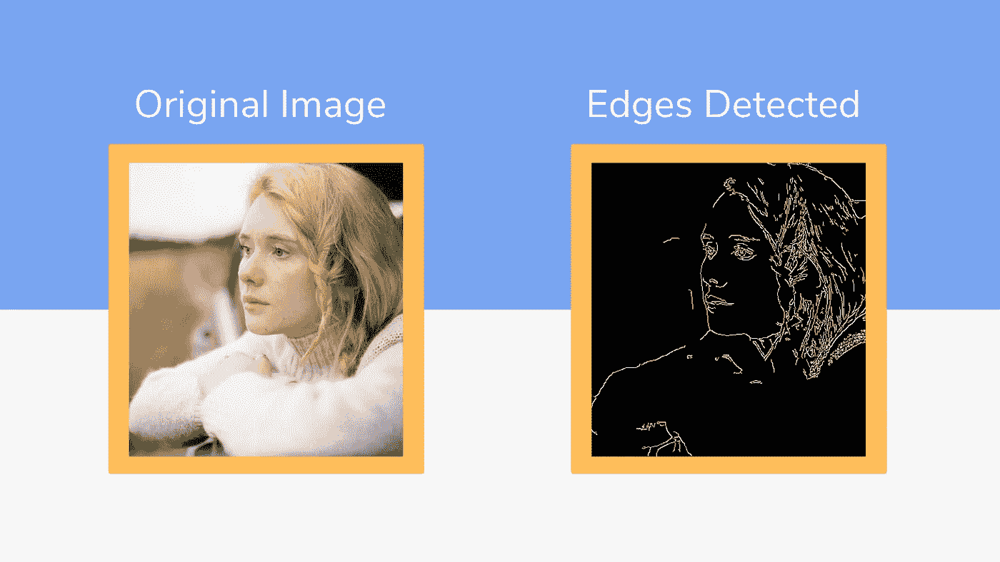
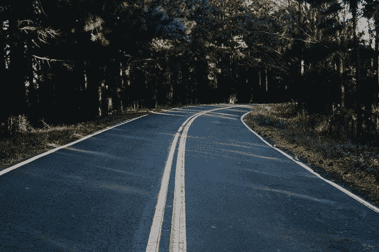
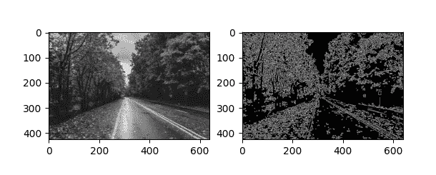
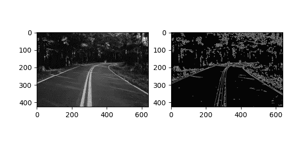
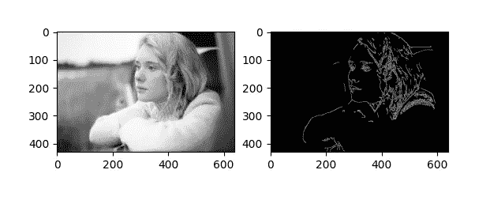

# 使用 Python 的简单边缘检测模型

> 原文：<https://towardsdatascience.com/simple-edge-detection-model-using-python-91bf6cf00864?source=collection_archive---------9----------------------->

## 机器使用边缘检测来更好地理解现实世界



来自[佩克斯](https://www.pexels.com/photo/woman-in-white-sweater-thinking-4091205/?utm_content=attributionCopyText&utm_medium=referral&utm_source=pexels)的[阿纳斯塔西娅·舒拉耶娃](https://www.pexels.com/@anastasia-shuraeva?utm_content=attributionCopyText&utm_medium=referral&utm_source=pexels)的照片

在这篇文章中，我将向你展示如何检测图像的边缘。写一个边缘检测程序会让你对计算机视觉和自动驾驶汽车有所了解。边缘检测通常用于理解图像中的对象。这也有助于机器做出更好的预测。编写边缘检测程序是理解机器如何看待外部世界的一个很好的方式。这将使我们在计算机视觉方面有更好的视角。

我在以前的文章中介绍了一些计算机视觉概念:人脸检测、人脸识别和文本识别。今天，我们将使用 python 进行边缘检测。

# 目录

*   ***入门***
*   ***导入库***
*   ***边缘检测功能***
*   ***选择一幅图像***
*   ***运行程序***

# 入门指南

我们将为这个项目使用两个主要模块:Numpy、Matplotlib 和 OpenCV。Matplotlib 是一个完整的库，用于在 Python 中生成静态、动画和交互式可视化。OpenCV 是一个高度优化的库，专注于实时应用。

## OpenCV

> OpenCV(开源计算机视觉库)是一个开源的计算机视觉和机器学习软件库。OpenCV 旨在为计算机视觉应用提供一个通用的基础设施，并加速商业产品中的机器感知。作为一个 BSD 许可的产品，OpenCV 使得企业利用和修改代码变得很容易。
> 
> 参考:[*https://opencv.org*](https://opencv.org/)

让我们从安装库开始。

# 图书馆

我们必须安装这些库，这样我们的程序才能正常工作。如前所述，我们只需要两个库。

我们可以使用 PIP 库管理器在一行中安装它们:

```
pip install numpy matplotlib opencv-python
```

安装过程完成后，我们可以将它们导入到代码中。您可以在 Jupiter 笔记本或 Atom 等常规文本编辑器上工作。我将使用这个项目的原子文本编辑器。

```
import cv2 
import numpy as np 
import matplotlib.pyplot as plt
```

# 边缘检测功能

现在，我们可以转到有趣的部分，在这里我们将编写边缘检测函数。你会惊讶于使用 OpenCV 包是多么简单。这个 OpenCV 检测模型也被称为 Canny 边缘检测模型。我们的功能由三部分组成:边缘检测，可视化，最后，保存结果。

## 边缘检测

```
def simple_edge_detection(image): 
   edges_detected = cv2.Canny(image , 100, 200) 
   images = [image , edges_detected]
```

理解代码:

*   Canny 是我们调用的使用 OpenCV 进行边缘检测的方法。
*   Image 是函数的一个参数，这意味着我们在调用函数时会传递图像。这样，你可以很容易地用不同的图像测试你的程序。
*   100 和 200 是滞后阈值的最小值和最大值。
*   如果想了解更多关于 Canny 边缘检测的知识:([官方文档](https://docs.opencv.org/master/da/d22/tutorial_py_canny.html))。

## 形象化

```
location = [121, 122] 
for loc, edge_image in zip(location, images): 
   plt.subplot(loc) 
   plt.imshow(edge_image, cmap='gray')
```

理解代码:

*   绘图部分需要位置数组。
*   然后，我们可视化原始图像和边缘检测图像。
*   cmap 参数用于改变图像的颜色。在我们的例子中，我们将它们转换成灰色。

## 保存结果

该功能的最后一部分将保存边缘检测图像和比较图。感谢 OpenCv 和 Matplotlib 包； *imwrite* 和 *savefig* 函数为我们做了保存。在最后一行中， *show* 函数将向我们展示创建的图表。

```
cv2.imwrite('edge_detected.png', edges_detected) plt.savefig('edge_plot.png') plt.show()
```

# 选择图像

这将是一个简单的图像。我们将找到一个图像，我们想测试我们的 canny 边缘检测程序。我将使用免费的库存摄影页面来找到一些好的图片。这里是他们网站的链接。

下载图像后，确保将它们放在与项目相同的文件夹中。这将有助于轻松地将它们导入程序。让我们定义一个图像变量并导入图像。以下是如何使用 OpenCV 读取图像:

```
img = cv2.imread('test_image.jpg', 0)
```

## 这是我将测试模型的示例图像:



*来自 Pexels 的 joo vítor Heinrichs 的照片*

# 运行程序

最好也是最后一步，是时候运行程序了。到目前为止，没有任何东西触发该功能。我们必须调用函数，这样奇迹才会发生。哦，别忘了把你的图片作为参数传递。让我们调用这个函数:

```
simple_edge_detection(img)
```

## 以下是一些结果:



作者照片



作者照片



作者照片

干得好！您已经使用 Python 创建了一个边缘检测模型。Python 是一种非常引人注目的语言，使用 python 可以创造无限的东西。现在，你也知道如何在实际项目中使用计算机视觉。从事像这样的动手编程项目是提高编码技能的最好方式。

我很高兴你今天学到了新东西。如果您在执行代码时有任何问题，请随时[联系我](https://sonsuzdesign.blog/)。😊

> *关注我的* [*博客*](https://medium.com/@lifexplorer) *和*[*YouTube*](https://www.youtube.com/behicguven)*频道留下灵感。谢谢，*

# 更多计算机视觉项目

[](/rendering-text-on-video-using-python-1c006519c0aa) [## 使用 Python 渲染视频文本

### 使用 moviePy 库的动手机器学习项目

towardsdatascience.com](/rendering-text-on-video-using-python-1c006519c0aa) [](/building-a-barcode-qr-code-reader-using-python-360e22dfb6e5) [## 使用 Python 构建条形码/QR 码阅读器

### 使用 Pyzbar 库的简单且可实际操作的机器学习项目

towardsdatascience.com](/building-a-barcode-qr-code-reader-using-python-360e22dfb6e5)