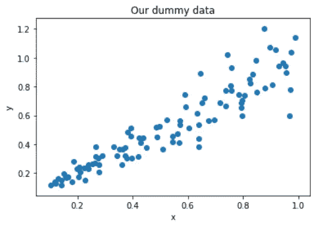
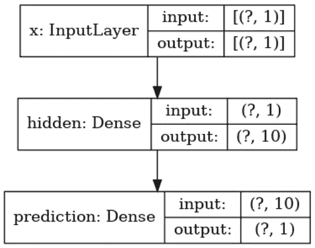
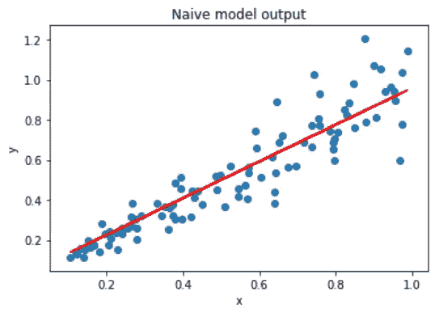
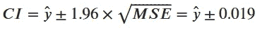
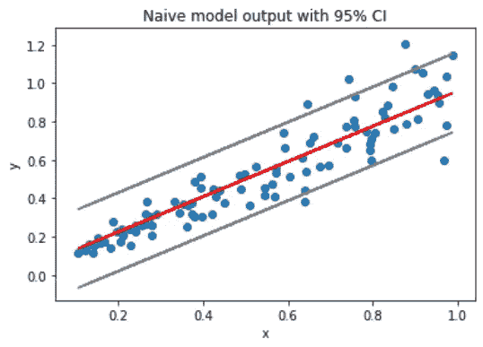
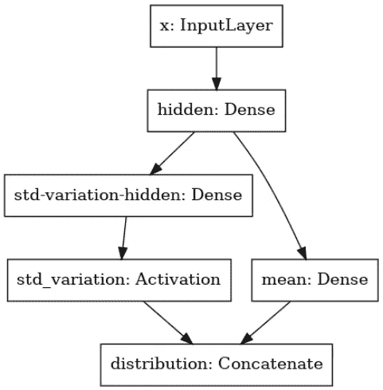
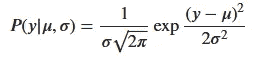
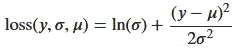
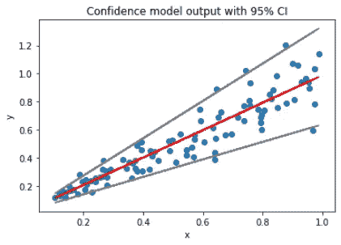

# 使用置信估计进行预测的简单示例

> 原文：<https://towardsdatascience.com/simple-example-of-predicting-with-confidence-estimates-cfc9e8a35c9b?source=collection_archive---------29----------------------->

西蒙·艾布拉姆斯在 [Unsplash](https://unsplash.com?utm_source=medium&utm_medium=referral) 上拍摄的照片

在数据科学中，制作一个输出数值的模型——也称为回归——是一个古老的故事。但有时我们不仅对预测值感兴趣，还对该值周围的*不确定性*感兴趣，这被称为[概率预测](https://en.wikipedia.org/wiki/Probabilistic_forecasting)。本文将带您浏览一个示意性示例，在该示例中，我们让神经网络预测一个值以及一个置信度估计值。我们将使用 Python 和 tf.keras，以及像正态分布这样的基本概率结果。此处提供有代码的笔记本[。](https://gitlab.com/Emmanuel_B/whats-up-timeseries/-/blob/master/notebooks/predict-confidence.ipynb)

# 评估模型的标准方法及其缺点

**经典方法**是评估所有测试输入的模型输出，并根据自己喜欢的度量计算*平均错误率*。举个例子:假设你正在预测明天的温度，你的模型平均误差率为 5%，如果你的模型预测明天的温度为 30 度，你只需在这个数字上加上+- 5%就可以得到一个置信区间。

这并不完美，原因有很多。这里的主要问题是我们使用一个不依赖于数据点的平均误差估计。如果模型有时对某些输入非常确定会怎样？例如，如果你正处于雨季，模型可能 99%确定明天会下雨，5%的误差率太大了。另一方面，可能有些日子模型比平均值更不确定，这 5%可能会给你带来麻烦。总之，计算平均错误率是一个平均值。它没有考虑到你所预测的实际点的特殊性。

让我们改进这一点。如果模型本身不仅能输出单一的预测值，还能输出其可信度会怎样？通过这种方式，您将获得一个根据您预测的实际数据点量身定制的置信度评估，从而获得上下文感知。在现实生活中，了解估计的不确定性和实际预测一样重要。

这里我们将制作一个非常简单的神经网络，它使用不确定性估计进行回归。为了尽可能简单明了，我将使用一个虚拟的一维数据，一个单层网络，没有测试集。

我在试图理解这篇论文时举了这个例子: [DeepAR:用自回归递归网络进行概率预测](https://arxiv.org/abs/1704.04110)来自 *D. Salinas 等人*在那里他们建立了一个用于多时间序列预测的概率预测网络。

我们将把工作分成三部分:

1.  产生具有变化的不确定性的伪数据
2.  用简单的置信区间制作一个非常简单的经典回归模型
3.  改进模型，使其输出置信度估计值

# 制作虚拟数据

我们生成两个变量:`x`是我们的自变量，它取 0 到 1 之间的值，`y`是我们想要预测的值。

我们根据以下公式生成 y:

数据生成方程

我们来分析一下。这意味着 y 相当于 x 加上一些噪声，噪声的大小取决于 x，所以，这是一个非常非常简单的预测！然而，y 上的*不确定性*与 x 成线性增长，因此，如果 x 较小，则很确定 y=x，但对于较大的 x 值，y 开始围绕其期望值扩散。

在我们的数据图中，我们可以看到 y 值随着 x 向 1 扩展。

# 经典回归模型

让我们制作一个基于`x`预测`y`的神经网络。我们只用一个单层神经网络。为此，我们将使用 tf.keras:

单层架构，没有比这更简单的了。

在用均方误差(MSE)损失和 Adam 优化器训练该模型 200 个时期后，我们得到以下预测:

朴素模型的预测。

好了，这差不多是我们预期的预测。我们的模型正确预测 y=x，MSE 为 0.011。

假设模型误差是高斯的，我们可以用这个 MSE 误差来计算置信区间。这些细节使用了高斯分布的一些属性，我们现在并不真正需要这些属性，所以让我们使用下面的公式，它给出了 95%的置信区间(CI):

95%置信区间的公式

在我们的简单模型上使用这个公式，并以图形方式显示结果，给出了下图。如您所见，CI 是正确的，因为我们有大约 95%的数据点在预测区间内。但是它完全忽略了数据噪音的可变性。

具有 95%置信区间的简单模型

# 向模型输出添加置信度信息

正如所承诺的，我们将修改我们的模型，使其输出不仅仅是一个预测，而是一个预测及其置信度。

这是获取技术的时候了。为了在预测中引入信心，我们需要讨论我们的预测值的*分布*，我们写为 P(y|x)。根据手头的数据，您期望的分布可能会有所不同。在我们的例子中，我们显然有一个正态分布，因为这是我们如何生成我们的数据，但这不是强制性的。

您如何知道哪个发行版与您的项目相关？绘制数据并查看模式的数量，围绕平均值和数据范围的对称性是一个良好的开端。根据这些参数，你应该找到一个符合这些特征的理论分布。

现在，正态分布是默认使用的分布，如果您正在处理实值数据，它应该是一个很好的起点。让我们继续这个例子。

正态分布由两个参数定义:平均值 *𝜇* 和标准差 *𝜎* 。从这两个值，我们已经完全确定了分布，我们可以计算我们可能需要的所有置信区间。所以，让我们的网络输出这两个值。这很简单:

具有概率输出的网络结构。

“左分支”计算标准偏差 *𝜎* ，而“右分支”计算平均值 *𝜇* 。我对*标准偏差*输出使用了“relu”激活，因为标准偏差必须为正。在最后一层，两个输出被连接。

现在我们需要**为模型选择一个损失函数**。之前，我们使用了一个均方误差来惩罚预测误差。但是在这里，我们需要一种方法来惩罚预测和不确定性。

为此，我们将把问题写成概率的形式。我们的模型以 x 为输入，返回一个正态概率分布 N( *𝜇* ( *𝑥* )， *𝜎* ( *𝑥* ))。

如果这个分布与实际的数据分布相匹配，那么我们的训练就是成功的。我们如何对此进行量化？我们会说，如果获得我们的精确训练数据的概率很高，如果我们从我们的分布中提取数据，这是一个很好的匹配。

对于数据点(x，y)，y 从 N( *𝜇* ( *𝑥* )、 *𝜎* ( *𝑥* ))被采样的概率由下式给出:

如果我们的数据是从输出分布中抽样的，那么看到它的概率。

这只是高斯定律的概率密度函数。现在我们要使这个概率尽可能的高，也就是我们要找到使*(*|*(*【𝑥*)**【𝑥*)最大化的函数*【𝑃】*(*|*𝜇*(*𝑥*)*(*)*****

**现在前面有几个有趣的计算，我打算跳过，因为它们非常简单:**

*   **我们应用对数，因为最大化 p 与最大化 ln( *𝑃* )是相同的。**
*   **我们删除常量，因为它们在优化中不起作用。**
*   **我们将否定整个表达式。这只是因为 Keras 喜欢*最小化*事情，如果我们最小化负面就像最大化原始。**

**最后，我们得到了一个 Keras 可以理解的损失:**

****

**概率损失**

**这是有效的损失吗？我们可以直观地检查它是否有意义。它将我们的目标值 y 与网络输出 *𝜎* ， *𝜇.结合在一起*此外，我们可以单独理解每个术语:**

*   **ln( *𝜎* ):这对于小 *𝜎* 来说会比较低，从而*推动网络自信*。**
*   **当 *𝜇* 接近 y 时，第二项将为低。这将推动网络减少预测误差。对于高 *𝜎* 值，该项也将为低。所以，当网络说它不自信时，这种损失对错误的惩罚较少(高 *𝜎* )。**

**让我们将此实现为一个 Keras 自定义损失。**

**训练这个模型比前一个稍微复杂一点。这里有一个效果很好的迭代方法:**

1.  **使用[学习率范围测试](https://www.machinecurve.com/index.php/2020/02/20/finding-optimal-learning-rates-with-the-learning-rate-range-test/)选择学习率。**
2.  **以此学习率训练 100 个纪元。**
3.  **检查损失，如果低于-1.9 止损，否则返回步骤 1。**

**通常，这种方法在几百个纪元内有效。请注意，大约有一半的时间，它收敛到一个坏的局部最小值。在这种情况下，只需重新初始化模型并重新启动。**

**下面我们有一个样本训练曲线，我只需要重复上面的过程两次。正如你所看到的，我开始时的学习率是 0.01，然后根据范围测试结果移动到 0.1。**

****

**概率模型的训练曲线。**

**好了，现在我们的模型已经训练好了，是时候检查预测了。我们将绘制我们的模型结果。为此:**

*   **我们使用第一个输出 *𝜇* 作为预测。**
*   **我们使用第二个输出 *𝜎* 根据公式*𝐶𝐼*=*𝜇*1.96×*𝜎.建立 95% CI***

****

**概率预测结果。预测的不确定性与数据中的不确定性相匹配。**

**就是这样。如你所见，我们的模型对小 x 值更有信心。**

# **结论**

**在本文中，我们已经看到了如何进行预测以及不确定性估计。我们已经研究了 Keras 中的理论和实现。**

**从实践的角度来看，我们可以升级现有的网络，分两步返回置信度估计值:**

1.  **添加分支以生成标准差输出**
2.  **切换到概率损失**

**但是，理解理论是有好处的，这样我们就可以选择正确的分布和适当的损失。**

**最后，用真实数据呢？看看 DeepAR:用自回归递归网络进行概率预测，他们应用了一种更复杂的技术来获得销售预测的不确定性估计。**

**我用这个简单的例子来总结这篇文章，希望它也能对你有用。我还没有在真实数据集上尝试过。一定要让我知道你的想法！**