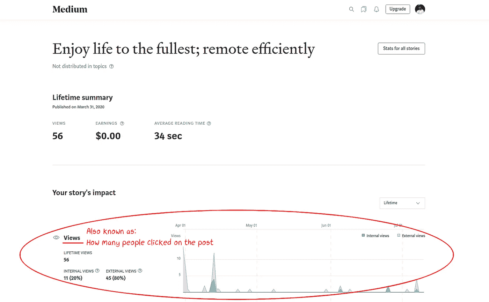
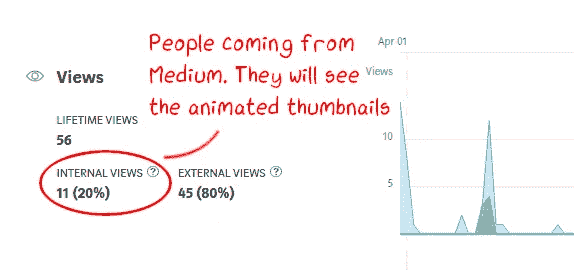
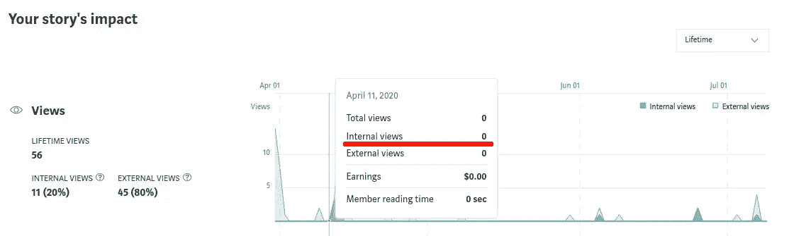
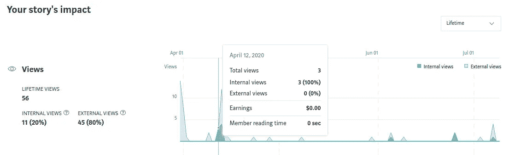
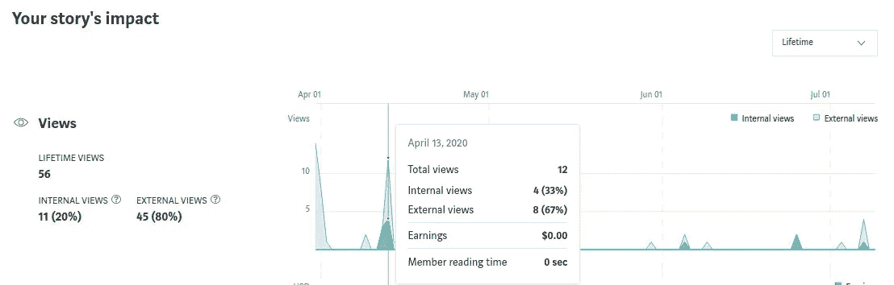
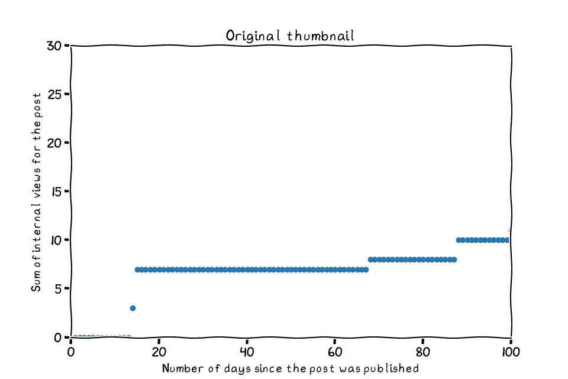
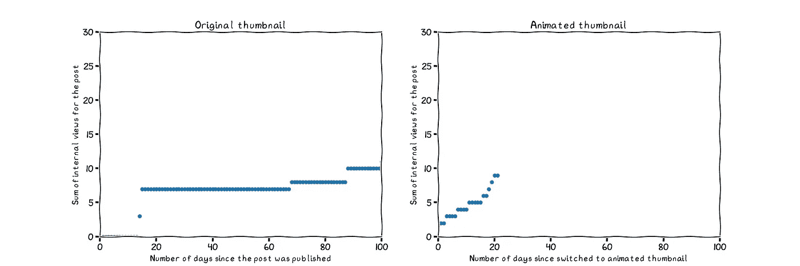
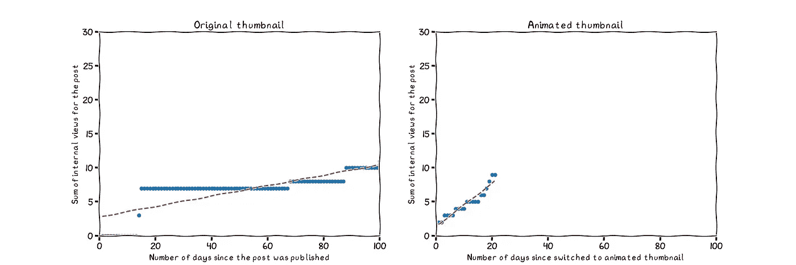
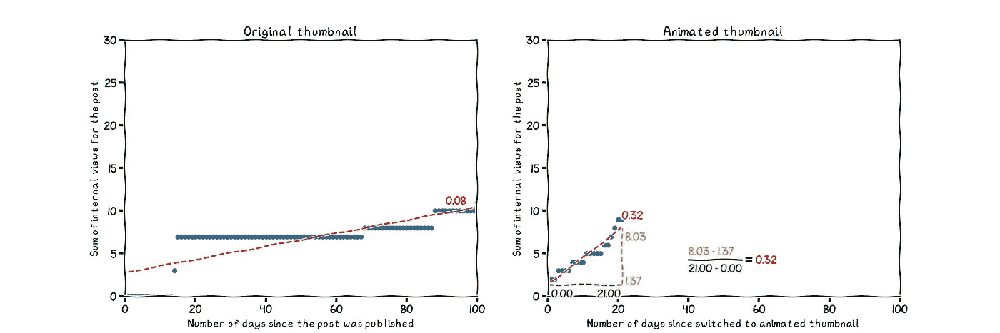
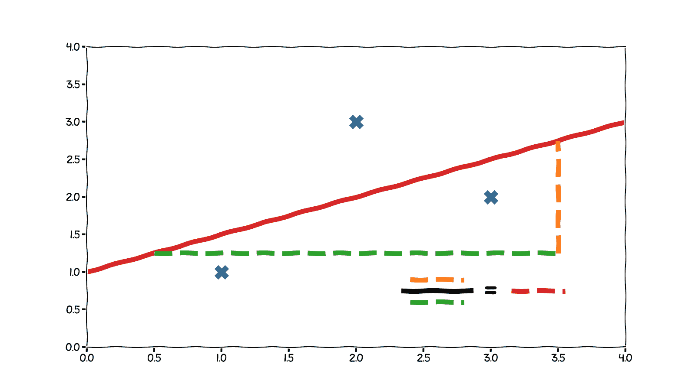

# 像我五岁一样解释:线性回归

> 原文：<https://towardsdatascience.com/simple-explanation-of-linear-regression-95b702d2bfde?source=collection_archive---------49----------------------->

## 让基本想法变得简单

我的小妹妹在我 10 岁时出生。我们很快成了好朋友，我会花很多个下午和她一起玩。当我们长大一点的时候，我们会一起尝试烹饪。后来我们会有各种建筑和游戏项目。总而言之，我们已经是一个团队 18 年了。我有机会和她分享我的知识。

几天前，我向她建议，我们应该测试一下一张动画预览图片会如何影响一篇中等帖子的点击量。她同意了——她会制作一个动画，我会测试它是否对点击量有积极的影响。但是，然后她问我:我们如何测试呢？

我感到剧痛。我忽略了作为一个哥哥的责任。我当然应该教我妹妹如何做实验。这种技能让我们在做任何事情时都有优势。为了弥补自己，我给她写了一篇关于如何使用线性回归分析实验结果的基本说明。

这是我对小姐姐的解释。*以我们的动画实验为例。*

# 1.我们在衡量什么

不久前，我写了我的第一篇文章，并在媒体上发表。让我的文章出现在媒体读者面前比我想象的要难一些。现在我有了更多的时间，我想用一部分时间来了解如何让媒体文章发挥作用。

和我妹妹一起，我们正专注于一个帖子的预览图片——也称为
缩略图。一个好的缩略图应该是相关的，真实的帖子，并鼓励人们点击帖子。一个改进的缩略图应该会增加点击帖子的人数。到目前为止，这似乎很符合逻辑。

下面是我写的一篇文章的原预览。这个女孩的照片是一个相当普通的，非动画的缩略图。

 [## 尽情享受生活；高效远程

### 现在改善你的远程工作习惯，可以开启全新的机会

medium.com](https://medium.com/@manezki/enjoy-life-to-the-fullest-remote-efficiently-78af5e48f865) 

帖子的点击数对作者是可用的，但它的名称不同。它们显示为**浏览量**的数量，也就是有多少人浏览了这个帖子。这是作者在帖子中看到的他们的观点:

这是一个作者在文章中看到的一些统计数据。如你所见，我们才刚刚开始。图片由作者提供。

对于我们的小测试，只查看看到动画缩略图的视图是有意义的。在我们的例子中，这些将是内部视图。他们是来自媒体的读者，他们肯定能看到动画缩略图。由于读者来自其他网站，如脸书，不清楚他们是否也看到了动画缩略图。因为我们对它们不确定，所以排除它们是个好主意。幸运的是，Medium 已经将它们算作外部视图，并且它们很容易被计算出来。

内部视图可以看到动画缩略图。然而，外部视图可能看不到
动画缩略图。图片由作者提供。

# 2.我们多快能获得浏览量

所以一个更好的缩略图会更快地获得浏览。我们怎么知道哪个更好？

原始缩略图和动画缩略图之间的差异很容易测试。我们可以在相同的时间内尝试两个缩略图，并比较最终哪个获得了更多的视图。但是原来的缩略图已经放在那里 99 天了。再过 99 天，我们可能会忘记整个实验。所以让我们试试别的。

相反，我们可以看看不同的缩略图获得视图的速度。

要知道这些，我们需要知道这篇文章每天有多少总浏览量。幸运的是，Medium 告诉我们每天有多少新的浏览量。

4 月 11 日 0 次查看。图片由作者提供。

3 4 月 12 日观点。图片由作者提供。

4 月 13 日观点。图片由作者提供。

按日期排列的总浏览量是所有前几天的总和。更重要的是，这些观点和自发布以来的天数的总和可以被绘制成一个图。像这样:

每天内部浏览的总和，使用原始缩略图。图片由作者提供。

这就是我们目前的情况。我们知道一段时间内的浏览量，但仅此而已。没什么有趣的信息。

# 3.比较缩略图

我们原来的问题是:一个动画缩略图会增加帖子的点击量吗？

目前，我们不知道。这是有道理的，但我们不知道，直到我们尝试一下。在我们尝试之后，我们将获得动画缩略图的浏览次数。**现在，我为动画缩略图编了一些数字——这样我就可以展示测试的其余部分了。**这里的数字是并排画的。

动画缩略图的一些虚构值。图片由作者提供。

从上面的图片中，我们可以看到动画缩略图已经生成了几乎与原始缩略图一样多的视图。但是，动画缩略图仅出现了 21 天。

我们完事了吗？动画缩略图似乎更好，对不对？

我们可以停在这里。但是我们仍然可以算出**动画缩略图比**好多少！这将是一件令人振奋的事情。这也有助于决定我们是否应该在这上面花时间。

为了感受不同之处，我们稍微改变了一下情节。我们添加一条直线，试图整齐地穿过两点之间。这条线是帖子获得浏览量的速度。线越陡越好。

对于这两个结果，我在两点之间添加了一条直线。图片由作者提供。

我们甚至可以通过一些简单的计算得到陡度的值。陡度等于**天数**除以**这些天增加的观看次数。**我把数值加到了下一张图片上。但是，请检查我们在点之间添加的线。为了使它更适合，它不会从第 0 天的 0 次查看开始。

右边的图计算了陡度。红色的文字告诉我们这条线有多陡——相当于
“我们每天有多少浏览量”。图片由作者提供。

为了获得改进值，我们将动画缩略图线的陡度除以原始缩略图的陡度。有了这个虚构的数据，动画缩略图会好 0.32/0.08 = 4 倍。所以有一个动画缩略图会很有用: )

这些是我们最后做的步骤。添加数据，添加直线，并计算直线的陡度。图片由作者提供。

我的小妹妹(和其他读者)，这就是我们如何分析实验结果。

这不是唯一的方法，也不总是最好的方法。但是，这很简单，步骤也很容易与现实生活联系起来。许多事情正在幕后发生，但是当你开始时，理解它们是不必要的。更重要的是，我总是乐于助人。