# NLP 中变压器的简单说明

> 原文：<https://towardsdatascience.com/simple-explanation-of-transformers-in-nlp-da1adfc5d64f?source=collection_archive---------12----------------------->

## NLP 中变压器的简单易懂的解释

克里斯·劳顿在 [Unsplash](https://unsplash.com/s/photos/transformation?utm_source=unsplash&utm_medium=referral&utm_content=creditCopyText) 上的照片

## 先决条件:

S [序列-2-序列-模型-关注机制](/sequence-2-sequence-model-with-attention-mechanism-9e9ca2a613a)

[Seq2Seq-神经机器翻译](/intuitive-explanation-of-neural-machine-translation-129789e3c59f)

在本帖中，我们将解决以下与 Transformer 相关的问题

*   *我们为什么需要变压器，Sequence2Sequence 模型有哪些挑战？*
*   *变压器及其详细架构*
*   *深入探讨变形金刚中使用的术语，如位置编码、自我关注、多头自我关注、掩蔽多头自我关注*
*   *可以使用变压器的 NLP 任务*

## 序列 2 序列(Seq2Seq)的挑战

*   **顺序计算**:在 Seq2Seq 中，我们以顺序方式在每一步向编码器输入一个单词，以便在解码器中一次生成一个单词的输出。我们可以通过并行化操作来实现计算效率，这在 Seq2Seq 建模中是不可能的

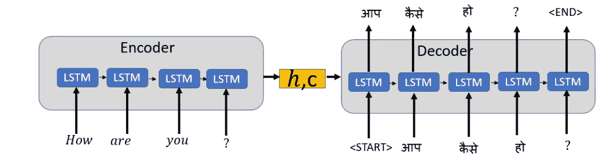

*   **长期依赖**:长期依赖是 Seq2Seq 的一个问题，因为需要对一个长句子执行大量操作，如下所示。

“它”这个词指的是“冠状病毒”或“国家”。

*让我们深入变压器的架构和变压器的关键概念，了解变压器如何应对这些挑战*

## 变压器架构

与 Seq2Seq 不同，Transformer 具有 6 个编码器和 6 个解码器的堆栈；编码器**包含两个子层:多头自关注层和全连接前馈网络**。

**解码器包含三个子层，一个多头自关注层，一个对编码器输出执行多头自关注的附加层，以及一个完全连接的前馈网络。**

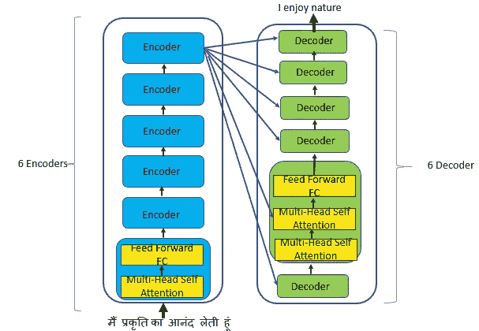

高级变压器架构

编码器和解码器中的每个子层都有一个残差连接，然后是层归一化。

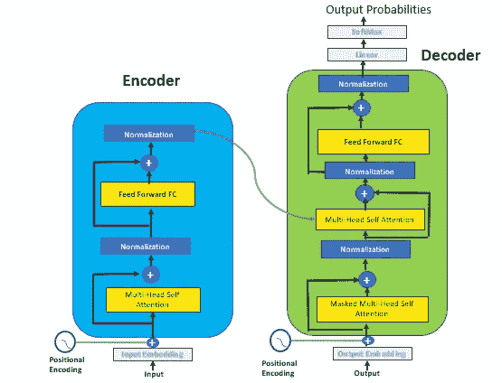

编码器和解码器的单一实例

## 编码器和解码器的输入

使用学习嵌入将编码器/解码器的所有输入和输出令牌转换成向量。这些输入嵌入然后被传递到位置编码。

**位置编码**

转换器的架构不包含任何递归或卷积，因此没有词序的概念。输入序列的所有字都被馈送到网络，没有特殊的顺序或位置，因为它们都同时流经编码器和解码器堆栈。

要理解一个句子的意思，理解单词的位置和顺序是必不可少的。

**位置编码被添加到模型中，以帮助注入关于句子中单词的相对或绝对位置的信息**

位置编码与输入嵌入具有相同的维数，因此两者可以相加。

## 自我关注

简单地说，注意力是为了更好地理解句子中单词的含义和上下文。

> 自我注意，有时被称为内部注意，是一种与单个序列的不同位置相关的注意机制，以便计算该序列的表示

**自我关注层将所有位置与恒定数量的顺序执行操作连接起来，因此比递归层更快**

**转换器中的注意功能被描述为将查询和一组键和值对映射到输出**。查询、键和值都是向量。**使用句子**中每个单词的标度点积注意力来计算注意力权重。最终得分是这些值的加权和。

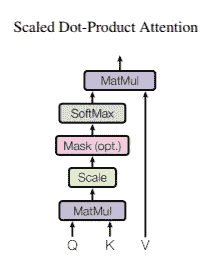

来源:[https://papers . nips . cc/paper/7181-attention-is-all-you-need . pdf](https://papers.nips.cc/paper/7181-attention-is-all-you-need.pdf)

*我们用一句话来理解这个吧，* ***“我享受自然。”***

输入是查询、键和值。向量的维数是 64，因为这导致稳定的梯度。

**第一步:点积**

为句子中的每个单词取查询和关键字的点积。点积决定了谁更关注输入句子中的其他单词。

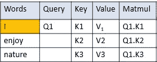

第一步:点积

**第二步:缩放**

通过除以关键向量维数的平方根来缩放点积。维度为 64；因此我们将点积除以 8。

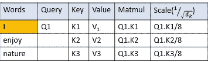

步骤 2:缩放点积

第三步:应用软最大值

Softmax 将缩放值规格化。应用 Softmax 后，所有值都是正的，加起来等于 1

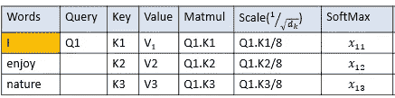

步骤 3:应用 Softmax 来归一化缩放值

**第四步:计算值的加权和**

我们应用标准化分数和值向量之间的点积，然后计算总和

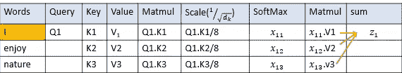

步骤 4:值的加权和

自我关注的完整方程式

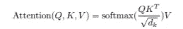

对句子中的每个单词重复这些步骤。

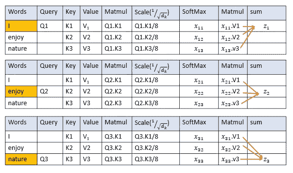

句子中所有单词的注意力权重

## 多头注意力

变形金刚使用多个注意力头，而不是使用单一的注意力功能，在单一的注意力功能中，注意力可以由实际的单词本身支配。

每个注意力头部具有应用于相同输入表示的不同线性变换。**变压器使用 8 个不同的注意头，并行独立计算。使用八个不同的注意头，我们有八组不同的查询、键和值，还有八组编码器和解码器，每组都是随机初始化的**

> "多头注意力允许模型在不同的位置共同注意来自不同表征子空间的信息."

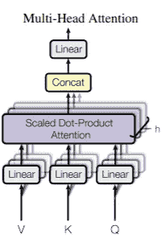

多头关注；来源:[https://papers . nips . cc/paper/7181-attention-is-all-you-need . pdf](https://papers.nips.cc/paper/7181-attention-is-all-you-need.pdf)

利用多头注意力头，输入表征的每个部分与输入表征的其他部分相互作用，以获得更好的含义和上下文。由于多头注意力在不同位置观察不同的表征子空间，这也有助于学习长期依赖性。

“它”这个词指的是“冠状病毒”或“国家”。

使用多头注意力，我们得到上面句子中的单词“它”指的是“冠状病毒”。

## 掩蔽的多头注意力

解码器屏蔽了多头注意力，它屏蔽或阻止解码器输入进入后续步骤。在训练期间，解码器的多头注意力隐藏了未来的解码器输入。

对于使用转换器将句子“我享受自然”从英语翻译成印地语的机器翻译任务，解码器将考虑所有输入单词“我享受自然”来预测第一个单词。

下表显示了解码器如何阻止后续步骤的输入

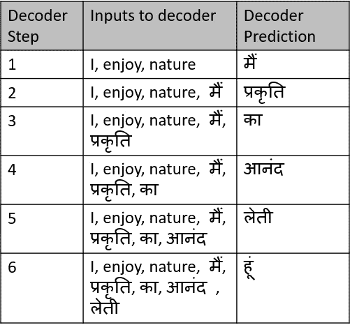

训练期间掩蔽的多头注意力解码器输入和预测

编码器和解码器中的每个子层都有一个残差连接，然后是层归一化。

## 残差连接和图层归一化有什么帮助？

**剩余连接**是“跳过连接”，允许梯度流过网络，而不通过非线性激活函数。残留连接有助于避免消失或爆炸梯度问题。为了使剩余连接工作，模型中每个子层的输出应该是相同的。变压器中的所有子层产生维度 512 的输出。

**图层标准化:**标准化每个特征的输入，独立于其他示例，如下所示。层标准化减少了前馈神经网络的训练时间。在层标准化中，我们在单个训练案例上计算层中神经元的所有总输入的均值和方差。

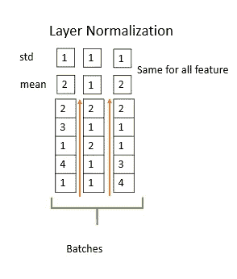

图层规范化

## 全连接层

变换器中的编码器和解码器都有一个完全连接的前馈网络，它有两个线性变换，中间包含一个 ReLU 激活。

## 解码器的线性和软最大层

解码器的最后一层应用线性变换和 softmax 函数来转换解码器输出，以预测输出概率

## 变压器的特点

seq2seq 模型的缺点由 Transformer 解决

*   **并行计算** : Transformer 的架构去除了 Seq2Seq 模型中使用的自回归模型，完全依靠自我关注来理解输入和输出之间的全局依赖关系。自我关注对并行计算有很大帮助
*   **操作次数减少**:变形金刚的操作次数不变，因为注意力权重在多头注意力中是平均的
*   **长程相关性**:影响长程相关性学习的因素基于信号在网络中必须经过的前向和后向路径的长度。输入和输出序列中任何位置组合之间的路径越短，就越容易了解长程相关性。自我注意层将所有位置与学习长程依赖的恒定数量的顺序执行的操作连接起来。

## 变压器处理的 NLP 任务

*   抽象文本摘要
*   神经机器翻译

## 结论:

变压器具有基于自关注机制的简单网络架构，并且不完全依赖于递归和卷积。计算是并行执行的，这使得变压器效率更高，并且需要更少的训练时间

## 参考资料:

[吉米·巴雷、杰米·瑞安·基罗斯和杰弗里·e·辛顿的图层规范化](https://arxiv.org/pdf/1607.06450.pdf)

[注意力是你所需要的一切](https://papers.nips.cc/paper/7181-attention-is-all-you-need.pdf)

 [## 图示的变压器

### 讨论:黑客新闻(65 分，4 条评论)，Reddit r/MachineLearning (29 分，3 条评论)翻译…

jalammar.github.io](http://jalammar.github.io/illustrated-transformer/) 

[https://nlp.seas.harvard.edu/2018/04/03/attention.html](https://nlp.seas.harvard.edu/2018/04/03/attention.html)