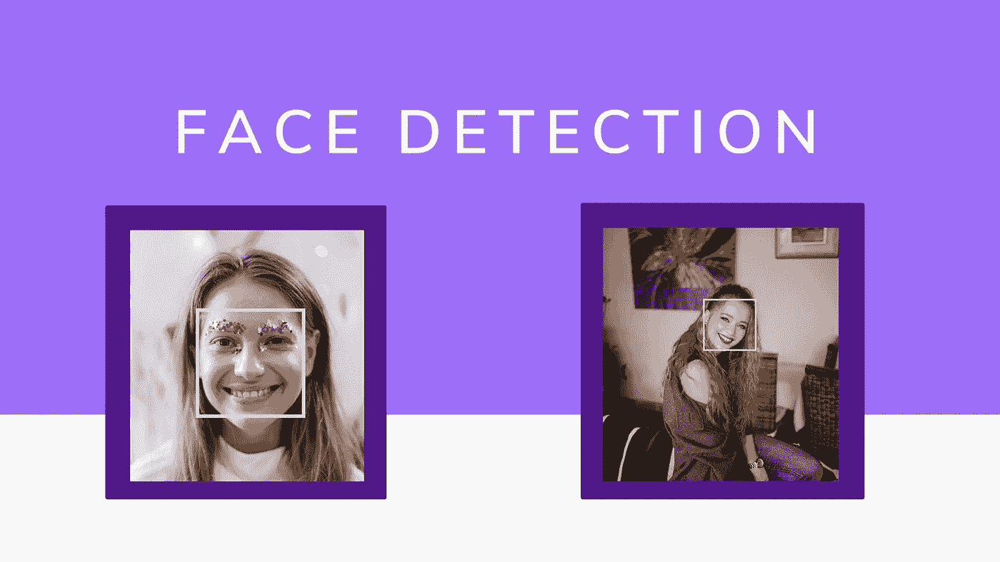
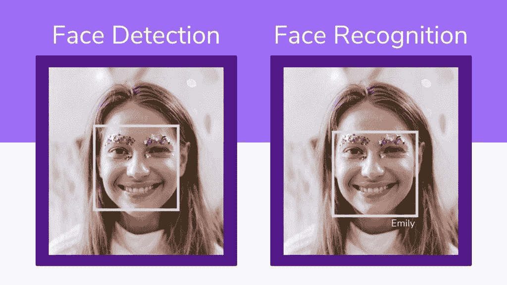
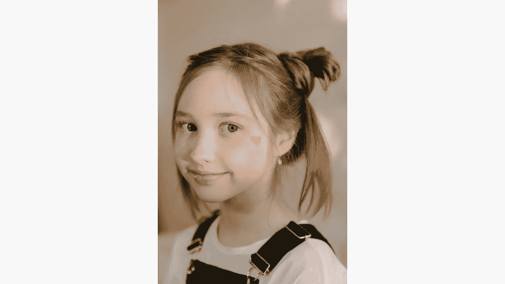
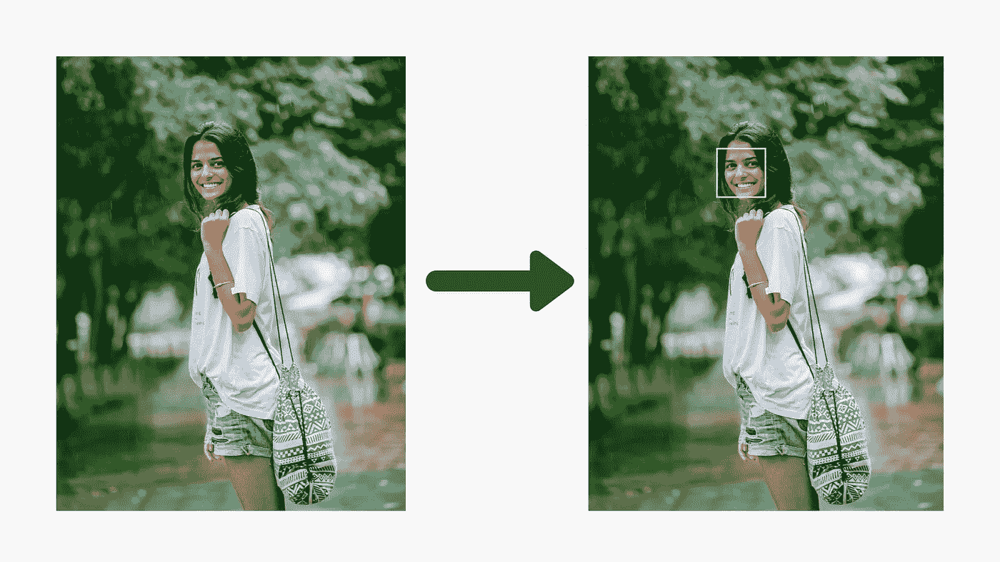

# Python 中的简单人脸检测

> 原文：<https://towardsdatascience.com/simple-face-detection-in-python-1fcda0ea648e?source=collection_archive---------5----------------------->

## 如何使用 OpenCV 库检测图像中的人脸



来自 [Pexels](https://www.pexels.com/photo/woman-in-white-crew-neck-shirt-with-pink-and-white-floral-face-paint-4684260/?utm_content=attributionCopyText&utm_medium=referral&utm_source=pexels) 的 [cottonbro](https://www.pexels.com/@cottonbro?utm_content=attributionCopyText&utm_medium=referral&utm_source=pexels) 摄影

在这篇文章中，我将向你展示如何使用 Python 构建一个简单的人脸检测器。构建一个检测人脸的程序是一个非常好的计算机视觉入门项目。在以前的帖子中，我展示了如何识别图像中的文本，这是在计算机视觉中练习 python 的一个很好的方法。今天我们来做一件更好玩更有趣的事情:人脸检测。

[](/building-a-simple-text-recognizer-in-python-93e453ddb759) [## 用 Python 构建一个简单的文本识别器

### 如何使用文本识别器改进笔记记录过程

towardsdatascience.com](/building-a-simple-text-recognizer-in-python-93e453ddb759) 

顾名思义，我们将编写一个程序来检测图像中的人脸。当我说“程序”时，你可以理解为教一台机器做什么。我喜欢用教学而不是编程，因为这实际上是我们正在做的事情。最好的学习方式是教学，所以在教机器如何识别人脸的同时，我们也在学习。在我们进入项目之前，我想分享一下人脸检测和人脸识别器的区别。

# 人脸检测与人脸识别

这两件事听起来可能非常相似，但实际上，它们并不相同。让我们明白其中的区别，这样才不会漏掉重点。人脸检测是从一幅图像或一段视频中检测人脸的过程。这个程序除了寻找人脸之外什么也不做。但是另一方面，人脸识别，程序找到了人脸，也能分辨出哪张脸是谁的。所以它比仅仅检测它们更能提供信息。有更多的编程，换句话说，更多的教学🙂

假设你在看街，有车经过。人脸检测就像告诉路过的物体是一辆车。而人脸识别器就像是能够分辨出路过的汽车的型号。这里有一个很好的图像显示了实践中的差异。



来自 [Pexels](https://www.pexels.com/photo/woman-in-white-crew-neck-shirt-with-pink-and-white-floral-face-paint-4684260/?utm_content=attributionCopyText&utm_medium=referral&utm_source=pexels) 的 [cottonbro](https://www.pexels.com/@cottonbro?utm_content=attributionCopyText&utm_medium=referral&utm_source=pexels) 摄影

# 我们开始吧！

我们将为这个项目使用一个模块库，它被称为 OpenCV。OpenCV 是一个高度优化的库，专注于实时应用。

> *OpenCV(开源计算机视觉库)是一个开源的计算机视觉和机器学习软件库。OpenCV 旨在为计算机视觉应用提供一个公共基础设施，并加速机器感知在商业产品中的应用。作为一个 BSD 许可的产品，OpenCV 使得企业利用和修改代码变得很容易。*
> 
> [T3【https://opencv.org】T5](https://opencv.org)

[](/building-a-face-recognizer-in-python-7fd6630c6340) [## 用 Python 构建人脸识别器

### 使用 OpenCv 库进行实时人脸识别的分步指南

towardsdatascience.com](/building-a-face-recognizer-in-python-7fd6630c6340) 

# 图书馆

首先，让我们安装软件包。

```
pip install opencv-python
```

安装完成后，我们可以将其导入到我们的程序中。

```
import cv2
```

OpenCV 已经包含了许多预先训练好的人脸、眼睛、微笑等分类器。这些 XML 文件存储在一个文件夹中。我们将使用人脸检测模型。

下面是人脸检测的链接:[https://raw . githubusercontent . com/opencv/opencv/master/data/haarcascades/haarcascade _ frontal face _ default . XML](https://raw.githubusercontent.com/opencv/opencv/master/data/haarcascades/haarcascade_frontalface_default.xml)

如果您有帐户，可以从 Github 下载 XML 文件。如果没有，可以从下面的链接中复制代码，粘贴到一个文本文档中，保存为“face_detector.xml”。

将文件保存到当前文件夹后，让我们将它加载到我们的程序中。

```
# Load the cascadeface_cascade = cv2.CascadeClassifier('face_detector.xml')
```

# 导入图像

在这一步中，您将选择一个要测试代码的图像。确保图像中至少有一张脸，以便我们的程序可以找到一张。这是一个人的图像示例。



照片由 [Pexels](https://www.pexels.com/photo/girl-in-black-and-white-crew-neck-shirt-4709830/?utm_content=attributionCopyText&utm_medium=referral&utm_source=pexels) 的 [cottonbro](https://www.pexels.com/@cottonbro?utm_content=attributionCopyText&utm_medium=referral&utm_source=pexels) 拍摄

选择图像后，让我们在程序中定义它。确保图像文件位于您正在处理的同一文件夹中。

```
# Read the input imageimg = cv2.imread('test.jpg')
```

# 人脸检测

你会惊讶于人脸检测代码有多短。感谢为 OpenCV 做出贡献的人们。下面是检测图像中人脸的代码:

```
# Detect faces
faces = face_cascade.detectMultiScale(img, 1.1, 4)
```

我们在前面的代码中定义了 face_cascade。在检测到人脸后，我们将在它们周围绘制矩形，这样我们就知道机器看到了什么。机器可能会出错，但我们的目标应该是教授最佳和最优化的方法，以便预测更加准确。

使用以下代码可以在检测到的人脸周围绘制矩形:

```
# Draw rectangle around the faces
for (x, y, w, h) in faces: 
  cv2.rectangle(img, (x, y), (x+w, y+h), (255, 0, 0), 2)
```

*   (255，0，0)是我们要绘制的矩形的颜色。你玩它，改变颜色。
*   (2)是线条的粗细。您可以更改该值并查看其外观。

# 结果呢

这是最后一步，现在我们将我们的结果导出为图像文件。此图像将显示人脸检测的结果。为了保存一个新的图像文件，我们将使用 cv2 库中名为“imwrite”的方法。保存完成后，您将在终端上看到“成功保存”。

```
# Export the resultcv2.imwrite("face_detected.png", img) print('Successfully saved')
```


来自 [Pexels](https://www.pexels.com/photo/girl-in-black-and-white-crew-neck-shirt-4709830/?utm_content=attributionCopyText&utm_medium=referral&utm_source=pexels) 的 [cottonbro](https://www.pexels.com/@cottonbro?utm_content=attributionCopyText&utm_medium=referral&utm_source=pexels) 摄影

## 另一个例子:



来自[像素](https://www.pexels.com/photo/shallow-focus-photography-of-woman-in-white-shirt-and-blue-denim-shorts-on-street-near-green-trees-937416/?utm_content=attributionCopyText&utm_medium=referral&utm_source=pexels)的[摄于](https://www.pexels.com/@mentatdgt-330508?utm_content=attributionCopyText&utm_medium=referral&utm_source=pexels)

恭喜你。！您已经创建了一个检测图像中人脸的程序。现在，你有了一个如何教机器为你做一些很酷的事情的想法。希望你喜欢这篇教程，并在今天学到一些新东西。在我的下一篇文章中，我将分享如何使用 python 构建人脸识别器。

*跟随我的* [博客](https://medium.com/@lifexplorer) *和* [走向数据科学](https://towardsdatascience.com/) *留下灵感。*

谢谢你，

[](https://lifexplorer.medium.com/subscribe) [## 每当贝希克居文出版时收到电子邮件。

### 每当贝希克居文出版时收到电子邮件。通过注册，您将创建一个中型帐户，如果您还没有…

lifexplorer.medium.com](https://lifexplorer.medium.com/subscribe) 

## 适合您的机器学习项目:

[](/building-a-speech-recognizer-in-python-2dad733949b4) [## 用 Python 构建语音识别器

### 使用谷歌云语音 API 将您的音频文件转换为文本

towardsdatascience.com](/building-a-speech-recognizer-in-python-2dad733949b4) [](/building-a-barcode-qr-code-reader-using-python-360e22dfb6e5) [## 使用 Python 构建条形码/QR 码阅读器

### 使用 Pyzbar 库的简单且可实际操作的机器学习项目

towardsdatascience.com](/building-a-barcode-qr-code-reader-using-python-360e22dfb6e5)