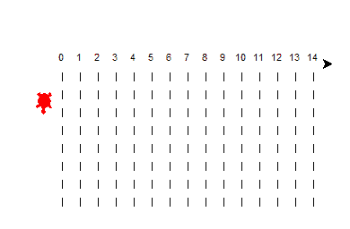

# 简单有趣的万圣节 Python 项目！

> 原文：<https://towardsdatascience.com/simple-fun-python-project-for-halloween-ff93bbd072ad?source=collection_archive---------22----------------------->

## 这是一个有趣的“不给糖就捣蛋”的游戏，让你在万圣节愉快地学习 python 编程


由 [Unsplash](https://unsplash.com?utm_source=medium&utm_medium=referral) 上[ukasz niecioruk](https://unsplash.com/@luki90pl?utm_source=medium&utm_medium=referral)拍摄的照片

在今天的文章中，我们将通过一个简单而有趣的项目来了解 python 编程的一些基础知识。本文的后续部分也提供了完整的代码。

由于 10 月 31 日是许多国家庆祝的万圣节，我认为用我编的有趣的“不给糖就捣蛋”游戏来学习一些 python 编程是个好主意。

在我们进一步讨论问题陈述和我们今天将构建的简单有趣的游戏之前，让我们了解一下我们将在本文中试图实现的一些基本目标以及您可以期待的内容。

下面的 gif 代表了我们的项目的一部分，这将是我们在这个项目中建立的两只乌龟之间的小比赛



作者截图

本文旨在更好地理解函数，并在享受构建简单项目的过程中学习编程。我们将使用一些很酷的库，如 turtle 模块和 Google 文本到语音模块来构建这个项目，并获得更多关于这些库的知识。

不要担心，如果你不知道这些，因为我将触及所有的基本要求，在一个简单详细的方式，对这个项目的完整理解。

# 问题陈述:

> 你给用户一个选择的机会——不给糖就捣蛋。如果选择请客，那么你只需展示一只海龟到达终点，获胜的话你会得到一块饼干。图像，以及语音记录，需要建议胜利的奖励。如果选择的是一个诡计，那么用户可以在两个可用的海龟上下注。因此，用户有 50%的机会赢得蛋糕奖励，否则他得不到任何奖励。

如果你想让问题陈述更复杂一点，那么你也可以增加这一行。

> 如果用户失去了第一个 50%的机会，还可以添加石头、纸、剪刀游戏的附加 else 情况，以向用户提供赢得游戏的更高机会。

# 方法:

解决这个问题的方法很简单。我们将使用两个函数，即 trick()和 treat()。我们将为用户提供一个输入选项，要么选择安全对待()并赢得一个 cookie，要么选择通过选择 trick()来赢得更大的蛋糕奖励。

选择 treat()选项后，我们将有一只乌龟在乌龟图形窗口上运行，并为用户检索奖励。该选项将是一个无风险的选择，用户可以做出并获得一个 cookie 作为奖励。然而，如果用户想要更大的回报，并想冒一些风险，那么我们有 trick()选择可用。

trick()选项将允许用户在两只乌龟之间进行选择，即红色或蓝色。无论你赌哪个海龟，都是你的选择。如果你选择的乌龟赢了比赛，你会得到一个蛋糕作为奖励。但是如果你选择的海龟没有赢，你就没有奖励。(另一个选择是石头、布、剪刀游戏，我之前建议给用户另一个机会。)

每当你赢了，无论是一块饼干还是一块蛋糕，图像都会相应地显示出来，而且你还会从计算机那里得到一个声音响应，表明你已经成功地赢得了游戏。对于失败的情况，您也可以有一个备选的响应。

# 了解模块:

turtle 模块是一个有趣的图形模块，主要用于初级程序员向他们介绍 Python 编程的世界。python 中的 turtle 模块允许用户在图形窗口上绘图，还可以添加一些乌龟来构建一个令人愉快的项目。

在这篇文章中，我将简要介绍海龟模块。我还将详细介绍其他模块。gTTS 模块已经在另一篇文章中广泛讨论过了，如果您刚刚开始使用它，我强烈推荐您阅读这篇文章。首先，我将简要介绍一下简单的模块。

枕头(PIL)图书馆进口的图像功能，将用于显示图像的胜利。这些是将作为奖励展示的饼干和蛋糕的图像。如果您愿意，也可以使用 open-cv 模块来实现这一目的。

playsound 模块用于播放将由 gTTS 模块保存的录音。您也可以使用 python 中的 OS 模块来完成相同的任务，如果您在安装 playsound 模块时遇到困难，这是首选。然而，当我尝试播放声音时，我不喜欢额外的 VLC 或默认媒体播放器打开，这就是我使用 playsound 模块的原因。

随机模块用于随机生成给定范围内的数字。对于这个项目来说，只有关于随机模块的那么多信息就足够了。然而，我强烈建议您查看比例抽样指南，以了解关于该模块的更多细节。

[](/step-by-step-guide-proportional-sampling-for-data-science-with-python-8b2871159ae6) [## 分步指南:使用 Python 进行数据科学的比例采样！

### 了解使用 python 进行数据科学所需的比例采样的概念和实现…

towardsdatascience.com](/step-by-step-guide-proportional-sampling-for-data-science-with-python-8b2871159ae6) 

因为我还没有在其他地方介绍过海龟模块，所以这正是我在这篇文章中要做的事情。别担心，这只是你需要知道的一些事情。我将只检查这个项目所需的要点。你可以从[官方文档](https://docs.python.org/3/library/turtle.html)中了解更多信息。

## 本项目 Turtle 模块所需命令快速指南:

## 1.移动和绘制命令:

*   **()**—沿着乌龟前进的方向，将乌龟向前移动指定的*距离*。
*   **向后()** —将乌龟向后移动*距离*，与乌龟前进的方向相反。不要改变海龟的方向。
*   **右()** —将乌龟向右旋转角度单位。(默认情况下，单位为度)。
*   **left()** —将乌龟向左旋转角度单位。

## 2.绘图状态:

*   **penup()** —向上拉笔，即移动时不绘图。
*   **pendown()** —向下拉笔，即边移动边画。
*   **write()** —根据 align ("left "、" center "或 right ")和给定的字体，在当前海龟位置按照' arg '的字符串表示形式书写文本。
*   **exitonclick()** —将 bye()方法绑定到屏幕上的鼠标点击。

## 3.颜色:

*   颜色() —给你的乌龟一个特定的颜色。
*   **pencolor()** —为绘图的笔赋予特定的颜色。

最后，我们将转移到这个项目所需的最终谷歌文本到语音模块。

文本到语音(TTS)是将单词转换成音频形式的过程。程序、工具或软件从用户处获取输入文本，使用自然语言处理方法，理解所用语言的语言学，并对数据进行逻辑推理。

该处理后的文本进入下一个块，在那里对处理后的文本数据进行数字信号处理。通过使用许多算法和转换，这个处理过的文本最终被转换成语音格式。这整个过程包括语音合成。下面是解释相同内容的文章的链接。

[](/how-to-get-started-with-google-text-to-speech-using-python-485e43d1d544) [## 如何使用 Python 开始使用 Google 文本到语音转换

### 从零开始的文本到语音转换简介

towardsdatascience.com](/how-to-get-started-with-google-text-to-speech-using-python-485e43d1d544) 

Python 提供了广泛的库模块和框架，使其成为构建机器学习模型和从事数据科学项目最兼容的语言之一。除了所使用的标准库之外，本文旨在提供一些很酷的模块，供您的机器学习和数据科学项目使用。如果你们有兴趣了解更多关于其他模块的内容，我强烈推荐你们去看看。

[](/5-unique-python-modules-for-creating-machine-learning-and-data-science-projects-that-stand-out-a890519de3ae) [## 5+独特的 Python 模块，用于创建脱颖而出的机器学习和数据科学项目！

### 超过 5 个酷 Python 库模块的指南，用于创建令人敬畏的机器学习和数据科学项目。

towardsdatascience.com](/5-unique-python-modules-for-creating-machine-learning-and-data-science-projects-that-stand-out-a890519de3ae) 

# 程序:

我的代码有两个功能。我将利用第一个函数对与 treat()选项相关的所有想法进行编码。第二个函数将针对与技巧选择相关的所有想法进行完整编码。

创建 treat 函数相当简单。我们将只画一条简单的跑道，一只红色的乌龟将参加比赛，并为主人拿到巧克力作为奖励。这可以通过下面的代码块来完成:

观察上面的代码块，并尝试解释这里到底发生了什么。我们正在为我们的海龟画一条跑道，并定义设置参数，这样跑道就建在图形窗口屏幕的中心。红海龟的位置在赛道的中心。

一旦海龟完成比赛，系统会提示你点击屏幕来结束图形窗口界面的运行。只要您点击屏幕，您就会收到祝贺您获得奖励的音频响应，并显示您赢得的 cookie 的图像。

下面是将为此项目显示的 cookie 的图像。我在代码块中将它重命名为“Cookies.jpg”。如果您想运行相同的程序，那么您也应该考虑这样做。


照片由[梅姆](https://unsplash.com/@picoftasty?utm_source=medium&utm_medium=referral)在 [Unsplash](https://unsplash.com?utm_source=medium&utm_medium=referral) 上拍摄

让我们以类似的方式编写下一个 trick()函数。

trick()函数将有一个参数，即用户选择的选项。默认颜色为红色，但是用户可以根据自己的喜好自由选择红色或蓝色的乌龟。

下面是实现特技功能的完整代码块。

trick()函数类似于 treat()函数。主要的区别是使用两只乌龟而不是一只。我们正在为我们的海龟画一条跑道，并定义好参数，这样跑道就在图形窗口的中心了。红海龟和蓝海龟的位置被放置在赛道中心附近。

当一只海龟越过终点线时，比赛就停止了。获胜的海龟将第一个冲过终点线。我们将计算每只海龟走过的总距离，谁走的距离更长，谁就赢得比赛。

我现在将对上面的代码执行一次测试。我选的乌龟是“红色”

让比赛开始吧！


作者截图

计算表明，红色显然赢得了比赛，因此，由于我选择的选项也是红色，那么蛋糕的奖励也将呈现给我！

下面的图像和一个祝贺的音频响应消息被提供给这个胜利案例的用户。


大卫·霍利菲尔德在 [Unsplash](https://unsplash.com?utm_source=medium&utm_medium=referral) 上拍摄的照片

这个项目植入的最终代码块是要给用户的选择选项。

第一个选择是不给糖就捣蛋。如果选择了特技选项，那么用户有两个选择。他们可以相应地选择红色或蓝色的海龟。

下面是这个实现的代码块以及一个示例输出。

```
Make Your Numerical Choice: 
1\. Trick
2\. Treat

 1
Enter red or blue: red
307 298
```

上面显示的示例输出是用户选择选项 1 的运行之一。第一个选项是 trick()函数，它会提示你选择一只海龟。如前所述，获胜的海龟会显示各自的输出。

让我们了解一些可以对这个简单项目进行的进一步改进。

# 进一步改进:

本文中展示的项目是一个非常基础的入门项目。这个“不给糖就捣蛋”的项目可以做很多改进。下面是一些有助于使项目更酷、更创新的改进:

1.  如前所述，您可以自由地试验 else 的情况。你可以像选择另一个游戏一样添加各种选项，或者只是添加一个额外的命令，表明拒绝。
2.  我强烈建议用 pygame 或 Tkinter 等其他模块来尝试项目的变体，以使它在图形和视觉上更吸引观众。
3.  另一个更高级方法的建议是致力于构建深度学习或强化学习模型，以实现更好的结果。
4.  改造项目，并加入你自己的想法，使其更加复杂和有趣。
5.  项目的部署，以确保它达到更广泛的受众。


由 [Riccardo Chiarini](https://unsplash.com/@riccardoch?utm_source=medium&utm_medium=referral) 在 [Unsplash](https://unsplash.com?utm_source=medium&utm_medium=referral) 拍摄的照片

# 结论:

学习编程的最好方法是享受和欣赏它的美丽。我们开发了一个简单的“不给糖就捣蛋”的游戏，理解了这项任务所需的一些模块，并对功能有了更多的了解。

我在这个项目中使用的方法和分析非常简单明了。它是以一种直观的方式来理解建立这个简单的游戏的基础。

提高编程语言效率的最好方法之一是改编和构建更多的游戏。你在娱乐的同时学习新的概念。所以这是一个双赢的局面！

查看其他一些可能对您的编程之旅有用的文章！

[](/understanding-advanced-functions-in-python-with-codes-and-examples-2e68bbb04094) [## 用代码和例子理解 Python 中的高级函数！

### 详细了解 python 中的匿名函数和高级函数及其实际应用…

towardsdatascience.com](/understanding-advanced-functions-in-python-with-codes-and-examples-2e68bbb04094) [](/10-step-ultimate-guide-for-machine-learning-and-data-science-projects-ed61ae9aa301) [## 机器学习和数据科学项目的 10 步终极指南！

### 详细讨论构建您的机器学习和数据科学项目的最佳方法…

towardsdatascience.com](/10-step-ultimate-guide-for-machine-learning-and-data-science-projects-ed61ae9aa301) [](/10-most-popular-programming-languages-for-2020-and-beyond-67c512eeea73) [## 2020 年及以后最受欢迎的 10 种编程语言

### 讨论当今 10 种最流行的编程语言的范围、优缺点

towardsdatascience.com](/10-most-popular-programming-languages-for-2020-and-beyond-67c512eeea73) 

谢谢你们坚持到最后。我希望你们喜欢阅读这篇文章。我希望你们都有美好的一天！