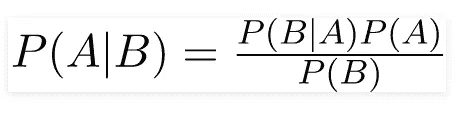
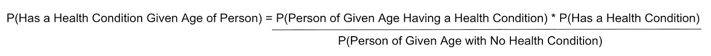
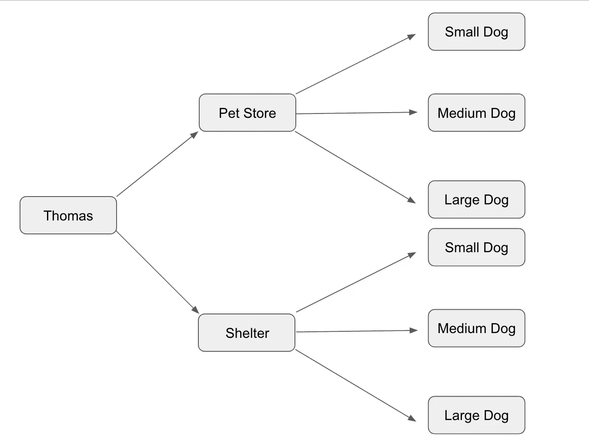
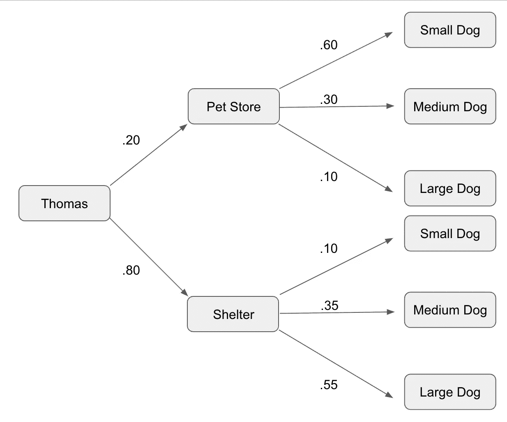
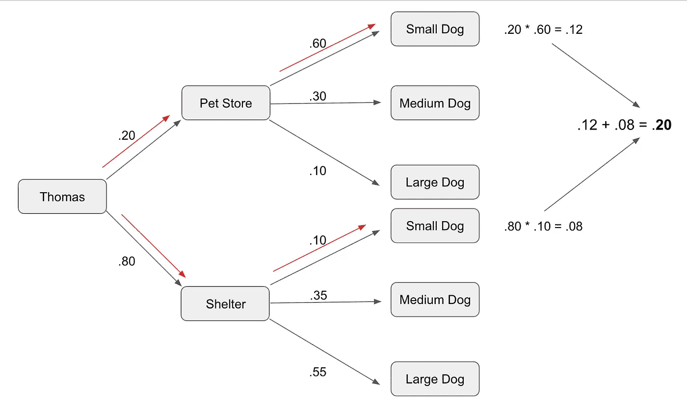
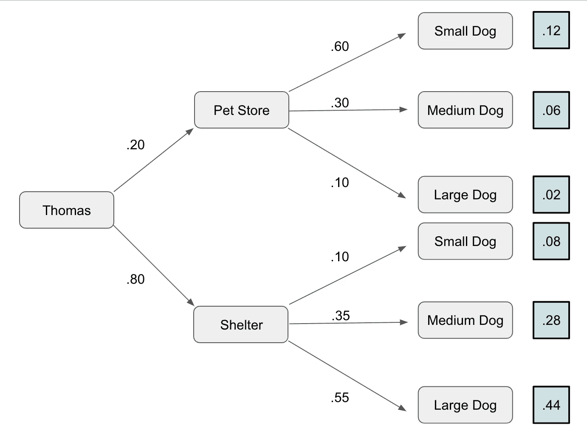
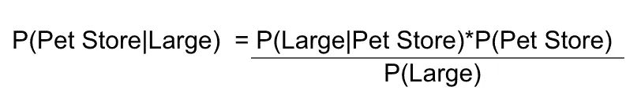
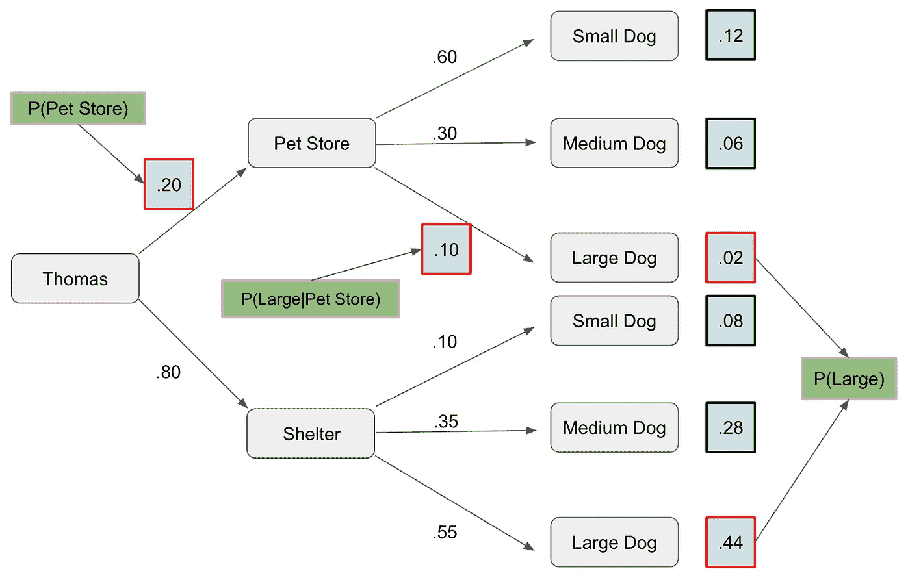
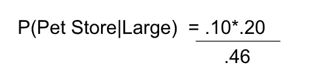

# 解决贝叶斯定理问题的简单指南

> 原文：<https://towardsdatascience.com/simple-guide-to-solving-bayes-theorem-problems-a594edc3e245?source=collection_archive---------39----------------------->

照片由 [Unsplash](/s/photos/branches?utm_source=unsplash&utm_medium=referral&utm_content=creditCopyText) 上的[尼克·费因斯](https://unsplash.com/@jannerboy62?utm_source=unsplash&utm_medium=referral&utm_content=creditCopyText)拍摄

## 树木是你的朋友

先说贝叶斯定理。贝叶斯定理是一个简单的概率公式，既通用又强大。它一直被誉为机器学习和数据科学中的热门新事物，直到神经网络出现并扮演了金·卡戴珊和贝叶斯的帕丽斯·希尔顿。与其他机器学习技术相比，贝叶斯定理特别有趣的是，公式本身已经有近 200 年的历史，而其他形式的机器学习通常有一个，比如说更年轻的年份。

概率可能是一个令人困惑的领域，你必须有足够的心智能力，能够在头脑中摆弄一些数字，以便能够解决一些更基本的问题。今天，我们将深入一个简单的方法来解决基本的贝叶斯定理问题。

# 一点背景

让我们来谈谈我们将要谈论的话题，嗯？贝叶斯定理是由英国长老会牧师托马斯·贝叶斯在 1763 年创立的。你们中的许多人可能会惊讶地听到神职人员负责，但在 20 世纪之前的几个世纪里，神职人员在很大程度上负责数学和科学的进步。遗传学的创始人格雷戈尔·孟德尔本人就是奥古斯丁修会的修士和修道院院长。

现在，贝叶斯定理作为一种方法被提出，通过这种方法，先前事件的知识将增加人们描述该事件或相关事件再次发生的概率的能力。例如，教科书中常见的一个例子是，如果健康问题的风险通常随着年龄的增长而增加，那么贝叶斯定理的应用允许我们更准确地评估已知年龄的个体的健康风险。如果你读了我之前关于朴素贝叶斯的文章，你就会知道这是怎么回事了。让我们看看公式，好吗？

好了，这似乎很容易。我们需要做的就是找到 P(B|A)，P(A)和 P(B)的概率，把它们代入，瞧，我们就有了计算结果！现在，如果有更简单的方法来做这件事呢？如果你对概率的走向感到困惑怎么办？如果应用题是你的敌人怎么办？该死的，这是数学，不是阅读理解！

# 更简单的方法

> 为什么在不需要的时候做数学？— Yi Shuen Lim

让我们来看看解决贝叶斯定理的潜在替代方法，当你看到它时，将允许你理解问题的所有方面。我们将使用我在熨斗中遇到的一个问题，因为我不是数学老师，也没有人付钱让我做数学题。

> 托马斯想要一只新的小狗。
> 
> 他可以选择从宠物店或动物收容所得到他的新小狗。他去宠物店的概率是 0.2。
> 
> 他可以选择得到一只大、中或小的小狗。
> 
> 如果他去宠物店，他得到一只小狗的概率是 0.6。他得到一只中型小狗的概率是 0.3，他得到一只大型小狗的概率是 0.1。
> 
> 如果他去动物收容所，他得到一只小狗的概率是 0.1。他得到一只中型小狗的概率是 0.35，他得到一只大型小狗的概率是 0.55。
> 
> **1。托马斯得到一只小狗的概率有多大？**
> 
> **2。鉴于他得到了一只大型小狗，托马斯去宠物店的概率是多少？**
> 
> **3。假设托马斯有一只小狗，他去宠物店还是去动物收容所的可能性更大？**

所以对于这个问题，我们将使用另一种方法来计算公式。我们打算种树。树是伟大的，它们帮助我们分解问题，并把它重铸成一个清晰和容易理解的格式。所以我们开始画吧！我们要做的第一件事是画出我们树的基本分支。

嘣。我们已经有效地将这个单词问题分解成它的结构组件，并以一种易于理解的格式展示出来。我们从托马斯和他去宠物店或收容所的决定开始，然后一旦在宠物店或收容所，我们将进一步的决定细分为小型，中型或大型狗。下一步是输入我们的概率。

看到我做了什么吗？现在我们已经得到了这个问题中给我们的概率，并把它们放在我们的树上。我们知道托马斯有 20%的概率去宠物店，到了那里有 60%的概率得到一只小狗，30%的概率得到一只中号狗，10%的概率得到一只大型犬。同样的情况也适用于 80%的概率，他去收容所和相关的概率为小型，中型和大型狗。还要注意，每个交叉点上的这些概率的总和是 100%，因为我们不能有超过 100%的概率，而小于 100%的总概率意味着还有另一种选择。如果你得到了一个单词问题的不完整信息，知道这一点是很有用的。

现在，我们来看第一个问题。

> 托马斯得到一只小狗的概率有多大？

为了解决这个问题，我们需要确定托马斯在宠物店或收容所得到一只小狗的所有概率。我们只需要将概率相乘，然后将它们相加，如下所示:

沿着红色箭头的路线，我们追踪了托马斯的路线，他先是去了宠物店或收容所，然后在那里得到了一只小狗。为了找到所有可能购买小狗的概率，我们采用收容所或宠物店的概率，然后乘以相应的购买小狗的概率。然后我们把那些加在一起，求出托马斯买小狗的概率的答案！通过简单地跟踪树中的分支，我们能够跟踪必要的概率，并将它们组合起来以找到所有小狗的情况。

现在让我们超越自我，完成所有概率的计算:

太好了！现在我们有了一个现成答案的适当框架，准备回答关于托马斯选择的任何问题。如果我们想知道托马斯得到一只大狗的概率会怎样？好吧，让我们回头看看我们的树。宠物店大型犬有 0.02 的概率，收容所大型犬有 0.44 的概率。我们把这些加在一起，大狗的**概率是. 46！**

现在进入第二个问题。

> *假设托马斯得到了一只大狗，他去宠物店的概率是多少？*

嗯，这确实是一个贝叶斯问题。如果我们把这个公式写出来，它会是这样的:

多亏了我们的树，我们不必绞尽脑汁去计算 P(大)需要构造什么样的概率。让我们回头参考我们的树来找到所需的组件。

因此，我们的公式看起来像这样:

这给了我们 **.04347！**

现在，进入最后一个问题！

> 假设托马斯得到了一只小狗，他去宠物店还是去动物收容所的可能性更大？

这个有点棘手。给定小型犬，P(宠物店|小型犬)和 P(收容所|小型犬)哪个更高？在这种情况下，我们将不得不重复公式，但两次，并确定哪个更高。

为了简化事情，我给你你需要的变量:

对于 P(宠物店|小狗):
P(小狗|宠物店)= .60
P(宠物店)= .20
P(小狗)= .20

对于 P(收容所|小型犬):
P(小型犬|收容所)= .10
P(收容所)= .80
P(小型犬)= .20

现在把这些代入贝叶斯定理，看看我们会得到什么数字？

以下是答案:

P(宠物店|小狗)= .60
P(收容所|小狗)= .40

由于 P(宠物店|小狗)比 P(收容所|小狗)大，鉴于托马斯给自己弄了一只小狗，托马斯去宠物店领狗的可能性更大！

# 结论

我希望你今天离开的时候，对贝叶斯定理的工作原理有了更好的理解，并且在面对这样的概率问题时，有了更多的安慰。视觉上分解事物几乎总是能帮助一个人理解他们所面临的情况，我认为这里的树对我们的理解有很大的帮助。这种方法的伟大之处在于，它几乎可以无限扩展，让你可以找到解决每个问题所需的概率。我将留给你们一个我在维基百科上找到的问题。自己建树，看自己能不能答出来！

假设我们有一个测试大麻使用的药物测试。现在，这种测试有 90%的真实阳性率，也就是说，90%的时候，它会检测到一个大麻使用者。它也有 80%的真实阴性率，即 80%的时间它将确认一个人没有使用大麻。不幸的是，它也会产生 20%的误报。考虑到所有接受测试的人中有 5%是大麻使用者，那么使用这种测试的大麻测试呈阳性的人是真正的大麻使用者的概率是多少？我给你一个开始的提示，你的树的第一个分支应该是大麻使用者。

玩得开心！