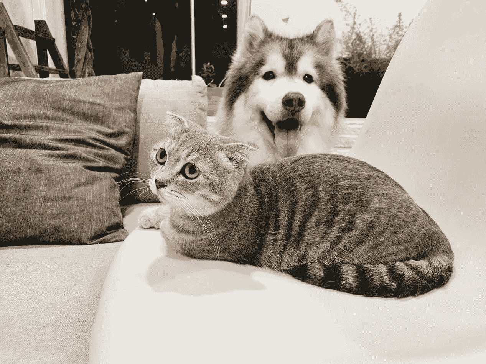

# 使用 Tensorflow 对初学者进行简单的 CNN 图像分类

> 原文：<https://towardsdatascience.com/simple-image-classification-with-cnn-using-tensorflow-for-beginners-b96a24be4f87?source=collection_archive---------50----------------------->

## 通过做一个将使用卷积神经网络的项目，学习执行一个简单的图像分类任务。



资料来源:Unsplash 作者 [Tran Mau Tri Tam](https://unsplash.com/photos/7QjU_u2vGDs)

图像分类不再是一个困难的话题。Tensorflow 拥有所有内置的功能，为我们处理复杂的数学问题。在不知道神经网络细节的情况下，我们现在可以使用神经网络。在今天的项目中，我使用了卷积神经网络(CNN ),它是神经网络的高级版本。它把一幅画浓缩成一些重要的特征。如果您使用包含衬衫、鞋子和手袋等的 FashionMNIST 数据集。美国有线电视新闻网将找出图像的重要部分。例如，如果你看到一个鞋带，它可能是一只鞋，如果有一个衣领和纽扣，那可能是一件衬衫，如果有一个把手，那可能是一个手提包。

## 概观

我们今天将构建的简单 CNN 将对一组图像进行分类，它将由卷积和池组成。输入在卷积层中进行修改。您可以根据需要放置一个或多个卷积。输入经过几个过滤器，这些过滤器对输入进行切片，以学习输入的一些部分，例如衬衫的纽扣、手提包的把手或鞋子的鞋带。我今天不打算在这方面深入探讨。因为这篇文章是写给初学者的。

联营是 CNN 的另一个非常重要的部分。池像卷积一样在每个局部区域上工作，但是它们没有过滤器，并且是向量到标量的转换。简单地计算该区域的平均值，识别具有最高强度的像素，并消除其余的像素。2 x 2 池会将要素地图的大小减少一半。即使你不知道其中的数学部分，你仍然可以解决一个深度学习问题。我会解释每一行代码。如今，我们有如此丰富的库来执行所有这些惊人的工作，甚至不需要了解太多的数学或编码。让我们开始吧。

## CNN 发展

我用的是谷歌 Colab 笔记本。如果你没有安装 anaconda 和 Jupiter 笔记本，你仍然可以在上面工作。每个人都可以使用谷歌的 collaboratory 笔记本。youtube 上有很多学习如何使用 Google Colab 的视频。如果你不知道 Google Colab，请随时查看。我们将使用包含猫和狗的图像的数据集。我们的目标是开发一个卷积神经网络，它将成功地从一张图片中对猫和狗进行分类。我们用的是 Kaggle 的数据集。

首先导入所有需要的包和库。

```
import osimport zipfileimport randomimport tensorflow as tffrom tensorflow.keras.optimizers import RMSpropfrom tensorflow.keras.preprocessing.image import ImageDataGeneratorimport shutil
```

是时候获取我们的数据集了。我们将使用名为“wget”的函数将数据集放入笔记本中。只是提醒一下，一旦你的 Google Collab 笔记本的会话结束，你必须再次导入数据集。让我们下载完整的 Cats-v-Dogs 数据集，将其存储为 cats-and-dogs.zip，并保存在名为“tmp”的目录中。

```
!wget –no-check-certificate \    "https://download.microsoft.com/download/3/E/1/3E1C3F21-ECDB-4869-8368-6DEBA77B919F/kagglecatsanddogs_3367a.zip" \    -O "/tmp/cats-and-dogs.zip"
```

现在从 zip 文件夹中提取数据，这将生成一个名为“temp/PetImages”的目录，其中有两个子目录，分别名为 Cat 和 Dog。这就是数据最初的结构。

```
local_zip = '/tmp/cats-and-dogs.zip'zip_ref = zipfile.ZipFile(local_zip, 'r')zip_ref.extractall('/tmp')zip_ref.close()
```

让我们检查猫和狗的文件夹。

```
print(len(os.listdir('/tmp/PetImages/Cat/')))print(len(os.listdir('/tmp/PetImages/Dog/'))
```

由于数据可用，现在我们需要创建一个名为 cats-v-dogs 的目录和子目录 training and testing。

```
try: os.mkdir('/tmp/cats-v-dogs/') os.mkdir('/tmp/cats-v-dogs/training/') os.mkdir('/tmp/cats-v-dogs/testing/')except OSError: pass
```

现在，为训练和测试拆分数据，用函数 split_data 将数据放在正确的目录中。Split_data 采用包含文件的源目录、数据切片将被复制到的训练目录、剩余数据将被复制到的测试目录以及分割数据的 split_size。

```
def split_data(SOURCE, TRAINING, TESTING, SPLIT_SIZE): cont = os.listdir(SOURCE)    lenList = len(cont)     shuffleList = random.sample(cont, lenList)  slicePoint = round(len(shuffleList)*SPLIT_SIZE) for i in range(0, len(shuffleList[:slicePoint])): if os.path.getsize(SOURCE+cont[i]) !=0:   
        shutil.copy(os.path.join(SOURCE,cont[i]), training) 
```

下面的代码块检查剩余文件的长度，并将它们放在测试目录中。

```
for j in range(len(shuffleList[slicePoint:])): if os.path.getsize(SOURCE+cont[j]) !=0: shutil.copy(os.path.join(SOURCE,cont[j]), testing)
```

功能就绪。使用 split_data 函数拆分源目录的数据，并将它们复制到培训和测试目录。

```
CAT_SOURCE_DIR = "/tmp/PetImages/Cat/"TRAINING_CATS_DIR = "/tmp/cats-v-dogs/training/cats/"TESTING_CATS_DIR = "/tmp/cats-v-dogs/testing/cats/"DOG_SOURCE_DIR = "/tmp/PetImages/Dog/"TRAINING_DOGS_DIR = "/tmp/cats-v-dogs/training/dogs/"TESTING_DOGS_DIR = "/tmp/cats-v-dogs/testing/dogs/"split_size = .9split_data(CAT_SOURCE_DIR, TRAINING_CATS_DIR, TESTING_CATS_DIR, split_size)split_data(DOG_SOURCE_DIR, TRAINING_DOGS_DIR, TESTING_DOGS_DIR, split_size)
```

检查培训和测试目录的长度。

```
print(len(os.listdir('/tmp/cats-v-dogs/training/cats/')))print(len(os.listdir('/tmp/cats-v-dogs/training/dogs/')))print(len(os.listdir('/tmp/cats-v-dogs/testing/cats/'))print(len(os.listdir('/tmp/cats-v-dogs/testing/dogs/')))
```

数据预处理完成。有趣的部分来了。我们将开发一个 Keras 模型来对猫和狗进行分类。在这个模型中，我们将使用三个卷积层和一个池层。你可以用更少或更多的卷积层来尝试。我们将使用一个激活函数和 input_shape 150 x 150。这个 input_shape 会将所有的图像重新塑造成这个相同的正方形。否则，现实世界中的图像将会有不同的大小和形状。在第一层中，我们的过滤器尺寸是 3×3，过滤器的数量是 16。最大池化 2 x 2 将像素浓缩 2 倍。我们还有两层不同数量的过滤器。您可以添加额外的“Conv2D”和“MaxPooling2D”层来观察结果。

```
model = tf.keras.models.Sequential([  

    tf.keras.layers.Conv2D(16, (3,3), activation='relu', input_shape=(150, 150, 3)), tf.keras.layers.MaxPooling2D(2,2), tf.keras.layers.Conv2D(32, (3,3), activation='relu'), tf.keras.layers.MaxPooling2D(2,2), tf.keras.layers.Conv2D(64, (3,3), activation='relu'), tf.keras.layers.MaxPooling2D(2,2),    tf.keras.layers.Flatten(),         tf.keras.layers.Dense(512, activation='relu'),         tf.keras.layers.Dense(1, activation='sigmoid')model.compile(optimizer=RMSprop(lr=0.001), loss='binary_crossentropy', metrics=['acc'])
```

在编译函数中，我们至少应该传递优化器和损失参数。这里学习率是 0.001。选择合理的学习速度很重要。学习率太小和太大都会使网络效率低下。下一步是标准化数据。

```
from tensorflow.keras.preprocessing.image import ImageDataGeneratorbase_dir = '/tmp/cats-v-dogs'TRAINING_DIR = os.path.join(base_dir, 'training')train_datagen = ImageDataGenerator(rescale = 1.0/255)train_generator = train_datagen.flow_from_directory(TRAINING_DIR,                                        batch_size=20,   class_mode='binary',  target_size=(150, 150))
```

ImageDataGenerator 有助于规范化像素值，使其介于 0 和 1 之间。您可能已经知道，最初的值可以是 0 到 255。然后我们批量传递我们的数据进行训练。在这里，我们提供的批量大小为 20。我们需要以同样的方式将测试数据标准化:

```
ALIDATION_DIR =os.path.join(base_dir, 'testing')validation_datagen = ImageDataGenerator(rescale = 1.0/255)validation_generator =  validation_datagen.flow_from_directory(VALIDATION_DIR,                                          batch_size=20,  class_mode='binary',  target_size=(150, 150))
```

现在训练模型。让我们用 15 个纪元来训练它。请随意测试更多或更少的纪元。你应该跟踪 4 个参数。损失、准确性、验证损失和验证准确性。随着每个时代的到来，损耗应该下降，精度应该上升。

```
history = model.fit_generator(train_generator,  epochs=15,  verbose=1,                              validation_data=validation_generator)
```

我在训练集上获得了 89.51%的准确率，在验证数据上获得了 91.76%的准确率。这里不得不提一件事。也就是说，如果训练集的精度非常高，而测试集或验证集的精度不是很好，这就是过拟合问题。这意味着模型很好地学习了训练数据集，它只知道训练数据很好，它对其他看不见的数据不好。但这不是我们的目标。我们的目标是开发一个对大部分数据集都有好处的模型。当您看到过度拟合时，您需要修改训练参数。大概是纪元数少，学习率不同。我们将在后面的文章中讨论如何处理过度拟合。