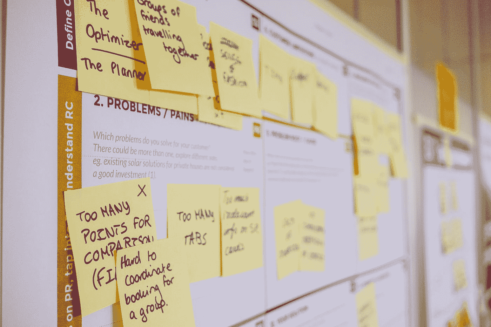

# 数据科学的简单介绍

> 原文：<https://towardsdatascience.com/simple-introduction-to-data-science-636413c2c60d?source=collection_archive---------66----------------------->

## 数据科学基础

## 数据科学项目生命周期中的步骤

照片由[艾丽](https://unsplash.com/@acreativegangster?utm_source=medium&utm_medium=referral)在 [Unsplash](https://unsplash.com?utm_source=medium&utm_medium=referral) 上拍摄

我们正在见证数据科学在我们周围的蓬勃发展。这已经成为新的技术行话，现在就像一个时髦词一样流传开来。在这篇文章中，我们将通过讲述以下内容来了解数据科学实际需要什么:

数据科学项目生命周期的步骤是什么？

因为从实用的角度来看，这是理解数据科学所有方面的最佳方式。

# 数据科学项目的生命周期

数据科学项目可以分为 7 个步骤:

## 1.理解业务问题

照片由[达里娅·内布里亚希娜](https://unsplash.com/@epicantus?utm_source=medium&utm_medium=referral)在 [Unsplash](https://unsplash.com?utm_source=medium&utm_medium=referral) 拍摄

这是任何数据科学项目开始的第一步，也是最重要的一步。理解你构建项目所基于的业务问题是非常重要的。这一步的任何模糊/混乱都可能让你在后期付出很大代价。这是任何想在数据科学领域取得成功的人最重要的特质之一。如果你正在为一个客户工作，一定要在这个初始阶段问尽可能多的问题。在你开始查看数据之前，你的头脑中应该对业务框架有一个绝对清晰的认识。

例如:如果您正在研究一个业务问题，该问题要求您建立一个预测模型来预测信用卡发行银行的哪些客户最容易流失。您可能想问的问题如下:

1.  你如何定义自然减员？—这将有助于您了解业务利益相关者的前景。
2.  总括损耗术语涵盖不同类型的行为。例如，在一种情况下，客户自愿关闭账户，而在另一种情况下，账户会休眠很长时间。—当您开始处理数据时，必须澄清每一个问题，以便能够成功地捕捉损耗。
3.  模型的准确性更重要，是以牺牲模型的可读性为代价，还是必须优先考虑模型的可读性？—这将有助于回答模型方法——统计模型或 ML 模型。
4.  谁将是这一模式的最终用户？这个模型是其他模型的支线模型还是独立模型？—这将有助于设计模型的输入输出结构。

你在这里得到了这个想法。还有问题吗？去问他们吧。这些信息构成了建模的基础。

## 2.数据采集

弗兰基·查马基在 [Unsplash](https://unsplash.com?utm_source=medium&utm_medium=referral) 上拍摄的照片

理解业务问题后的下一步是寻找数据源，从那里可以收集所有行为、性能、地理和各种描述业务问题的数据。最好你应该从稳定可靠的来源获取数据。

例如:如果您想将银行信用卡余额转账服务的客户群作为目标，您将需要大量的属性来确定客户的特征。你可以使用信用局的数据(交易，查询，拖欠等)。)、内部历史数据(过去报价接受率、月末未清余额、内部信用评分等。).简而言之，在统计上被确定为在区分特定类型的报价的好和坏账户时具有预测性的一组特征。

## 3.数据准备

一旦收集了数据，就进入数据准备阶段。数据准备通常也称为“预处理”。这是为数据科学项目的后续阶段清理和组织原始数据的阶段。在准备过程中，会认真检查原始数据是否有错误。此步骤的目的是消除不良数据(冗余、不完整或不正确的数据),并开始创建高质量的数据以获得最佳商业智能。

例如:您从第 2 阶段中讨论的各种来源获取数据，但是在我们准备数据的预处理阶段，现在我们意识到某个特定的数据源没有在级别(比如说帐户 ID 级别)上正确连接，并导致错误的属性列。我们可以在这个阶段删除数据源。同样，冗余、不完整或不正确在这个阶段都以同样的方式处理。

## 4.探索性数据分析

探索性数据分析(EDA)是一种分析数据集以总结其主要特征的方法，通常采用可视化方法。EDA 用于在建模任务之前可视化数据可以向我们展示的内容。查看一列数字或整个电子表格并确定数据的重要特征并不容易。通过查看表格形式的数据，似乎很难获得任何深刻的见解。探索性数据分析技术包括单变量分析 *{(箱线图、直方图等。)查看数据中单个变量的基本趋势、最大值、最小值、四分位间距、异常值等。}* 和双变量分析 *{(散点图、条形图、折线图等。)来看看因变量-自变量的关系和趋势}*

EDA 是在进入机器学习或统计建模阶段之前要执行的关键步骤。它为理解提供了一个重要的基础框架，并提供了为手头的问题开发合适的模型并正确解释其结果所需的背景。EDA 对于确保产生的结果是有效的、正确解释的，并且适用于期望的业务环境是有价值的。

## 5.预测建模

预测建模是预测未来行为的常用统计技术。预测建模解决方案是一种数据挖掘技术，通过分析历史和当前数据并生成模型来帮助预测未来结果。

有各种各样的预测建模技术，如回归、分类、聚类等。

这一步是最关键的一步。在开发预测模型时，确保在构建模型后对其进行评估，并开发 3-4 个挑战者模型，以便从中选择最佳模型。如果它是一个 ML 模型，你完全基于准确性来判断，因为大多数 ML 模型起着黑箱的作用。另一方面，如果它是一个统计模型，好好看看你在模型中使用的最终变量，并检查它们的业务相关性以及模型评估指标的结果。

## 6.可视化和交流

由[卢卡斯·布拉塞克](https://unsplash.com/@goumbik?utm_source=medium&utm_medium=referral)在 [Unsplash](https://unsplash.com?utm_source=medium&utm_medium=referral) 上拍摄

一旦模型准备好了，有效地传达它的结果是非常重要的。确保准备适当的文件，描述开发、验证和过时样本的模型结果，这些结果可以清楚地显示基尼系数/知识系数或其他评估指标。此外，传达结果还应包括清楚地描述构建模型时使用的假设。此外，敏感性分析是一种重要的可视化工具，可以描述模型的稳健性。你在这里得到的想法。明智地选择如何有效地沟通和展示你所开发的模型的准确性和作用。

## 7.部署和维护

现在，一旦模型被开发人员和业务涉众批准。它必须投入生产。一旦模型进入生产阶段，工作就不会结束。必须以适当的频率间隔连续监控模型。PSI(人口稳定性指数)和 CSI(特征稳定性指数)是一个很好的衡量人口分布如何符合开发样本的方法。如果差异显著，那么模型的结果可能变得不可靠，或者需要进一步深入研究。此外，应该监控模型预测的所有重要 KPI，如果在模型运行的两个月/两个时间段之间百分比变化变高，则可能需要重新校准或重新开发模型。

这些是数据科学项目的不同阶段。有几个数据科学团队专门从事我们上面讨论的某些阶段，而在 Kaggle 竞赛或许多公司中，您可能负责数据科学项目的端到端开发。无论哪种方式，所有阶段对于开发一个健壮可靠的模型都很重要，它可以帮助我们解决手头的业务问题。

每个阶段都包括许多进一步的技术子步骤，这些子步骤组合在一起构成一个阶段。但这篇文章是我试图解释一个没有任何技术术语描述的数据科学项目的整体观点。

观看此空间，了解更多关于数据科学、机器学习和统计的信息！

*快乐学习:)*