# 设置神经网络学习速率的简单直觉

> 原文：<https://towardsdatascience.com/simple-intuitions-for-setting-learning-rates-for-neural-networks-47df77cb7bd6?source=collection_archive---------57----------------------->

## 学习率可能是训练神经网络要调整的最重要的超参数。

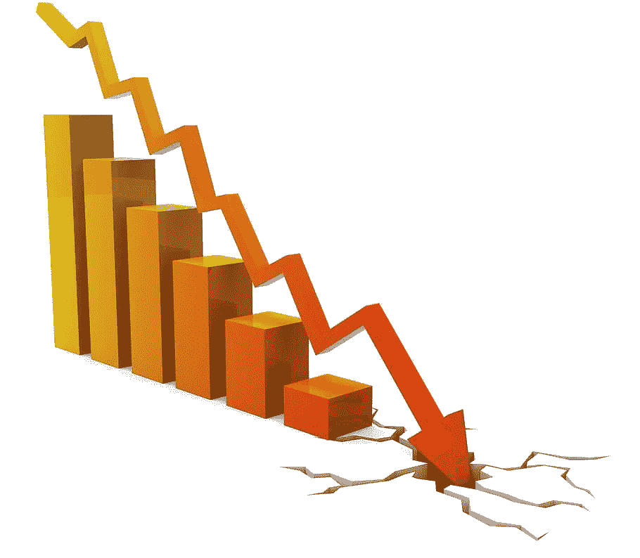

为训练神经网络的不同阶段设置良好的学习速率对于收敛以及减少训练时间是至关重要的。([图片](https://www.pxfuel.com/en/free-photo-qlnhr)来源)

学习率可能是训练神经网络要调整的最重要的超参数。

本文的目的是直观地了解调整学习率(LR)的各种最佳实践。

首先，我假设对 LR 和人工神经网络(NN)有一个大致的了解。详情请参考[此处](https://en.wikipedia.org/wiki/Artificial_neural_network)。简而言之，LR 是网络响应丢失而更新其参数的速率。在元水平上，LR 代表当面对失败时信念被修正的程度。

为了简单起见，我会考虑尝试学习两个简单的函数 f(x) -> x 和 f(x)-> 2x+5。因此，在第一种情况下，给定像 1，2，3 这样的数字，神经网络需要学会将这些数字返回。对于第二种情况，它需要学习一个线性函数。

对于第一种情况，忽略使用具有一个节点(输入)的网络的明显解决方案，我们考虑具有两个节点的 NN:一个输入和一个输出。因为我们知道它必须学习的函数，即 f(x) = 1*x + 0。我们不设置偏差参数。因此，只有一个参数需要调整，即权重，在本例中是一个标量。

```
*model = keras.models.Sequential([
 keras.layers.Input(1),
 keras.layers.Dense(1, use_bias=False)
])* model.summary()
Model: "sequential_28"
_________________________________________________________________
Layer (type)                 Output Shape              Param #   
=================================================================
dense_33 (Dense)             (None, 1)                 1         
=================================================================
Total params: 1
Trainable params: 1
Non-trainable params: 0
_________________________________________________________________
```

现在，让我们看看 keras 设置的[随机权重。默认情况下，它使用 Xavier 初始化，但出于这个目的，我们可以认为这是一个小的随机浮点。](https://www.deeplearning.ai/ai-notes/initialization/)

```
model.layers[0].get_weights()
[array([[1.3835369]], dtype=float32)]
```

太好了，NN 需要做的就是学会把 1.38…改成 1 就搞定了。大约 80 个训练例子应该足以学习这个参数。我们去看看。

我们首先使用 LR 为 0.1 的随机梯度下降优化器。

```
model = keras.models.Sequential([
    keras.layers.Input(1),
    keras.layers.Dense(1, use_bias=False)
])#saving the single weight in a list using callback for plotting
all_weights = []
save_weights = LambdaCallback(on_epoch_end=lambda batch, logs: all_weights.append(model.layers[0].get_weights()[0][0][0]))model.compile(loss='mae', optimizer=keras.optimizers.SGD(**0.1**), metrics=['mae'])
history = model.fit(X[:80], X[:80], epochs=100, validation_data=(X[80:], X[80:]), callbacks=[save_weights])Epoch 1/100
3/3 [==============================] - 0s 25ms/step - loss: 68.6347 - mae: 73.1572 - val_loss: 220.5727 - val_mae: 220.5727
...
Epoch 100/100
3/3 [==============================] - 0s 9ms/step - loss: 80.8392 - mae: 84.1430 - val_loss: 58.0744 - val_mae: 58.0744
```

经过大约 100 个时期的训练后，平均误差似乎降低了，但幅度不大。发生了什么事？

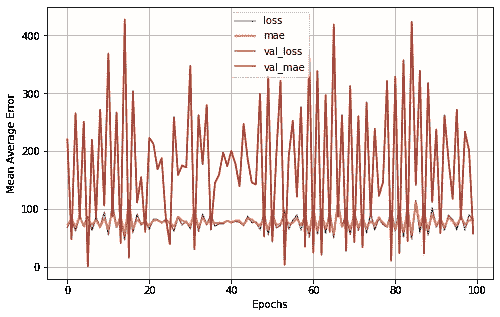

MAE 在整个时代都在波动，没有学到任何有用的东西。

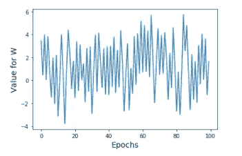

我们期望权重 W 收敛到 1。它好像在做随机漫步。

W 图的尖峰告诉我，当神经网络预测的值过高时，它会过多地调整权重，从而导致它在另一个方向上调整过多。它从未能以“恰到好处”的方式调整它。现在，我将尝试通过将 LR 设置为 0.001 来重复这个实验。

```
model.compile(loss='mae', optimizer=keras.optimizers.SGD(0.001), metrics=['mae'])
history = model.fit(X[:80], X[:80], epochs=100, validation_data=(X[80:], X[80:]), callbacks=[save_weights])
...
Epoch 1/100
3/3 [==============================] - 0s 25ms/step - loss: 51.1354 - mae: 51.7827 - val_loss: 109.6049 - val_mae: 109.6049
Epoch 100/100
3/3 [==============================] - 0s 11ms/step - loss: 1.1278 - mae: 1.0618 - val_loss: 1.5589 - val_mae: 1.5589
```

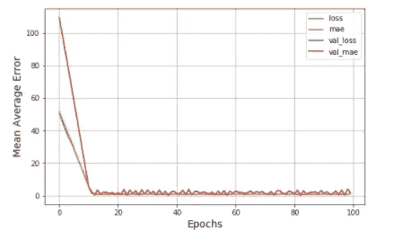

好多了！MAE 下降非常快，但随后开始波动。

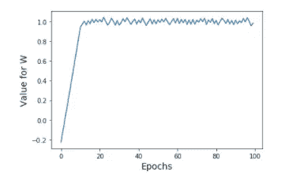

相反，权重开始收敛到 1，但永远不会完全达到 1。

似乎 LR 越低越好。让我再试一次。LR= 0.0001

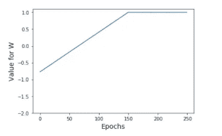

设置较低的 LR 意味着学习非常慢。请注意比例的差异，W 接近 1，但需要近 200 个历元。但一旦开始，它会保持很紧。

因此，在开始时有较大的学习速率似乎有助于快速接近一个好的解决方案，而有较小的学习速率似乎有助于接近理想的解决方案。

# 衰退

学习率衰减的想法很简单，在每次迭代结束时，假设我们正在缓慢收敛，我们希望将学习率修改为更小的值。大多数优化器定义允许在每次迭代(小批量)后更新 LR 的单个衰减参数。优化器中指定的 LR 是 initial_lrate。

```
# decay works by:
# lrate = initial_lrate / (1 + decay * iteration)
model.compile(loss='mae', optimizer=keras.optimizers.SGD**(0.01, decay=0.01)**, metrics=['mae'])
history = model.fit(X[:80], X[:80], epochs=250, validation_data=(X[80:], X[80:]), callbacks=[save_weights])
```

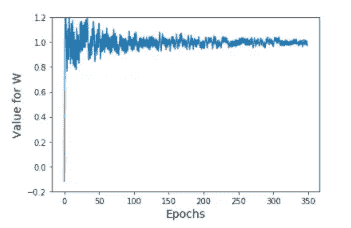

好多了。然而，它似乎从来没有完全稳定下来，需要很长时间。

# 学习费率表

为了增加灵活性，我们可以指定回调，而不是使用优化器的衰减参数。在 Keras 中，回调是一个可定制的函数，在每个时期结束时调用。

在这里，我定义了一个函数来处理简单依赖于纪元编号的衰减。函数 lr_schedule 当然是可定制的。

```
def lr_schedule(epoch):
    if epoch<5:
        return 0.02
    elif 5>=epoch>25:
        return 0.01
    elif 25>=epoch>50:
        return 0.001
    else:
        return 0.0001
lrate = LearningRateScheduler(lr_schedule)
model.compile(loss='mae', optimizer=keras.optimizers.SGD(), metrics=['mae'])
history = model.fit(X[:80], X[:80], epochs=100, validation_data=(X[80:], X[80:]), callbacks=[save_weights, lrate])
```

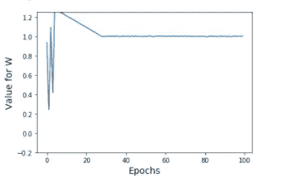

在这种情况下，我们看到我们在开始时有一点波动，但在纪元 40 之前已经收敛了很多。我发现这也有助于开始小 LR 上升到最大，然后开始按比例缩小，直到它达到最小。这叫 LR 循环。对迁移学习特别有帮助。

# 适应性学习率

在上面这个非常简单的例子中，我从一个可怕的 LR 值开始，然后慢慢地调整这个过程。为 LR 设置的时间表取决于任务的复杂性、训练数据的大小、小批量大小、训练数据的质量等等。

像 [RMSProp](http://keras.io/optimizers/) 、 [Adagrad](http://keras.io/optimizers/) 和 [Adam](http://keras.io/optimizers/) 这样的常用优化器使用像动量和前瞻这样的梯度特征来自动调整 LR。

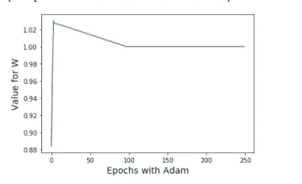

对于这个简单的问题，Adam 似乎在没有任何超参数调整的情况下在 100 个时期内稳定。Adam 可以理解为有动量的 RMSprop 和 SGD 的组合。已经有了更新的提议，像那达慕，是对亚当的增强。

使用 Adam 这样的自适应优化器通常是一个不错的选择。然而，已经表明，有时 Adam [并不总是](https://ruder.io/optimizing-gradient-descent/)收敛到与带动量的 SGD 一样的最优解。因此，在最终确定解决方案之前，针对几个不同的超参数尝试 SGD 是一个很好的实践。增加了一点复杂性

当我通过要求神经网络学习 f(x) -> 2*x+5 并允许使用一个偏差变量来增加原始问题的复杂性时。

```
X = np.arange(100)
y = 2*X+5
X_train_full, X_test, y_train_full, y_test = train_test_split(X, y, test_size=0.2, random_state=42)
X_train, X_valid, y_train, y_valid = train_test_split(X_train_full, y_train_full, test_size=0.2, random_state=42)model = keras.models.Sequential([
    keras.layers.Input(1),
    keras.layers.Dense(1)
])#all_weights = []
#save_weights = LambdaCallback(on_epoch_end=lambda batch, logs: all_weights.append(model.layers[0].get_weights()[0][0][0]))
model.compile(loss='mae', optimizer=keras.optimizers.Adam(), metrics=['mae'])
history = model.fit(X_train, y_train, epochs=200, validation_data=(X_valid, y_valid), callbacks=[lrate])
```

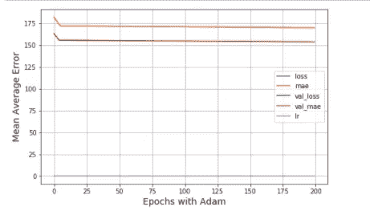

Adam 的默认设置没有在 200 个时期内收敛到一个解决方案。然而，它正在稳步取得进展。

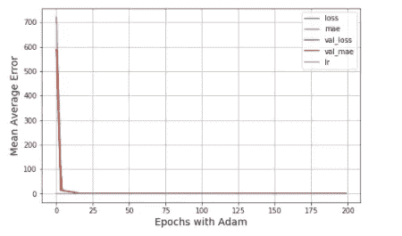

给定更多的训练示例(1000)，它似乎进展得更好，学习 a W = 2.004 和 b=1.94。它收敛到正确的权重，但未能收敛到好的偏移值。

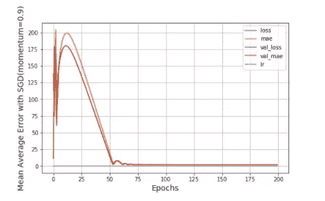

在这种情况下，使用带有动量的 SGD 似乎做得更好。它在 200 个时代结束时学习的参数是 W=2.071 和 b= 0.23。

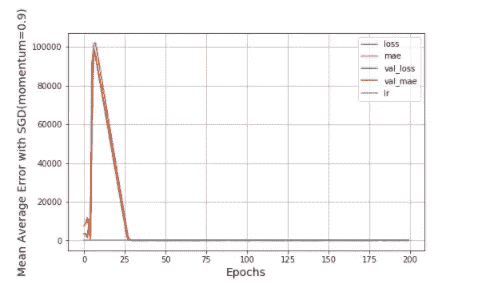

SGD 解决方案看起来并没有因为更多的例子而变得更好。它学习了 W=2.05 和 b=0.34。

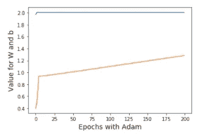

W 稳定得相当快，但是偏置更新得很慢。(亚当)

在这篇简短的文章中，我们看到设置好的 LR 对于确保神经网络收敛以及优化收敛速度非常重要。我们还看到使用替代优化器，如 Adam、RMSProp、Nadam 等。帮助调整学习速度。最后，我们还看到了如何使用自定义函数来设置学习率衰减的时间表，以及 LR 循环如何有所帮助。

但是，为什么一个神经网络需要 1000 个样本和 100 次数据传递来学习一个简单的恒等函数，而这个函数对于只有几个样本的人来说是显而易见的？现在，这是另一个职位！