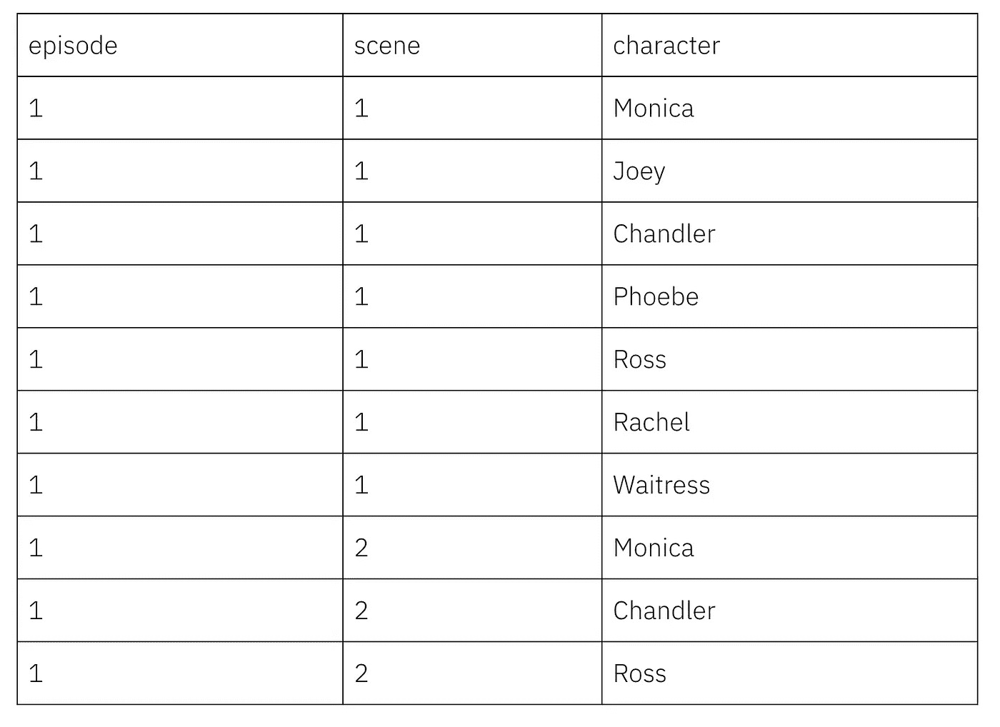
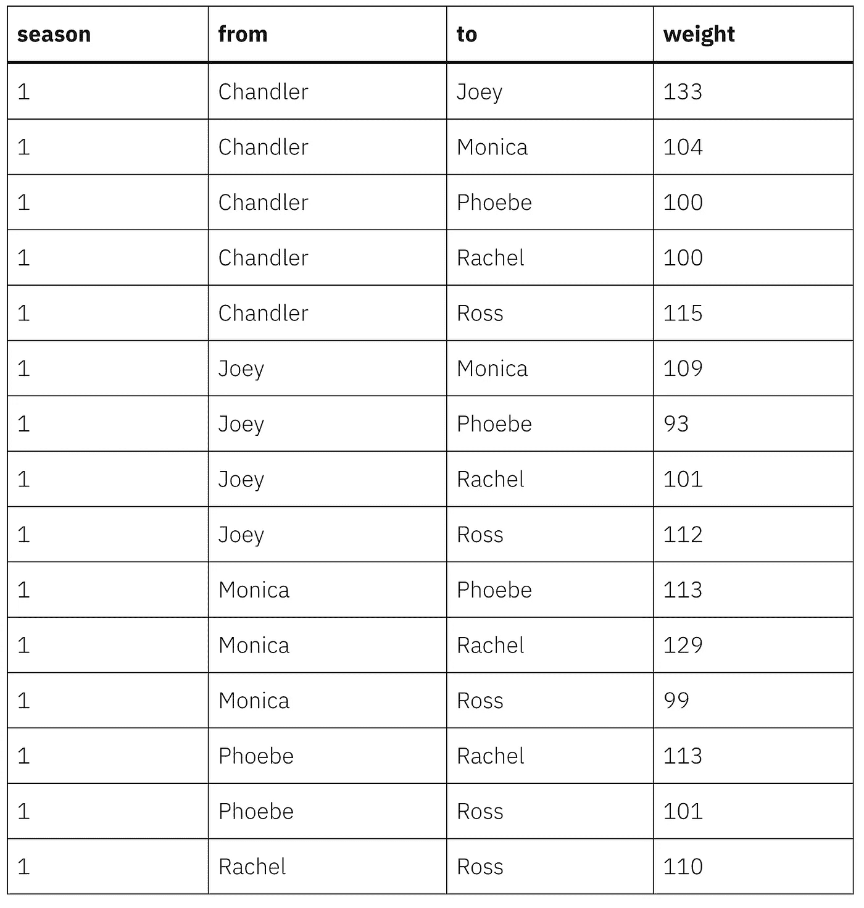

# R 中的简单迭代编程和错误处理

> 原文：<https://towardsdatascience.com/simple-iterative-programming-and-error-handling-in-r-a68ebccdf9b9?source=collection_archive---------47----------------------->

## 有时候你有很多事情要做，你不需要因为错误而停下来

作为一名程序员，你会发现自己处于一些常见的情况。其中一种情况是，您需要在一个或多个循环的多次迭代中运行代码，并且您知道您的代码可能会在至少一次迭代中失败。您不希望您的代码完全停止，但是您确实希望知道它失败了，并记录它发生的位置。我将在这里展示一个简单的例子来说明如何做到这一点。

这是我为电视节目*老友记构建互动角色网络可视化旅程的第二部分。*第一步的教程——从网上抓取单集剧本——可以在[这里](https://drkeithmcnulty.com/2020/03/25/scraping-structured-data-from-semi-structured-documents/)找到。整个项目的最终产品可以在[这里](https://keithmcnulty.github.io/friends_analysis/play_friends.html)看到，所有代码在[这里](https://github.com/keithmcnulty/friends_analysis)。

在我们停下来的地方，我们已经写了一个脚本，可以抓取 *Friends* 的每个在线集，找到并计算不同的场景，并列出每个场景中的角色。我们的抓取脚本输出了这样一个表:



我们现在要做的是创建一个网络边缘列表，以便我们可以分析和可视化该剧的角色网络。网络边列表是带有“从”和“到”列的简单的字符配对，其中如果字符在至少一个场景中一起出现，则它们是配对的。我们还将增加一个“权重”栏，统计这对情侣一起出现的场景数量——这是一种衡量联系“强度”的方法。我们希望每一季都这样做，我们不在乎我们网络中的方向——所以对我们来说，这对组合{“钱德勒”、“莫妮卡”}就是对组合{“莫妮卡”、“钱德勒”}。因此，总结我们的目标，我们希望:

1.  让我们的抓取功能贯穿每一季每一集
2.  将输出转换为每个场景的字符“对”
3.  统计每一季剧中的角色对，形成一个“权重”。

# 在所有季节和剧集中运行我们的抓取功能

《老友记》一共播出了十季，每一季都有不同的集数，但从未超过 25 集——也有双集，这意味着一些集数在剧本名称中被跳过了。我不想编写精确定义多年来所有季节和剧集组合的条件代码。我更愿意做的是让我的抓取脚本抛出一个错误，返回一个空数据框，在我的控制台中将错误记录为一条消息，然后继续下一次迭代。然后，我可以查看记录的消息，并检查错误是否在意料之中，因为剧集并不存在。

因此，我将在这里做一些错误处理——我将使用`tryCatch()`函数来做这件事。`tryCatch()`接受一个命令，如果可以就执行它，然后接受特定的指令作为出错时的回调函数。在我的例子中，我将像这样使用`tryCatch()`:

```
library(dplyr)# function developed in previous tutorial
source('edgelist_creation/scrape_friends.R')   

season <- 1 # enter season no
episode <- 1 # enter episode number

scrape <- tryCatch(
      scrape_friends(season, episode),
      error = function(e) {
        message(paste("Scrape failed for Episode", episode, "Season", season))
        data.frame(from = character(), to = character(), stringsAsFactors = FALSE)
        }
)
```

使用此代码，如果特定的季节和剧集组合不存在，代码将不会停止，而是会在控制台中显示特定的消息并返回一个空数据帧。这使得我们可以迭代每一季和每一集，而不用担心我们的代码会因为一个错误而停止。

# 将输出转换成字符对

因此，由于我们出色的`tryCatch()`解决方案，我们现在可以创建一个`for`循环的开始，该循环将迭代 10 季，每季 25 集，如下所示。请注意我在这里的评论，并特别注意我们接下来需要处理的 CAPS 部分:

```
for (season in 1:10) {

  # start with empty dataframe
  season_results <- data.frame(from = character(), to = character(), stringsAsFactors = FALSE)

  # no season has more than 25 episodes, loop through them all
  for (episode in 1:25) { 

    # keep track of where we are
    message(paste("Scraping Season", season, "Episode", episode))

    # run scraping function, pass empty df if scrape fails
    scrape <- tryCatch(
      scrape_friends(season, episode),
      error = function(e) {
        message(paste("Scrape failed for Episode", episode, "Season", season))
        data.frame(from = character(), to = character(), stringsAsFactors = FALSE)
        }
    )

    result <- data.frame(from = character(), to = character(), stringsAsFactors = FALSE)

    if (nrow(scrape) > 0) {
      # DO SOMETHING TO CREATE CHARACTER PAIRS HERE
    } 

   # add episode output to season results 
   season_results <- season_results %>% 
     dplyr::bind_rows(result)

  }

  # add season results to overall results
  raw_results <- season_results %>% 
    dplyr::mutate(season = season) %>% 
    dplyr::bind_rows(raw_results)

}
```

这就把我们带到了如何将一集的输出转换成每个场景的一组独特的字符对的问题上。回想一下，我们的抓取脚本的输出包含一组场景编号和每个场景的角色列表。

在一个场景中，我们需要将这个字符列表转换成一组唯一的无序对。让我们编写一个简单的函数，将一个字符向量转换成一组唯一的无序元素对。为此，我们需要遍历每个元素，直到倒数第二个元素，并与它后面的每个元素配对——例如，为了对向量`("A", "B", "C", "D")`进行这样的操作，我们会将`"A"`与`"B"`、`"C"`和`"D"`配对，将`"B"`与`"C"`和`"D"`配对，最后将`"C"`与`"D"`配对。

```
unique_pairs <- function(char_vector = NULL) {

  vector <- as.character(unique(char_vector))

  df <- data.frame(from = character(), to = character(), stringsAsFactors = FALSE)

  if (length(vector) > 1) {
    for (i in 1:(length(vector) - 1)) {
      from <- rep(vector[i], length(vector) - i) # each element up to second last
      to <- vector[(i + 1): length(vector)] # each element that follows it

      df <- df %>% 
        dplyr::bind_rows(
          data.frame(from = from, to = to, stringsAsFactors = FALSE) 
        )
    }
  }

  df

}
```

让我们测试一下我们的函数，看看它是否有效:

```
> test <- c("A", "B", "C", "D")
> unique_pairs(test)
  from to
1    A  B
2    A  C
3    A  D
4    B  C
5    B  D
6    C  D
```

看起来不错！现在我们只需要将它应用到这一集的每一个场景，所以这是我们可以替换到循环中的最终代码，而不是上面的 CAPS 注释。它遍历每个场景，将我们新的`unique_pairs()`函数应用于角色列表，然后将结果附加到一个数据帧中，该数据帧捕获该集的所有配对。

```
for (i in 1:max(scrape$scene)) {
        result_new <- scrape %>% 
          dplyr::filter(scene == i) %>% 
          dplyr::pull(character) %>% 
          unique_pairs()

        result <- result %>% 
          dplyr::bind_rows(result_new) 
}
```

现在我们可以在所有的季节和剧集中运行整个循环。你可以在这里找到这个循环[的完整代码。如果我们运行它，我们将看到被捕获的错误—例如，我们将看到:](https://github.com/keithmcnulty/friends_analysis/blob/master/edgelist_creation/generate_edgelist.R)

```
Scraping Season 10 Episode 17
Scraping Season 10 Episode 18
Scrape failed for Episode 18 Season 10
Scraping Season 10 Episode 19
Scrape failed for Episode 19 Season 10
Scraping Season 10 Episode 20
Scrape failed for Episode 20 Season 10
Scraping Season 10 Episode 21
Scrape failed for Episode 21 Season 10
Scraping Season 10 Episode 22
Scrape failed for Episode 22 Season 10
Scraping Season 10 Episode 23
Scrape failed for Episode 23 Season 10
Scraping Season 10 Episode 24
Scrape failed for Episode 24 Season 10
Scraping Season 10 Episode 25
Scrape failed for Episode 25 Season 10
```

这是有道理的，因为第十季最后一集是第十七集(双集大结局)。

# 计算每对场景的数量

现在我们差不多到家了。我们需要计算每一季中一对角色一起出现在一个场景中的次数，以创建我们的“权重”栏。我们需要克服的唯一问题是字符的顺序在我们的`raw_results`数据帧中可能不一样。我们的迭代可能在一个场景中捕捉到了`from = "Monica"`、`to = "Chandler"`，但在另一个场景中则相反。

对此的最佳解决方案是使用以下命令按字母顺序对每行中的对进行排序:

```
# order pairs alphabetically to deal with different orderings
for (i in 1: nrow(raw_results)) {

  raw_results[i, c("from", "to")] <- sort(raw_results[i, c("from", "to")])

}
```

现在我们准备按季节生成我们的“体重”列，这现在相当简单:

```
# add up scenes to form season weights
edges <- raw_results %>% 
  dplyr::count(season, from, to, name = "weight")
```

我们可以快速浏览一下我们的`edges`数据框架的样本。正如您所料，它有成千上万行，但我们预计六个主要字符之间的权重相当高:

```
friends <- c("Phoebe", "Monica", "Rachel", "Joey", "Ross", "Chandler")

edges %>% 
  dplyr::filter(season == 1,
                from %in% friends,
                to %in% friends)
```

这将返回:



好了，我们已经有了边缘列表，现在我们准备继续这个项目的网络分析部分，在这里我们将查看六个主要角色的社区，并想象它们如何随着季节的变化而变化。在接下来的文章中，请留意这一点。

最初我是一名纯粹的数学家，后来我成为了一名心理计量学家和数据科学家。我热衷于将所有这些学科的严谨性应用到复杂的人的问题上。我也是一个编码极客和日本 RPG 的超级粉丝。在[*LinkedIn*](https://www.linkedin.com/in/keith-mcnulty/)*或*[*Twitter*](https://twitter.com/dr_keithmcnulty)*上找我。也可以看看我在 drkeithmcnulty.com 的***上的博客。**

**

*来自《老友记》，由 NBC 提供*