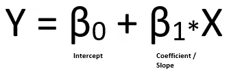
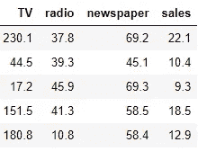
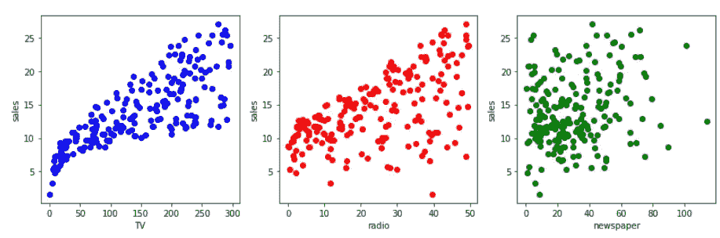
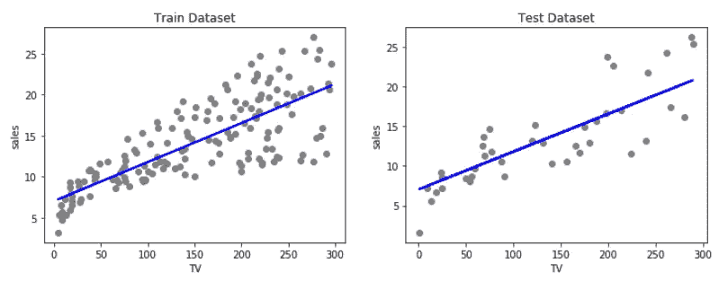
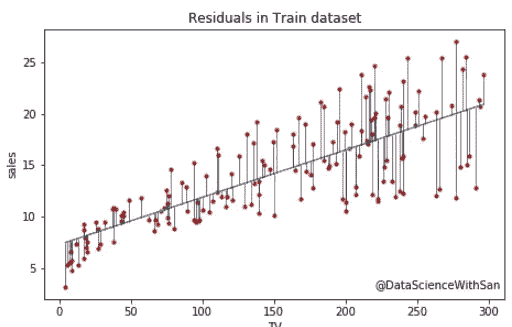
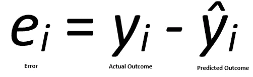
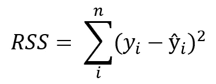
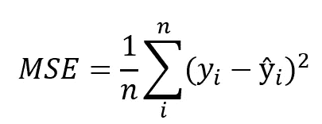
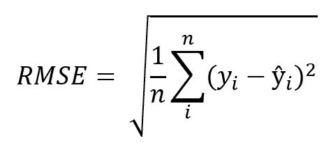
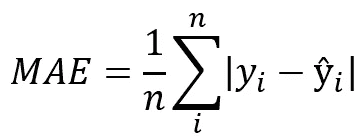

# 简单线性回归

> 原文：<https://towardsdatascience.com/simple-linear-regression-35b3d940950e?source=collection_archive---------17----------------------->

## 关于简单线性回归你需要知道的一切


格伦·卡斯滕斯-彼得斯在 [Unsplash](https://unsplash.com?utm_source=medium&utm_medium=referral) 上拍摄的照片

当我们着手理解机器学习模型时，我们通常首先遇到的事情之一是简单的线性回归。这是进入机器学习的第一步，这篇文章将帮助你了解你需要知道的一切。让我们从了解什么是**回归**开始。

## 什么是回归？

回归一词最早出现在 19 世纪，用来描述一种现象，即高个子祖先的后代的身高倾向于向正常平均身高回归。换句话说，回归就是回归中庸(中庸)的趋势。有趣吧？

在统计学中，该术语被定义为输出变量和输入变量之间**关系的量度。因此，线性回归假设前者和后者之间存在线性关系。根据输入变量的数量，线性回归可以分为两类:**

1.  简单线性回归(单一输入变量)
2.  [多元线性回归](/multiple-linear-regression-8cf3bee21d8b?source=your_stories_page---------------------------)(多输入变量)

## 这篇文章的目的

这篇文章致力于解释简单线性回归的概念，这也将为你理解多元线性回归打下基础。除此之外，我们将在 Python 中实现线性回归，以了解它在机器学习中的应用。与此同时，我们还将了解一些重要的事实。说到这里，让我们开始吧。

## 数学上…

我们将输入变量表示为 X，输出变量表示为 Y，这是通常的做法。然后我们可以把 X 和 Y 之间的关系写成:



这里，两个常数项(β)是截距和斜率。你可能在你的学校代数中见过这个表达式，直线的一般表达式是，

y = c + mx

其中 c 是截距，m 是斜率。这就是我们在线性回归中要做的。我们试图拟合一条直线来观察输入和输出变量之间的关系，然后进一步用它来预测看不见的输入的输出。

让我们引入数据来理解这是如何工作的。

## 可视化数据

我们将使用南加州大学马歇尔商学院网站上的广告数据。你可以在这里下载[。](http://faculty.marshall.usc.edu/gareth-james/ISL/Advertising.csv)

> 这些数据被用在一本很受欢迎的书“统计学习入门”中，顺便说一下，如果你想了解机器学习的基本统计，这是必读的。

广告数据集包括一种产品在 200 个不同市场的销售额，以及三种不同媒体的广告预算:电视、广播和报纸。它看起来是这样的:



销售额(*1000 台)与广告预算(*1000 美元)

数据的第一行表示电视、广播和报纸的广告预算分别为 230.1k 美元、37.8k 美元和 69.2k 美元，相应的售出数量为 22.1k(或 22，100)。

现在，我们将尝试使用简单的线性回归来了解这三种媒体中的每一种是如何与销售相关联的。因此，我们的输入变量(X)将是广告代理商之一，输出变量将是销售额(Y)。

> 在下结论之前理解你的数据是很重要的。一个人必须注意测量单位和变量的规模，以讲述正确的故事。

## 绘制输入与输出

现在让我们观察一下我们的销售额与每个广告代理商的对比情况。

```
import pandas as pd#give the path of your directory containing the csv file as parameter to read_csv.data = pd.read_csv(.../advertising.csv)
```

加载 csv 文件后，运行以下代码来绘制变量。

```
import matplotlib.pyplot as plt  
%matplotlib inlineplt.figure(figsize=(14,3))plt.subplot(1,3,1)
plt.scatter(data['TV'], data['sales'], 'blue')
plt.xlabel('TV')
plt.ylabel('sales')plt.subplot(1,3,2)
plt.scatter(data['radio'], data['sales'], color = 'red')
plt.xlabel('radio')
plt.ylabel('sales')plt.subplot(1,3,3)
plt.scatter(data['newspaper'], data['sales'], color = 'green')
plt.xlabel('newspaper')
plt.ylabel('sales')plt.show
```

上述[代码](https://github.com/datasciencewithsan/Simple-Linear-Regression/)将产生以下散点图。



销售额(*1000 台)与广告预算(*1000 美元)

通过观察第一幅图(左)，人们可以推断出随着电视广告的增加，销售额有急剧上升的趋势。在描述广播广告的第二个图表(中间)中也可以观察到类似的趋势。然而，在最后一张图(右)中，趋势并不明显。这是什么意思？

## 相互关系

当观察到输入变量 X 的增加与输出变量 Y 的同时增加或减少时，这两者之间就有了关联。这是对 X 和 Y 之间关系的一种度量。通过可视化的数据，我们可以直观地看到电视和销售是强相关(高度相关)的。另一方面，报纸预算和销售之间的相关性似乎较弱。

> 相关性经常会误导人，因为它看起来像因果关系。仅仅因为两个变量相关，并不意味着一个变量会引起另一个变量的变化。我们需要深入挖掘，决定这是否只是一个相关的例子，或者是否也是因果关系。

线性回归将帮助我们确定这种关系的强度，即在给定特定广告媒体的情况下，我们预测销售额的准确度有多高。

## 建立简单线性回归模型

现在我们已经了解了数据，让我们建立一个简单的模型来了解销售和广告代理之间的趋势。在这篇文章中，我将使用电视作为代理来构建以下回归模型。我鼓励你为另外两个代理(广播和报纸)做这件事。

**→ 𝑆𝑎𝑙𝑒𝑠 = 𝛽0 + 𝛽1 * 𝑇𝑉**

这个回归模型将通过调整𝛽0 和𝛽1.这两个常数，找到能够代表数据的最佳直线最佳拟合是在给定输入值的情况下预测输出时显示最小量的*误差*的拟合。

稍后，我们将了解更多关于误差函数和模型评估的内容。在此之前，让我们编码并构建上述模型。

```
**#** **Importing required libraries**
import pandas as pd
import numpy as np
from sklearn.model_selection import train_test_splitfrom sklearn.linear_model import LinearRegression**# Defining X and Y**
X = data['TV'].values.reshape(-1,1)
Y = data['sales'].values.reshape(-1,1)**# Splitting the data into Train & Test** X_train, X_test, y_train, y_test = train_test_split(X, Y, test_size=0.2, random_state=1)**# Fitting the model on Train dataset** Model = LinearRegression(fit_intercept=True)
Model = Model.fit(X_train, y_train)**# Predicting and storing results for Test dataset** train_fit = Model.predict(X_train)
test_pred = Model.predict(X_test)
```

回归模型通过调整𝛽0 和𝛽1 这两个常数来寻找能够代表数据的最佳直线，从而以最佳方式代表数据。

> 请注意，我们已经将数据分成了两个子集:训练数据集和测试数据集。这是机器学习中的常见做法。这使我们能够在可见和不可见的数据上检查模型的性能。

你可以在这里找到完整的代码。现在，让我们在训练和测试数据集上绘制和可视化我们的模型。

```
plt.figure(figsize=(12,4))**# Plotting Regression line on Train Dataset**
plt.subplot(1,2,1)
plt.scatter(X_train, y_train, color='gray')
plt.plot(X_train, train_fit, color='blue', linewidth=2)
plt.xlabel('TV')
plt.ylabel('sales')
plt.title("Train Dataset")**# Plotting Regression line on Test Dataset**
plt.subplot(1,2,2)
plt.scatter(X_test, y_test, color='gray')
plt.plot(X_test, test_pred, color='blue', linewidth=2)
plt.xlabel('TV')
plt.ylabel('sales')
plt.title("Test Dataset")plt.show()
```



太好了！通过调整常数，我们的回归方程拟合出了最佳模型。正如我们所看到的，它在训练和测试数据中做了很好的直线处理。让我们检查截距和 x 系数(斜率)的值。

```
print("Intercept is ", Model_1.intercept_[0])
print("Coefficient is ", Model_1.coef_[0][0])
```

您应该会得到这些输出，其中可能有非常细微的变化:

```
Intercept is 7.032593549127693
Coefficient is 0.047536640433019764
```

**截距是输入为 0** 时输出的值。在这种情况下，它是在没有电视广告预算的情况下的估计销售额。这里截距的值是 7.033，也就是说在没有电视广告的情况下，售出的单位数是 7033(销售额*1000 单位)。

> 需要注意的是，截距并不总是与问题相关，可能只是作为调整回归线所需的常数。

系数或斜率是每单位输入变量变化时输出变量变化的量度。在这里，模型的系数是 0.048，这意味着如果我们增加 1 个单位(1000 美元)的电视广告预算，产品的销量将增加约 48 个单位(0.048*1000)。

试着找出广播和报纸的这些值。你认为哪种广告媒体对销售影响最大？

> 注意，这里的系数值是正的。然而，系数的负值意味着**负相关，**这意味着输出随着输入值的增加而减少。在我们的数据中，我们只在所有情况下观察到了一个**正相关**，即无论何时任何媒体的广告预算增加，销售额都会增加(这对任何企业都有意义)。

厉害！我们刚刚建立了简单的线性回归模型。但是我们如何知道在给定电视广告预算的情况下，它是否足以预测销售额呢？我们应该依靠模型做出正确的商业决策吗？如果是，那么涉及哪些损失？在真实的商业问题中回答这些问题很重要。为此，我们需要评估我们的模型，并测量在预测输出时产生了多少 ***误差*** 。

## 误差函数

误差函数可以被认为是当前状态和理想状态之间的距离。

例如，如果你必须从一个山峰下降，那么误差函数就是山峰的高度，并且你在减小误差(高度)的同时保持小幅度下降，直到你到达底部，即零误差状态。

类似地，模型从初始状态开始，在该初始状态下，它假设所涉及的参数的某个值，从而调整这些参数以减少误差函数。

在这种情况下，截距和广告系数是要调整的参数，而误差函数是实际销售额和预测销售额之间的总体差异。



垂直线表示模型预测中的单个误差

位于直线上或非常接近直线的点是模型能够正确预测的点。然而，有许多点远离回归线。每个这样的点离直线的距离就是误差的原因。

因此，第 *i* 个值的误差函数 *e* 可定义如下:



该误差项也被称为*残差*，根据模型是否高估或低估结果，该误差项可以是负数或正数。因此，为了计算净误差，将所有残差直接相加会导致项的消除和净效应的减小。为了避免这种情况，我们取这些误差项的平方和，称为 ***残差平方和(RSS)。***



残差平方和

> 截距和斜率在线性回归中通过使用微积分最小化 RSS(残差平方和)来计算。令人欣慰的是，算法会处理这部分，我们不必担心它背后的数学问题。

RSS 可能是一个太大的数字，无法表示误差函数。因此，我们考虑以下措施来评估线性回归中的误差。

1.  **均方误差(MSE):** 它是残差平方的平均值( *e* )，通过将 RSS 除以数据值的个数来计算。MSE = RSS/n



均方误差

2.**均方根误差(RMSE):** 顾名思义，就是均方误差的平方根，更适用于误差特别大的情况。



均方根误差

**3。平均绝对误差(MAE):** 我们取残差的绝对值并计算它们的平均值，而不是取平方。



绝对平均误差

我们不必担心计算这些值，因为它可以使用 Python 中预定义的函数来完成。让我们用测试数据集来检查我们的模型的这些值。

```
print('Mean Squared Error:', metrics.mean_squared_error(y_test, y_pred)) print('Root Mean Squared Error:', np.sqrt(metrics.mean_squared_error(y_test, y_pred)))print('Mean Absolute Error:', metrics.mean_absolute_error(y_test, y_pred))
```

您应该会看到下面的输出，如果有细微的变化的话:

```
Mean Squared Error: 10.186181934530222
Root Mean Squared Error: 3.191579849311344
Mean Absolute Error: 2.505418178966003
```

您可以将这些结果与您的训练集错误进行比较。你得到了相似的误差值还是与测试误差不同？

既然您有了测量误差的方法，您就可以决定接受该模型时允许的误差有多大。这取决于你正在解决的问题和你因错误预测而面临的损失惩罚。

## 关于线性回归的更多信息

如您所见，线性回归是一种非常简单的建模方法，如果数据过于分散，它会产生很高的误差。这是一个不灵活的模型，只假设变量之间的线性或直线关系。因此，它不适合大多数数据点，这使得它容易受到高 ***偏差*** 。这导致了过度泛化和 ***欠拟合*** 。当模型主要由于其不灵活而没有恰当地捕捉训练数据的本质时，就会发生这种情况。

尽管线性回归是一个非常简单的模型，但它确实有助于理解其他高级模型的工作方式。我们看到了当只有一个预测因子时简单的线性回归是如何工作的。你可以在这里找到这篇文章[的完整代码。](https://github.com/datasciencewithsan/Simple-Linear-Regression/)

您还可以阅读[多元线性回归](/multiple-linear-regression-8cf3bee21d8b?source=your_stories_page---------------------------)，它是简单线性回归的扩展，用于有多个输入变量的情况。感谢阅读，敬请关注。

[](/multiple-linear-regression-8cf3bee21d8b) [## 多元线性回归

### 一个完整的研究—模型解释→假设检验→特征选择

towardsdatascience.com](/multiple-linear-regression-8cf3bee21d8b) 

如果你是数据科学和机器学习的新手，不知道从哪里开始你的旅程，请查看下面的链接，在那里我提到了学习数据科学的一步一步的方法，有很多资源可供你选择。

[](/data-science-from-scratch-4343d63c1c66) [## 从零开始的数据科学

### 作为一个完全的初学者如何步入数据科学

towardsdatascience.com](/data-science-from-scratch-4343d63c1c66) 

等不及了？如果你想一头扎进一门课程，请点击下面的[链接](https://www.datacamp.com?tap_a=5644-dce66f&tap_s=910084-843f05&utm_medium=affiliate&utm_source=sangeetaggarwal)查看适合你的数据科学职业轨迹。

[](https://www.datacamp.com?tap_a=5644-dce66f&tap_s=910084-843f05&utm_medium=affiliate&utm_source=sangeetaggarwal) [## 在线学习 R、Python 和数据科学

### 使用 DataCamp 的视频教程&编码，按照您自己的步调，在您的浏览器中舒适地学习数据科学

www.datacamp.com](https://www.datacamp.com?tap_a=5644-dce66f&tap_s=910084-843f05&utm_medium=affiliate&utm_source=sangeetaggarwal)