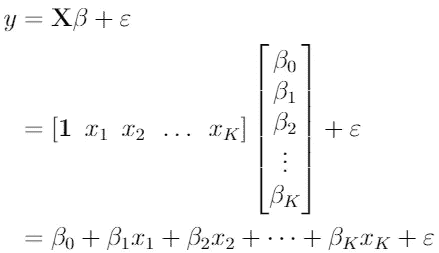
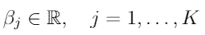
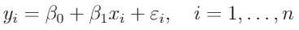
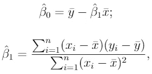
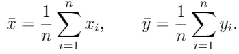
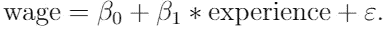
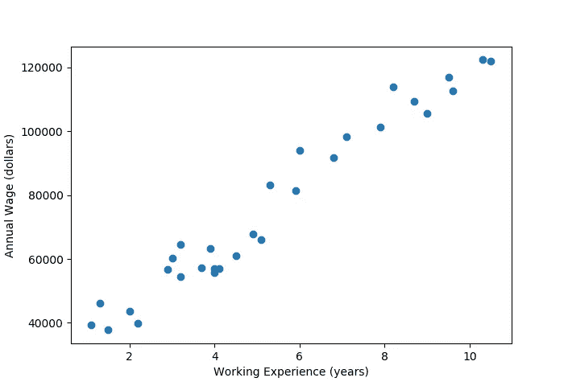
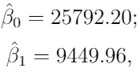
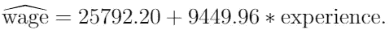
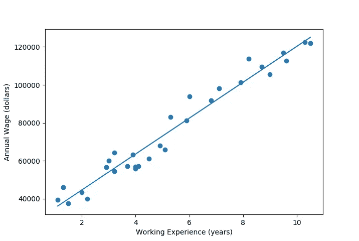

# (简单)线性回归和 OLS:理论介绍

> 原文：<https://towardsdatascience.com/simple-linear-regression-and-ols-introduction-to-the-theory-1b48f7c69867?source=collection_archive---------11----------------------->

## 简单线性回归和 OLS 估计的核心概念介绍

# 背景

**回归分析**是分析数据的重要统计方法。通过应用回归分析，我们能够检查因变量和一个或多个自变量之间的关系。在本文中，我将介绍最常见的回归分析形式，即**线性回归**。顾名思义，这种类型的回归是一种**线性**方法，用于建模感兴趣的变量之间的关系。

# 方法

线性回归用于研究一个**因变量** (y)与一个或多个**自变量** ( **X** )之间的线性关系。因变量和自变量之间的线性关系是模型的一个*假设*。该关系通过随机**干扰项**(或误差变量)ε建模。扰动是最重要的，因为我们无法捕捉到模型因变量的每一个可能的影响因素。为了捕捉影响因变量的所有其他因素(未作为自变量包括在内)，将扰动项添加到线性回归模型中。

这样，线性回归模型采用以下形式:

在哪里

是模型的**回归系数**(我们要估计的！)，K 是包含的自变量个数。该方程被称为**回归方程**。

# 简单线性回归

现在让我们后退一步。我们开始考虑只包含一个自变量的简单线性回归，而不是包含多个自变量。这里，我们开始用一个自变量 xi 对因变量 yi 建模:

其中下标 I 指的是特定的观察值(总共有 n 个数据点)。这里，β0 和β1 是需要从数据中估计的系数(或参数)。β0 是截距(常数项)，β1 是梯度。

在简单线性回归中，我们实际上是使用自变量 xi 的得分来预测因变量 yi 的值，以观察 I

# 模型假设

为了能够获得可靠的系数估计值，并能够解释随机数据样本的结果，我们需要做出**模型假设**。有五个与线性回归模型相关的假设(这些被称为**高斯-马尔可夫假设**):

1.  **线性**:因变量、自变量和扰动之间的关系是线性的。
2.  **随机样本**:我们有一个大小为 n {(xi，易):i=1 的随机样本，..，n)}，其中观察值彼此独立。
3.  **没有完美的共线性**:没有一个自变量是常数，自变量之间没有精确的线性关系。
4.  **外生性**:给定自变量的任意值，扰动项的期望值为零。换句话说，E(ε|xi)=0。
5.  **同方差**:给定独立变量的任意值，扰动项具有相同的方差。换句话说，Var(ε|xi)= σ。

高斯-马尔可夫假设保证了普通最小二乘法(OLS)估计回归系数的有效性。

# 普通最小二乘法(OLS)

如前所述，我们希望获得可靠的系数估计值，以便能够研究感兴趣的变量之间的关系。列出的模型假设使我们能够做到这一点。基于模型假设，我们能够推导出最小化**残差平方和(SSR)** 的截距和斜率估计值。最小化 SSR 是期望的结果，因为我们希望回归函数和样本数据之间的误差尽可能小。最小化 SSR 的系数估计称为**普通最小平方****【OLS】**估计。

在这篇文章中，我们不会为 OLS 估计是如何得出的而烦恼(尽管理解 OLS 估计的推导确实会增强你对我们之前所做的模型假设的含义的理解)。

简单线性回归的 **OLS 系数估计值**如下:

其中系数上方的“帽子”表示它与系数*估计值有关，x 和 y 变量上方的*和“条”表示它们是**样本平均值**，计算如下

# 小例子

现在，我们已经定义了简单的线性回归模型，我们知道如何计算系数的 OLS 估计。我们如何解释系数估计值？这里，我们将考虑一个小例子。

假设我们对*工作经验*对*工资*的影响感兴趣，其中工资以年收入衡量，经验以经验年限衡量。为了研究工资(因变量)和工作经验(自变量)之间的关系，我们使用以下线性回归模型:

系数β1 衡量的是工作年限增加一个单位时年薪的变化。因为经验多(通常)对工资有正向作用，所以我们认为β1 > 0。

在这个例子中，我们使用了 30 个数据点，其中年薪从 39343 美元到 121872 美元不等，工作年限从 1.1 年到 10.5 年不等。正如您所想象的，仅包含 30 个数据点的数据集通常太小，无法提供准确的估计，但这对于说明来说是一个不错的大小。让我们制作一个散点图，以便更深入地了解这个小数据集:

图 1:工资数据集的散点图

看着这个散点图，我们可以想象线性模型在这里可能实际上工作得很好，因为看起来这个样本中的关系非常接近线性。

接下来，让我们使用前面导出的公式来获得这个特定应用的简单线性回归模型的 OLS 估计。通过使用这些公式，我们获得了以下系数估计值:

因此，将*工资*与*经验*联系起来的 OLS 回归线是

等式中工资顶部的“宽帽”表示这是一个估计等式。

现在，我们如何解释这个等式？我们可以用这个等式来预测不同工作年限的工资。当我们假设经验=5 时，模型预测工资为 73，042 美元。对于一个完全没有经验的人(即经验=0)，该模型预测工资为 25，792 美元。

除了预测，我们还可以用这个等式来研究工作年限与年薪的关系。一个人多一年的工作经验，预计他的年薪会增加 9449 美元。这意味着(如我们所料)，多年的工作经验对年薪有**的正面影响**。

为了完成这个示例，让我们在前面看到的散点图中添加回归线，以查看它与数据点的关系:

图 2:添加到散点图的回归线

# 感谢阅读！

我希望这篇文章能帮助你开始了解(简单)线性回归模型是如何工作的，或者如果你已经熟悉这个概念的话，为你澄清一些问题。