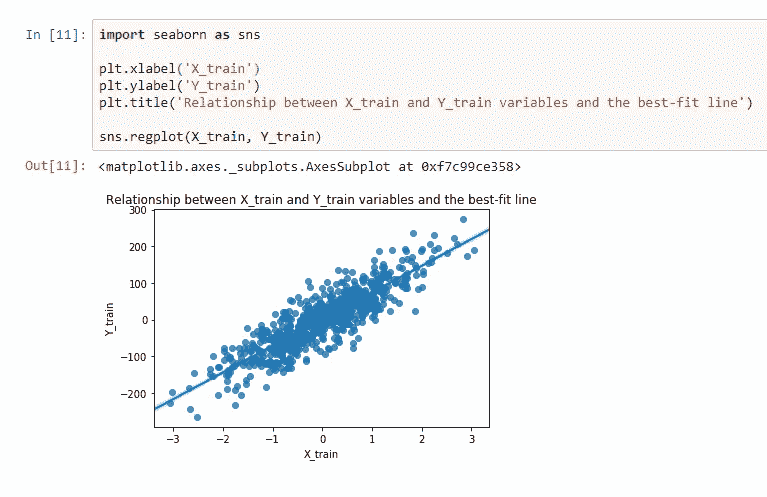
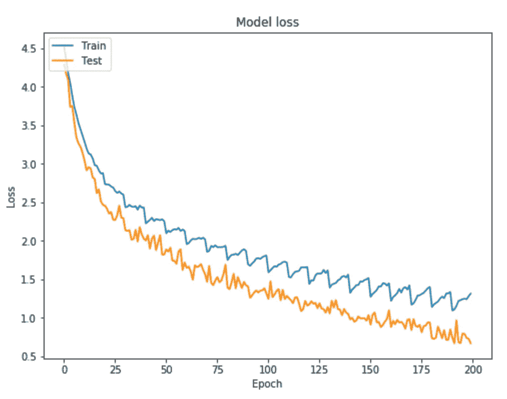
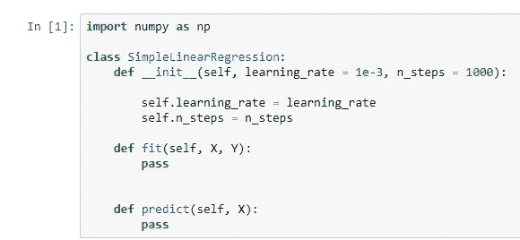
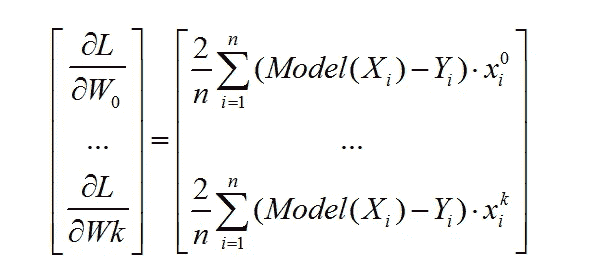
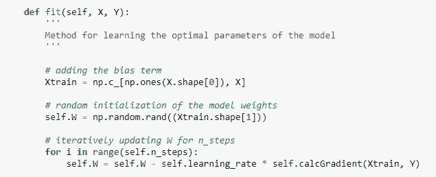
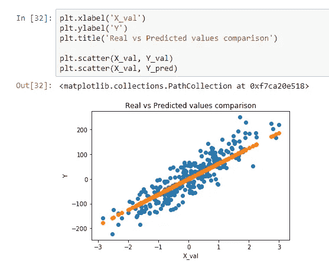
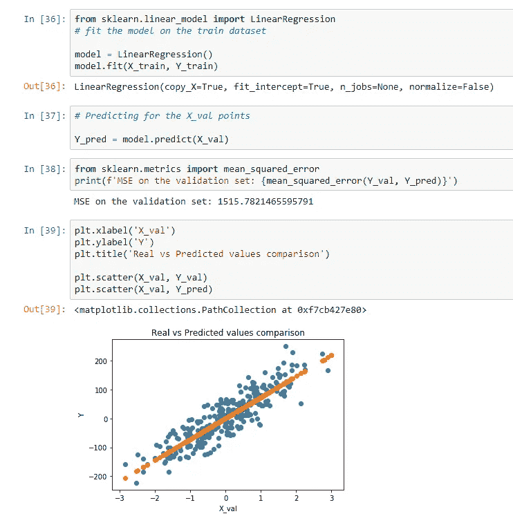

# 使用 Python 和 Numpy 从头开始简单的线性回归解释和实现

> 原文：<https://towardsdatascience.com/simple-linear-regression-explanation-and-implementation-from-scratch-with-python-26325ca5de1a?source=collection_archive---------12----------------------->

## 你是否经常使用线性回归，但却不知道它的本质是什么？这篇文章将帮助你理解这个重要的概念！

来源[免费照片](https://pixabay.com/users/free-photos-242387/)，通过 [pinterest](https://pixabay.com/photos/forest-mist-nature-trees-mystic-931706/) (CC0)

当我们开始研究机器学习时，大多数时候我们并不真正理解那些算法在引擎盖下是如何工作的，它们通常对我们来说就像是黑盒。今天，我想介绍一下回归任务中最基本也是最著名的算法之一——线性回归。在本文中，我将从头开始构建并解释 Python 中的线性回归模型，我们还将看到它在从[sk learn . datasets . make _ Regression](https://scikit-learn.org/stable/modules/generated/sklearn.datasets.make_regression.html)方法生成的回归数据集上的性能，与 Sklearns 的从[*sk learn . Linear _ Regression 生成的线性回归相比。线性回归*](https://scikit-learn.org/stable/modules/generated/sklearn.linear_model.LinearRegression.html) 类。那么，我们可以开始了吗？

**用于线性模型创建的数据集**

在一个简单的例子中，假设我们只有一个变量— *X.* 基于对 *X* 的了解，我想预测未知变量 *Y.* 我还将定义**训练集**，它包含所有已知的( *X_train，Y_train* )变量对和**验证集**，我仅从中取 *X_val* 然后，我们可以在知道 *Y_pred* 和 *Y_val* 变量的情况下测量模型的性能。让我们在 Python 代码中定义训练和测试集:

在这里，我导入了 *make_regression* 方法，并创建了包含 1 个特征(即 *X* 和目标(即 *Y.* )的数据集。现在，让我们将数据集拆分为**训练**和**验证**部分。如上所述，这可以通过[sk learn . model _ selection . train _ test _ split](https://scikit-learn.org/stable/modules/generated/sklearn.model_selection.train_test_split.html)方法来完成。如上所述，我将在**训练**零件上训练线性回归模型，并在**验证**零件上评估模型。

如图所示，我将 70%的数据作为**训练**数据，另外 30%用于**验证**。现在，为了更好地理解我们的数据，我将绘制图片，显示我们的 *X_train* 和 *Y_train* 变量之间的关系。

因此，总而言之，我们的目标是建立一个模型，该模型将 *X* 作为输入，并预测相应的 *Y* 变量。让我们把它重写为函数:模型( *X* ) = *Y.* 考虑一个输入 *X = -2，*，那么模型 *(-2)* 将返回接近 *-200* 的值，如果输入 *X =2* ，那么*模型(2)* 将返回接近 *100* 的值。总而言之，我将在 1 个特性案例中实现的模型如下所示:

*型号(X) = W1*X + W0*

*W1* 和 *W0* 为参数，将由模型在训练中学习。你可以看到，上面的函数只是直线的方程，因此，我们的线性模型的预测将形成直线，看起来像这样:

出现在图表上的线是最适合**系列**组的线。现在，当我准备好数据集后，让我们了解线性回归模型背后的直觉。

**线性回归理论和直觉**

正如我在上面解释的，主要思想是拟合一条线(在 1 个特征的情况下)或一个超平面(在 K 个特征的情况下)，因此在 1 个特征的情况下，模型看起来像这样:

*型号(X1) = W1*X1 + W0*

在 K 特性的情况下，看起来是这样的:

*型号(X1…Xk)= Wk * Xk+Wk-1 * Xk-1+…+W1 * X1+W0*

注意，在这两种情况下，我们都有 *W0* 项，称为偏差。为了有效地训练模型，我们也可以将其重写为:

*模型(X0，X1…Xk)= Wk * Xk+Wn-1 * Xn-1+…+W1 * X1+W0 * X0，其中 X0 = 1*

简而言之，在 1 个特征的情况下，如果 *W0 = 0* ，那么 W1 变量的任何选择将仅导致线围绕(0，0)点旋转。W0 项有助于移动直线或超平面，这**通常**导致更好的模型性能。

现在，接下来要了解的是如何选择这个 *W0…Wk* 术语。为此，你需要理解什么是[损失函数](https://heartbeat.fritz.ai/5-regression-loss-functions-all-machine-learners-should-know-4fb140e9d4b0)以及梯度下降背后的想法。

[https://www.youtube.com/watch?v=sDv4f4s2SB8](https://www.youtube.com/watch?v=sDv4f4s2SB8)

一般来说，*损失函数*显示模型的当前预测值(*模型(X)* )与真实的 *Y* 值有多接近。使用*梯度下降*,我们以这样的方式进行小步骤，即我们的*损失函数*减少(即，在训练模型 W1…Wk 的每一步，参数以这样的方式变化，即在一些步骤之后，我们的损失函数稳定在局部最小值。我的意思是:

https://stack overflow . com/questions/56794716/periodic-oscillating-loss-function-for-py torch-ccnn

在第一步，损失是高的(即预测和 Y 变量彼此远离)。每走一步，损失就会减少，预测值会变得更接近真实值。

让我们为我们的任务定义损失函数，我们将使用 MSE 作为损失函数:

同样，让我们计算损失对 Wj 的导数，

总而言之，以下是您在训练线性回归模型时要做的事情:

1.  你随机初始化模型的 *W0…Wk* 变量。

对于一定数量的迭代(步骤数)，您需要执行以下操作:

2.根据以下规则更新 *W0…Wk* :

这里 *dL/dWj* 是损失函数相对于 *Wj* 的导数。(上面我们已经定义了梯度的公式)，这里的 learning_rate 只是模型的超参数，你要在训练前自己选择(我一般是从 learning_rate 0.001 开始)

嗯，基本上这就是你实现所需要的所有理论，我建议你重读几遍这部分，如果你没有得到什么，这完全没问题！现在我将用 Python 实现一个简单的线性回归模型类。

**用 Python 实现线性回归模型**

首先，让我们定义我们类的主要功能:

这里我用两种方法创建了 SimpleLinearRegression 类: **fit** 和 **predict** *。*我们的模型将学习**拟合**方法中最佳拟合线的参数，我们将使用**预测**方法来预测未知的 *X* 变量。您还可以看到，类的构造函数( **__init__** )有两个变量(我们将在创建类实例时定义它们)，它们是: *learning_rate* 和 *n_steps* 。我已经在**直觉**部分解释了这两个变量。

现在让我们实施**拟合**方法，如**插入**部分所述。我们还需要一种方法来计算每个 W 的损失梯度:

该函数是梯度计算函数的矢量化实现，但同时适用于所有权重:

其中 K—参数总数，W0 是偏置项。

现在有了**梯度**函数，让我们实现拟合方法，以如下方式迭代更新 *W0…Wk* 参数:

**fit** 函数现在应该是这样的:

理解该功能的每个部分至关重要。首先，我们添加如上所述的偏差项，np.c_ 在这里的作用如下:

这里的每一行代表一个单独的点，每一列是一个单独的特征。因此，对于每一行(点)，我添加一个新的偏差特征。之后，我随机初始化权重并运行一个循环，在每一步我都更新所有的权重。这就是 fit 函数的全部功能！我们流程的最后一步是实现**预测**功能，如下所示:

正如您在这里看到的，我还添加了偏差项，并转移到该函数的矢量化实现 x^T * w。

实现如下:

这就是我们简单线性回归模型的全部实现！现在让我们在之前准备好的数据集上测试它。

**简单线性回归模型测试和评估**

作为第一步，我在本文第一部分定义的训练数据集上拟合模型。

到目前为止，我们的模型已经学习了 *W1，W0* 参数的最佳值(在我们的例子中是 1 个参数和偏置项)。现在我们可以调用 predict 方法，来获得对 *X_val* 点的预测。

现在让我们用 MSE 函数(我们用作损失函数的那个)来衡量预测质量。

让我们也做一个对(X_val，Y_val)和(X_val，Y_pred)的散点图

正如你所看到的，我们的模型已经学习了最佳拟合线(橙色的那条),它很好地描述了给定的一组点。

现在，我将对 sklearn.linear_model 执行相同的步骤。LinearRegression 模型类，做个比较。

如你所见，sklearns 实现的 MSE 误差要低一些，这是因为他们的模型比我们的要复杂一些。

**结论**

总而言之，今天我们已经完成了一项非常出色的工作——用 Python 从头开始实现了一个简单而有效的线性回归算法。我希望您能够轻松理解本文的每一点，如果需要的话，您可以自己实现相同的功能。我已经将这篇文章中的 Jupyter 笔记本完整加载到 github 中，所以请不要犹豫使用它并从中学习。

**你可以在我的** [**网站**](http://artkulakov.com) 上查看其他帖子