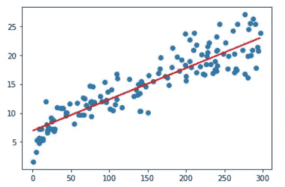

# 使用 Python 的简单线性回归模型:机器学习

> 原文：<https://towardsdatascience.com/simple-linear-regression-model-using-python-machine-learning-eab7924d18b4?source=collection_archive---------1----------------------->

## 学习如何使用 Python 中的 Jupyter notebook 在机器学习中构建简单的线性回归模型


凯文·Ku 在 [Unsplash](https://unsplash.com/s/photos/machine-learning?utm_source=unsplash&utm_medium=referral&utm_content=creditCopyText) 上的照片

在上一篇文章中， [**线性回归模型，**](/linear-regression-model-machine-learning-9853450c8bce) 我们已经看到了线性回归模型在理论上是如何使用 Microsoft Excel 工作的。本文将介绍如何在 Jupyter 笔记本中使用 Python 构建线性回归模型。

## 简单线性回归

为了预测两个变量之间的关系，我们将使用一个简单的线性回归模型。

在简单的线性回归模型中，我们将只使用一个自变量来预测一个称为因变量的变量的结果。

> 在本文中，我们将直接开始构建模型。更多关于线性回归模型和我们必须考虑的因素在这里[详细解释](/linear-regression-model-machine-learning-9853450c8bce)。

## 构建线性回归模型

为了在 python 中构建线性回归模型，我们将遵循五个步骤:

1.  阅读和理解数据
2.  可视化数据
3.  执行简单的线性回归
4.  残差分析
5.  测试集上的预测

## 阅读和理解数据

在这一步中，首先，我们将导入必要的库来导入数据。之后，我们将执行一些基本命令来理解数据的结构。

> 我们可以从[这里](https://github.com/Kaushik-Varma/linear_regression_model_python)下载我们将在本文中使用的样本数据集。

让我们假设我们有一个公司的数据，其中有花费在不同类型广告上的金额及其随后的销售额。

**导入库** 我们将导入 Jupyter 笔记本中的`numpy`和`pandas`库，并使用`pandas`读取数据。

数据集看起来像这样。这里我们的目标变量是销售列。


公司的广告数据

**理解数据** 让我们执行一些任务来理解数据，比如`shape`、`info`和`describe`。

我们数据集的`shape`是，

```
(200, 4)
```

使用`info`，我们可以看到数据中是否有空值。如果是，那么我们必须做一些数据操作。


数据集的信息

正如我们所观察到的，数据中没有空值。

使用`describe`，我们将看到数据值是否有任何突然的跳跃。


描述数据集

列中显示的值在整个数据中相当一致。

## 可视化数据

现在让我们使用`matplolib`和`seaborn`库来可视化数据。我们将绘制所有列的配对图，并查看哪些列与`Sales`最相关。

在两个数值变量之间使用散点图总是更好。上面代码的 pairplot 看起来像，


每个列的 pair plot w . r . t . Sales 列

如果我们不能使用散点图来确定相关性，我们可以使用 seaborn 热图来可视化数据。

热图看起来像这样，


数据中所有列的热图

从上面的图表中我们可以看出，电视栏目似乎与销售最相关。

让我们使用电视作为特征变量来执行简单的线性回归模型。

## 执行简单的线性回归

一元线性回归方程
`y = c + mX`

在我们的例子中:
`y = c + m * TV`
m 值称为**模型系数**或**模型参数。**

我们将分四步执行简单的线性回归。

1.  创建 X 和 y
2.  创建训练和测试集
3.  训练你的模型
4.  评估模型

**创建 X 和 y** 首先，我们将特征变量/列`TV`指定为`X`，目标变量`Sales`指定为`y`。

概括地说，

自变量代表`X`，`y`代表简单线性回归模型中的目标变量。

创建训练集和测试集我们需要将变量分成训练集和测试集。使用训练集，我们将构建模型并在测试集上执行模型。我们将把训练集和测试集分别分成 7:3 的比例。

我们将通过从`sklearn.model_selection`库中导入`train_test_split`来分割数据。

让我们来看看训练数据集，

X_train 数据拆分后是这样的。


分割后的 X_train 数据

y_train 数据拆分后是这样的。


拆分后的 y_train 数据

**建立和训练模型** 使用下面的两个包，我们可以建立一个简单的线性回归模型。

*   `statsmodel`
*   `sklearn`

首先，我们将使用`statsmodel`包来构建模型。为此，我们需要导入`statsmodel.api`库来执行线性回归。

默认情况下，`statsmodel`库适合一条穿过原点的线。但是如果我们观察简单的线性回归方程`y = c + mX`，它的截距值为`c`。因此，要进行截取，我们需要手动添加`add_constant`属性。

一旦我们添加了常数，我们就可以使用`OLS`(普通最小二乘法)来拟合回归线。之后，我们将看到直线的参数，即`c`和`m`。

输出是，


直线的截距和斜率

让我们看看回归线拟合的所有不同参数的汇总，如`R²`、`F-statistic`和`p-value`的概率。

上述回归线的统计数据是，


上述最佳拟合线的所有统计数据

因此，我们主要关心的决定模型是否可行的统计数据是:

1.  `coefficients`及其`p-value`(意义)
2.  `R-squared`值
3.  `F-statistic`及其意义


我们需要看的统计数据

1.电视的`coefficient`为 0.054，其对应的`p-value`很低，几乎为 0。这意味着`coefficient`在统计上是显著的。

> 我们必须确保 p 值总是小于这个系数才是有效的

2.`R-squared`值为 0.816，这意味着`Sales`方差的 81.6%可以通过使用此行的`TV`列来解释。

3.Prob `F-statistic`的`p-value`非常低，几乎为零，这让我们知道模型拟合在统计上是显著的。

由于拟合度很高，让我们继续观察直线与`TV`和`Sales`列之间的散点图的拟合度。

从这些参数中，我们得到了直线的`intercept`和`slope`的值。这条线的方程式是，

`Sales = 6.948 + 0.054 * TV`

图表看起来像这样，



最佳回归直线

这就是我们如何使用训练数据建立一个简单的线性回归模型。现在，在根据测试数据评估模型之前，我们必须执行残差分析。

## 残差分析

线性回归模型的主要假设之一是误差项是正态分布的。

`Error = Actual y value - y predicted value`

现在，从数据集中，
我们必须使用`predict`属性从 X 的训练数据集中预测 y 值。之后，我们将从预测数据中创建误差项(残差)。

现在，让我们画出残差的直方图，看看它是否像正态分布。

残差的直方图看起来像，


残差分布

正如我们所见，残差服从均值为 0 的正态分布图。

现在，确保残差不遵循任何特定的模式。

散点图看起来像，


残值散点图

由于残差遵循正态分布，不遵循任何特定的模式，我们可以使用我们建立的线性回归模型来评估测试数据。

## 对测试数据的预测或评估模型

现在，我们已经在训练数据集上拟合了回归线，我们可以对测试数据进行一些预测。类似于训练数据集，我们必须`add_constant`测试数据，并使用`statsmodel`中的`predict`属性预测 y 值。

测试数据的预测 y 值为:


预测 y 值

现在，让我们计算上面预测的 y 值的`R²`值。我们可以通过从`sklearn.metrics`包中导入`r2_score`库来实现。

使用上述代码得到的 R 值= 0.792

如果我们能从训练数据中记住，R 值= 0.815

由于测试数据的 R 值在训练数据的 R 值的 5%以内，我们可以得出结论，该模型相当稳定。这意味着，模型在训练集上学习的内容可以在看不见的测试集上推广。

让我们想象一下测试数据上的线。

具有最佳拟合线的散点图看起来像，


测试数据的最佳拟合线

这就是我们如何使用`statsmodel`包构建线性回归模型。

除了`statsmodel`，我们可以使用`sklearn`建立一个线性回归模型。使用来自`sklearn`的`linear_model`库，我们可以制作模型。

与`statsmodel`类似，我们将数据分成`train`和`test`。

对于简单的线性回归，我们需要添加一列来正确地执行回归拟合。

X_train 加列前的形状是`(140, )`。
训练和测试数据的 X 形状为`(140, 1)`。

现在，让我们将这条线与从`sklearn.linear_model`导入`LinearRegression`库的图相匹配。

现在，让我们找出模型的系数。

截距和斜率的值是，


系数值

我们得到的上述值的直线方程是，
`Sales = 6.948 + 0.054 * TV`
如果我们观察，这里得到的方程和`statsmodel`中得到的方程是一样的。

之后，我们将对数据进行预测，并通过比较 R 值来评估模型。

训练和测试数据的 R 值为
R train _ data = 0.816
R test _ data = 0.792

与`statesmodel`相同，测试数据的 R 值在训练数据的 R 值的 5%以内。我们可以在未来将该模型应用于未知的测试集。

# 结论

正如我们所见，我们可以使用`statsmodel`或`sklearn`构建一个线性回归模型。

我们必须确保遵循这五个步骤来构建简单的线性回归模型:

1.  阅读和理解数据
2.  可视化数据
3.  执行简单的线性回归
4.  残差分析
5.  测试集上的预测

在下一篇文章中，我们将看到多元线性回归模型是如何工作的。

**感谢您阅读**和**快乐编码！！！**

# 点击这里查看我以前的文章

*   [**线性回归模型:机器学习**](/linear-regression-model-machine-learning-9853450c8bce)
*   [**探索性数据分析(EDA): Python**](/exploratory-data-analysis-eda-python-87178e35b14)
*   [**(CLT)中心极限定理:数据科学**](/central-limit-theorem-clt-data-science-19c442332a32)
*   [**推断统计:数据分析**](/inferential-statistics-data-analysis-e59adc75c6eb)
*   [**Seaborn: Python**](/seaborn-python-8563c3d0ad41)
*   [**熊猫:蟒蛇**](https://levelup.gitconnected.com/pandas-python-e69f4829fee1)
*   [**Matplotlib:Python**](https://levelup.gitconnected.com/matplotlib-python-ecc7ba303848)
*   [**NumPy: Python**](https://medium.com/coderbyte/numpy-python-f8c8f2bbd13e)

# 参考

*   **机器学习—线性回归:**[https://www . w3schools . com/python/python _ ml _ Linear _ Regression . ASP](https://www.w3schools.com/python/python_ml_linear_regression.asp)
*   **Python 中的线性回归:**[https://realpython.com/linear-regression-in-python/](https://realpython.com/linear-regression-in-python/)
*   **线性回归(Python 实现):**[https://www . geeks forgeeks . org/Linear-Regression-Python-Implementation/](https://www.geeksforgeeks.org/linear-regression-python-implementation/)
*   **用 Scikit 学习 Python 线性回归的初学者指南:**[https://www . kdnugges . com/2019/03/初学者指南-线性回归-python-scikit-learn.html](https://www.kdnuggets.com/2019/03/beginners-guide-linear-regression-python-scikit-learn.html)