# 简单线性回归:里面是什么？

> 原文：<https://towardsdatascience.com/simple-linear-regression-whats-inside-702475055ad5?source=collection_archive---------35----------------------->

## 让我们深入研究简单线性回归的数学意义并实现它。


**第 0 步:开始**

回归是一种统计方法，建议在其他自变量(数据)的帮助下预测因变量(目标特征)。回归是最广为人知和理解的统计方法之一。

线性回归是一种假设因变量和自变量之间存在线性关系的模型。线性回归进一步分为简单线性回归(SLR)和多元线性回归(MLR)。我们将探讨一元线性回归，即一个因变量和一个自变量的回归，因为它简单。SLR 的数学是许多其他机器学习模型的基础。

在这里，我将详细阐述简单的线性回归，以获得关于它如何工作的直觉。我将使用一个 NBA 比赛得分数据集(下面的链接)来演示单反，并最终将其与 Scikit-learn 的线性回归模型进行比较。

## *简单线性回归*

要理解单反，我们来分解一下必须要经历的概念

*   SLR 线及其系数
*   损失函数
*   梯度下降
*   导出系数(可选)

## SLR 线及其系数

直线的斜率截距形式为 Y= MX+B。

y 是因变量(目标)，X 是自变量(数据)，M 和 B 是直线的特征。斜率(M)给出了相关变量 X 和 Y 的关系，截距(B)给出了当变化率被消除时因变量的值的信息。

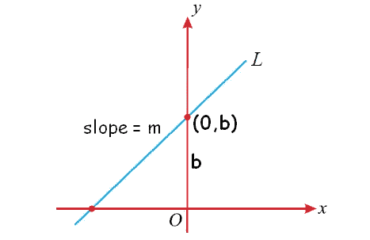

来源: [onlinemath4all](https://www.onlinemath4all.com/images/slopeinterceptform1.png)

在单反中，等式写成 **y = b0 + x b1。** b0 和 b1 分别是截距和斜率。它们由下面给出的公式确定，以找到最佳拟合线。


但是，在回归中情况并不总是如此。让我们在梯度下降部分了解一下为什么。如果你对我们如何偶然发现这些感到好奇，请查看可选部分。

## 损失函数

损失函数是表明预测值与实际值偏离程度的一种度量。有很多损失函数可用，我们将着眼于均方差(MSE)。


MSE，顾名思义，对每条记录的实际值和预测值之差求平方，求和，然后除以记录数。我们的目标是找到一个损失最小的模型。

## 梯度下降

梯度下降是一种优化算法，它迭代地更新参数，以找到损失最小的模型。具有一个或两个参数的模型的损失函数可以被部分微分以找到最小值。但是随着维度的增加，很难将参数可视化，更不用说每个解的特征值了。由于局部最小值的多次出现，我们将不得不遍历特征值的所有组合，以确保我们找到了全局最小值。尽管全局最小值问题没有完全解决，梯度下降有助于找到高阶模型的最小值。

但是我们还没有探索问题的基础:损失函数。MSE(作为二次函数)保证曲线上总有一个点的梯度为零，但有些损失函数不能保证梯度为零的点，或者梯度为零的点可能不总是全局最小值。为了克服这个问题，采用了梯度下降法。

具体到我们的情况，我们可以选择通过上面给出的公式来找到系数，或者我们可以从随机非零值开始，让它以最佳方式工作。梯度下降算法的数学意义本身就值得写一篇文章。现在，我将通过直觉来实现这个算法。数学方法类似于系数，我认为把它包括进来是多余的(如果你好奇，我会在最后把它联系起来)。

现在，让我们看看梯度下降是怎么回事。想象一个人在没有视觉的情况下徒步下山；这个人的目标是到达谷底。凭直觉，他向前迈了一步，如果坡度是向下的，他将继续前进，直到遇到坡度的变化。一旦这个人在移动中感觉不到提升，他/她就会停下来。

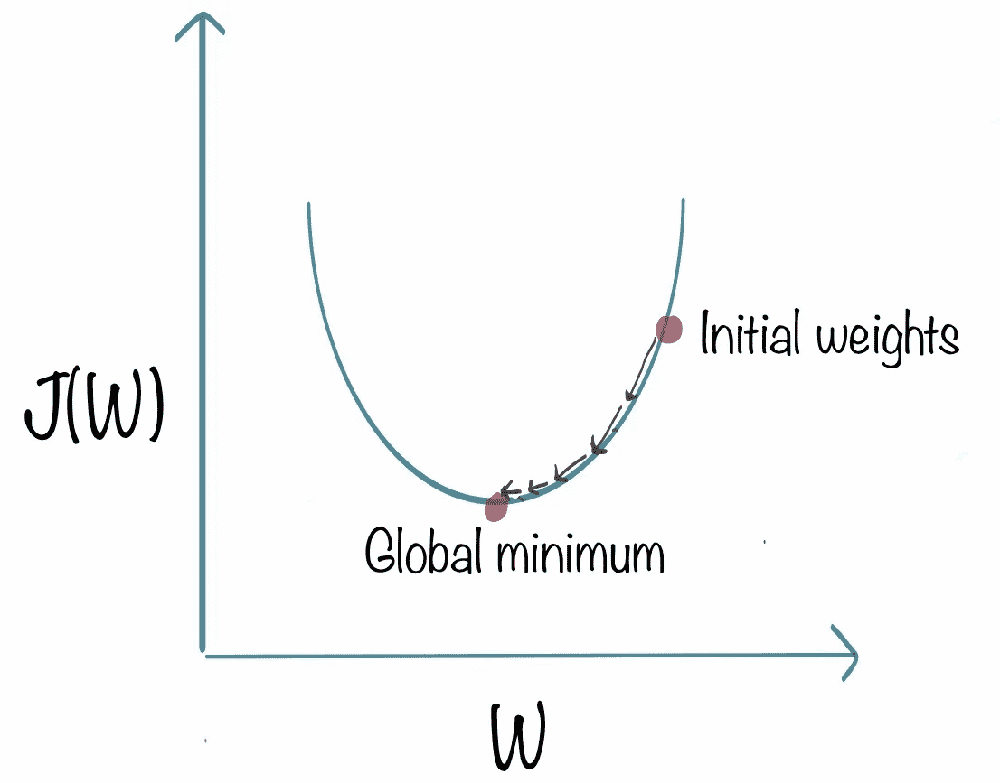

来源: [kdnuggets](https://www.kdnuggets.com/2018/06/intuitive-introduction-gradient-descent.html)

但是如上所述，采取确定长度的步骤然后评估路线修正是没有意义的，因为这个人可能已经通过了最小值，却意识到他/她向错误的方向移动。这就是学习率发挥作用的地方。它惩罚大步，以确保该人不采取一步超过最低限度。

人如何选择学习速度？

不幸的是，学习率没有“万能”的标准。我们可以粗略估计这个值的一种方法是通过反复试验。我们必须注意的问题是学习率的高低。这两种方法的计算量都很大，所以在开始时总是要运行几次模型来检查损失的变化。浪费的计算能力和时间。

一个适合高学习率的类比是金属球轴承和碗。当一个球从碗的边缘被释放出来时，它的速度会随着力的方向趋向最小值而不断增加。当它经过最小值时，球的方向会远离最小值，但作用在球上的力的方向会相反。这样，通过一些有损耗的振荡，它最终在碗的底部达到稳定的平衡。有损耗的振荡是计算能力和时间的浪费。


来源:[深度学习向导](https://www.deeplearningwizard.com/deep_learning/boosting_models_pytorch/images/lr1.png)

现在，我们把这个和单反合并一下。我们所指的人是 b0 和 b1 系数。我们看到的谷是 MSE 相对于 b0 和 b1 参数绘制的曲线。学习率(alpha)为我们提供了修改参数的步长，而不必在每次通过时跳过最小值。

**推导系数(可选)**

虽然不是关键，但探索模型的机制很有趣。让我们首先建立基本方程和推导方程的术语。在我们开始之前，确保你熟悉微积分的基础知识。

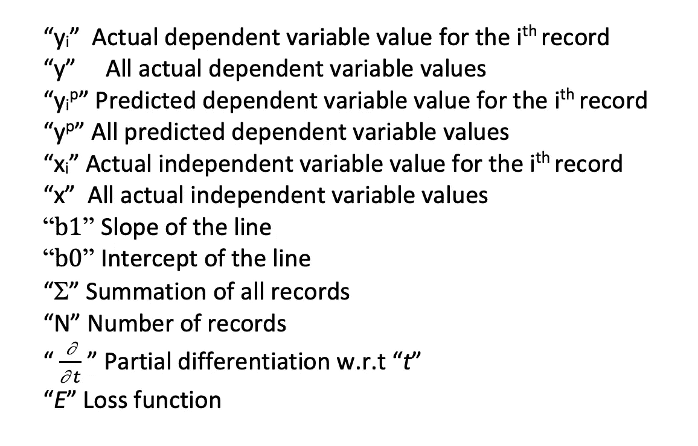

既然我们都有了方程，让我们开始研究 b0 和 b1。现在，如果我们绘制任何一个系数(保持另一个不变)对 E 的曲线，它看起来会像这样

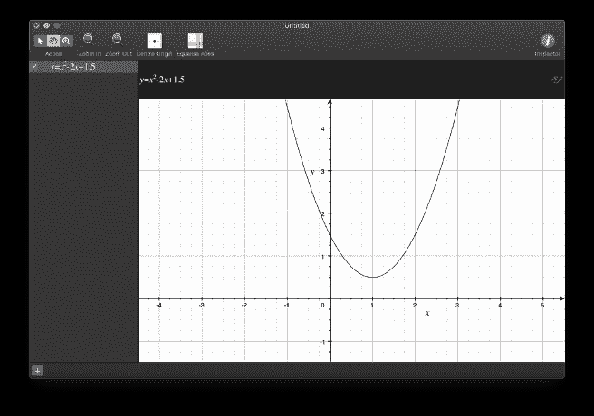

函数的最小值可以通过对函数相对于系数进行部分微分并使梯度等于零来找到。现在我们的目标是

*   为了找到两个系数的梯度为零(近似)的点
*   找出一个仅是给定数据的函数的方程。

**找到 b0**

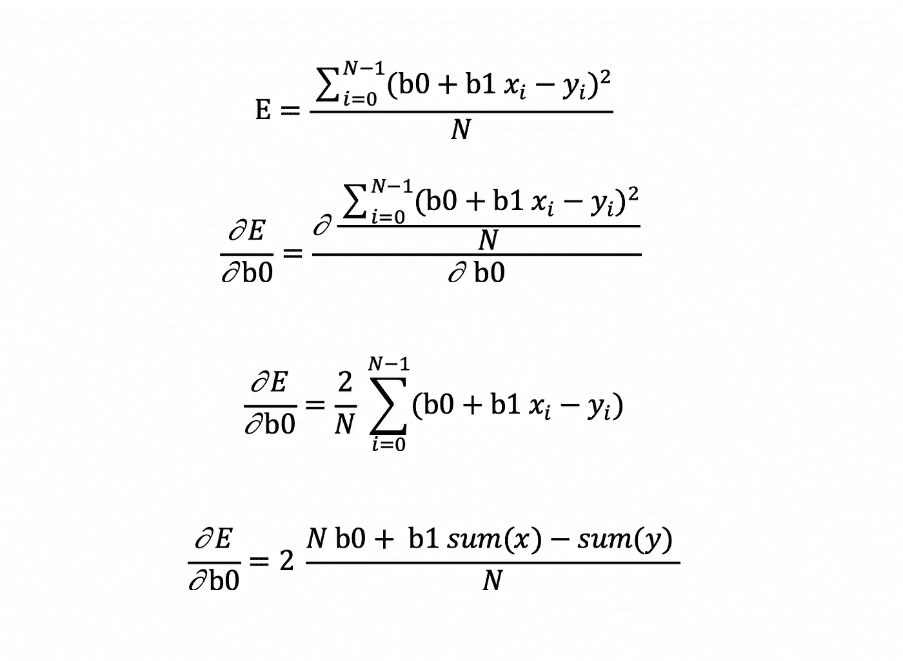

现在求最小值，将梯度等于零。

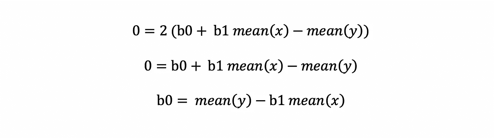

虽然我们确实找到了 b0 的值，但是它依赖于 b1。

**找到 b1**


代入 b0 的值并部分微分

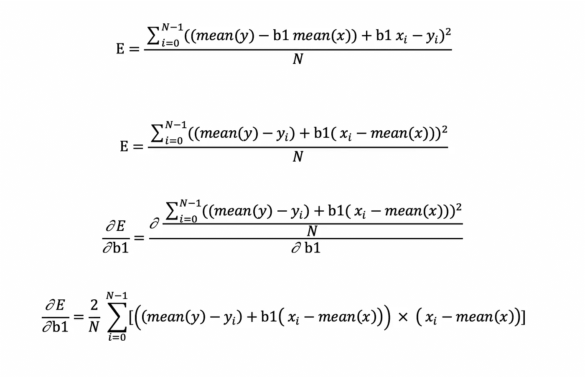

类似于 b0，将梯度等于零

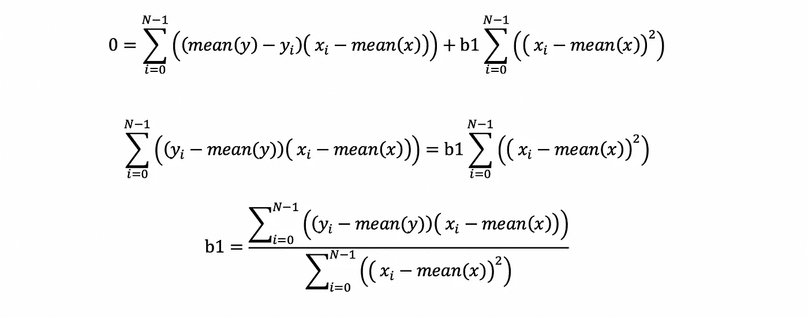

这检验了我们的目标；我们找到了 b1 的方程式，它只依赖于我们现有的数据。我们能够利用曲线的基本性质找到这些值。

***实现***

首先，让我们处理数据，然后使用

*   系数
*   梯度下降
*   Scikit-learn 线性回归

**数据**

使用标准 python 库，让我们导入数据并可视化分布。

```
**import pandas as pd
import numpy as np
import matplotlib.pyplot as plt
import seaborn as sns** %matplotlib inline*#load data*df=**pd.read_csv**('teampts_fg.csv')
X=df['TeamPoints'].**values**
y=df['FieldGoals'].**values***#plot data***plt.rcParams**["figure.figsize"] = (12,8)
**plt.xlim**(40,160)
**sns.scatterplot**(x='TeamPoints', y='FieldGoals', data=df);
```

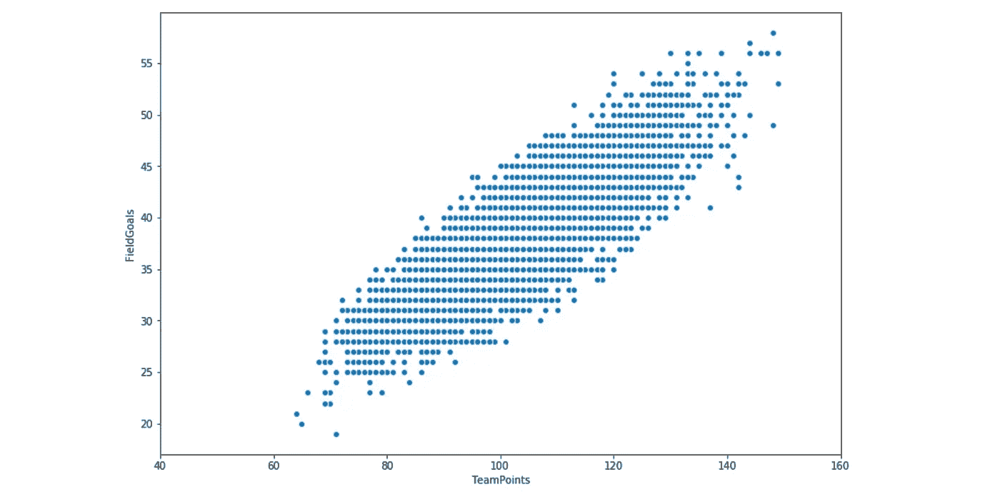

```
*#define the loss function***def** loss(data, data_pred):
    N=data.**shape**[0]
    loss=**np.sum**(**np.square**(data-data_pred))/N
    **return** loss
```

**使用系数实现模型**

```
Bc1=**sum**((X-**np.mean**(X)) * (y - **np.mean**(y)))/**sum**((X-**np.mean**(X))**2)
Bc0=np.mean(y) - Bc1*(np.mean(X))
x_coeff_model=np.linspace(40,160,1000)
y_coeff_model= Bc1*x_coeff_model + Bc0*#plot the line with the original data***plt.rcParams**["figure.figsize"] = (12,8)
**plt.xlim**(40,160)
**sns.scatterplot**(x='TeamPoints', y='FieldGoals', data=df);
**plt.plot**(x_coeff_model, y_coeff_model,c='r');
**plt.show**()
**print**("The value of b0 is {} and b1 is {}".format(Bc0, Bc1))
```


使用系数的最佳拟合线

**使用梯度下降实现模型**

```
loss_history=[]*#define gradient descent***def** gradient_descent(epochs, X , y , alpha):
    B0=0.0001
    B1=0.0001
    N=X.**shape**[0]
    for i in np.arange(epochs):
        y_pred= B0 + B1*X
        loss_history.append(loss(y,y_pred)) dB0=(-2/N)***np.sum**(y-y_pred)        
        dB1=(-2/N)***np.sum**(X*(y-y_pred)) B0= B0- alpha*dB0
        B1= B1- alpha*dB1 **return** [B0,B1]*#call the gradient_descent function for 30 iterations on the data*Bgd0,Bgd1=**gradient_descent**(30, X, y, 0.00001)
```

现在根据获得的参数绘制直线。

```
x_gd_model=**np.linspace**(40,160,1000)
y_gd_model= Bgd1*x_coeff_model + Bgd0
**plt.rcParams**["figure.figsize"] = (12,8)
**plt.xlim**(40,160)
**sns.scatterplot**(x='TeamPoints', y='FieldGoals', data=df);
**plt.plot**(x_gd_model, y_gd_model,c='r')
**plt.show**()
**print**("The value of b0 is {} and b1 is {}".format(Bc0, Bc1))
```

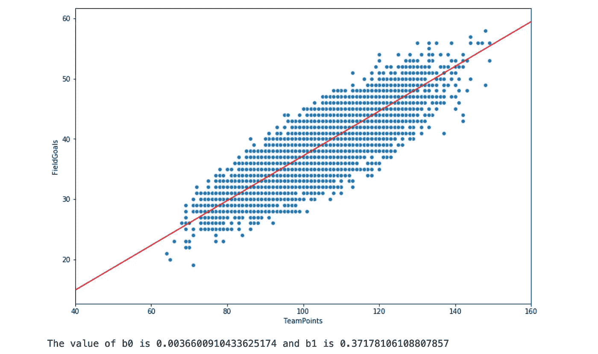

使用梯度下降的最佳拟合线

我以很小的学习率存储了几百次迭代的每个值，以可视化模型如何成熟。使用 pyplot，我保存了所有的图来制作一个 gif。

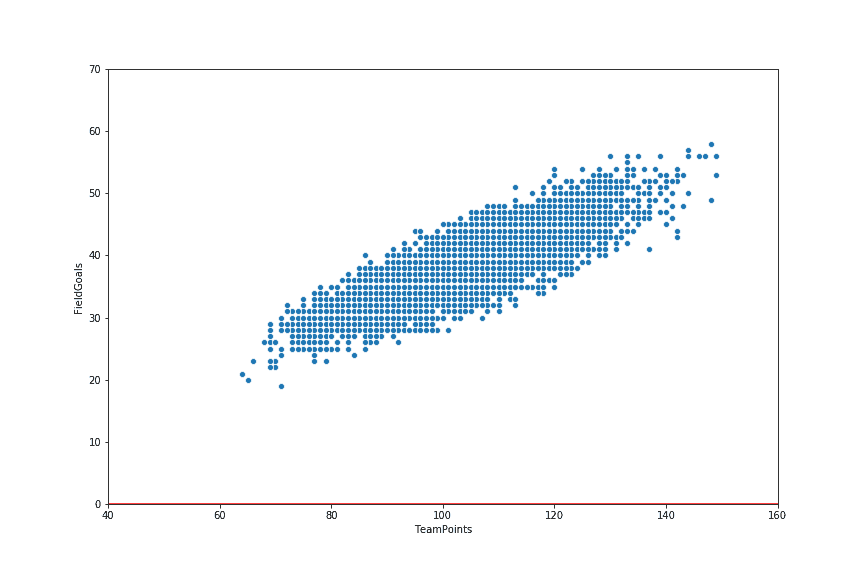

现在让我们绘制模型的损失历史。

```
**plt.plot**(loss_history);
**plt.xlabel**("Number of iterations")
**plt.ylabel**("Loss")
**plt.show**()
**print**("Loss at iteration 25 is {}".format(loss_history[24]))
```

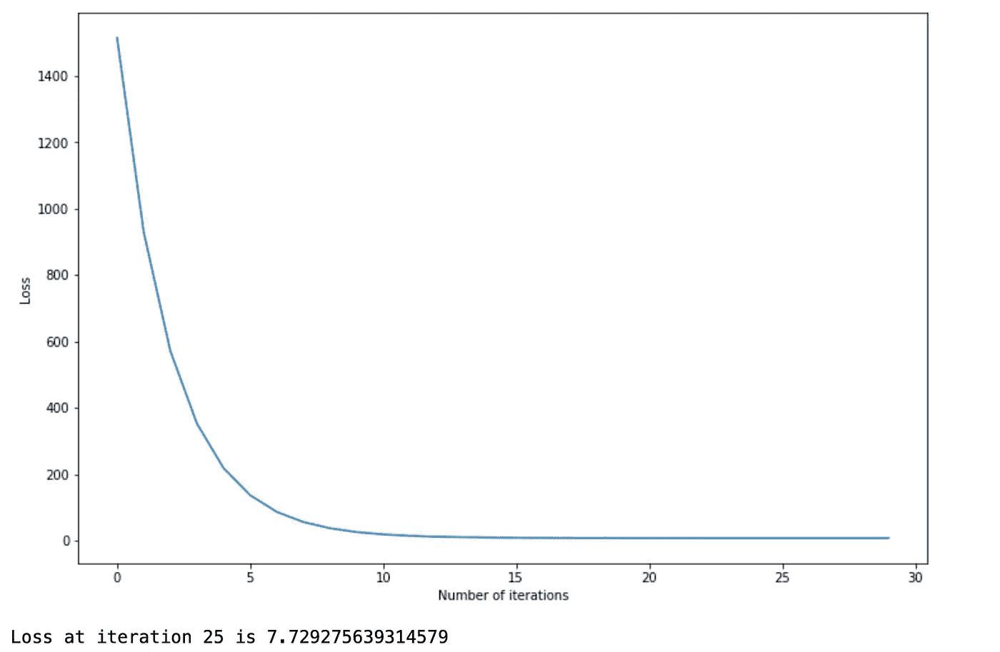

**使用 scikit-learn 实现模型**

```
**from** sklearn.linear_model **import** LinearRegression
lr= **LinearRegression**()
lr.**fit**(X.**reshape**(-1,1),y.**reshape**(-1,1))
x_lr_model=**np.linspace**(40,160,1000)
y_lr_model=lr.**predict**(x_lr_model.**reshape**(-1,1)).**reshape**(1,-1)[0]*#plot the line***plt.rcParams**["figure.figsize"] = (12,8)
**plt.xlim**(40,160)
**sns.scatterplot**(x='TeamPoints', y='FieldGoals', data=df);
**plt.plot**(x_lr_model, y_lr_model,c='r')
**plt.show**()
```

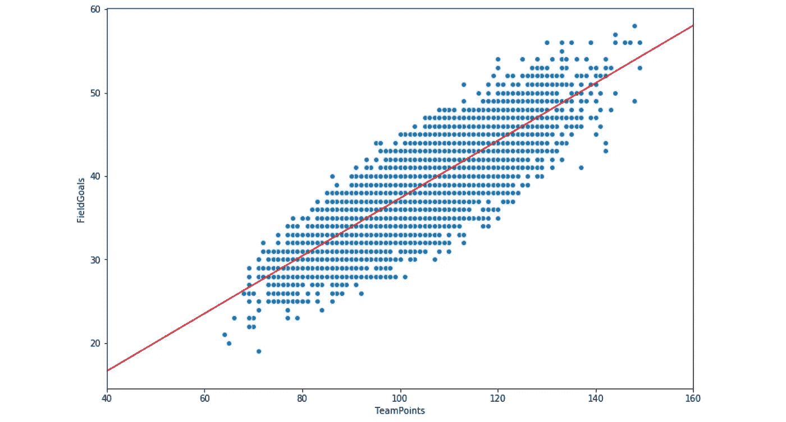

使用 scikit-learn 的最佳拟合线

**对比**

```
**plt.plot**(x_lr_model, y_lr_model,c='b', label="LinearRegression");
**plt.plot**(x_gd_model, y_gd_model, c='r', label="Gradient Descent");
**plt.plot**(x_coeff_model, y_coeff_model, c='g', label="Coefficient");
**plt.legend**()
**plt.show**()
```

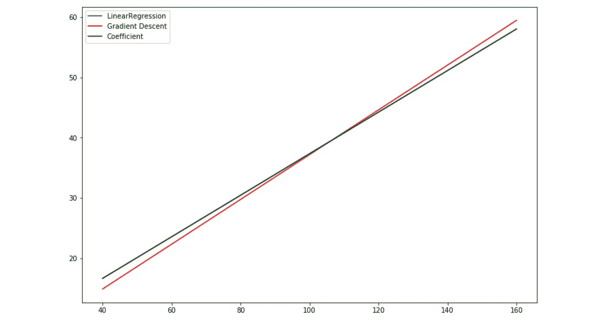

```
*#let's print the loss between lines to see the difference***print**("The loss between Coeff model and Gradient descent {}".format(loss(y_coeff_model,y_gd_model)))
**print**("The loss between Coeff model and Linear Regression Model {}".format(loss(y_coeff_model,y_lr_model)))
**print**("The loss between Gradient descent and Linear Regression Model {}".format(loss(y_gd_model,y_lr_model)))
```

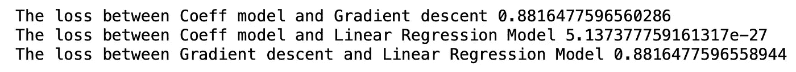

在上面的比较图中，我们可以看到线性回归线和系数线重叠。但是另一方面，梯度下降线稍微偏向线性回归线。这是什么意思？我们来调查一下。

```
loss_gd=loss_history[-1]
loss_lr=loss(Bc0+Bc1*X, y)
**print**("The loss of the LinearRegression line is {}".format(loss_lr))
**print**("The loss of the GradientDescent line is {}".format(loss_gd))
```


尽管线的损失有所不同，但所有模型的预测值和实际值之间的损失是非常相似的。我们可以有把握地推断梯度下降线——尽管它没有相同的参数——已经以近似等于理想状态的方式定位了自己。

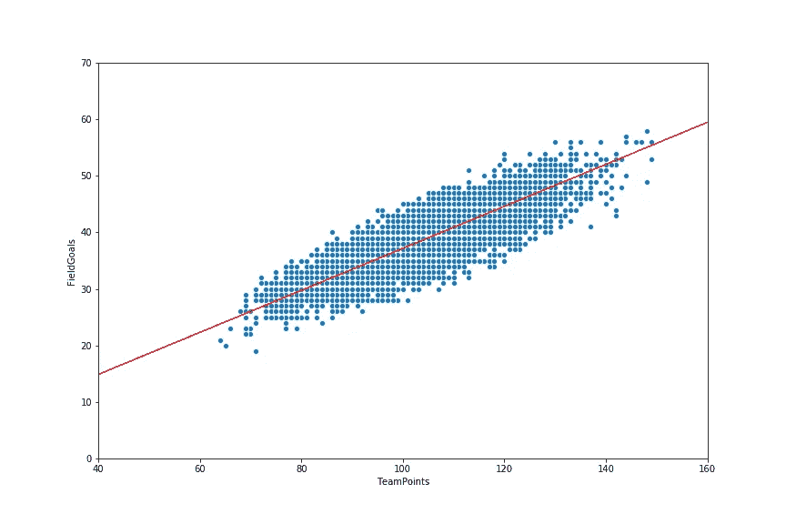

**步骤 steps_count[-1]:结束**

最后，这是简单线性回归的内容。谢谢你。

> 参考

[](https://machinelearningmastery.com/implement-simple-linear-regression-scratch-python/) [## 如何用 Python-Machine Learning mastering 实现简单的线性回归

### 线性回归是一种已有 200 多年历史的预测方法。简单的线性回归是一个很好的开端…

machinelearningmastery.com](https://machinelearningmastery.com/implement-simple-linear-regression-scratch-python/) [](/linear-regression-using-gradient-descent-97a6c8700931) [## 使用梯度下降的线性回归

### 在本教程中，你可以学习梯度下降算法的工作原理，并从头开始用 python 实现它。首先…

towardsdatascience.com](/linear-regression-using-gradient-descent-97a6c8700931)  [## 2014 年至 2018 年 NBA 球队比赛统计

### 2014 - 2018 nba 期间每场比赛的统计数据

www.kaggle.com](https://www.kaggle.com/ionaskel/nba-games-stats-from-2014-to-2018) 

> 除引用图片外，所有图片均由作者制作