# 使用 Matplotlib 的简单小表格

> 原文：<https://towardsdatascience.com/simple-little-tables-with-matplotlib-9780ef5d0bc4?source=collection_archive---------1----------------------->

## 如何创建一个漂亮的 Pyplot 表的注释示例

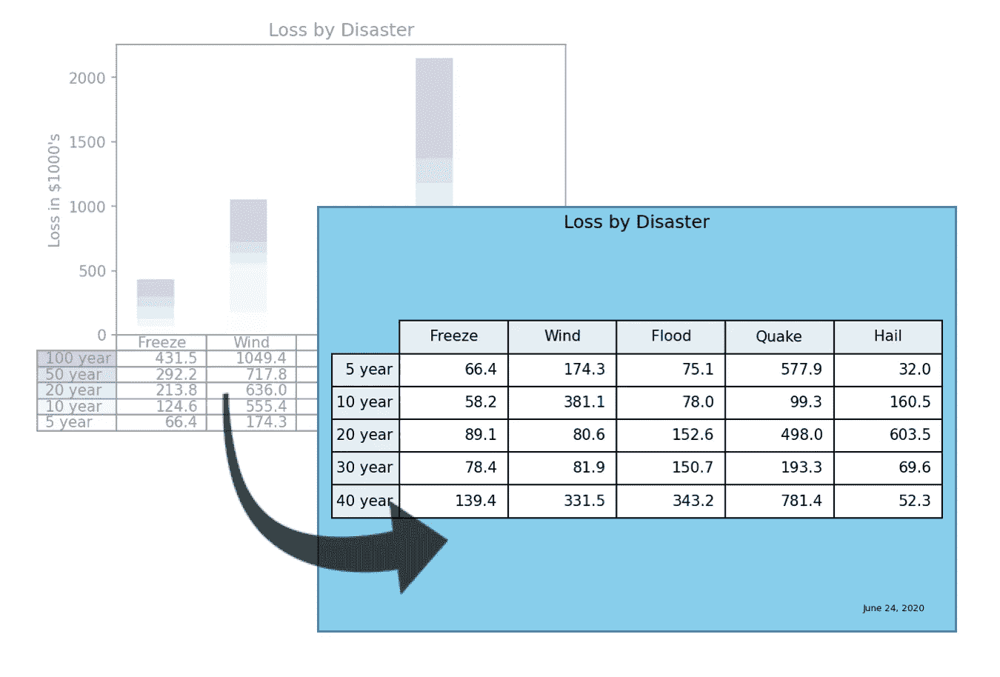

有时，我需要为包含几行和几列数据的文档创建一个图像。像大多数人一样，我将只使用屏幕截图来创建图像，但这种方法不太适合自动化任务，需要手工调整才能呈现。荒谬的是，我正在用熊猫和 Matplotlib 在我的 Jupyter 笔记本上工作，我正在截图以捕捉幻灯片和书面报告的表格。Matplotlib 呈现漂亮的图形。为什么不是漂亮的小桌子？

一种替代方法是使用 LaTeX 生成报告，LaTeX 具有强大的表格功能。采用 LaTeX 进行报告，只是为了渲染一个小表格，这种做法有些矫枉过正，而且常常是徒劳的。我真的很想用 Matplotlib 生成我的小网格，标题居中；没有无关文字；漂亮、干净的边框；可能还有一个小小的日期页脚。

由于 Jupyter 的输出单元渲染，熊猫可以在 Jupyter 笔记本上输出看起来不错的数据帧。它甚至可以使用`pandas.Dataframe.style`库来设计这些熊猫数据帧的样式。使用这些工具构建样式化表格的挑战在于它们以 HTML 呈现输出。将文件转换成图像格式需要调用其他外部工具的工作流，比如`[wkhtmltoimage](https://wkhtmltopdf.org)`，将 HTML 转换成图像。

Matplotlib 可以将图表保存为图像。如果你搜索 Matplotlib 文档，你会发现它有一个`matplotlib.pyplot.table`包，看起来很有希望。它是有用的。事实上，我在这篇文章中使用了它。挑战在于`matplotlib.pyplot.table`创建的表格通常挂在堆叠的条形图下面，以向读者提供对上面数据的洞察。您希望只显示图表，并且希望图表看起来很漂亮。

当试图使用`matplotlib.pyplot.table`时，你可能会注意到的第一件事是，表格相当难看，并且不能很好地管理垂直单元格填充。第二，如果您试图隐藏图形，只显示表格网格，对齐问题就会暴露出来，使您永远无法得到您想要的漂亮的小表格。让桌子看起来漂亮需要一些工作，我将与你分享我自己做这项工作的心得。

# Matplotlib 表示例

Matplotlib `pyplot.table`示例代码创建了一个表，但是没有展示如何用一个简单的表来显示数据。它生成一个表格，用作堆叠条形图的扩展。如果你跟随你的直觉，只隐藏图表，你会得到一个格式很差的图像，不适合你的文章或幻灯片演示。

在本文中，我将带您一步一步地将 Matplotlib 示例编写器提供的示例转换为您项目的一些简单表格代码。我解释了我在这一过程中所做的更改，这应该有助于您进行改进。我在文章的最后提供了完整的代码。

从[示例](https://matplotlib.org/3.1.1/gallery/misc/table_demo.html#sphx-glr-gallery-misc-table-demo-py)中，您可以看到表格功能用于显示与相关堆积条形图相关的数据。

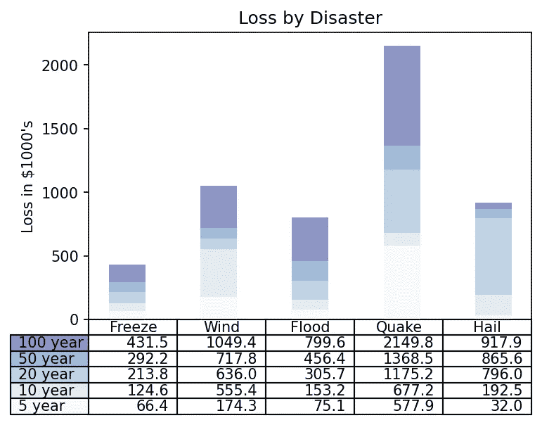

Matplotlib 表格演示示例(图片由作者提供)

示例的源代码(来自 Matplotlib [表格演示](https://matplotlib.org/3.1.1/gallery/misc/table_demo.html#sphx-glr-gallery-misc-table-demo-py)):

```
import numpy as np
import matplotlib.pyplot as pltdata = [[ 66386, 174296,  75131, 577908,  32015],
        [ 58230, 381139,  78045,  99308, 160454],
        [ 89135,  80552, 152558, 497981, 603535],
        [ 78415,  81858, 150656, 193263,  69638],
        [139361, 331509, 343164, 781380,  52269]]columns = ('Freeze', 'Wind', 'Flood', 'Quake', 'Hail')
rows = ['%d year' % x for x in (100, 50, 20, 10, 5)]values = np.arange(0, 2500, 500)
value_increment = 1000# Get some pastel shades for the colors
colors = plt.cm.BuPu(np.linspace(0, 0.5, len(rows)))
n_rows = len(data)index = np.arange(len(columns)) + 0.3
bar_width = 0.4# Initialize the vertical-offset for the stacked bar chart.
y_offset = np.zeros(len(columns))# Plot bars and create text labels for the table
cell_text = []
for row in range(n_rows):
    plt.bar(index, data[row], bar_width, bottom=y_offset, color=colors[row])
    y_offset = y_offset + data[row]
    cell_text.append(['%1.1f' % (x / 1000.0) for x in y_offset])
# Reverse colors and text labels to display the last value at the top.
colors = colors[::-1]
cell_text.reverse()# Add a table at the bottom of the axes
the_table = plt.table(cellText=cell_text,
                      rowLabels=rows,
                      rowColours=colors,
                      colLabels=columns,
                      loc='bottom')# Adjust layout to make room for the table:
plt.subplots_adjust(left=0.2, bottom=0.2)plt.ylabel("Loss in ${0}'s".format(value_increment))
plt.yticks(values * value_increment, ['%d' % val for val in values])
plt.xticks([])
plt.title('Loss by Disaster')# plt.show()# Create image. plt.savefig ignores figure edge and face colors, so map them.
fig = plt.gcf()
plt.savefig('pyplot-table-original.png',
            bbox_inches='tight',
            dpi=150
            )
```

# 整理数据代码并删除图形生成

现在，让我们开始工作吧。首先，我将打破表的图表。我根据自己的喜好重新格式化了图表数据，并删除了特定于堆积条形图的数据。这一步对你来说是可选的。当我从代码中的 Python 列表加载少量数据时，我更喜欢在数据数组中包含标签，并在适当的时候弹出它们。当我几个月后回来时，我可以更容易地阅读它。您可能会从外部 CSV 文件或数据库导入数据，并在 Pandas 数据框架中对其进行操作。将数据放在一个二维列表中使这个例子变得简单。

我还删除了`plt.show()`指令，并添加了将图像写入 png 文件的代码。如果在调用`plt.savefig()`之前调用`plt.show()`，图像将会是空白的，因为`plt.show()`重置了 pyplot 图形对象引用。记住`plt.savefig()`可以通过检测你提供的文件扩展名来输出其他图像类型(jpeg，svg，eps 等。).

**注意:**在我的实验中，我还对一些数据和标签做了微小的改动。为了与原始代码保持一致，我忘记在发布之前回滚它们。例如，“100 年”变成了“40 年”

```
data =  [
            [         'Freeze', 'Wind', 'Flood', 'Quake', 'Hail'],
            [ '5 year',  66386, 174296,   75131,  577908,  32015],
            ['10 year',  58230, 381139,   78045,   99308, 160454],
            ['20 year',  89135,  80552,  152558,  497981, 603535],
            ['30 year',  78415,  81858,  150656,  193263,  69638],
            ['40 year', 139361, 331509,  343164,  781380,  52269],
        ]# Pop the headers from the data array
column_headers = data.pop(0)
row_headers = [x.pop(0) for x in data]# Table data needs to be non-numeric text. Format the data
# while I'm at it.
cell_text = []
for row in data:
    cell_text.append([f'{x/1000:1.1f}' for x in row])...fig = plt.gcf()
plt.savefig('pyplot-table-original.png',
            bbox_inches='tight',
            dpi=150
            )
```

# 修复问题

让我们开始隔离和整理桌子。这需要几个步骤。我会带你穿过它们。

## 隐藏 x 和 y 轴

首先，让我们隐藏 x 和 y 轴，以及它们所有的刻度和标签。

```
ax = plt.gca()
ax.get_xaxis().set_visible(False)
ax.get_yaxis().set_visible(False)
```

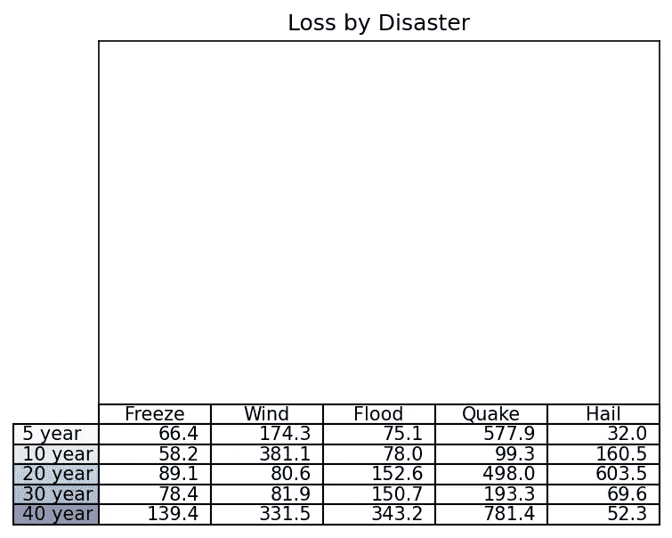

x 轴和 y 轴已移除(图片由作者提供)

## 隐藏轴边框

坐标轴消失了，但我们留下了一个围绕条形图的边界。我们可以很容易地关掉它。

```
plt.box(on=None)
```

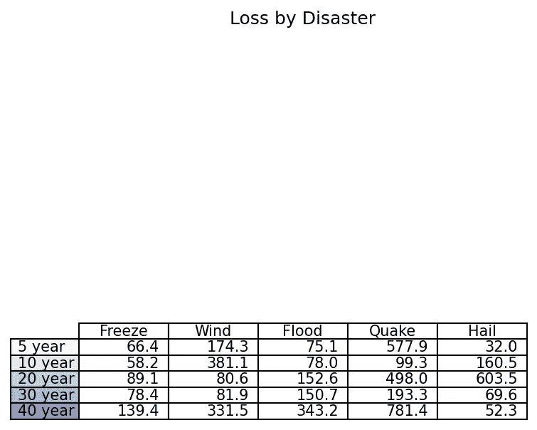

条形图边框已禁用(图片由作者提供)

## 把桌子放在图的中央

它越来越清晰，但是我们看到标题和表格之间有大量的空白。我们所要做的就是将现有的`bottom`校准改为`center`。这将使表格在隐藏轴区域居中。我们也应该从例子中去掉支线剧情的位置调整。

删除此行:

```
plt.subplots_adjust(left=0.2, bottom=0.2)
```

并将`plt.table`线改为居中`loc`:

```
the_table = plt.table(cellText=cell_text,
                      rowLabels=row_headers,
                      rowColours=rcolors,
                      colLabels=column_headers,
                      loc='center')
```

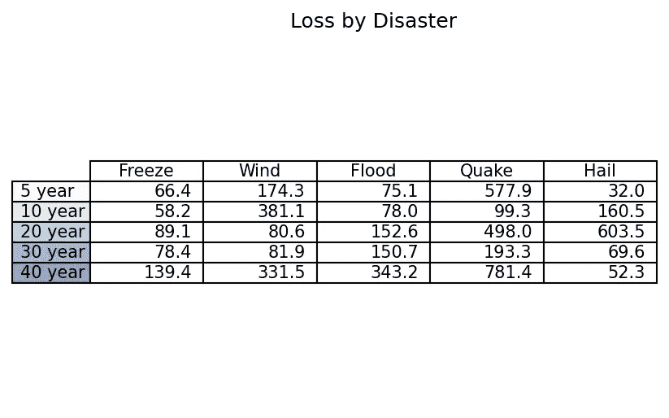

将表格居中(图片由作者提供)

## 缩放单元格以获得更多填充

这一改变很好地把桌子向上拉。现在，让我们解决单元格内过于紧凑的垂直空间。`pylot.table`不允许指定单元格的填充，但是我们可以用`scale(x, y)`函数的`y`参数将高度缩放 1.5 倍。这给了我们的细胞数据一点喘息的空间。您可以根据自己的喜好使用`x`和`y`值。

```
the_table.scale(1, 1.5)
```

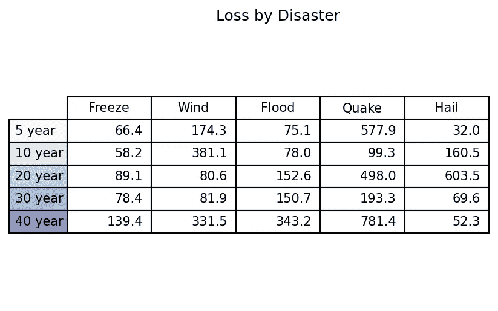

缩放表格(图片由作者提供)

## 设置列标题和行标题的样式

让我们设置列颜色，并将行标题水平对齐设置为`right`。我们将填充两个颜色列表，一个用于每个行标题单元格，另一个用于每个列标题单元格。我们将只使用示例中使用的`plt.cm.BuPm`颜色图，尽管对于装饰颜色来说，有比线性颜色图更好的选择。我们将在创建表格时设置行和列标签的颜色和对齐方式。

```
rcolors = plt.cm.BuPu(np.full(len(row_headers), 0.1))
ccolors = plt.cm.BuPu(np.full(len(column_headers), 0.1))...the_table = plt.table(cellText=cell_text,
                      rowLabels=row_headers,
                      rowColours=rcolors,
                      rowLoc='right',
                      colColours=ccolors,
                      colLabels=column_headers,
                      loc='center')
```

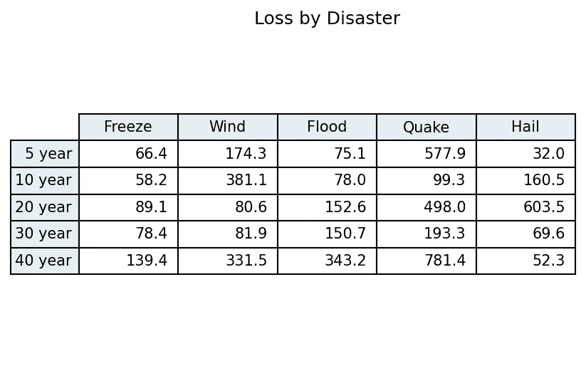

样式行和列标题(按作者排列的图像)

## 给人物造型

我们可以显式声明图形，以便轻松控制其边框和背景颜色。我将在这里使用一些标记的颜色作为这种方法的例子，与上面使用的颜色图形成对比。我通常只使用白色作为背景，但是天蓝色很适合演示如何设置它的颜色。

```
fig_background_color = 'skyblue'
fig_border = 'steelblue'...plt.figure(linewidth=2,
           edgecolor=fig_border,
           facecolor=fig_background_color
          )...plt.savefig('pyplot-table-figure-style.png',
            bbox_inches='tight',
            edgecolor=fig.get_edgecolor(),
            facecolor=fig.get_facecolor(),
            dpi=150
            )
```

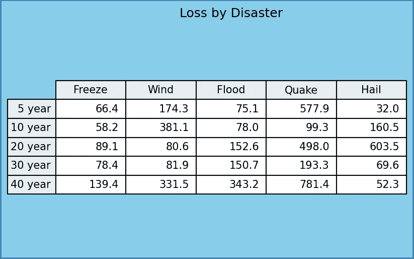

样式边框和背景(图片由作者提供)

## 在图形上居中标题

漂亮。像夏天一样。您可能注意到标题集中在轴数据上，不包括行标题。我们需要把它放在图的中心，修改三个代码。这些变化也提高了图中表格的居中一致性。

1.  使用`plt.suptitle()`.`在图形上设置标题，而不是轴
2.  在图形声明中为`tight_layout`设置一个小的填充值。既然我们现在在这里声明一个紧凑的布局，我们应该从`savefig`中移除`bbox='tight'`。把它留在里面似乎会破坏桌子在图中的居中。如果您在图像生成过程中对中有困难，可以尝试此`bbox`设置。(实验人员:注意在`save_fig`中设置`pad_inches=1`与图形声明中调用的`tight_layout={'pad':1}`效果不一样。总有一天，我会找出原因。)
3.  可选地，在保存图形之前调用`plt.draw()`。这可以解决图像渲染过程中图形边界裁剪和标题居中的问题。有时候没什么效果。

```
title_text = 'Loss by Disaster'...plt.figure(linewidth=2,
           edgecolor=fig_border,
           facecolor=fig_background_color,
           tight_layout={'pad':1}
          )...plt.suptitle(title_text)...plt.draw()...plt.savefig('pyplot-table-tighten-figsize.png',
            #bbox_inches='tight',
            edgecolor=fig.get_edgecolor(),
            facecolor=fig.get_facecolor(),
            dpi=150
            )
```

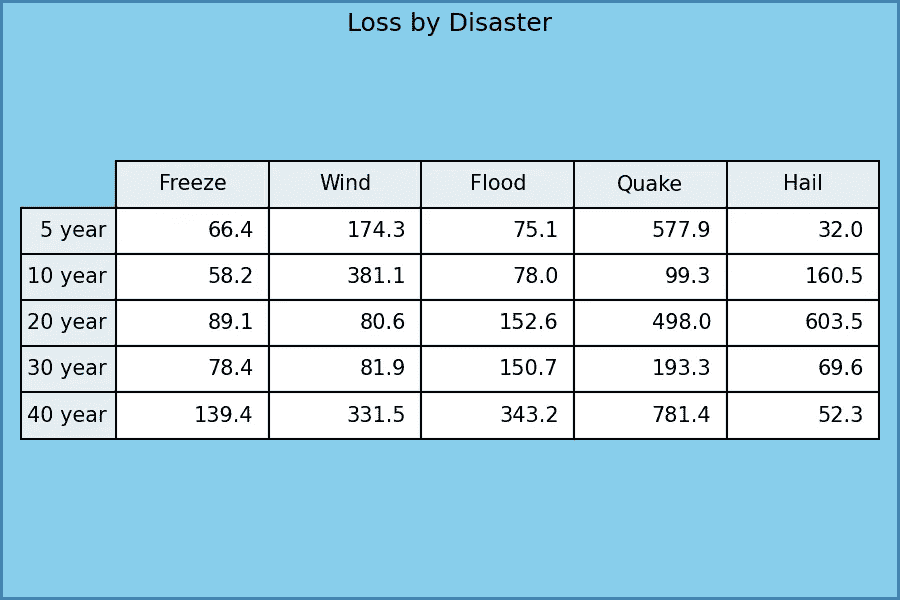

将标题居中(图片由作者提供)

# 添加页脚

我们将使用图形文本来创建一个页脚，并调整位置值，直到它看起来合适为止。

```
footer_text = 'June 24, 2020'...plt.figtext(0.95, 0.05, footer_text, horizontalalignment='right', size=6, weight='light')
```

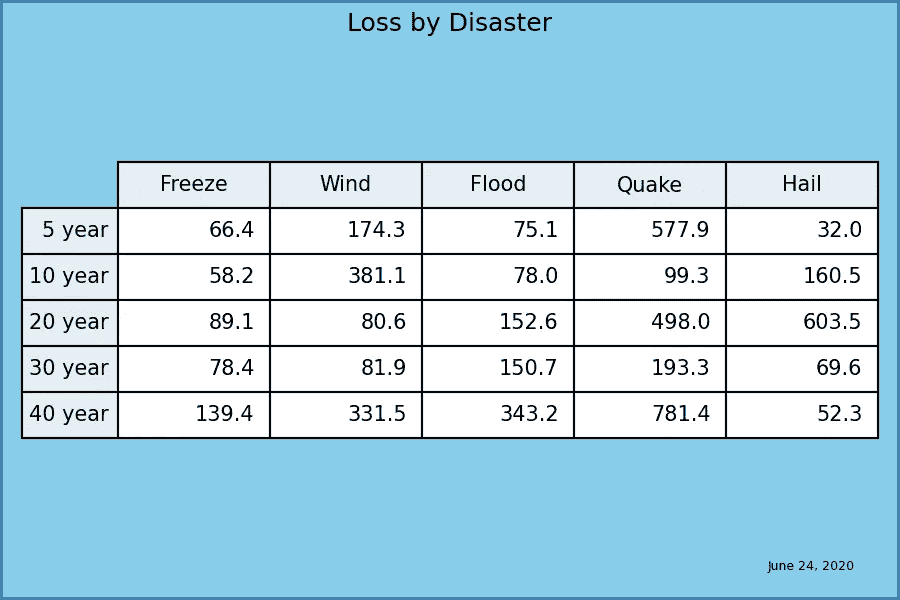

添加页脚(作者图片)

# 可选:使用明确的 figsize 缩小空间

表格图像看起来很好，但是自动布局并不总是产生我喜欢的空白。玩一个明确的数字大小往往可以拨入这个。猜测数字大小需要实验，并且可以改善或降低您的表格图像。

您可能还需要在`bbox_inches='tight'`中添加回`savefig`来重新计算边界框。否则，图像可能没有正确的左右填充。您可能会发现图像在 Jupyter 笔记本输出单元格中看起来很好，但在您保存的图像中没有对齐。让所有渲染者满意是一种平衡行为。您应该经常检查最终的输出图像，即使它们在 IDE 的预览中看起来很棒。

```
plt.figure(linewidth=2,
           edgecolor=fig_border,
           facecolor=fig_background_color,
           tight_layout={'pad':1},
           figsize=(5,3)
          )...plt.savefig('pyplot-table-tighten-figsize.png',
            bbox_inches='tight',
            edgecolor=fig.get_edgecolor(),
            facecolor=fig.get_facecolor(),
            dpi=150
            )
```

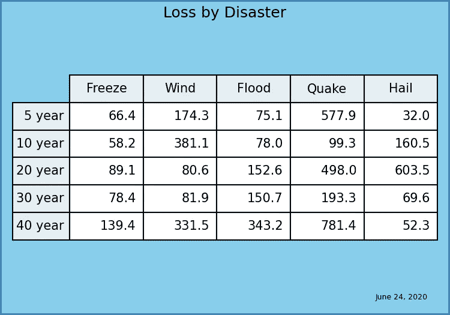

带有明确 figsize 的更紧凑的空白(图片由作者提供)

# 最终源代码

这个最终源代码不包括明确的图形大小声明。我喜欢更宽敞的外观。

```
import numpy as np
import matplotlib.pyplot as plttitle_text = 'Loss by Disaster'
footer_text = 'June 24, 2020'
fig_background_color = 'skyblue'
fig_border = 'steelblue'data =  [
            [         'Freeze', 'Wind', 'Flood', 'Quake', 'Hail'],
            [ '5 year',  66386, 174296,   75131,  577908,  32015],
            ['10 year',  58230, 381139,   78045,   99308, 160454],
            ['20 year',  89135,  80552,  152558,  497981, 603535],
            ['30 year',  78415,  81858,  150656,  193263,  69638],
            ['40 year', 139361, 331509,  343164,  781380,  52269],
        ]# Pop the headers from the data array
column_headers = data.pop(0)
row_headers = [x.pop(0) for x in data]# Table data needs to be non-numeric text. Format the data
# while I'm at it.
cell_text = []
for row in data:
    cell_text.append([f'{x/1000:1.1f}' for x in row])# Get some lists of color specs for row and column headers
rcolors = plt.cm.BuPu(np.full(len(row_headers), 0.1))
ccolors = plt.cm.BuPu(np.full(len(column_headers), 0.1))# Create the figure. Setting a small pad on tight_layout
# seems to better regulate white space. Sometimes experimenting
# with an explicit figsize here can produce better outcome.
plt.figure(linewidth=2,
           edgecolor=fig_border,
           facecolor=fig_background_color,
           tight_layout={'pad':1},
           #figsize=(5,3)
          )# Add a table at the bottom of the axes
the_table = plt.table(cellText=cell_text,
                      rowLabels=row_headers,
                      rowColours=rcolors,
                      rowLoc='right',
                      colColours=ccolors,
                      colLabels=column_headers,
                      loc='center')# Scaling is the only influence we have over top and bottom cell padding.
# Make the rows taller (i.e., make cell y scale larger).
the_table.scale(1, 1.5)# Hide axes
ax = plt.gca()
ax.get_xaxis().set_visible(False)
ax.get_yaxis().set_visible(False)# Hide axes border
plt.box(on=None)# Add title
plt.suptitle(title_text)# Add footer
plt.figtext(0.95, 0.05, footer_text, horizontalalignment='right', size=6, weight='light')# Force the figure to update, so backends center objects correctly within the figure.
# Without plt.draw() here, the title will center on the axes and not the figure.
plt.draw()# Create image. plt.savefig ignores figure edge and face colors, so map them.
fig = plt.gcf()
plt.savefig('pyplot-table-demo.png',
            #bbox='tight',
            edgecolor=fig.get_edgecolor(),
            facecolor=fig.get_facecolor(),
            dpi=150
            )
```

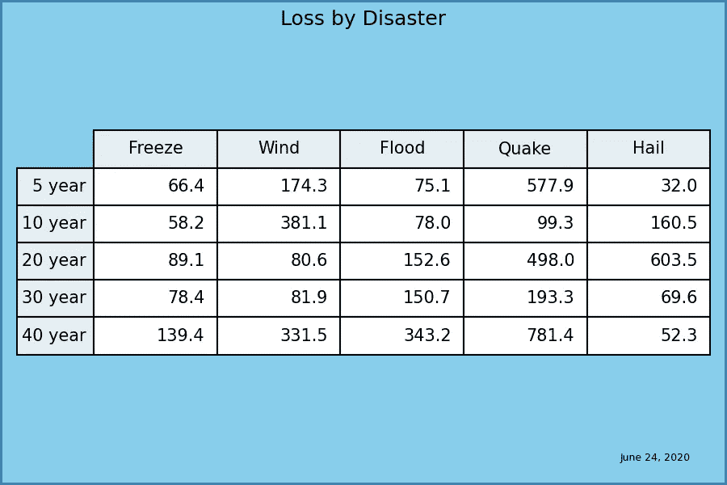

简单的小桌子(图片作者)

# 结论

我分享了 Matplotlib `pyplot.tables`示例到一个简单、整洁的小表格的一步一步的转换，没有附带图表。表格排列整齐，适合您的出版物或演示文稿。这些步骤包括隐藏图表、使表格居中、设置颜色、插入页脚的代码更改，以及改进最终图像文件的对齐和间距的提示。也许有一天这些步骤会节省你的时间。