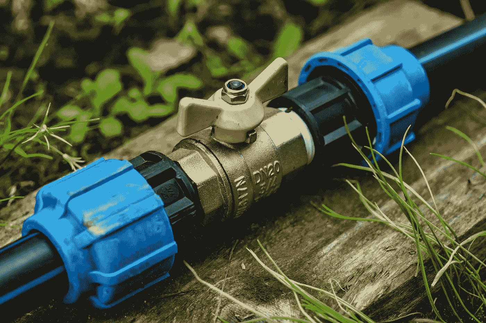
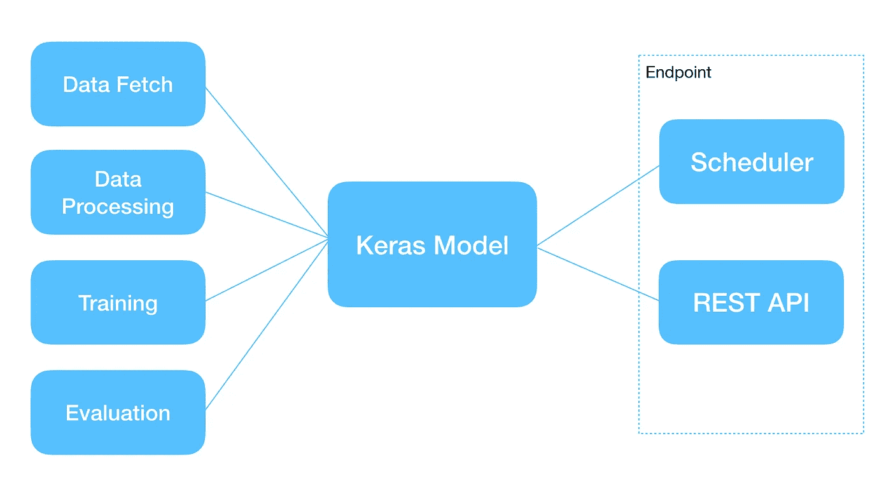
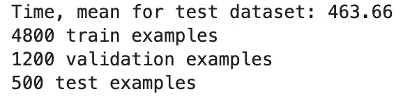
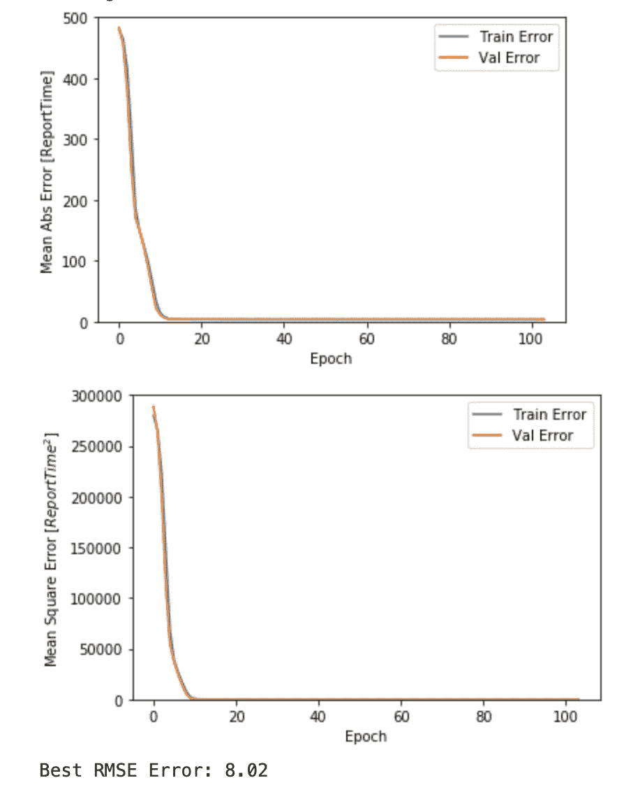
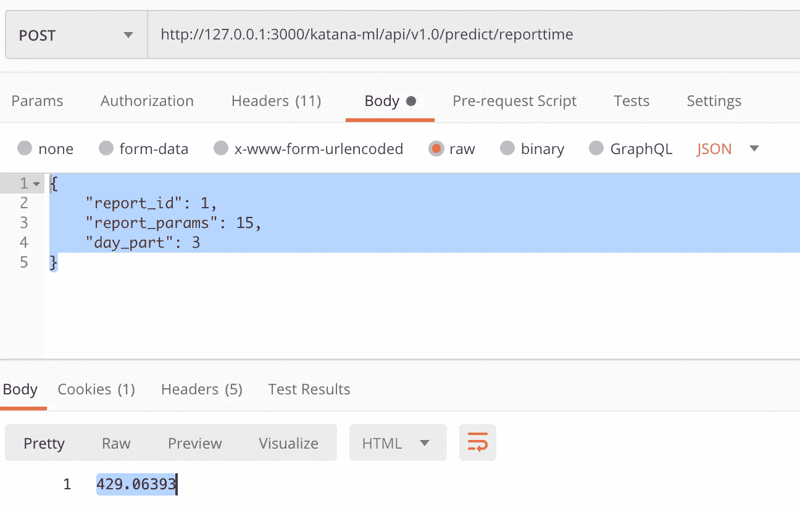
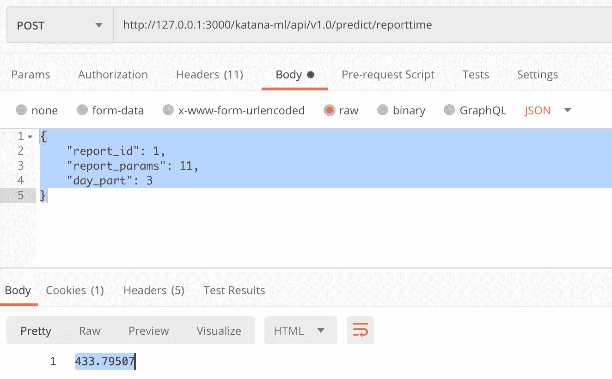
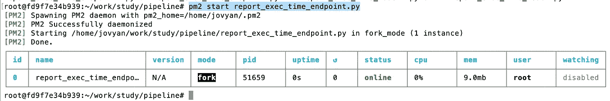

# 简单的机器学习管道

> 原文：<https://towardsdatascience.com/simple-machine-learning-pipeline-770eb3f08a2d?source=collection_archive---------41----------------------->

## 将所有必要的部分结合在一起，构建一个简单而强大的机器学习管道。这将包括 Keras/TensorFlow 模型训练、测试、自动再训练和 REST API



[Alexei_other](https://pixabay.com/users/alexei_other-9114223/) 在 [Pixabay](https://pixabay.com/) 上的照片

在这篇文章中，我将涵盖多个主题，并解释如何建立机器学习管道。什么是 ML 管道？这是一个帮助自动重新训练 ML 模型并通过 API 使其可用的解决方案。重新训练间隔可以通过调度程序配置，模型可以每天或以任何其他选定的间隔更新。

解决方案的简要架构:



简单的 ML 管道(作者:Andrej Baranovskij)

我正在使用 Keras 构建一个模型，它可以计算企业报表生成的等待时间。时间是根据报告 ID、报告参数和日部分计算的。有一个常见的规则，即模型在培训期间获得的规则，即报表运行速度较慢，参数较少，并且在一天的第二部分。

训练 Keras 模型的 Python 函数是获取数据，处理数据，然后调用 Keras API 来拟合模型。模型训练分十次进行，以选出最佳结果。最佳结果是根据模型评估结果和测试数据选择的，稍后会详细介绍。新模型是使用时间戳保存的，这使得如果有任何活动的调用同时发生，当前模型仍然可以得到服务(或者可能一些用户仍然喜欢调用以前的模型，这增加了额外的灵活性)。

从[日程安排器](https://apscheduler.readthedocs.io/en/stable/)执行模型再训练。我使用后台调度程序选项，这允许我们将它与 REST API 进程一起运行(我使用 PM2 来运行 Python 进程)。这使得控制更加简单，并且当重新训练任务运行时，REST API 调用不会被阻塞。

REST API 使用 [Flask](https://flask.palletsprojects.com/en/1.1.x/) 库运行。模型预测函数是通过用 tf.keras.models.load_model API 加载最新的可用模型，并在其上调用预测函数来执行的。

**型号**

模型逻辑在*report _ exec _ time _ model . py*中实现。

函数 ***fetch_data*** 从 CSV 中读取数据。在本例中，它总是读取相同的数据(出于简单的原因)，但是在实际实现中，对于每次重新训练，您很可能会读取新的数据。获取训练和测试数据集。对于*报告参数*特性，训练数据包含 0–10 个值，测试数据包含 11–20 个值。这是故意的，我们正在用训练中不知道的数据进行测试。这将允许我们检查模型是否能够获得正确的趋势——执行时间应该随着更多的报告参数而减少。特征*报告参数*通过计算 log 进行归一化，使值更小，从而帮助模型更好地学习它。这同样适用于训练和测试数据集。20%的训练数据用于验证。数据结构:



截图作者:Andrej Baranovskij

*报告参数*的测试数据来自不同的集合，并且在规模上不同于训练集合，但是使用 log 可以通过相同的规则标准化不同集合中的数据:

```
*# Normalize training feature - report_params*
eps=0.001
dataframe['report_params'] = np.log(dataframe.pop('report_params') +eps)
normed_df = dataframe
```

函数***build _ feature _ layer***定义张量流特征层。这是一个元数据层，有助于将数据自动转换为可用于训练算法的格式。特征*报告 ID* 和*日部分*是分类的。这两个特征都使用 TensorFlow 分类特征支持编码为指示器列。*报表参数*特性被定义为数值列。所有三列都定义为 TensorFlow 要素图层-这允许转换数据而无需额外的自定义处理:

```
feature_columns = []

report_id = feature_column.categorical_column_with_vocabulary_list('report_id', [1, 2, 3, 4, 5])
report_id_one_hot = feature_column.indicator_column(report_id)
feature_columns.append(report_id_one_hot)

    feature_columns.append(feature_column.numeric_column('report_params'))

day_part = feature_column.categorical_column_with_vocabulary_list('day_part', [1, 2, 3])
day_part_one_hot = feature_column.indicator_column(day_part)
feature_columns.append(day_part_one_hot)

feature_layer = tf.keras.layers.DenseFeatures(feature_columns)
```

函数***build _ dataset***将熊猫数据转换为 TensorFlow 数据集。这种数据集可以直接发送到 Keras 模型训练:

```
batch_size = 16train_ds = df_to_dataset(train, shuffle=**False**,batch_size=batch_size)
val_ds = df_to_dataset(val, shuffle=**False**, batch_size=batch_size)
test_ds = df_to_dataset(normed_df_test, shuffle=**False**, batch_size = batch_size)
```

我用的是批量= 16。根据我的测试，这是在给定数据的模型训练期间找到最佳拟合的最佳批次。我们不需要打乱训练数据，在分成训练集和验证集的过程中已经打乱了。

函数 ***build_model*** 构建顺序 Keras 模型。该模型接受第一层——要素层(要素列表及其表示方式)。不需要指定输入维度。有三层，第三层是输出层(一个单位/神经元)。前两层分别设置 16 和 8 个单元/神经元和 *relu* 激活。通过试验不同的设置来选择层和单元的数量。

```
model = tf.keras.Sequential([
        feature_layer,
        layers.Dense(16, activation='relu'),
        layers.Dense(8, activation='relu'),
        layers.Dense(1)
    ])optimizer = tf.keras.optimizers.RMSprop(0.001)

model.compile(loss='mse',
              optimizer=optimizer,
              metrics=['mae', 'mse'])
```

该模型是在 ***train_model*** 功能中训练的。从零开始反复训练十次。结果保存了最佳模型。模型以 TensorFlow 格式保存。训练循环完成后，最佳模型被复制到 API 端点可访问的部署文件夹中。每个新模型都存储有时间戳，这允许实现模型版本控制。训练配置为提前停止回调，当 10 个周期没有改善时，训练停止。使用 TensorFlow 数据集的模型训练:

```
EPOCHS = 1000
*# The patience parameter is the amount of epochs to check 
# for improvement*
early_stop = tf.keras.callbacks.EarlyStopping(monitor='val_loss', patience=10)

history = model.fit(train_ds,
                      validation_data=val_ds,
                      epochs=EPOCHS,
                      verbose=0,
                      callbacks=[early_stop])
```

保存最佳模型。基于测试集评估模型。我将报表参数大于 10 的数据包含在测试集中，以便能够测试回归如何作用于看不见的数据。模型应该在训练过程中选择一个规则—报表参数越多，执行时间应该越短。我很高兴看到那个模特实际上正确地学习了这条规则:

```
loss, mae, mse = model.evaluate(test_ds, verbose=0)rmse = math.sqrt(mse)
print("Testing set RMSE Error:**{:5.2f}**".format(math.sqrt(mse)))
**if** rmse < best_rmse:
    print("Saving model with RMSE Error **{:5.2f}**".format(math.sqrt(mse)))
    model.save('./model_exec_time_temp/', save_format='tf')

    best_history = history
    best_rmse = rmse
```

将最佳模型复制到 API 可访问的目录中，以及用于版本控制的时间戳值:

```
ts = calendar.timegm(time.gmtime())
print('Creating new model:', ts)
copyDirectory('./model_exec_time_temp/', './model_exec_time/' + str(ts))
```

这是 RMSE = 8.02 秒的模型训练结果(这意味着在计算测试集数据的报告执行时间时出现约 8 秒的误差)。我们可以看到，在提前停止回调终止训练之前，大约需要 100 个时期:



截图作者:Andrej Baranovskij

函数 ***run_predict*** 接受输入数据进行推理，加载最新的可用模型，执行预测调用。

**终点**

端点逻辑在*report _ exec _ time _ endpoint . py*中实现

在这个脚本中，我实现了重新训练调度器和 REST API。重新训练在后台线程中运行，这允许保持 REST API 运行而不会阻塞。

计划程序被配置为每天运行一次，但是重新训练的时间间隔由您决定。当新数据可用时，重新训练是有意义的:

```
# create scheduler
scheduler = BackgroundScheduler()
scheduler.start()# Using UTC time to schedule job, once per day.
scheduler.add_job(
    func=report_model.train_model,
    trigger='cron',
    hour='9', 
    minute='45')
```

REST API 通过 [Flask](https://flask.palletsprojects.com/en/1.1.x/) 实现。请求参数被发送用于推理到模型中(自动从调度器中挑选出最佳的最新模型，或者你可以基于模型版本化实现其他逻辑)预测方法，结果被返回给客户端:

```
app = Flask(__name__)
CORS(app)[@app](http://twitter.com/app).route("/katana-ml/api/v1.0/predict/reporttime", methods=['POST'])
def predict():
    report_id = request.json['report_id']
    report_params = request.json['report_params']
    day_part = request.json['day_part']

    input_data = [[report_id, report_params, day_part]]
    result = report_model.run_predict(input_data)

    return str(result[0][0])# running REST interface port=3000
if __name__ == "__main__":
    app.run(debug=False, host='0.0.0.0', port=3000)
```

我们来验证一下模型。以来自模型训练集的数据为例(报告 ID、报告参数、日部分=时间):

```
1, 10, 3 = 440
```

用 15 个报表参数做推断。正如所料，执行时间更短= 429，这意味着模型训练正确:



截图作者:Andrej Baranovskij

如果有 11 个报告参数，执行时间会稍微长一点，这是应该的:



截图作者:Andrej Baranovskij

您可以尝试不同的报告 ID 和日部分值，看看执行时间计算是如何变化的。

**部署**

Python 端点进程正在使用 [PM2](https://pm2.keymetrics.io/) 管理器运行。用 PM2 命令启动进程:

```
pm2 start report_exec_time_endpoint.py
```



截图作者:Andrej Baranovskij

**结论**

希望本文描述的信息能够帮助您在生产中运行可扩展的机器学习管道。我认为核心部分是一个自动化的重新训练选项，这有助于在新数据可用时保持模型更新。在单独的线程中运行预定的再训练的能力允许我们在与 API 端点相同的过程中管理它。这使得管道更简单，更易于维护。

**源代码** : [GitHub](https://github.com/abaranovskis-redsamurai/automation-repo/tree/master/pipeline) repo。