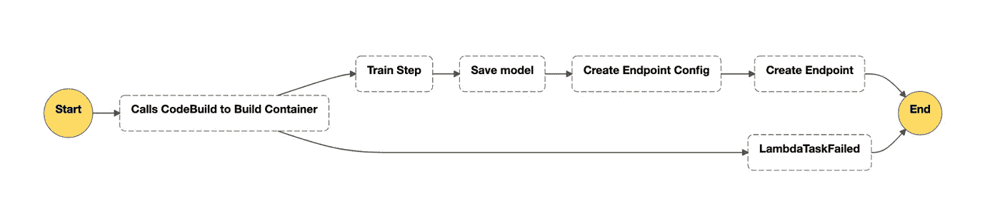
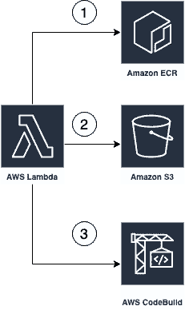
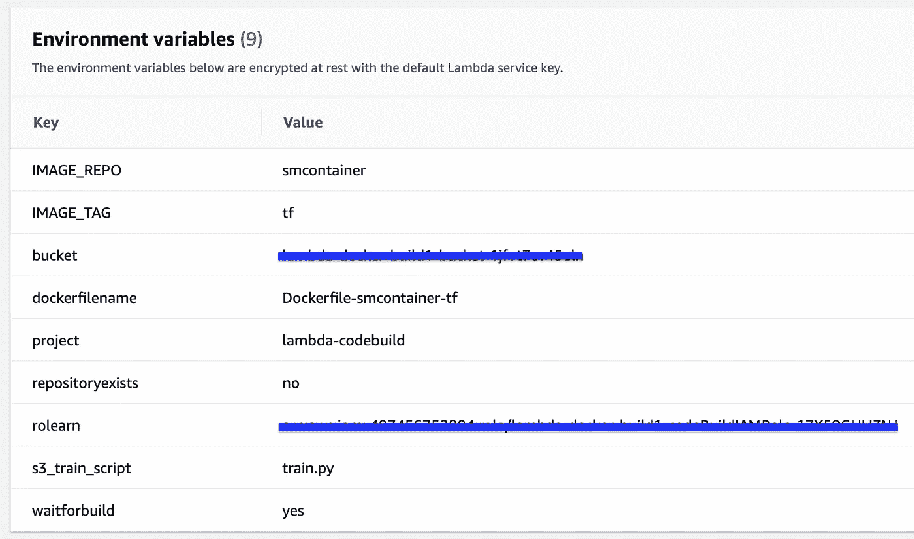

# 带有 Amazon SageMaker、Lambda 和 AWS 阶跃函数的简单 Data Science SDK

> 原文：<https://towardsdatascience.com/simple-mlops-with-amazon-sagemaker-lambda-and-aws-step-functions-data-science-sdk-e8052825a56c?source=collection_archive---------13----------------------->

## 使用 AWS 上的无服务器组件构建您自己的 ML CI/CD 管道。



由[斯特凡·纳图、](https://medium.com/u/5b52acb0f7e6?source=post_page-----e8052825a56c--------------------------------)T2、史瑞亚斯·苏布拉曼尼安、[李庆伟](https://www.linkedin.com/in/liqingwei/)

# 介绍

随着机器学习领域的成熟，越来越需要简单的方法来自动化 ML 管道并将其部署到生产中。随着数据科学平台的爆炸式增长，公司和团队经常使用不同的机器学习平台进行数据探索、提取-转换-加载(ETL)作业、模型训练和部署。在这篇博客中，我们描述了用户如何使用 Docker 自带算法代码来构建训练和推理图像，使用 Amazon SageMaker 和 AWS StepFunctions 来训练和托管他们的模型。我们使用 Mask R-CNN，这是一种非常流行的实例分割模型，用于许多计算机视觉用例，如[1]。希望亲自了解这篇博客内容的读者可以参考我们的[Github](https://github.com/aws-samples/aws-stepfunctions-byoc-mlops-using-data-science-sdk)【2】。

# 使用的 AWS 服务

**AWS code build:**AWS code build 是一个完全托管的持续集成(CI)服务，允许用户将代码编译和打包成可部署的工件。在这里，我们将使用 CodeBuild 将我们的自定义 Mask R-CNN 容器打包到 Docker 映像中，我们将该映像上传到 Amazon Elastic Container Registry(ECR)

**AWS Lambda:**AWS Lambda 是一种服务，它允许您在不提供服务器的情况下运行代码。这里我们将使用 AWS Lambda 来部署一个代码构建作业。

**AWS step functions:**AWS step functions 是一个编排工具，允许用户构建管道并将微服务协调到工作流中。然后，AWS StepFunctions 可以以事件驱动的方式触发该工作流，而无需用户管理任何底层服务器或计算机。

**亚马逊 SageMaker:** 亚马逊 SageMaker 是一个完全托管的机器学习平台，用于构建、训练和部署机器学习模型。在这里，我们使用 Amazon SageMaker 编写培训和模型部署作业，使用 SageMaker Jupyter 笔记本编写 StepFunctions 工作流。

# 创建一个屏蔽 R-CNN 容器

因为我们在培训或托管中运行相同的映像，所以 Amazon SageMaker 用参数`train`或`serve`运行您的容器。当 Amazon SageMaker 运行训练时，你的`train`脚本就像一个普通的 Python 程序一样运行。托管与训练有着非常不同的模型，因为托管是对通过 HTTP 传入的推理请求做出响应。在这个例子中，我们使用我们推荐的 Python 服务栈来提供推理请求的健壮和可伸缩的服务:

## 集装箱

在“container”目录中，是您打包 Amazon SageMager 的示例算法所需的所有组件。

```
├── Dockerfile
    ├── build_and_push.sh
    └── mask_r_cnn
        ├── nginx.conf
        ├── predictor.py
        ├── serve
        ├── wsgi.py
        ├── transforms.py
        ├── utils.py
        ├── coco_eval.py
        ├── coco_utils.py
        ├── engine.py
        └── helper.py
```

让我们依次讨论这些问题:

*   `**Dockerfile**`描述如何构建 Docker 容器映像。更多细节见下文。
*   `**build_and_push.sh**`是一个脚本，它使用 docker 文件来构建你的容器图像，然后将其推送到 ECR。我们将在本笔记的后面直接调用这些命令，但是您可以复制并运行您自己算法的脚本。
*   `**mask_r_cnn**`是包含将要安装到容器中的文件的目录。

在这个简单的应用程序中，我们只在容器中安装了五个文件。我们将放入容器的文件是:

*   `**nginx.conf**`是 nginx 前端的配置文件。通常，您应该能够照原样接受这个文件。
*   `**predictor.py**`是实际实现 Flask web 服务器和该应用程序的决策树预测的程序。
*   `**serve**`容器启动托管时程序是否启动。它只是启动 gunicorn 服务器，运行在`predictor.py`中定义的 Flask 应用程序的多个实例。您应该能够照原样接受这个文件。
*   `**train**`是运行容器进行训练时调用的程序。
*   `**wsgi.py**`是一个用来调用 Flask app 的小包装器。您应该能够照原样接受这个文件。

我们已经定制了`train.py`和`predictor.py`用于在训练期间微调掩码 R-CNN，以及用于加载调整后的模型、反序列化请求数据、进行预测和发送回序列化结果。

## 文档文件

Dockerfile 文件描述了我们想要构建的图像。我们将从一个标准的 Ubuntu 安装开始，运行普通的工具来安装所需的东西，比如 python、torch、torchvision 和 Pillow。最后，我们将实现特定算法的代码添加到容器中，并设置合适的运行环境。docker 文件如下所示，

```
FROM ubuntu:16.04MAINTAINER Amazon AI <sage-learner@amazon.com> RUN apt-get -y update && apt-get install -y --no-install-recommends \
         wget \
         gcc\
         g++\
         python3 \
         python3-dev\
         nginx \
         ca-certificates \
    && rm -rf /var/lib/apt/lists/* RUN wget [https://bootstrap.pypa.io/get-pip.py](https://bootstrap.pypa.io/get-pip.py) && python3 get-pip.py && \
    pip install cython numpy==1.16.2 scipy==1.2.1 pandas flask gevent gunicorn && \
        (cd /usr/local/lib/python3.5/dist-packages/scipy/.libs; rm *; ln ../../numpy/.libs/* .) && \
        rm -rf /root/.cache
RUN pip install  torch torchvision fastai thinc  PillowENV PYTHONUNBUFFERED=TRUE
ENV PYTHONDONTWRITEBYTECODE=TRUE
ENV PATH="/opt/program:${PATH}"# Set up the program in the image
COPY mask_r_cnn /opt/program
WORKDIR /opt/program
```

# 使用 AWS Lambda 和 CodeBuild 构建您的映像

## SageMaker 集装箱项目

为了构建 SageMaker-ready 容器，比如上面讨论的 Mask R-CNN，我们使用开源的“SageMaker 容器”项目，可以在 https://github.com/aws/sagemaker-containers[这里找到。SageMaker Containers 为您提供了创建 SageMaker 兼容的 Docker 容器的工具，并提供了用于创建框架的附加工具(可以运行任意 Python 或 shell 脚本的 SageMaker 兼容的 Docker 容器)。目前，这个库被以下容器使用:](https://github.com/aws/sagemaker-containers) [TensorFlow 脚本模式](https://github.com/aws/sagemaker-tensorflow-container/tree/script-mode)、 [MXNet](https://github.com/aws/sagemaker-mxnet-container) 、 [PyTorch](https://github.com/aws/sagemaker-pytorch-container) 、 [Chainer](https://github.com/aws/sagemaker-chainer-container) 和 [Scikit-learn](https://github.com/aws/sagemaker-scikit-learn-container) 。要创建 Sagemaker 兼容容器，我们需要以下组件:

1.  train.py 文件和您的培训代码，以及
2.  Dockerfile，如上图所示

训练脚本必须位于文件夹`/opt/ml/code`下，其相对路径在环境变量`SAGEMAKER_PROGRAM`中定义。支持以下脚本:

*   Python 脚本:将 Python 解释器用于任何带有。py 后缀
*   Shell 脚本:使用 Shell 解释器来执行任何其他脚本

当训练开始时，解释器执行上面例子中的入口点:

```
python train.py
```

关于超参数和环境变量的更多信息，请参考[https://github.com/aws/sagemaker-containers#id10](https://github.com/aws/sagemaker-containers#id10)。

## 使用 Lambda 和 CodeBuild 自动化容器构建

我们将使用云形成模板来自动化我们的掩模 R-CNN 的容器构建。该模板建立了以下体系结构:



Lambda 函数包含可以内联编辑的 train.py 文件和 Dockerfile 文件。一旦触发(手动或通过下一节所示的阶跃函数方法)，Lambda 函数:

1.  创建一个 ECR 存储库(如果还不存在的话),用于存储构建后的容器映像
2.  将 train.py 和 docker 文件上传到 S3 存储桶
3.  创建一个 Codebuild 项目，并使用上述带有 buildspec.yml 的文件来启动构建容器的过程，将映像推送到 ECR。

Lambda 函数还包含有用的环境变量，可以针对新的构建进行重新配置。



# 使用 AWS Step 函数 Data Science SDK 训练和部署您的容器

一旦 Lambda 函数设置完毕，我们现在就可以构建自动化管道来训练和部署模型到端点。为此，我们将使用 AWS Step Functions，这是一个编排工具，它允许用户将状态机作为 JSON 对象创作并执行它们，而无需提供或管理任何服务器。Step Functions 现在还提供了一个数据科学 Python SDK，用于在熟悉的 Jupyter 笔记本环境中使用 Python 创作机器学习管道。我们建议读者参考 Github 存储库的 Step Functions 来开始[3]。

这里我们简单演示一下我们的 Github [2]中详细描述的管道的关键组件。为了编写代码，我们将使用 Amazon SageMaker，AWS 完全管理的机器学习平台。

与所有 AWS 服务一样，我们首先需要提供适当的 IAM 服务权限来调用其他 AWS 服务。为此，我们首先需要允许 Amazon SageMaker 调用 Step 函数 API，并允许 AWS Step 函数调用 SageMaker 进行模型训练、端点创建和部署。[3]中详细介绍了如何设置正确的 IAM 凭证。

一旦设置好，我们将首先创建一个 Lambda 状态来运行 Lambda 函数，该函数获取代码并将其作为容器部署到 ECR 中。

```
lambda_state = LambdaStep(
    state_id="Calls CodeBuild to Build Container",
    parameters={  
        "FunctionName": "Docker_Lambda", #replace with the name of the Lambda function you created
        "Payload": {  
           "input": "HelloWorld"
        }
    }
)lambda_state.add_retry(Retry(
    error_equals=["States.TaskFailed"],
    interval_seconds=15,
    max_attempts=2,
    backoff_rate=4.0
))lambda_state.add_catch(Catch(
    error_equals=["States.TaskFailed"],
    next_step=Fail("LambdaTaskFailed")
))
```

这里添加了重试和捕获步骤，用于错误处理。您可以用您的自定义错误处理步骤来修改这些，但是如果 Lambda 函数未能部署容器，这将让步骤函数知道结束工作流。

接下来的步骤是将训练任务和来自已训练工件的模型创建链接在一起。幸运的是，Step Functions Data Science SDK 提供了将这些步骤链接在一起的逻辑和 API，以及可能需要的任何自定义分支逻辑。

```
train_step = TrainingStep('Train Step',
estimator=maskrcnn,
data=os.path.dirname(data_location),
job_name=execution_input['JobName'])model_step = ModelStep('Save model',
model=train_step.get_expected_model(),
model_name=execution_input['ModelName'])endpoint_config_step = EndpointConfigStep(
    "Create Endpoint Config",
    endpoint_config_name=execution_input['ModelName'],
    model_name=execution_input['ModelName'],
    initial_instance_count=1,
    instance_type='ml.m5.large'
)endpoint_step = EndpointStep("Create Endpoint",
endpoint_name=execution_input['EndpointName'],
endpoint_config_name=execution_input['ModelName'])
```

在这里，我们使用我们的 **mask-rcnn** 估计器，它是一个通用的 SageMaker 估计器对象，允许我们指定我们想要在其上训练我们的模型的实例的类型，识别任何网络或安全设置(如果需要)和模型超参数，以及模型的输出路径。估计器的输入是由上面的 Lambda 函数创建的容器图像。

```
maskrcnn = sagemaker.estimator.Estimator(image,
                       role, 1, 'ml.p2.xlarge', #feel free to modify with your own. A cost estimate is provided in Readme.
                       output_path="s3://{}/{}/output".format(sess.default_bucket(), key),
                       sagemaker_session=sess)maskrcnn.set_hyperparameters(num_epochs = 1,
                              num_classes = 2)
```

通过使用 Chain 实用程序，我们可以将上述所有步骤串联起来，按顺序进行。然后，我们可以选择将整个工作流输出为 JSON，例如，可以在更大的云形成模板中使用，该模板还包括关于实例供应、网络安全设置等的信息。，或者自行运行。通过创建工作流和呈现图形，将在 Amazon Step Functions 控制台中创建一个状态机。

```
workflow_definition = Chain([
    lambda_state,
    train_step,
    model_step,
    endpoint_config_step,
    endpoint_step
])# Next, we define the workflow
workflow = Workflow(
    name="MyWorkflow-BYOC-MaskRCNN-{}".format(uuid.uuid1().hex),
    definition=workflow_definition,
    role=workflow_execution_role
)workflow.render_graph()
```

这将呈现以下输出:


这就完成了我们的步骤功能工作流程。我们现在可以直接在 Amazon SageMaker
中执行这个工作流，并使用 workflow.execute 和 workflow . render _ progress()API 或直接从 Step Functions 控制台检查进度。执行将被记录在 CloudWatch 中，并可用于在下游系统中向用户发送警报和通知。

借助 AWS Step Functions Data Science SDK，数据科学家和工程师可以无缝部署定制容器、训练 ML 模型并将其部署到生产中。为了将其他 AWS 大数据工具(如 EMR 和 AWS Glue)集成到 Step Functions 工作流中，我们建议读者参考[4，5]。

# 参考

[1] He，k .，Gkioxari，g .，Dollar，p .，Girshick，R .，Mask R-CNN，[https://arxiv.org/abs/1703.06870.](https://arxiv.org/abs/1703.06870)
【2】[https://github . com/AWS-samples/AWS-step functions-byoc-mlops-using-data-science-SDK](https://github.com/aws-samples/aws-stepfunctions-byoc-mlops-using-data-science-sdk)
【3】[https://github . com/aw slats/Amazon-sagemaker-examples/tree/master/step-functions-data-science-SD](https://github.com/awslabs/amazon-sagemaker-examples/tree/master/step-functions-data-science-sdk)