# “拉平曲线”和“解除锁定”的简单建模

> 原文：<https://towardsdatascience.com/simple-modeling-of-flattening-the-curve-and-lifting-lockdown-1a774a248e68?source=collection_archive---------25----------------------->

## 一个基本流行病学模型的简单 Python 脚本，用于演示社交距离的影响，以及如果封锁解除得太快会发生什么。

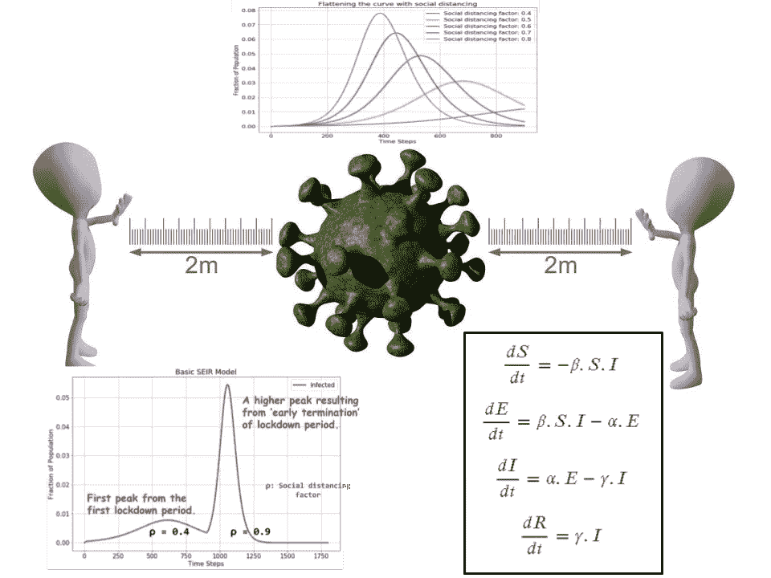

图片:(作者用 Pixabay 免费图片和编程制作)

***编者按:*** [*走向数据科学*](http://towardsdatascience.com/) *是一份以数据科学和机器学习研究为主的中型刊物。我们不是健康专家或流行病学家，本文的观点不应被解释为专业建议。想了解更多关于疫情冠状病毒的信息，可以点击* [*这里*](https://www.who.int/emergencies/diseases/novel-coronavirus-2019/situation-reports) *。*

# 介绍

新冠肺炎——自二战以来最大的全球性危机和自 1918-1919 年西班牙流感以来最大的全球性疫情今天降临在我们身上。每个人都在关注死亡人数的每日上升，以及这种新型病毒的快速指数传播。

数据科学家，像其他各行各业的许多人一样，也可能感到焦虑。他们可能也渴望看到自己是否能为抗击这种高传染性病原体做出贡献。

来源: [Pixabay(免费用于商业用途)](https://pixabay.com/illustrations/covid-corona-coronavirus-virus-4948866/)

数据科学家和统计建模专业人员可以通过许多途径为这项事业做出贡献。**在几乎所有情况下，他们都应该与领域专家密切合作——病毒学家、医疗保健专家、流行病学家**。没有这种积极的合作和团队精神，开展预测性建模或预测疾病传播和缓解努力的项目是危险和无意义的。

正如广受欢迎的数据建模网站 Five-38 所言，制作一个准确的新冠肺炎模型[异常困难。](https://fivethirtyeight.com/features/why-its-so-freaking-hard-to-make-a-good-covid-19-model/)

 [## 为什么做一个好的新冠肺炎模型如此困难

### 我们在这里，在疫情的中间，像观赏鱼一样盯着我们起居室的窗户。关于…的问题

fivethirtyeight.com](https://fivethirtyeight.com/features/why-its-so-freaking-hard-to-make-a-good-covid-19-model/) 

然而，即使不冒险进入实际的预测模型，也有可能通过一种简单的编程方法来展示我们所有人对抗新冠肺炎病毒的唯一基本武器——“T4”***社交距离*** ”的功效。

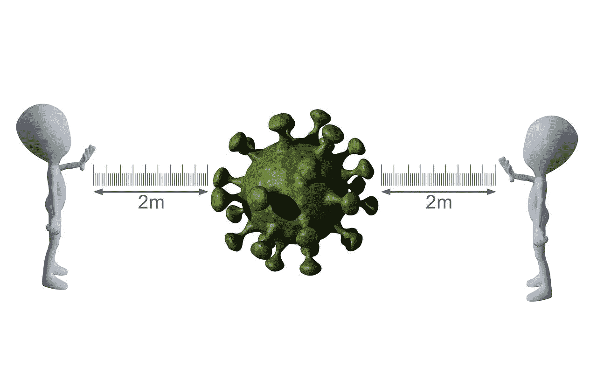

来源: [Pixabay(免费商业使用)](https://pixabay.com/illustrations/social-distancing-virus-covid-19-4990640/)

在本文中，我们将展示如何用 Python 构建这样一个演示，遵循[简单而基本的流行病学理论](https://en.wikipedia.org/wiki/Compartmental_models_in_epidemiology)。

**这并不是试图建立任何预测或预测模型**。除了一些虚构的数字之外，没有实际的数据将用于生成图表和可视化。

**目标是展示仅用一个基本的动力学模型，就有可能理解关键概念**，例如“*使曲线变平*”、“*群体免疫*”和“*过快解除封锁*”。并且，你可以用基本的 Python 和[数学知识](/the-mathematics-of-epidemiology-fa0ba15e44a2)编写这样一个模型。

> 然而，即使不冒险进入实际的预测模型，也有可能通过简单的编程方法来展示我们所有人对抗新冠肺炎病毒的唯一基本武器——“社交距离”的功效。

# (流行病学)模型和 Python 类

我们基于基础流行病学的 [SEIR 模型](https://en.wikipedia.org/wiki/Compartmental_models_in_epidemiology)创建了一个叫做`SEIRclass`的 Python 类。该脚本在 [**my Github repo**](https://github.com/tirthajyoti/Covid-19-analysis) 中的`SEIRclass.py`文件中，该类需要为该演示导入。

## SEIR 模式

SEIR 模型将全部人口分为四组，

*   ***易感*** :从未被感染过且尚未产生任何免疫力的人群。
*   *:接触过病毒但没有表现出任何症状或不能被称为“感染者”的人。病毒正处于 [**潜伏期**](https://www.medscape.com/answers/2500114-197431/what-is-the-incubation-period-for-coronavirus-disease-2019-covid-19) 。*
*   ****已感染*** :处于活跃感染状态的人口比例，表现为轻度或重度症状，可能需要住院治疗。这是对 [**医疗能力规划**](https://www.definitivehc.com/resources/covid-19-capacity-predictor) 最重要的类别，几乎所有的 [**死亡事故**](https://thehill.com/homenews/state-watch/492722-covid-19-fatality-rates-vary-widely-leaving-questions-for-scientists) 都将来自这一人群。*
*   ****收复*** :噩梦彼岸的乡亲们！那些被感染并从中康复的人。请注意，在这个简单的模型中，这些人被假定具有“**永久免疫力**，即他们不会再次落入易感或受感染人群。*

**

*来源:[维基百科(知识共享许可)](https://upload.wikimedia.org/wikipedia/commons/3/3d/SEIR.PNG)*

## *参考文章*

*这个想法是受这篇文章的启发，这篇文章清楚地阐述了流行病学模型和动力学方程: [**社会距离减缓冠状病毒**](/social-distancing-to-slow-the-coronavirus-768292f04296) **。***

* [## 社交距离减缓冠状病毒

### 模拟新冠肺炎峰的变平

towardsdatascience.com](/social-distancing-to-slow-the-coronavirus-768292f04296) 

下面是上面文章对应的 Github 回购:[https://github.com/dgoldman0/socialdistancing](https://github.com/dgoldman0/socialdistancing)。

## 动力学方程

几乎所有传染病传播的[分室模型在本质上都是](https://www.tandfonline.com/doi/full/10.1080/23737867.2018.1509026)[动态的](https://en.wikipedia.org/wiki/Dynamical_system)，即它们由一组以时间为自变量的[一阶/二阶微分方程](https://en.wikipedia.org/wiki/Ordinary_differential_equation)描述。基本的动力学方程如下，

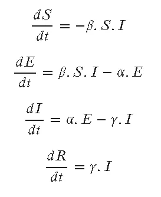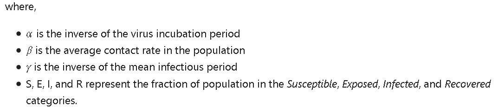

需要注意的是，[著名再现数 R0](https://web.stanford.edu/~jhj1/teachingdocs/Jones-on-R0.pdf) 是这个模型的β和γ之比。

所有系数(α、β、γ等。)在这里被假定为常数。实际上，病原体的[传染性可能会随着时间的推移而变化](https://www.livescience.com/coronavirus-sheds-early-in-disease.html)。

随着第四个参数 ***𝜌* 的引入，前两个方程略有变化，第四个参数代表社会混合**。𝜌越高，社交距离就越小。它的值可以从 0 到 1。

这里有两篇文章展示了如何使用 Python 编程来数值求解这样的动态方程组。

 [## Python 中的动态模拟

### 表示微分方程的三种方法是(1)传递函数，(2)状态空间，和(3)半显式…

apmonitor.com](https://apmonitor.com/pdc/index.php/Main/ModelSimulation)  [## 用 Python 模拟动态系统的初学者指南

### Python 中数字积分微分方程

towardsdatascience.com](/a-beginners-guide-to-simulating-dynamical-systems-with-python-a29bc27ad9b1) 

## 核心 Python 类

分部类定义如下所示。一个测试 Jupyter 的笔记本可以在这里找到**。模型类在这里是**。它们是在 MIT 许可下发布的，因此，我们鼓励您下载并使用它，通过添加其他有用的方法来增强它，等等。****

****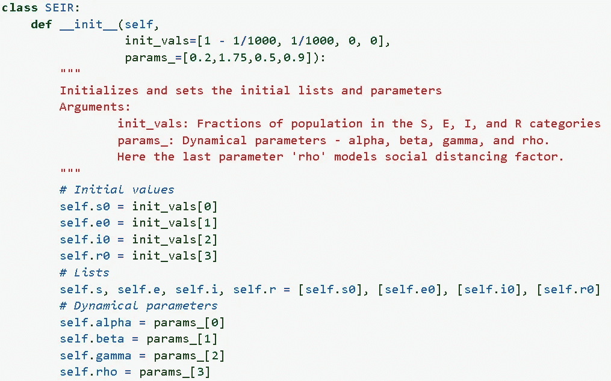****

## ****各种方法****

****我们在这个类中定义了各种实用方法，****

*   ****`reinitialize`:用新值(总体值)重新初始化模型****
*   ****`set_params`:设定动态参数的值****
*   ****`reset`:将内部列表重置为零状态，即初始值****
*   ****`run`:运行给定时间量的动力学模拟(具有给定的时间步长增量)****
*   ****`plot`:在时间轴上绘制模拟的基本结果****

# ****简单的演示****

## ****动态模拟和绘图****

****我们从导入类并创建一个对象作为实例开始。****

****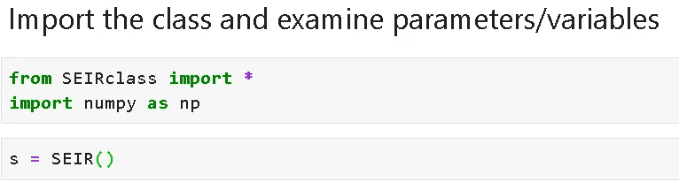****

****然后，我们可以运行一段时间的动态模拟——比如 90 个时间单位。这可以被认为是 90 天或任何其他长度的时间。****

****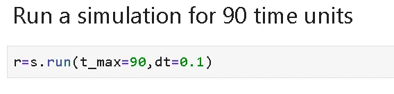****

****我们可以简单地绘制出这个模拟的结果，****

****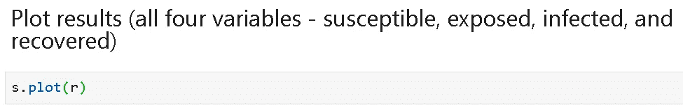********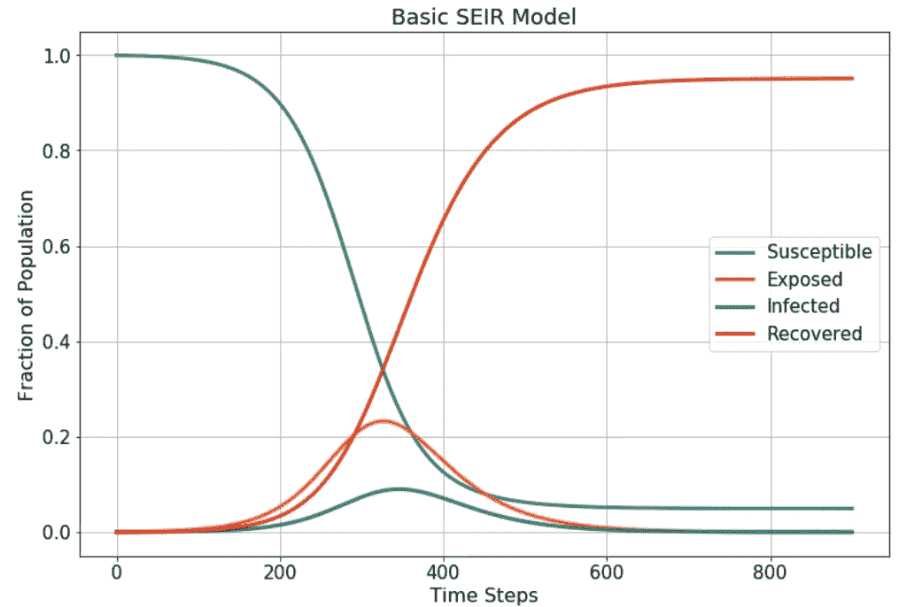****

******图片**:SEIR 模型的代表性模拟结果(作者制作)。****

## ****拉平曲线——社交距离如何影响峰值****

****接下来，我们对各种社会距离因素进行模拟，以检查它们对曲线峰值的影响。请注意，这里的**值越高意味着社交距离越小，即社交混合/互动越多**。****

****我们观察到**更高程度的社会融合会导致感染人口比例**达到更高的峰值，这可能会超出医疗保健系统的能力。****

****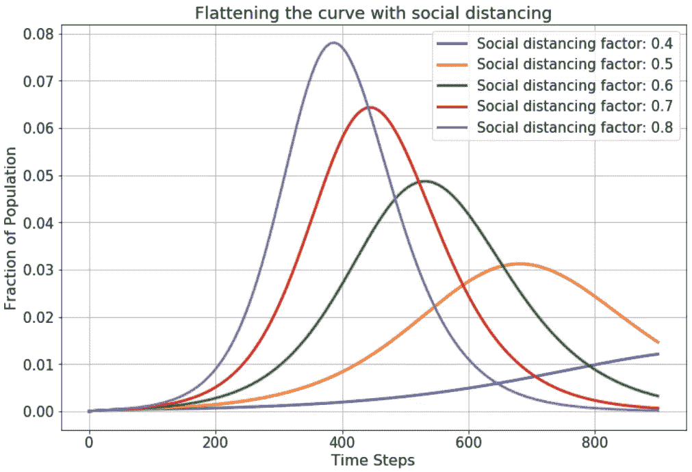****

******图片**:社会距离因素对感染比例峰值的影响(作者制作)。****

## ****调整社交距离——提前结束封锁****

****现在，我们研究[提前终止封锁或“留在家中”措施](https://www.dailymail.co.uk/sciencetech/article-8227025/Relaxing-coronavirus-lockdown-measures-soon-catastrophic-consequences.html)会发生什么，这些措施旨在减少社会交往，即增加社会距离。****

****我们从社会距离因子的某个值开始，让它运行一段时间，然后放松规范，即增加社会距离因子的值，并观察感染人口比例会发生什么。**我们将观察到第二个峰值出现**。根据各种社会和流行病学因素，第二个峰值可能高于第一个峰值。****

****在这项研究中，我们将使用两个 SEIR 模型，****

*   ****第一个模型将在低社交混合因子(严格的社交距离规范)下运行一段时间****
*   ****该模型得出的人口比例最终值将输入第二个模型。****
*   ****第二个模型将运行一个更高的社会混合值(宽松的社会距离标准)****

****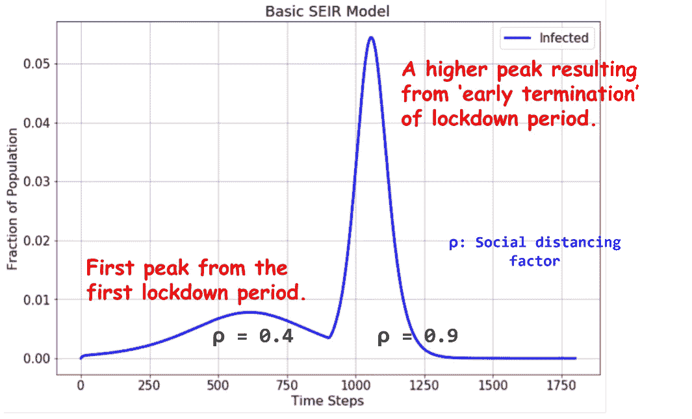****

******图片**:提前终止封锁会导致第二个高峰吗？(作者制作)****

## ****优化锁定期可以减少所有峰值****

****在“呆在家里”的规定结束和社会距离标准有所放松后，不可避免地会出现另一个感染病例高峰。问题是，这一比例会有多高，以及更长时间的封锁能否在某种程度上抑制这一趋势。****

****通过这个简单的模型，我们可以观察到，让第一次“锁定”运行很长时间可能会降低两个峰值的绝对值——一个在锁定期间，另一个在锁定结束后不可避免地出现。****

****这是由于增强的 ***【群体免疫】*** 即**的影响，随着封锁时间的延长，易感人群随着时间的推移逐渐缓慢减少**(没有产生尖峰)**。**因此，当封锁放松时，病毒感染的易感人群就减少了！****

****我们还注意到，超过 150 天后，易感分数水平不会显著下降，即从 150 天的情况到 180 天的情况再到 210 天的情况，没有明显的下降。因此，**如果目标是建立群体免疫，锁定扩展可能仅在特定时期内有效**。****

****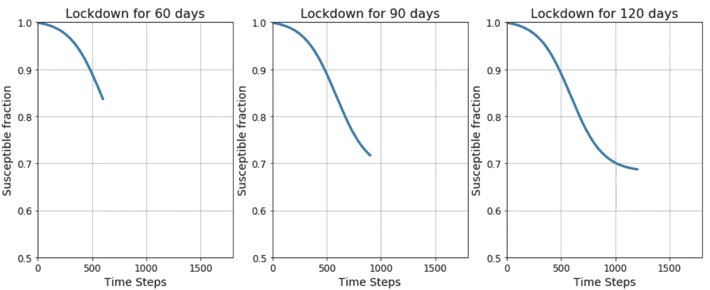****

******图片**:随着封锁期的延长，易受影响的比例下降(作者制作)****

****上面“调整社交距离”的例子显示了高达> 0.05 的第二个峰值，即 5%的人口被感染。这里，我们展示了**让第一次锁定运行更长时间可能会减少两个峰值**。事实上，我们在该实验中看到第一个峰值更高，仅为 0.018 或 1.8%左右。****

****当然，这种情况取决于初始感染率、疾病参数和社会动态。这只是我们的计划可以强调的一个可能的结果。****

****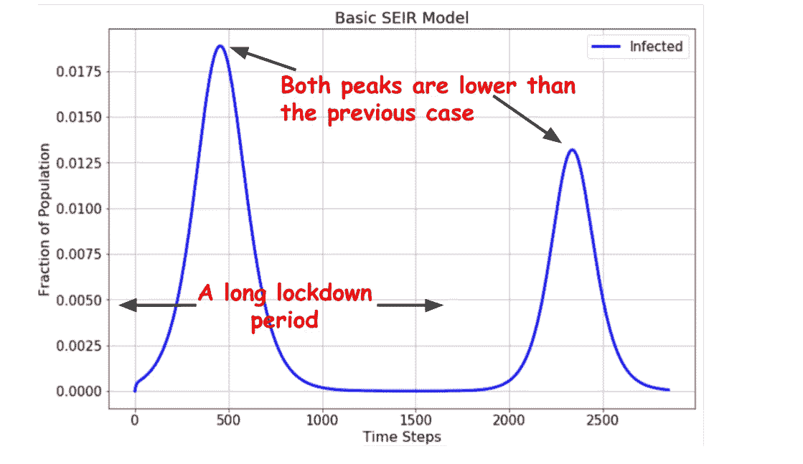****

******图片**:更长时间的封锁可能有助于整体降低峰值(作者制作)****

# ****这是一个演示，而不是新冠肺炎的实际模型****

****同样，这项工作是为了展示如何使用一个简单的 Python 脚本来编程一个广泛使用的流行病学动态模型。****

****一旦建立了这样一个程序化的模型，许多流行的短语，如'*使曲线变平*'、*群体免疫*'和'*从锁定*的早期结束起的尖峰可以通过玩模型参数和模拟设置来测量。****

> ******目标是展示仅用一个基本的动力学模型，就有可能理解关键概念**，例如“*使曲线变平*”、“*群体免疫*”和“*过快解除锁定*”。而且，您可以用基本的 Python 和数学知识编写这样一个模型。****

****这个模型非常简化。没有[地理空间互动](https://wwwnc.cdc.gov/eid/article/2/2/96-0202_article) n，这是采用图论算法的最先进的传染病模型的核心。****

****该模型没有任何[统计估计](https://www.ncbi.nlm.nih.gov/pmc/articles/PMC3090691/)，这是估计参数(α、β、γ等)的核心。)来运行真实的模拟。****

******所以，请不要把这个模型当成与当前新冠肺炎局势发展**相关的实际数据和预测有任何关联。有许多优秀的资源可供参考。****

**** [## 特别报道:模拟推动世界对新冠肺炎的反应

### 当尼尔·弗格森参观位于伦敦唐宁街的英国政府中心时，他更接近于…

www.nature.com](https://www.nature.com/articles/d41586-020-01003-6) 

然而，即使这样一个简单的编程方法也足够强大，可以创建关键的可视化效果，将“呆在家里”和“曲线变平”的信息传递给家庭。

这里有一篇很棒(但是很长)的可播放的 JavaScript 动画，

 [## 接下来会发生什么？新冠肺炎期货，用可玩的模拟解释

### “唯一值得恐惧的是恐惧本身”是个愚蠢的建议。当然，不要囤积卫生纸——但如果政策制定者担心…

ncase.me](https://ncase.me/covid-19/) 

再次，一个测试 Jupyter 的笔记本可以在这里 找到 [**。模型类在这里是**](https://github.com/tirthajyoti/Covid-19-analysis/blob/master/Notebook/SEIR-demo.ipynb)****。它们是在 MIT 许可下发布的，因此，我们鼓励你下载并使用它。****

**注意安全，各位！**

*****作者注*** : *我是一名半导体工艺师，有兴趣将数据科学和机器学习应用于与我领域相关的各种问题。我没有医学、分子生物学、流行病学或任何与新冠肺炎相关的专业知识。请不要给我发这种问题的邮件。***

**A lso，你可以查看作者的 [**GitHub**](https://github.com/tirthajyoti?tab=repositories) **知识库**获取机器学习和数据科学方面的代码、思想和资源。如果你和我一样，对人工智能/机器学习/数据科学充满热情，请随时[在 LinkedIn 上添加我](https://www.linkedin.com/in/tirthajyoti-sarkar-2127aa7/)或[在 Twitter 上关注我](https://twitter.com/tirthajyotiS)。**

** [## Tirthajyoti Sarkar - Sr .首席工程师-半导体、人工智能、机器学习- ON…

### 通过写作使数据科学/ML 概念易于理解:https://medium.com/@tirthajyoti 开源和有趣…

www.linkedin.com](https://www.linkedin.com/in/tirthajyoti-sarkar-2127aa7/)*******