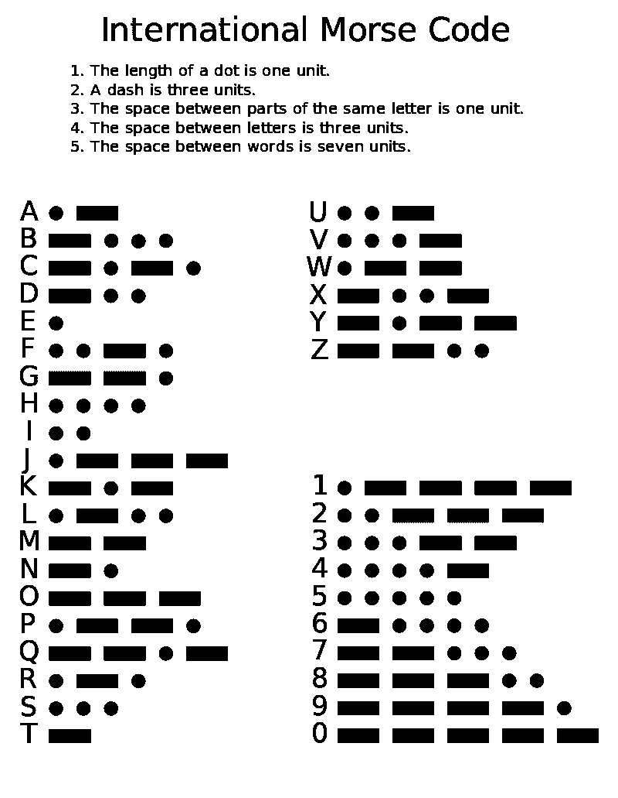
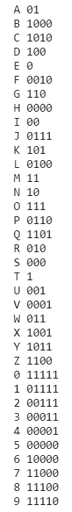
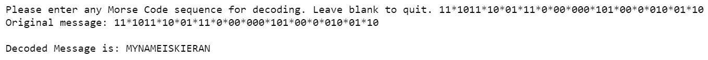
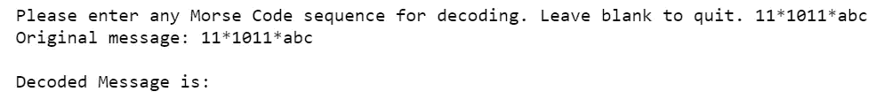
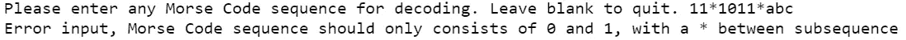
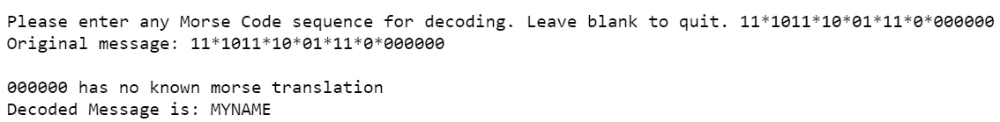
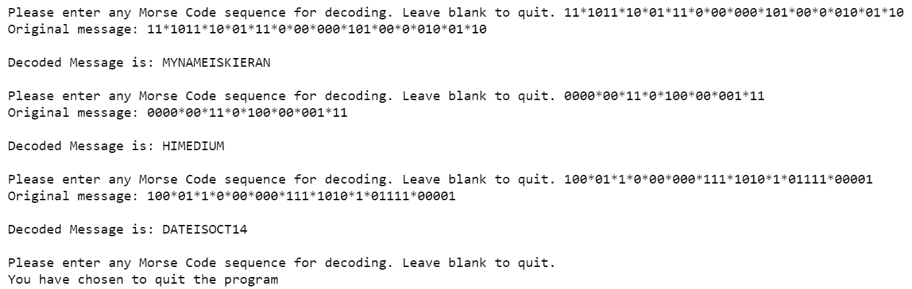

# Python 中的简单莫尔斯码解码器

> 原文：<https://towardsdatascience.com/simple-morse-code-decoder-in-python-39f6db635af2?source=collection_archive---------8----------------------->



作者 Rhey t . Snodgrass&Victor f . Camp，1922 — Image:Intcode.png 和 Image:国际莫尔斯 code.png，公共领域，[https://commons.wikimedia.org/w/index.php?curid=3902977](https://commons.wikimedia.org/w/index.php?curid=3902977)

莫尔斯电码是一种用于电信的方法，其中每个字母、数字和标点符号由一系列点/破折号/空格表示。它是由塞缪尔·莫尔斯在 20 世纪 30 年代首先发明的，并且已经在海军工业中大量使用。本文将描述用 Python 构建一个简单的莫尔斯码解码器的过程。

# Python 中的莫尔斯码表示

如上图所示，每个字母和数字都由一系列点和破折号表示。我们可以在 Python 中这样表示它们，但是为了更清楚，让我们将它们翻译成‘0’和‘1’，其中**‘0’表示点**，而**‘1’表示破折号**。

```
character = ['A','B','C','D','E','F','G','H','I','J','K','L','M','N','O','P','Q','R','S','T','U','V','W','X','Y','Z','0','1','2','3','4','5','6','7','8','9']code = ['01','1000','1010','100','0','0010','110','0000','00','0111','101','0100','11','10','111','0110','1101','010','000','1','001','0001','011','1001','1011','1100','11111','01111','00111','00011','00001','00000','10000','11000','11100','11110']
```

由于每个字符(即一个字母或数字)对应一系列 0 和 1，我们将使用一个字典结构在 Python 中存储它们。你可以在这里参考我之前关于用 Python [构建字典数据结构的帖子。](/python-data-structures-conversions-ec9d56649e3b)

```
# Define an empty dictionary 'morse_dict'
morse_dict = {}# Convert the 2 lists into a dictionary using a tuple
zipped_char_code = zip(character, code)
morse_dict = dict(zipped_char_code)# Print the dictionary 'morse_dict' on the terminal line by line
for key, value in morse_dict.items():
    print(key, value)
```



作者图片-包含莫尔斯电码表示的字典的 Python 输出

# 建造莫尔斯电码解码器

莫尔斯解码器的构建方式是，我们将提示用户键入莫尔斯码表示(即 0 和 1)，每个字母或数字由一个 ***** 分隔。一旦用户按下“回车”，程序将解码莫尔斯电码并以字母数字的形式显示出来。

```
# reverse the previous dict as it's easier to access the keys
zipped_code_char = zip(code,character)
rev_morse_dict = dict(list(zipped_code_char))
# initiating a while loop
while True:
    # empty list to store original message
    ori_msg = [] 
    # empty list to store decoded message
    dec_msg = []

    # prompt the user to input morse code
    input_msg = input ("Please enter any Morse Code sequence for decoding. Leave blank to quit. ")
    # append input_msg (string) to ori_msg (string)
    ori_msg.append(input_msg)
    # split each morse code by '*'
    new_msg = input_msg.split("*")

    # printing out the original message
    for line in ori_msg: # to print original message without the []
        print("Original message: " + line + "\n")

    # loop through each morse code representation
    for j in range (0,len(new_msg)):
        # get the alphanumeric alphabet based on the dict keys and append to dec_msg
        if new_msg[j] in rev_morse_dict.keys():
            dec_msg.append(rev_morse_dict[new_msg[j]])

    # printing out the decoded message
    print ("Decoded Message is: " + ''.join(dec_msg) + "\n") # end the infinite while loop
    break
```



图片作者——莫尔斯电码解码器的 Python 输出

正如在程序输出中看到的，莫尔斯电码解码器能够将莫尔斯电码解码为 *MYNAMEISKIERAN。*

# 错误检查



图片由作者提供——带“abc”输入的莫尔斯电码解码器的 Python 输出

到目前为止，我们只实现了一个简单的莫尔斯电码解码器，它只能在用户只输入莫尔斯电码表示(即 0 和 1)的情况下解码**。如截图所示，如果用户输入' *abc '，*解码器将无法解码剩余的莫尔斯电码，也不会显示任何错误信息。让我们改进我们的解码器，进行以下简单的错误检查:**

1.  用户只能输入 0、1 和*
2.  用户只能输入预先定义的莫尔斯电码表示法(例如 0000000 不是有效的表示法)
3.  程序可以继续解码莫尔斯电码，直到用户指定退出

```
# counter to do error check
    i = 0
    # proceed if user enters something
    if (len(input_msg)!=0):
        # while loop to check if only 0, 1 or * has been keyed in
        while (i<len(input_msg)):
            if input_msg[i] == "0" or input_msg[i] == "1" or input_msg[i] == "*":
                i+=1
            else:
                # if invalid chars found, print error message
                print ("Error input, Morse Code sequence should only consists of 0 and 1, with a * between subsequence")
               # break the error check once one error has been found
                break
```

我们添加上面的代码来纠正第一个无效字符的问题，如下面的屏幕截图所示，现在会向用户显示一条无效字符的错误消息。



作者图片——带“abc”输入的新型莫尔斯电码解码器的 Python 输出

```
# loop through each morse code representation
            for j in range (0,len(new_msg)):
                # get the alphanumeric alphabet based on the dict keys and append to dec_msg
                if new_msg[j] in rev_morse_dict.keys():
                    dec_msg.append(rev_morse_dict[new_msg[j]])
                # if morse code representation not found in original list, append input to err_msg
                else:
                    err_msg.append(new_msg[j])

            # to print error message only when necessary
            if len(err_msg) != 0:  
                for line in err_msg: 
                    print(line + " has no known morse translation")
```

我们添加上面的代码来纠正在预定义列表中找不到的无效莫尔斯码表示的第二个问题。新程序现在将向用户显示一条错误消息，如下所示，同时对那些有效的消息进行解码。



图片由作者提供-新莫尔斯电码解码器的 Python 输出，带有无效的莫尔斯电码输入

最后，如前所述，我们将使我们的程序有能力继续解码莫尔斯电码表示，如果用户继续输入，只有当用户选择退出时才停止。



作者图片—新莫尔斯电码解码器的 Python 输出

# 限制

这个程序的第一个限制是，如果用户想键入句子，程序将无法识别。从程序的输出中可以看出，字母数字被解码，中间没有任何空格。当然，有一些方法可以改进这一点，比如指定用户键入“***”作为空格。

第二个限制是，我们没有在这个莫尔斯电码解码器中加入标点符号，因为它对这个程序的目的来说并不重要。由于标点符号也是由点和破折号组成的，我们可以简单地扩展预定义的莫尔斯电码表示来包含标点符号。

# 摘要

本文描述了构建一个莫尔斯码解码器的过程，该解码器能够接受用户输入，并以原始的字母数字形式输出。此外，我们在程序中实现了几个错误检查功能，以确保莫尔斯电码解码器按照预期的方式工作。希望你们喜欢这篇文章，并开始建立自己的莫尔斯码解码器的乐趣！干杯！

[](https://www.buymeacoffee.com/tankahwang)