# 带宇宙魔方的简单 OCR

> 原文：<https://towardsdatascience.com/simple-ocr-with-tesseract-a4341e4564b6?source=collection_archive---------0----------------------->

## 如何训练宇宙魔方阅读你独特的字体

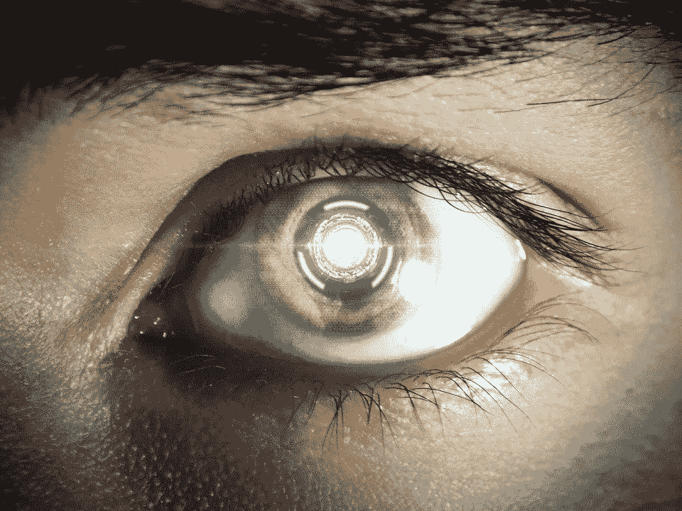

[天使昆](https://pixabay.com/users/angel-kun-50012/)在[的照片](https://pixabay.com/photos/future-eye-robot-eye-machine-175620/)

在本文中，我想与您分享如何使用 Tesseract 构建一个简单的 OCR，“*一个用于各种操作系统的光学字符识别引擎*”。宇宙魔方本身是自由软件，最初由惠普开发，直到 2006 年谷歌接手开发。它可以说是迄今为止最好的开箱即用的 OCR 引擎，支持 100 多种语言。这是最受欢迎的 OCR 引擎之一，因为它易于安装和使用。

现在，假设你的老板给了你一个任务，让你能够将下面的图片转换成机器语言，或者用更简单的话来说，“建立一个 OCR 模型，以便能够阅读一些图片中的这些字体！”。“好的，没问题，”你说，但突然你的主管对你说“我要你今天完成，在接下来的 3-5 个小时内。”

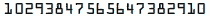

例如，我们将这张图片命名为 file_0.png

" Welp，我怎么能这么快地建立一个 OCR 模型？"你对自己说。但是别担心，这就是宇宙魔方的作用！首先，你必须把它安装在你的电脑上。

*   如果你用的是 Windows 操作系统，去[https://github.com/UB-Mannheim/tesseract/wiki](https://github.com/UB-Mannheim/tesseract/wiki)用安装程序安装宇宙魔方(你可以选择最新的稳定版本，或者我用的是宇宙魔方 4.0.0)。按照说明操作。然后，进入*编辑环境变量*，添加一个新路径到你的宇宙魔方安装文件夹，如下图所示

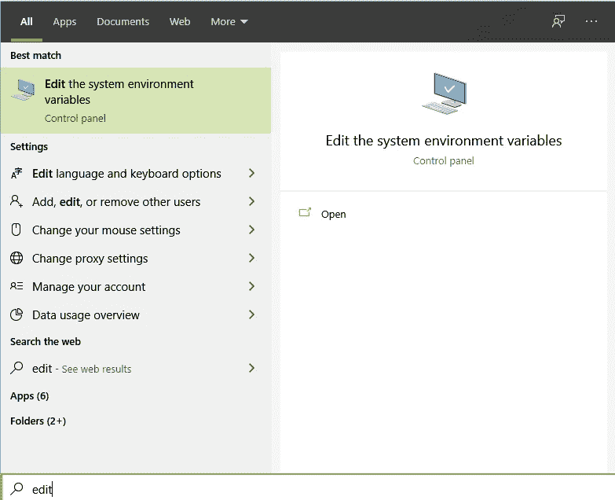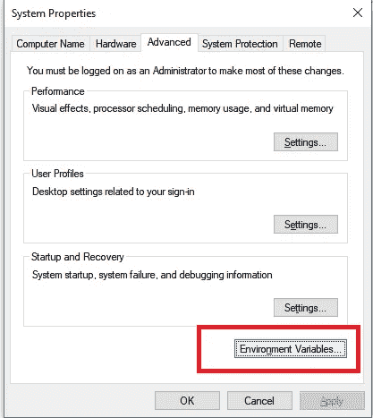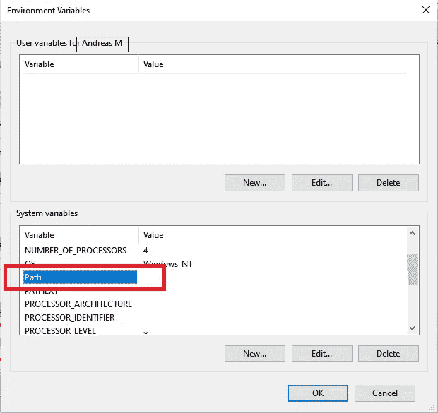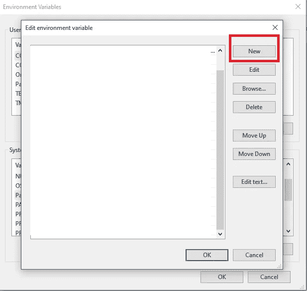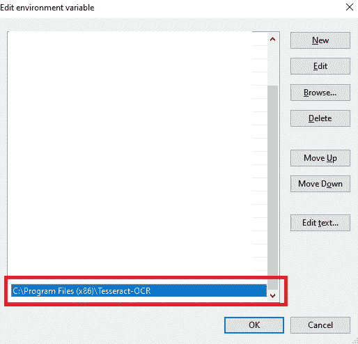

然后点击“确定”

*   如果使用 Ubuntu OS，那么打开终端，运行
    ***sudo apt-get install tesserac t-ocr***

在你的电脑上成功安装了宇宙魔方之后，打开*命令提示符*对于 windows 或者*终端*如果你使用的是 Ubuntu，然后运行:

```
tesseract file_0.png stdout
```

其中**f*ile _ 0 . png*是上图的文件名。我们希望宇宙魔方读取它在上面的图像中找到的任何单词。您应该在终端中看到这些输出:**

```
Warning. Invalid resolution 0 dpi. Using 70 instead.
Estimating resolution as 147
40293847 S565647386e2e91L0
```

哦不！看起来宇宙魔方不能完美地阅读上图中的文字。似乎它误读了一些字符，可能是因为图像中的字体独特而奇怪。幸运的是，你可以训练你的宇宙魔方，让它可以很容易地阅读你的字体。跟着我的脚步走！

> 免责声明，正如 Tesseract 的 wiki 中所述，建议使用默认的“语言”，这种语言已经在 tesseract 的许多数据上进行了训练，并在最后关头训练您自己的*语言*(这意味着，您应该在跳转到训练之前尝试预处理图像、阈值处理和其他图像预处理方法)。这是因为宇宙魔方本身在一般干净的图像上相当准确，并且很难使宇宙魔方的训练预测更准确，除非你的字体非常不同和独特(就像在我们的例子中)，或者如果你试图阅读一些恶魔的语言。

# 安装和数据准备

要训练您的字体，首先，您需要:

1.  安装宇宙魔方*(你不说)*
2.  安装 **jTessBoxEditor** 这个工具用于创建和编辑地面真相来训练宇宙魔方。请注意，您需要 Java 运行时才能打开它，您可以下载[***https://www.java.com/en/download/***](https://www.java.com/en/download/)。安装 Java 之后再在 [***上安装 **jTessBoxEditor** (不是 FX 的)https://SourceForge . net/projects/vietocr/files/jTessBoxEditor***](https://sourceforge.net/projects/vietocr/files/jTessBoxEditor/)***/*** 解压 zip 文件就可以打开 jTessBoxEditor，运行 ***train.bat*** 如果你用的是 Windows，或者

3.  **[ **可选的** ]一个工作 Word Office (Windows)或 LibreOffice (Ubuntu)和。您的字体的 tiff 文件。例如在上面的例子中，我使用的是*OCR——一种扩展的*字体。你可以很容易地从谷歌上下载你的字体(只需搜索 font_name。tiff 下载)。安装您的字体(只需双击。tiff 文件)或者，您最好有一个图像集合，以便以后作为训练数据进行预测。**

**在你准备好上面所有的安装步骤后，你就可以训练你的魔方了。Tesseract 使用“*语言*作为其 OCR 模型。有很多默认语言，像 *eng* (英语)、 *ind* (印尼语)等等。我们试图创造一种新的语言，让宇宙魔方能够预测我们的字体，通过使用我们的字体创建一些由随机数组成的训练数据。有两种方法可以做到这一点。首先，如果你有一个仅由你的字体组成的图像集合，那么你可以使用这种方法，或者第二种方法，即使用你的字体在 word 上键入任何你想要的数字(或字符)，并使用剪切工具(windows)或 *shift 键+ PrintScreen* (Ubuntu)来捕获并将其保存在一个文件夹中。**

**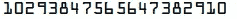**

**训练数据示例**

**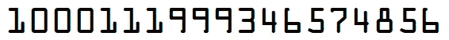**

**训练数据示例**

**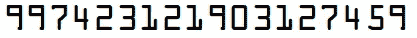**

**训练数据示例**

**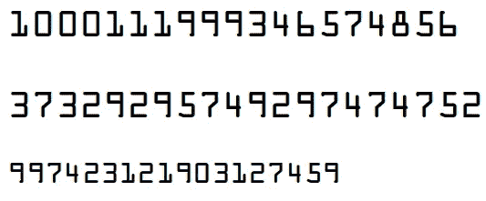**

**多行的训练数据示例**

**根据我的经验，10–15 个数据足以产生一个准确的(*主观)*模型，对于干净和一些有噪声的图像都足够准确。请注意，您应该尝试创建尽可能平衡的数据，并尽可能接近真实案例。如果您想要预测一些蓝色背景、红色字体的图像，那么您应该创建蓝色背景、红色字体的训练数据。**

# **训练宇宙魔方**

**一般来说，宇宙魔方的训练步骤是:**

1.  **将培训数据合并到。使用 jTessBoxEditor 的 tiff 文件**
2.  **通过创建一个. box 文件来创建一个训练标签，该文件包含来自。tiff 文件并修正每个不准确的预测**
3.  **训练宇宙魔方**

# **第一步。合并培训数据**

**创建完一些数据后，打开 ***jTessBoxEditor。*** 在顶栏，进入“工具”→“合并 Tiff”(或者你也可以只使用快捷键 Ctrl *+ M* )。转到保存训练图像的文件夹。将过滤器更改为 PNG(或您的图像的任何扩展名)，选择所有图像，然后单击“确定”。然后在选择面板中，键入 *font_name.font.exp0* ，其中 font_name 是您想要的任何名称(这将是您自己的新*宇宙魔方语言的名称)。***

# **第二步。创建培训标签**

**打开“终端”,导航到存储训练图像的文件夹，然后。tiff 文件。既然我们现在有了训练数据，我们如何得到训练标签呢？恐怕不行，您不应该手动标记每个图像，因为我们可以使用 Tesseract 和 jTessBoxEditor 来帮助我们。在终端中，运行以下命令:**

```
tesseract --psm 6 --oem 3 *font_name.font.exp0.tif font_name.font.exp0 makebox*
```

**等等，为什么突然有了 psm 和 oem？当我键入上面的命令时会发生什么？如果你跑步:**

```
tesseract --help-psm
#or
tesseract --help-oem
```

**您将会看到 psm 表示页面分段模式，即宇宙魔方如何处理图像。如果你想让宇宙魔方把它看到的每张图片都当作一个单词，你可以选择 psm 8。在我们的例子中。tiff 文件是单行文本的集合，我们选择 psm 6。至于 OEM，这意味着 Ocr 引擎模式，至于 tesseract，有通过识别字符模式工作的传统引擎，或者使用神经网络和 LTSM 引擎(如果您想使用 LTSM，请安装 tesseract 版本> 4.0.0)。**

**使用上面的命令，我们希望 tesseract 生成边界框和。tiff 文件，并将其保存到 font_name.font.exp0.box 文本文件中。如果您不知道，我们之前制作的. tiff 文件包含您的按“页面”划分的训练图像。通过使用上面的命令，它将生成一个包含预测的. box 文件，以及。tiff 文件。名为 font_name.font.exp0.box**

**现在打开 jTessBoxEditor，导航到“框编辑器”选项卡，单击“打开”并选择。tiff 文件。您应该看到每个页面上的每个图像都有其边界框和预测。您现在的工作是修复每个边界框及其在。盒子文件。(*没错，这是最无聊的部分*)**

# **第三步。训练宇宙魔方**

**创建了已经修复的。箱文件和。tiff 文件。创建包含以下内容的新文本文档**

```
font 0 0 0 0 0
```

**将其作为 *font_properties* 保存到与。tiff 文件和。盒子文件。现在你已经准备好开始训练了！(*终于*)。在该文件夹中，您应该有所有这些文件:**

**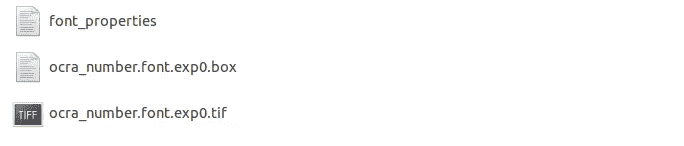**

**现在在终端上运行以下命令:**

```
# Create a .tr file (training file)
tesseract num.font.exp0.tif font_name.font.exp0 nobatch box.train# Create a unicharset file
unicharset_extractor font_name.font.exp0.box# Create a shapetable file
shapeclustering -F font_properties -U unicharset -O font_name.unicharset font_name.font.exp0.tr# Create a pffmtable, intemp file
mftraining -F font_properties -U unicharset -O font_name.unicharset font_name.font.exp0.trecho Clustering..# Create a normproto file
cntraining font_name.font.exp0.tr
```

**如果遇到错误，您可能需要使用 extractor.exe、unicharset_extractor.exe 和 cntraining.exe(对于 windows 用户)。您将在终端中看到一些输出，最重要的是在 shapeclustering 部分。如果您的训练图像包含所有必要的字符，您将看到形状的数量= {您想要的类的数量}。例如，如果我想训练宇宙魔方能够正确读取数字，那么形状的数量等于 10(即 0，1，2，3，…，9)。**

```
Master shape_table:Number of shapes = 10 max unichars = 1 number with multiple unichars = 0
```

**如果您的形状数不等于您想要的类数，您应该返回创建训练数据，并尝试创建更清晰的数据**

**如果你做的一切都是正确的，你会在你的文件夹中看到 4 个主要文件。shapetable、normproto、intemp 和 pffmtable。将这些文件重命名为 *font_name.shapetable，font_name.normproto，font_name.intemp，font_name.pffmtable.***

**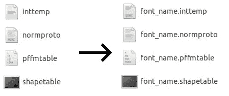**

**然后运行:**

```
combine_tessdata font_name.
```

**运行完上面的所有命令后，您会在文件夹中看到这些文件**

**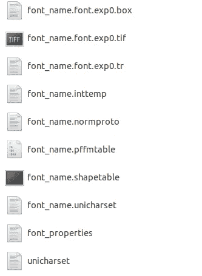**

**现在将***font _ name . trained data***复制到:**

```
C:/Program Files x86/tesseract/4.0/tessdata  # Windowssudo cp /usr/shared/tesseract/4.0/tessdata # ubuntu
```

**你完了！是的，因为我们使用少量的数据，训练本身不需要几个小时，只需要几秒钟或者几分钟。与如果你必须从头开始训练一个深度学习模型(可能使用对象检测模型)相比，这要快得多。现在，下次运行 Tesseract 时，可以使用**

```
tesseract -l font_name file0.png
```

**记得之前用默认语言，上图用默认 Tesseract 引擎的结果是 40293847 S565647386e2e91L0。使用我们新训练的语言，结果是**

```
Warning. Invalid resolution 0 dpi. Using 70 instead.
Estimating resolution as 147
10293847 565647382910
```

**如你所见，结果更加准确。耶！仅用少量训练数据和相对较短的时间，您就创建了一个能够读取独特和奇怪字体的 OCR 模型！**

**为了进一步检查模型的结果，您可以创建另一个。通过使用另一个图像或使用以前的。tiff 文件。打开终端，再次运行:**

```
tesseract -l font_name --psm 6 --oem 3 *font_name.font.exp0.tif font_name.font.exp0 makebox*
```

**现在打开 **jTessBoxEditor →** 框编辑器→打开并选择你的。tiff 文件。检查一下你的模型是否比前一个模型给出了更准确的预测。你应该看到预测提高了很多。**

# **最后的想法**

**"但是如果你想要一个现成的快速 OCR 引擎，宇宙魔方是唯一的选择吗？"你可能会问。当然不是，如果你愿意拿出一些钱，有很多 OCR API 提供者。在我看来，如果您的图像非常干净(例如，一个 word 文档、一张收银单等等), Tesseract 是很好的。如果您的图像数据包含许多噪声，您可以使用阈值来区分背景和噪声与字体本身。根据我的经验，使用少至 10-20 个数据，Tesseract 甚至能够与最先进的对象检测模型竞争，如使用更多数据训练的更快的 R-CNN(也有很多增强)。但是，如果你的图像数据有一些噪声(随机点，脏标记)与你的字体颜色相同，宇宙魔方将无法正确预测你的图像。我说**如果你想尽快建立 OCR 模型，或者你的训练数据有限，你应该使用宇宙魔方**。**

**宇宙魔方的一个主要弱点(我认为)是它很不稳定。我可以通过使用相同图像的更大裁剪来得到不同的结果。同样出于某种原因，如果我使用超过 50 个数据，那么宇宙魔方的性能会更差。嗯，我自己也还在学习。如果你在这篇文章中发现一些错误或误解，请随时联系我。感谢阅读，快乐学习！**

****参考文献:****

**[](https://github.com/tesseract-ocr/tesseract) [## 宇宙魔方-ocr/宇宙魔方

### 这个包包含一个 OCR 引擎——libtesserac t 和一个命令行程序——tesserac t。宇宙魔方 4 增加了一个新的…

github.com](https://github.com/tesseract-ocr/tesseract) [](https://github.com/nguyenq/jTessBoxEditor) [## nguyenq/jTessBoxEditor

### Tesseract OCR 的框编辑器和训练器，提供 Tesseract 2.0x 和 3.0x 格式的框数据编辑和…

github.com](https://github.com/nguyenq/jTessBoxEditor) [](https://medium.com/@gaopengbai0121/training-your-tesseract-on-windows-10-df6756946d4f) [## 在 windows 10 上训练您的宇宙魔方

### Tesseract 是由谷歌实验室开发并由谷歌维护的开源 OCR(光学字符识别)引擎…

medium.com](https://medium.com/@gaopengbai0121/training-your-tesseract-on-windows-10-df6756946d4f) [](https://github.com/tesseract-ocr/tessdoc) [## tesserac-ocr/Tess doc

### 宇宙魔方文档。在 GitHub 上创建一个帐户，为 tesseract-ocr/tessdoc 开发做出贡献。

github.com](https://github.com/tesseract-ocr/tessdoc) [](https://medium.com/@latifvardar/how-does-tesseract-ocr-work-with-python-a6bccf85a002) [## Tesseract-OCR 如何与 Python 协同工作？

### 这篇文章指导你使用 Tesseract OCR、OpenCV 和 Python 从图像中识别字符。

medium.com](https://medium.com/@latifvardar/how-does-tesseract-ocr-work-with-python-a6bccf85a002) [](https://medium.com/better-programming/beginners-guide-to-tesseract-ocr-using-python-10ecbb426c3d) [## 宇宙魔方 OCR 初学者指南

### 基于 Tesseract 和 Python 的光学字符识别

medium.com](https://medium.com/better-programming/beginners-guide-to-tesseract-ocr-using-python-10ecbb426c3d) [](https://nanonets.com/blog/ocr-with-tesseract/#installingtesseract?&utm_source=nanonets.com/blog/&utm_medium=blog&utm_content=%5BTutorial%5D%20OCR%20in%20Python%20with%20Tesseract,%20OpenCV%20and%20Pytesseract) [## [教程 Python 中的 OCR 与 Tesseract、OpenCV 和 Pytesseract

### 光学字符识别。换句话说，OCR 系统转换文本的二维图像，可以…

nanonets.com](https://nanonets.com/blog/ocr-with-tesseract/#installingtesseract?&utm_source=nanonets.com/blog/&utm_medium=blog&utm_content=%5BTutorial%5D%20OCR%20in%20Python%20with%20Tesseract,%20OpenCV%20and%20Pytesseract)**