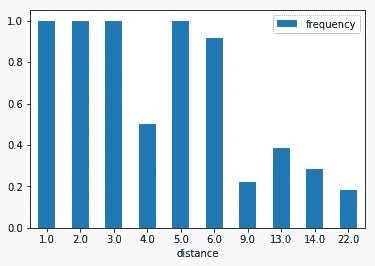

# 简单的实时竞价游戏

> 原文：<https://towardsdatascience.com/simple-real-time-bidding-game-11bd1a7674ef?source=collection_archive---------27----------------------->

## 使用 Pytorch 和一些真实数据一瞥在线广告的实时竞价机制。

照片由[基里尔·沙尔科夫斯基](https://unsplash.com/@sharkovski?utm_source=medium&utm_medium=referral)在 [Unsplash](https://unsplash.com?utm_source=medium&utm_medium=referral) 上拍摄

我们都会在各种网站、社交媒体平台、视频流媒体服务等上看到广告。对于不同的人来说，它们通常是不同的。这是因为网站提供的是广告空间。然后是对空间的竞价，胜出的广告显示在那个位置。无需深入细节，要更好地了解这一过程，请查看这篇文章:

 [## 广告技术简化版:什么是实时竞价，(RTB)？

### 实时竞价指的是在线拍卖过程，其中在线广告投放的购买和出售是在…

medium.com](https://medium.com/@greedy_game/ad-tech-simplified-what-is-real-time-bidding-rtb-8ee9754c3ab8) 

我们将构建一个简单的类似游戏的环境，向用户展示广告，不同的投标人试图优化投标价格。这只是一个例子，实际过程很复杂。我们将使用一个简单的神经网络来评估出价。因此，让我们深入一些编码。

# 种子数据

虽然整个过程是可生成的，但我们将使用一些种子数据以合理的方式进行初始化。我们将使用 Avazu CTR 预测数据集。可以从[这里](https://www.kaggle.com/c/avazu-ctr-prediction/overview)下载。

没有访问网站的唯一用户的明确数据。因此，我们使用(“设备 id”、“设备型号”)来区分各个用户。

在将数据用于游戏之前，我们将首先分析数据，以了解一些简单的趋势。最近的实证研究表明，在线广告的效果不能被 [CTR](https://en.wikipedia.org/wiki/Click-through_rate) 或 [CR](https://en.wikipedia.org/wiki/Conversion_marketing#Conversion_rate) 完全捕捉到。观众通常不会在获得广告印象后立即点击广告(当用户看到一个广告时，它被称为该广告的印象)。他们往往是在抓取多了，对同一个广告的印象多了之后才点击的。

为了捕捉特定广告的这一点(由数据中的“site_id”定义)，我们获取所有获得其印象的用户的数据。然后，对于每个用户，我们找出在点击广告之前走过的距离(访问过的网站)以及在此期间用户获得了多少广告印象。

图片由[叶琳琳·莫迪](https://medium.com/u/7a67061357dc?source=post_page-----11bd1a7674ef--------------------------------)

我们绘制了频率对距离图，其中频率是(印象数)/距离。我们可以看到频率随着距离的增加而降低。

# 创造环境

在我们的例子中，每个用户都拥有每个广告的点击数和浏览量的向量。它还必须在用户查看和点击时更新这些向量。用户还必须根据观看和点击来决定是否点击所显示的广告。

根据视图和点击量，用户可以使用 toss()生成 0-1 点击向量。每当特定用户被展示广告时，为该用户生成“点击”向量。如果赢得投标的广告的“点击”向量是“1”，则假定用户点击了所示的广告。

现在我们需要设置投标人。每个投标人被分配一组广告，每个广告由单个整数标识。

“投标模型”是一种简单的神经网络模型，其作用类似于投标的估计器。每个投标人都有自己的奖励，目标是使其最大化。为此，在“反向预测”函数中，我们将正确的预测定义为奖励和模型的预测点击概率的函数。我们还添加了一些随机事件，以允许模型探索其他可能性。

最后，我们需要一个生成器来创建一个环境，在这个环境中，用户被给予一个位置，投标人投标来赢得这个位置。

# 把东西放在一起

最终的笔记本会是这样的。在示例笔记本中，使用了 avazu 数据集的精简版本。

# 结束语

自从 1980 年在线广告开始以来，它已经经历了许多发展，并且人们不断尝试显示相关的广告。这个游戏只是这个领域大量研究的一小部分。

本文由 [Akhilesh Ravi](https://medium.com/u/a50645071fd?source=post_page-----11bd1a7674ef--------------------------------) 和 [Kaushal Modi](https://medium.com/u/7a67061357dc?source=post_page-----11bd1a7674ef--------------------------------) 联合制作。这是我们数据科学课程项目的一部分。

# 参考

1.  李，K. C .，贾拉里，a .，&达斯丹，A. (2013 年 8 月)。在线广告中具有平滑预算交付的实时出价优化。在*第七届在线广告数据挖掘国际研讨会论文集*(第 1-9 页)。
2.  m .比连科和 m .理查森(2011 年 8 月)。个性化广告的预测客户端配置文件。第 17 届 ACM SIGKDD 知识发现和数据挖掘国际会议论文集*(第 413–421 页)。*
3.  蔡海红，任，张，马利亚斯，王，于，郭，(2017 年 2 月)。展示广告中基于强化学习的实时竞价。第十届 ACM 网络搜索和数据挖掘国际会议论文集(第 661-670 页)。
4.  阿尔查克，n .，米尔洛克尼，V. S .，& Muthukrishnan，S. (2010 年 4 月)。使用 adfactors 挖掘特定广告客户的用户行为。在*第 19 届万维网国际会议记录*(第 31-40 页)。