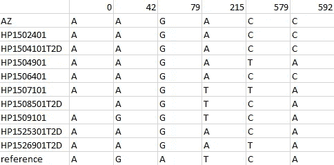

# 下一代测序中 mRNA 的简单重建

> 原文：<https://towardsdatascience.com/simple-reconstruction-of-mrna-from-next-generation-sequencing-rna-seq-c4faaa5da90d?source=collection_archive---------45----------------------->

## 使用 NGS 数据重建二型糖尿病患者和非患者的前胰岛素原 mRNA。


图片由来自 Pixabay 的 Arek Socha 提供

P 个性化/精准医疗:根据患者独特的基因构成开出药物处方的能力。这个概念一直是许多医疗从业者的目标，随着下一代测序(NGS)的进展，个性化医疗有望很快从概念过渡到实践。

世界各地的科学界继续在人类基因组和遗传疾病之间取得新的发现。因此，科学家现在已经产生了比以往任何时候都多的数据，可能为研究人员提供更多证据来联系遗传和疾病之间的关系。

通过利用 RNA-seq 的基因测序数据，一种通过对提取的 m RNA 分子(转录组)进行测序来检查细胞产生的大多数蛋白质的 NGS 方法，我能够重建 10 个不同个体的前胰岛素原的 mRNA 和蛋白质序列，其中 4 个被诊断为二型糖尿病(T2D)。

虽然我检查了前胰岛素原的 mRNA，但读者只需要知道胰岛素是一个复杂的生物过程的最终产物，其中前胰岛素原是这个过程的开始。此外，DNA 被用来制造 mRNA，而 mRNA 可以用来制造蛋白质。

## 步骤 1:获得 NGS 数据和参考基因序列

为了开始这项研究，我从瑞典斯德哥尔摩卡罗林斯卡学院桑德伯格实验室的研究人员那里获得了提交给[欧洲生物信息研究所](https://www.ebi.ac.uk/arrayexpress/experiments/E-MTAB-5061/)的 RNA-seq 数据。(该数据用于 2016 年出版的[细胞](https://www.cell.com/cell-metabolism/fulltext/S1550-4131%2816%2930436-3)。)

接下来，我从 NCBI[获得了所有 4 种已知的前胰岛素原 mRNA 序列变体。这些遗传序列被认为是在大多数个体中发现的*正常*/野生型序列，并将作为与 RNA-seq 数据进行比较的参考序列。](https://www.ncbi.nlm.nih.gov/gene?term=INS%5BGene%5D%20AND%20%22Homo%20sapiens%22%5BOrganism%5D&cmd=DetailsSearch)


**NCBI，4 种前胰岛素原变体:**浅绿色矩形是编码 mRNA 的外显子，而(重叠的)深绿色矩形是蛋白质编码区。从顶部开始，变量依次为 1、2、4 和 3。当匹配/比对来自 RNA-seq 数据的序列时，使用变体 3，因为 mRNA 编码区(浅绿色)覆盖所有其他变体，并且前胰岛素原蛋白序列对于所有变体都是相同的。

## 步骤 2:用 Biopython 加载和排列基因序列

精彩的 [Biopython](https://biopython.org/) 套装让接下来的步骤变得简单了！只需加载数据并将 RNA-seq 数据与参考序列进行比对。然后我把所有的比赛记录在熊猫的数据框里。

```
**# Load FASTQ File(s):**
fastq = SeqIO.parse('RNA-Seq\\' + file, "fastq")**# Local Alignment of Sequences:**
for seq_record in fastq:
    seq = str(seq_record.seq)matches = pairwise2.align.localms(variant_3, seq, 1, -1, -99, -99)**# The numeric arguments of localms() determine the score for each 
# "match". I set my score requirement to 35+ since all sequences are
# 43 nucleotide long. Also, I did not considered matches that 
# changed the reference sequence.**
```

虽然在 RNA-seq 数据中读取的每个核苷酸序列都与测序质量值(FASTQ)相关，但在这种情况下并不相关，因为有大量的比对匹配，其中异常值不会对 mRNA 重建产生任何影响。

## 步骤 3:重建前胰岛素原 mRNA 变体

一旦所有的测序数据都被扫描匹配，我计数所有测序的核苷酸，并提取每个位置最常见的核苷酸，以重建前胰岛素原 mRNA 序列。

```
**# Counting Matched Nucleotides:** count_df = pd.DataFrame(columns= list(range(0, 644)), index= ['A', 'T', 'G', 'C'])**# Getting the columns/nucleotide positions of the DataFrame with the mRNA sequence matches (match_df).
# The len() function will count how many of nucleotides matched in each position and works around needing to change NaN values.** for position in match_df.columns: A_count = len(count_df[count_df[position] == 'A'])  
    T_count = len(count_df[count_df[position] == 'T']) 
    G_count = len(count_df[count_df[position] == 'G']) 
    C_count = len(count_df[count_df[position] == 'C']) count_df.loc['A', int(position)] = A_count   
    count_df.loc['T', int(position)] = T_count 
    count_df.loc['G', int(position)] = G_count  
    count_df.loc['C', int(position)] = C_count
```


**mRNA 重建:**图像显示了所有 10 个个体的 mRNA 重建的前几个核苷酸位置。看看这些重建，大部分的 mRNA 序列是相同的。所有名字后面有“T2D”的人都是二型糖尿病。请注意，虽然此图像从“0”位置开始，但所有遗传数据和信息通常从 1 开始。

## 步骤 4:找出 mRNA 和蛋白质序列之间的差异

既然已经进行了重建，就需要扫描 mRNA 序列中每个位置的任何核苷酸差异。



**mRNA 重建差异:**这些是与每个个体或参考序列存在差异的 mRNA 位置。空的核苷酸单元意味着不存在覆盖该特定个体的核苷酸位置的序列。

只看差异，很明显，人与人之间可能存在许多可能的单一突变。然而，最重要的是，这些 mRNA 位置不位于蛋白质编码区——这意味着一旦 mRNA 被核糖体(翻译)读取，这些差异/变异不会影响前胰岛素原蛋白。蛋白质编码区的范围从位置 239-572(使用我的编号系统为 238-571)，所有这些变异都位于该范围之外。**但是，这并不意味着这些变化不重要！**

下一步是将 mRNA 转化成蛋白质序列。然而，由于所有重建的蛋白质编码区没有差异，转换将导致产生相同的蛋白质序列。

## 最后一步:从生物学角度解释重建

要解释的主要数据是 mRNA 重建之间的差异。虽然变异的 mRNA 位置不在蛋白质编码区内，但它们可能影响其他方面，如 mRNA 转化为前胰岛素原的速率。mRNA 的起始和末端被称为非翻译区(UTRs)，在将 mRNA 信息转化为蛋白质时，它们有助于 mRNA 和核糖体之间的相互作用。除了与核糖体的相互作用，其他蛋白质利用这些区域与 mRNAs 一起执行其他功能。

从该分析中可以得到的第二个认识是，变体 1 是细胞中存在的最普遍的 mRNA 形式(数据未显示)。这是预期的，因为直接转化变体 1 mRNA 序列将产生前胰岛素原的蛋白质序列，而其他变体需要在 mRNA 序列到达核糖体之前对其进行后修饰(选择性剪接)。

## 考虑:样本多样性和不常见的重建

最后要考虑的是细胞/样本来自哪里，来自谁，以及其他可能的 mRNA 重建。

二型糖尿病(T2D)是一种很难确定病因的疾病——它可能源于一个人的遗传、生活习惯、饮食、健康和其他环境因素。但是，棘手的部分在于，它很可能是由任何或所有这些因素造成的。因此，对于这种疾病和其他类似的疾病，遗传学研究可能无法提供一个关于一个人的遗传是否是其疾病的主要原因的结论性答案。在这项分析中，没有提供关于这些人的其他医学信息——因此，在开始这项分析之前，任何关于 T2D 的结论预计都是站不住脚的。

此外，这些个体的基因库也不清楚。这很重要，因为在这项研究中只有 10 个人，这极不可能反映世界上的遗传多样性。然而，令人惊讶的是，所有这些个体都没有产生与 mRNA 位置 80 处的参考序列相同的核苷酸(A80G，前面图像中的“79”)。

最后，对于一些个体来说，可能存在不太常见的 mRNA 重构。然而，我没有对这些重建进行全面的分析，因为最常见的重建与其他重建之间的百分比很可能保持在 2%以下。这些重构的低群体应该不会对胰岛素生产有显著的影响，因为最常见重构的群体将足以满足细胞的需要，如果不太常见的重构一开始就不存在的话。

# 结论

这项研究的目的是以 T2D 为例，从 NGS 数据中重建 mRNA，这是通过与参考序列的比对来完成的。虽然该分析没有显示 10 个个体(有或没有 T2D)之间产生的前胰岛素原蛋白有任何差异，但非蛋白编码区(UTRs)的变异在个体和群体之间是常见的、允许的和可行的突变。

查看我的 GitHub 获取 Python 代码。ipynb)！ ]