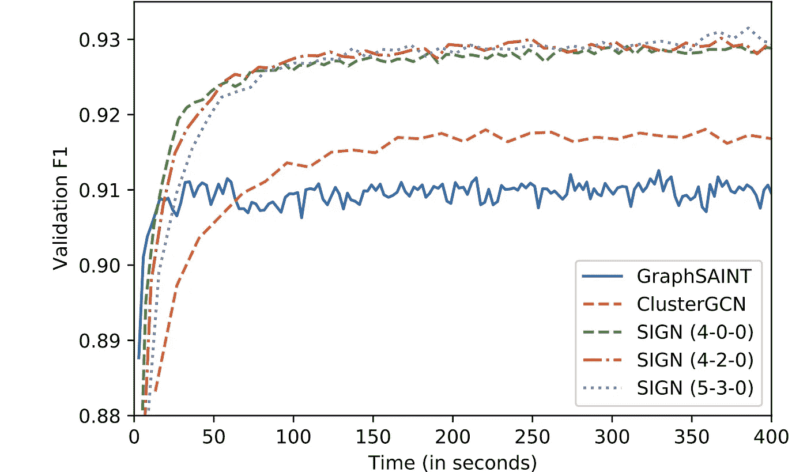

# 简单可扩展图形神经网络

> 原文：<https://towardsdatascience.com/simple-scalable-graph-neural-networks-7eb04f366d07?source=collection_archive---------4----------------------->

## 巨型图上的深度学习

## 到目前为止，阻碍图形神经网络在工业应用中广泛采用的挑战之一是难以将它们扩展到大型图形，如 Twitter follow graph。节点之间的相互依赖性使得将损失函数分解成单个节点的贡献具有挑战性。在这篇文章中，我们描述了一个在 Twitter 上开发的简单的图形神经网络架构，它可以处理非常大的图形。

*本文与* [*法布里索·弗拉斯卡*](https://twitter.com/ffabffrasca?lang=en) *和* [*伊曼纽·罗西*](https://www.emanuelerossi.co.uk/) *合著。*

G 图形神经网络(GNNs)是近年来出现的一类 ML 模型，用于对图形结构数据进行学习。GNNs 已经成功地应用于各种不同领域的关系和相互作用的模型系统，包括社会科学、计算机视觉和图形学、粒子物理、化学和医学。直到最近，该领域的大多数研究都集中在开发新的 GNN 模型并在小图上进行测试(其中 Cora 是一个仅包含约 5K 个节点的引用网络，仍在广泛使用[1])；在处理大规模应用程序方面投入的精力相对较少。另一方面，工业问题经常处理巨型图，例如包含数亿个节点和数十亿条边的 Twitter 或脸书社交网络。文献中描述的大部分方法不适合这些环境。

简而言之，图形神经网络通过聚集来自本地邻居节点的特征来运行。将 *d* 维节点特征排列成一个 *n* × *d* 矩阵 **X** (这里 *n* 表示节点的数量)，在流行的 [GCN 模型](http://tkipf.github.io/graph-convolutional-networks/) [2]中实现的对图的最简单的类似卷积的操作将逐节点变换与跨相邻节点的特征扩散相结合

**Y** = ReLU( **AXW** )。

这里 **W** 是一个跨所有节点共享的可学习矩阵， **A** 是一个线性扩散算子，相当于邻域中特征的加权平均[3]。这种形式的多层可以像在传统的 CNN 中那样按顺序应用。图形神经网络可以被设计成在节点(例如，用于诸如检测社交网络中的恶意用户的应用)、边(例如，用于链接预测，推荐系统中的典型场景)或整个图形(例如，预测分子图形的化学属性)的级别进行预测。例如，可以通过以下形式的两层 GCN 来执行逐节点分类任务

**Y**= soft max(**A**ReLU(**AXW**)**W**’)。

W 为什么标度图神经网络具有挑战性？在前述的逐节点预测问题中，节点扮演样本的角色，GNN 在样本上被训练。在传统的机器学习设置中，通常假设样本是以统计独立的方式从某个分布中抽取的。这反过来允许将损失函数分解成单个样本贡献，并采用随机优化技术，一次处理训练数据的小子集(小批量)。实际上，现在每个深度神经网络架构都是使用小批量来训练的。

另一方面，在图中，节点通过边相互关联的事实在训练集中的样本之间产生了统计相关性。此外，由于节点之间的统计相关性，采样会引入偏差，例如，它会使一些节点或边比训练集中的其他节点或边出现得更频繁，这种“副作用”需要适当的处理。最后但并非最不重要的一点是，必须保证采样后的子图保持一个 GNN 可以利用的有意义的结构。

在许多关于图形神经网络的早期工作中，这些问题被掩盖了:GCN 和切布内[2]、莫奈[4]和加特[5]等架构是使用整批梯度下降来训练的。这导致了在内存中保存图的整个邻接矩阵和节点特征的必要性。结果，例如，一个 *L* 层 GCN 模型具有时间复杂度𝒪( *Lnd* )和内存复杂度*𝒪*(*lnd+LD*)【7】，即使对于中等大小的图也是禁止的。

解决可伸缩性问题的第一份工作是 GraphSAGE [8]，这是 Will Hamilton 和合著者的开创性论文。GraphSAGE 使用邻域采样结合小批量训练来在大型图上训练 gnn(缩写 SAGE 代表“样本和集合”，是对该方案的引用)。主要思想是，为了计算具有 *L* 层 GCN 的单个节点上的训练损失，只有该节点的 *L* 跳邻居是必要的，因为图中更远的节点不包括在计算中。问题是，对于“[小世界](https://en.wikipedia.org/wiki/Small-world_network#:~:text=A%20small%2Dworld%20network%20is,number%20of%20hops%20or%20steps.)”类型的图，比如社交网络，一些节点的 2 跳邻居可能已经包含数百万个节点，这使得它太大而无法存储在内存中[9]。GraphSAGE 通过对邻居进行采样直到第 *L* 跳来解决这个问题:从训练节点开始，它均匀采样，替换[10]固定数量的 *k* 个 1 跳邻居，然后对于这些邻居中的每一个，它再次采样 *k* 个邻居，以此类推 *L* 次。这样，对于每一个节点，我们保证有一个有界的 *L* 跳的𝒪( *kᴸ* 节点的采样邻域。如果我们随后构造一批具有 *b* 个训练节点的节点，每个节点都有其自己独立的 *L* 跳邻域，我们得到一个独立于图大小 *n* 的𝒪( *bkᴸ* 的记忆复杂度。一批 GraphSAGE 的计算复杂度为𝒪(*bld*t30】kᴸ。

*graph sage 的邻域抽样程序。从全图中对一批 b 节点进行子采样(在本例中，b=2，红色和浅黄色节点用于训练)。在右边，用 k=2 采样的 2 跳邻域图，其被独立地用于计算嵌入，并因此计算红色和浅黄色节点的损失。*

GraphSAGE 的一个显著缺点是采样节点可能会出现多次，因此可能会引入大量冗余计算。例如，在上图中，深绿色节点出现在两个训练节点的 *l* 跳邻域中，因此它的嵌入在批处理中被计算两次。随着批量 *b* 和样本数量 *k* 的增加，冗余计算的数量也增加。此外，尽管每批内存中都有𝒪( *bkᴸ* 节点，但损失仅在其中的 *b* 节点上计算，因此，其他节点的计算在某种意义上也是浪费的。

多项后续工作集中于改善小批量的抽样，以消除 GraphSAGE 的冗余计算，使每批更有效。这个方向上最近的工作是 ClusterGCN [11]和 GraphSAINT [12]，它们采用了*图采样*的方法(与 GraphSAGE 的邻域采样相反)。在图采样方法中，对于每一批，原始图的子图被采样，并且完整的类 GCN 模型在整个子图上运行。挑战在于确保这些子图保留大部分原始边，并且仍然呈现有意义的拓扑结构。

ClusterGCN 通过首先对图进行聚类来实现这一点。然后，在每一批中，在一个集群上训练该模型。这使得每批中的节点尽可能紧密地连接在一起。

GraphSAINT 提出了一种通用概率图采样器，通过采样原始图的子图来构造训练批次。图形采样器可以根据不同的方案进行设计:例如，它可以通过使用随机行走计算节点的重要性并将其用作采样的概率分布来执行均匀节点采样、均匀边采样或“重要性采样”。

同样值得注意的是，采样的优势之一是，在训练期间，它充当一种边缘方向的丢失，这使模型正规化，并有助于性能[13]。然而，边缘丢失需要在推理时仍然看到所有的边缘，这在这里是不可行的。图形采样的另一个效果可能是减少瓶颈[14]和由邻域的指数扩展导致的“过度挤压”现象。

在我们最近与 Ben Chamberlain、Davide Eynard 和 Federico Monti [15]合作的论文中，我们研究了为节点分类问题设计简单、免采样架构的可能性。你可能想知道，鉴于我们刚刚在上面强调的间接好处，为什么人们宁愿放弃抽样策略。这有几个原因。首先，节点分类问题的实例可能彼此显著不同，并且据我们所知，迄今为止没有工作系统地研究了当采样实际上提供除了仅仅减轻计算复杂性之外的积极效果时的*。其次，采样方案的实施带来了额外的复杂性，我们认为简单、强大、免采样、可扩展的基线架构很有吸引力。*

我们的方法是由几个最近的经验发现所激发的。首先，简单的固定聚合器(如 GCN)在许多情况下表现往往优于更复杂的聚合器，如 GAT 或 MPNN [16]。第二，虽然深度学习的成功建立在有很多层的模型上，但在图形深度学习中，是否需要深度仍然是一个公开的问题。特别是，Wu 和合著者[17]认为具有单个多跳扩散层的模型可以与具有多个层的模型性能相当。

通过在单个卷积层内组合不同的、固定的邻域聚合器，有可能获得一个极其可扩展的模型，而无需诉诸图形采样[18]。换句话说，所有与图相关的(固定的)操作都在体系结构的第一层，因此可以预先计算；然后，预聚合的信息可以作为输入提供给模型的其余部分，由于缺乏邻域聚合，该模型可以归结为一个多层感知器(MLP)。重要的是，通过使用几个可能专门的和更复杂的扩散算子，即使使用这样的浅层卷积方案，图过滤操作中的表达性仍然可以保留。例如，可以设计操作符来包含[局部子结构计数](/beyond-weisfeiler-lehman-using-substructures-for-provably-expressive-graph-neural-networks-d476ad665fa3)【19】或图形主题【20】。

*SIGN 架构包括一个类似 GCN 的层，该层具有可能作用于多跳邻域的多个线性扩散算子，随后是逐节点应用的 MLP。其效率的关键是扩散特征的预先计算(用红色标记)。*

所提出的可扩展架构，我们称之为可扩展的类初始图网络(SIGN ),对于节点分类任务具有以下形式:

**y**= soft max(relu(**xw**₀**| a**₁**xw**₁**| a**₂**xw**₂**|…| a***ᵣ***xw***ᵣ***w**’)

这里**a**t24】ᵣ是线性扩散矩阵(例如归一化的邻接矩阵、其幂或基序矩阵)并且**w**t28】ᵣ和 **W** 是可学习的参数。如上图所示，通过增加节点层，网络可以变得更深，

**y**= soft max(relu(…relu(**xw**₀**| a**₁**xw**₁**|…| a***ᵣ***xw***ᵣ*)**w**')…**w**' ')

最后，当对同一扩散算子采用不同的幂时(如**a**₁=**b**t56】，A ₂= **B** 等)。)，图操作有效地在越来越远的跳中从邻居聚集，类似于在同一网络层中具有不同感受域的卷积滤波器。这种与经典 CNN 中流行的 inception 模块的类比解释了所提出的架构的名称[21]。

如上所述，上述等式中的矩阵乘积 **A** ₁ **X** ，…，**a***ᵣ***x**不依赖于可学习的模型参数，因此可以预先计算。特别是，对于非常大的图形，可以使用 Apache Spark 等分布式计算基础设施来有效地扩展这种预计算。这有效地将整个模型的计算复杂度降低到 MLP 的计算复杂度。此外，通过将扩散移至预计算步骤，我们可以从*所有*邻居聚集信息，避免采样以及可能的信息丢失和随之而来的偏差【22】。

SIGN 的主要优势是其可扩展性和效率，因为它可以使用标准的小批量梯度下降来训练。我们发现我们的模型在推理时间上比 ClusterGCN 和 GraphSAINT 快两个数量级，同时在训练时间上也快得多(所有这些都保持了与最先进的 GraphSAINT 非常接近的准确性性能)。

不同方法在 OGBN-Products 数据集上的收敛性。与 GraphSaint 和 ClusterGCN 相比，SIGN 的变体收敛更快，验证 F1 分数更高。

*OGBN-Products 数据集上不同方法的预处理、训练和推理时间(秒)。虽然预处理速度较慢，但 SIGN 的训练速度更快，推理时间比其他方法快近两个数量级。*

此外，我们的模型支持任何扩散算子。对于不同类型的图形，不同的扩散操作符可能是必要的，我们发现一些任务受益于基于基元的操作符，如三角形计数。

*SIGN 和其他可扩展方法在一些流行数据集上对节点分类任务的性能。基于三角形主题的扩散算子在 Flickr 上提供了有趣的性能增益，并在 PPI 和 Yelp 上提供了一些改进。*

尽管只有一个图卷积层和线性扩散算子的限制，SIGN 在实践中表现非常好，达到与更复杂的模型相当甚至更好的结果。鉴于其速度和实现的简单性，我们设想 SIGN 是一种用于大规模应用的简单基线图学习方法。也许更重要的是，这样一个简单模型的成功引出了一个更基本的问题:[我们真的需要深度图神经网络](/do-we-need-deep-graph-neural-networks-be62d3ec5c59#dd10-e43ce4231f64)？我们推测，在社交网络和“小世界”图的许多学习问题中，我们应该使用[更丰富的局部结构](/beyond-weisfeiler-lehman-using-substructures-for-provably-expressive-graph-neural-networks-d476ad665fa3)而不是诉诸蛮力深度架构。有趣的是，传统的 CNN 架构按照相反的趋势发展(更深的网络和更小的滤波器),因为它具有计算优势，并且能够将复杂的功能组合成简单的功能。我们不确定同样的方法是否适用于图，在图中，组合性要复杂得多(例如，某些结构不能通过消息传递来计算，无论网络有多深)。当然，还需要更精细的实验来验证这个猜想。

[1]最近推出的[开放图形基准](https://ogb.stanford.edu/)现在提供具有数百万个节点的大规模图形。社区可能需要一段时间才能转用它。

[2] T. Kipf 和 M. Welling，[用图卷积网络进行半监督分类](https://arxiv.org/pdf/1609.02907.pdf) (2017)。继续。ICLR 引入了流行的 GCN 架构，该架构是对 M. Defferrard 等人提出的 ChebNet 模型的简化(2016)。继续。乳头。

[3]作为扩散算子，Kipf 和 Welling 使用具有自循环的图邻接矩阵(即，节点本身有助于其特征更新)，但是其他选择也是可能的。可以使扩散操作依赖于形式为 **A** ( **X** ) **X** (即，它仍然是节点特征的线性组合，但是权重取决于特征本身)的特征，如在 MoNet [4]或 GAT [5]模型中，或者完全非线性，****x**，如在消息传递神经网络(MPNN) [6]中。为简单起见，我们集中讨论应用于节点分类的 GCN 模型。**

**[4] F. Monti 等人，[利用混合模型 CNN 对图和流形进行几何深度学习](https://openaccess.thecvf.com/content_cvpr_2017/html/Monti_Geometric_Deep_Learning_CVPR_2017_paper.html) (2017)。进行中。CVPR。**

**[5]p . veli kovi 等人，[图形注意网络](https://arxiv.org/abs/1710.10903) (2018)。进行中。ICLR。**

**[6] J. Gilmer 等人，[量子化学的神经信息传递](https://arxiv.org/abs/1704.01212) (2017)。进行中。ICML。**

**[7]这里为了简单起见我们假设图是稀疏的，边数为|[*ℰ*](https://en.wikipedia.org/wiki/%E2%84%B0)|=𝒪(*n*。**

**[8] W. Hamilton 等人，[大型图上的归纳表征学习](https://arxiv.org/abs/1706.02216) (2017)。进行中。神经炎。**

**[9]在这样的图中，邻居的数量随着邻居的扩展而呈指数增长。**

**[10]带有替换的采样意味着一些邻居节点可能出现不止一次，特别是如果邻居的数量小于 k 时。**

**[11] W.-L. Chiang 等人， [Cluster-GCN:一种训练深度和大型图卷积网络的高效算法](https://arxiv.org/abs/1905.07953) (2019)。进行中。KDD。**

**[12] H. Zeng 等， [GraphSAINT:基于图抽样的归纳学习方法](https://arxiv.org/abs/1907.04931) (2020)在 Proc .ICLR。**

**[13] Y. Rong 等.【DropEdge:面向节点分类的深度图卷积网络 (2020)。进行中。ICLR。一种类似于丢弃的想法，其中在训练期间使用边的随机子集。**

**[14] U. Alon 和 E. Yahav，[关于图形神经网络的瓶颈及其实际意义](https://arxiv.org/pdf/2006.05205.pdf) (2020)。arXiv:2006.05205。确定了图形神经网络中的过度挤压现象，这类似于在顺序递归模型中观察到的现象。**

**[15]弗拉斯卡等人，[符号:可扩展的初始图神经网络](https://grlplus.github.io/papers/77.pdf) (2020)。ICML 图形表示学习研讨会。**

**[16] O. Shchur 等人[图神经网络评估的陷阱](https://arxiv.org/pdf/1811.05868.pdf) (2018)。关系表征学习工作坊。显示简单的 GNN 模型与更复杂的模型表现相当。**

**[17] F. Wu 等，[简化图形神经网络](https://arxiv.org/abs/1902.07153) (2019)。进行中。ICML。**

**[18]虽然我们强调，为了计算效率，SIGN 不需要采样，但是还有其他原因说明图形子采样为什么有用。j .克利茨佩拉等人[扩散改善图形学习](https://arxiv.org/pdf/1911.05485.pdf) (2020)。继续。NeurIPS 表明，采样扩散矩阵提高了图形神经网络的性能。我们在早期的符号实验中观察到了同样的现象。**

**[19] G. Bouritsas 等[通过子图同构计数提高图神经网络表达能力](https://arxiv.org/abs/2006.09252) (2020)。arXiv:2006.09252。展示了如何通过结构节点编码获得强大的 gnn。**

**[20] F. Monti，K. Otness，M. M. Bronstein， [MotifNet:一种基于 motif 的图卷积网络，用于有向图](https://arxiv.org/pdf/1802.01572) (2018)。arXiv:1802.01572。使用基于基元的扩散算子。**

**[21] C. Szegedi 等人，[用卷积进行更深入的研究](https://arxiv.org/abs/1409.4842) (2015)。继续。CVPR 在经典的 Google LeNet 架构中提出了 inception 模块。公平地说，我们并不是第一个想到图初始模块的人。我们的合作者来自慕尼黑工业大学的 Anees Kazi 是去年帝国理工学院的访问学生，她首先介绍了他们。**

**[22]注意，到达更高阶的邻居通常是通过与直接邻居一起操作的深度堆叠图卷积层来实现的；在我们的架构中，这是在第一层通过图操作符的能力直接实现的。**

***符号* [*工具*](https://pytorch-geometric.readthedocs.io/en/latest/_modules/torch_geometric/transforms/sign.html) *选项可用* [*PyTorch 几何*](https://pytorch-geometric.readthedocs.io/en/latest/index.html) *。本帖的* [*中文翻译*](https://www.infoq.cn/article/5BhpycIuVVcO4KvMtQGs) *由* [*刘止庸*](https://medium.com/@zhiyongliu) *提供。对图形深度学习感兴趣？关于图形深度学习的其他文章，请参见我的* [*博客*](https://towardsdatascience.com/graph-deep-learning/home) *关于走向数据科学，* [*订阅*](https://michael-bronstein.medium.com/subscribe) *到我的帖子，获取* [*中等会员*](https://michael-bronstein.medium.com/membership) *，或者关注我的*[*Twitter*](https://twitter.com/mmbronstein)*。***