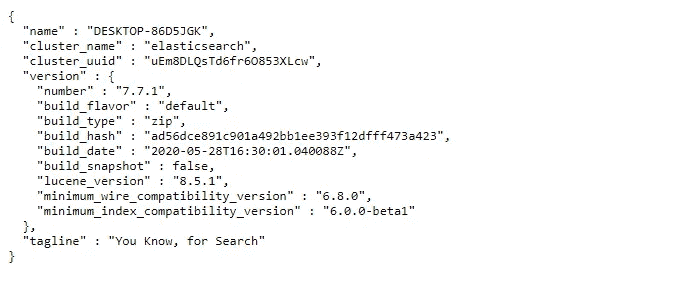
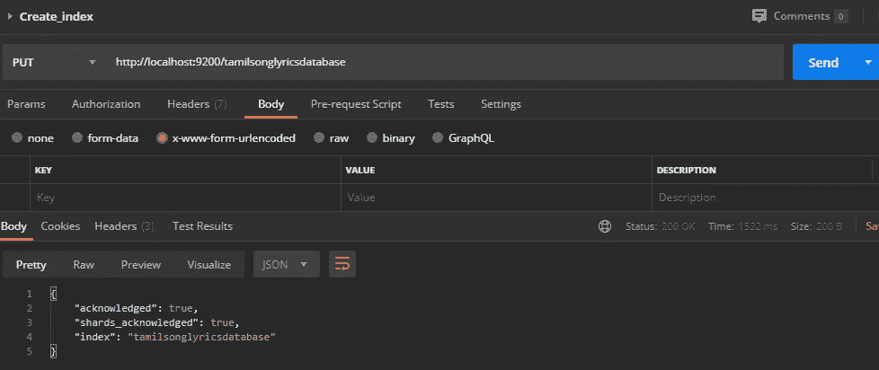
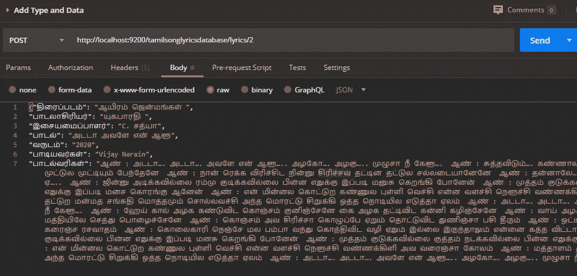
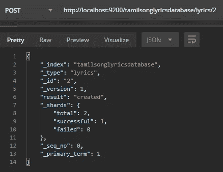
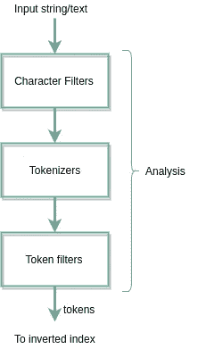
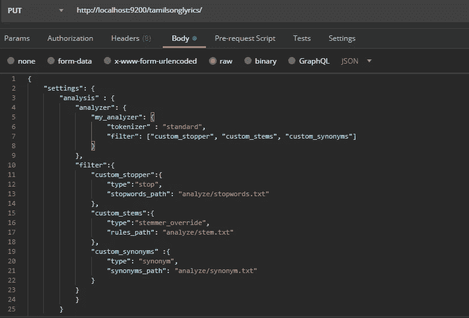
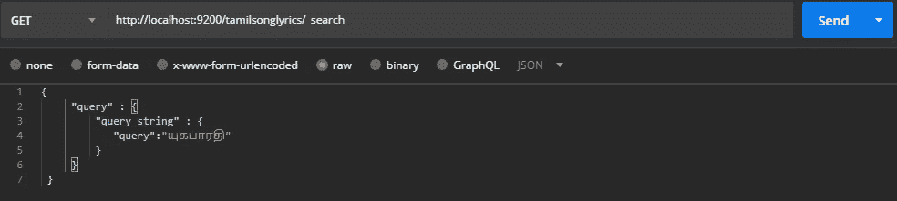
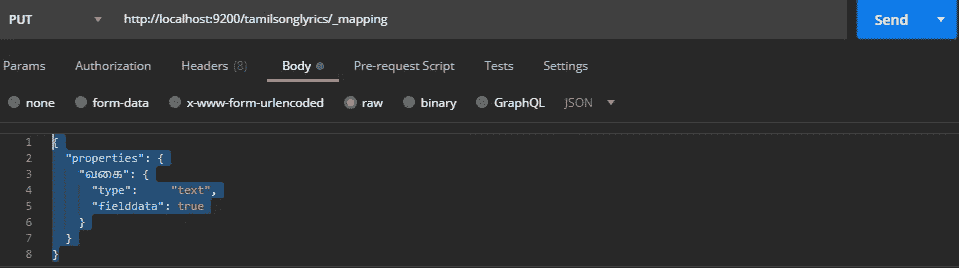

# 具有弹性搜索的简单搜索引擎

> 原文：<https://towardsdatascience.com/simple-search-engine-with-elastic-search-d36086591d26?source=collection_archive---------7----------------------->

## 从头开始构建泰米尔歌词搜索


图 1:作者解释的弹性叠加

## 弹性堆叠

Elastic Stack 是来自 [*Elastic*](https://www.elastic.co/) 的一组开源产品，旨在帮助用户从任何类型的来源以任何格式获取数据，并实时搜索、分析和可视化这些数据。

*   Elasticsearch 是一个 RESTful 分布式搜索引擎。它基于 Java，可以搜索和索引不同格式的文档文件。
*   Kibana 是一个开源的数据可视化和探索工具，专门用于大量的流和实时数据。该软件通过其图形表示，使庞大而复杂的数据流变得更加容易和快速理解。

还有一些其他的产品。 ***logstash*** 和 ***节拍*** 。博客的目的是通过配置一个非常简单的歌词搜索引擎来指导读者，特别是对于使用 ElasticSearch 的泰米尔人。

## 先决条件

> [歌词语料库](https://github.com/VivekVinushanth/TamilSongsLyricsCorpus) → *需要添加的歌词数据*
> [邮递员](https://www.postman.com/downloads/) → *测试 API 调用*
> 
> [ElasticSearch](https://www.elastic.co/downloads/elasticsearch) → *带 API 的搜索引擎*
> 
> [样本歌词搜索引擎](https://github.com/VivekVinushanth/TamilSongsLyricSearhEngine) →包含 lyricsdata、UI [HTML/CSS]和 python 脚本，用于 FLASK 的后端支持

# 要遵循的步骤

## 数据抓取

*   在构建歌词搜索引擎之前，必须收集歌词数据。www.tamilpaa.com 是一个收集了电影名、歌手和音乐导演的歌词的网站。泰米尔语歌词的必要性和数据量(3200+歌词可刮擦)使得使用特定网站作为爬虫主机成为必要。
*   曾经用[***scrapy***](https://scrapy.org/)写了一个网络爬虫，从网站上抓取原始数据。[爬虫](https://github.com/VivekVinushanth/TamilSongsLyricsCorpus/blob/master/Tamilsongs_lyric_crawler.ipynb)是回购中可用的 colab 笔记本。

```
Raw_Data : The data scraped directly from the website. Stored in different folders, categorized based on year.
  ├── Tamil_movie_song_lyrics_2017
  ├── Tamil_movie_song_lyrics_2018
  ├── Tamil_movie_song_lyrics_2019
  ├── Tamil_movie_song_lyrics_2020
  ├── Tamil_movie_song_lyrics_random_2300+ 

PreProcessedData : The data has to be pre-processed(convert to Tamil) for values of some fields were in English(E.g. A.R.Rahman => A. R. ரஹ்மான்)

ModifiedData : The data was modified by adding more fields to spice up search ("வகை","நுகர்ச்சி","மதிப்பீடு") -('genre','views','ratings')
```

# 配置弹性搜索

## 第一步

下载[***elastic search***](https://www.elastic.co/downloads/elasticsearch)，有多种格式，包括 ZIP 和 TAR.GZ 格式，解压文件夹。打开一个命令行工具，遍历到 elasticsearch 的 bin 文件夹，然后运行“elasticsearch”命令。

```
C:\Users\cvvin>cd C:\Users\cvvin\Desktop\Notes\elasticsearch-7.7.1\binC:\Users\cvvin\Desktop\elasticsearch-7.7.1\bin>elasticsearch
```

“elasticsearch”命令将在 localhost 中托管 elasticsearch。默认端口是 9200。

## 第二步

打开 web 浏览器并粘贴以下 URL，检查 elasticsearch 搜索服务器是否启动并运行。

```
http://localhost:9200/
```

结果必须类似于下图。



图 2 .检查 ElasticSearch 服务器启动时的结果——由作者截取

请注意，默认端口是 9200，可以更改。在弹性搜索中遍历到 config 文件夹。打开“config.yml”文件，根据需要编辑端口号。

```
http.port: 9300
```

## 第三步

下载[邮差](https://www.postman.com/downloads/)如果你还没有。Postman 是一个专门用来测试别人或者你自己开发的 RESTful API 的工具。

## **步骤 4**

*   Elasticsearch 类似于一个数据库。下面是一个比较 ElasticSearch 和更一般的关系数据库的类比。

```
Elastic Search => Mysql
Index => Database
Types => Tables
Properties => Columns
Documents => Rows
```

*   索引就像一组键，隐含着指向搜索查询中的术语的指针。索引将由一个或多个文档组成。ElasticSearch 使用一个**倒排索引**，它将一个以页面为中心的数据结构倒排到一个以关键字为中心的数据结构。
*   我们可以使用 PUT 请求创建索引。这里我选择了'*Tamil songlyricsdatabase*'作为索引名。

```
http://localhost:9200/tamilsonglyricsdatabase
```



图 3 .使用 Postman 屏幕在 ElasticSearch 中创建新索引——由作者捕获

并且响应将类似于上图中的内容(图 3)。如果索引已经存在于 ElasticSearch 中，服务器将抛出一个引用现有索引的错误。

## 第五步

我们现在可以使用 POST 请求创建类型(即数据库中的表)和添加文档(即数据)。 ***文档*** 是搜索和索引的单位，由一个或多个字段组成。

*   我选择了 ***“歌词”*** 作为文档类型，选择了“***2”***作为文档 ID。将歌词数据作为 **JSON** 添加到帖子请求的 ***正文部分*** 如下图所示(Fi.4\. |左)。可以从[语料库](https://github.com/VivekVinushanth/TamilSongsLyricsCorpus)中获取歌词数据。

```
[http://localhost:9200/tamilsonglyrics/lyrics/](http://localhost:9200/tamilsonglyrics/lyrics/2)2
```



图 4\. ( **左**)将文档添加到索引屏幕-由作者捕获| ( ***右*** )响应屏幕-由作者捕获

*   在图 4(左)中，显示的 JSON 是文档。蓝色的是字段，粉色的是这些字段的相关值。
*   如果对添加文档的响应如图 4 所示，则可以从响应中验证成功添加了文档(右图)
*   但是像这样手动添加几个 JSONs 将会是一项繁忙的任务，而且成本很高。因此，弹性搜索有了“批量 API”的帮助，我们可以在一次 API 调用中添加大量文档。
*   要通过 BulkAPI 添加文档，需要将我通过抓取网站收集的所有单个 JSON 转换成一个 BulkJSON。 [***这里***](https://github.com/VivekVinushanth/TamilSongsLyricSearhEngine/tree/master/corpus) ***(年份 2017，2018，2019)*** 你可以找到三个这样的 BulkJSONs。但是需要添加一个小的 python 脚本来修改我收集的数据，并使用 Python 通过 BulkAPI 添加数据。
*   必须在当前的 python 解释器中添加 elasticsearch，elasticsearch_dsl。

```
pip install elasticsearchpip install elasticsearch-dsl
```

一旦添加了库，现在就可以运行 python 脚本了。

> 如果您已经克隆了 repo 并且更喜欢尝试，只需运行***bulk data . py .****否则，如果您在读取文件和添加任何字符替换时有自己的数据和操作，请尝试修改下面的脚本。还可以使用 python 和 elasticsearch 库创建索引、添加文档和搜索。*

bulkdata.py 可从[作者的 github](https://github.com/VivekVinushanth/TamilSongsLyricSearhEngine/blob/master/bulkdata.py) 获得

*   获取 python 脚本***‘bulk data . py***’来添加索引(如果之前没有添加，取消对索引部分的注释)。并通过运行脚本向 BulkAPI 添加文档。修改“索引”名称以适合您的名称，并运行 python 脚本。将数据添加到一个文件夹(如 corpus ),并在`read_all_songs()`方法中更新路径。如果您想要添加更多文档，请将它们添加到同一个文件夹中并运行脚本。对于抓取的数据，我已经相应地定义了字段。但是，如果您对数据进行了任何更改，请在`genData()`方法中添加相同的字段。

通过这些步骤，我们将能够成功上传数据，并可以搜索歌词。

## 高级索引

但是另外，您可以设置现有的分析器或定制的分析器来支持更有效的索引。必须创建一个定制的分析器，结合适当的[字符过滤器](https://www.elastic.co/guide/en/elasticsearch/reference/current/analysis-charfilters.html)、[记号赋予器](https://www.elastic.co/guide/en/elasticsearch/reference/current/analysis-tokenizers.html)和[记号过滤器](https://www.elastic.co/guide/en/elasticsearch/reference/current/analysis-tokenfilters.html)。



图 5 . Arun Mohan 的博客[中弹性搜索的文本分析](https://medium.com/elasticsearch/introduction-to-analysis-and-analyzers-in-elasticsearch-4cf24d49ddab)

> 一个**字符过滤器**接收作为字符流的原始文本，并可以通过添加、删除或改变字符来转换该流。
> 
> 一个 ***记号赋予器*** 接收一个字符流，将其分解成单独的*记号*(通常是单独的单词)，并输出一个*记号流。*
> 
> **记号过滤器**接受来自[记号赋予器](https://www.elastic.co/guide/en/elasticsearch/reference/current/analysis-tokenizers.html)的记号流，并且可以修改记号(例如小写)，删除记号(例如删除停用词)或者添加记号(例如同义词)。

我已经创建了一个自定义分析器，你可以从 [***这里***](https://github.com/VivekVinushanth/TamilSongsLyricSearhEngine/tree/master/analyzers) 得到。并遍历到机器中 ElasticSearch 的 config 文件夹。

```
elasticsearch-7.7.1\config
```

*   创建一个名为“analyze”的文件夹，并添加您从 repo 中获取的文件。

```
elasticsearch-7.7.1\config\analyze\
```

定制分析仪包括

> 1.标准记号化器→它在单词边界上将文本分成术语，并删除大部分标点符号。对于任何语言来说，它都是最常用的标记符。因此我们坚持使用这个记号化器。
> 
> 2.自定义过滤器，包括
> 
> **自定义阻止符** →包含 Tamil(Like:ஒரு、என்று、மற்றும்、இந்த、இது、என்ற、கொண்டு的停用词，这些词在 Thamizh 中非常常见，但在搜索中可以忽略，因为它们通常不会为搜索提供任何特定的意义。
> 
> **自定义词干** →词干是提供单词的词干。例如，在英语中，我们可以用“播放，播放，播放器”→ **播放**。通常蒸可以用动词。在塔米兹我们也能阻止。比如“உண்ண、உண்டு、உண்டேன்、உண்கிறேன்、உண்பேன்、உண்ணும்”→**உண்**
> 
> **自定义匿名** →可以添加匿名词，这样我们可以减少各种索引的数量，从而提高索引和搜索的效率。比如“மிகச்சிறந்த、மிகசிறந்த,மிகவும்சிறப்பான、சிறப்பான、தலைசிறந்த、உயர்ந்த”→**சிறந்த**

添加“分析器”文件夹(包含 stem.txt、stopwords.txt、synonym.txt)后，需要创建(新的)索引，包括以下示例 JSON 作为主体。



图 6 .添加定制分析器屏幕——由作者捕获

# 示例搜索查询

我们已经看到了添加文档、添加批量数据、添加定制分析器，现在我们可以继续搜索查询。下面的例子可以用 Postman 试试。

*   **基本搜索** —用户可以只进行搜索，而无需将任何必需的信息添加到搜索获取请求的正文中。

```
http://localhost:9200/tamilsonglyrics/_search
```

*   如果用户只知道电影/年份/歌手/作词人/流派，他可以搜索歌词。将下面的代码片段作为正文添加到 Postman GET 请求中。在所提供的例子中，`யுகபாரதி` 是一个作词人，他想检索他写的歌词。我们可以通过在查询中提到电影的名称来搜索特定电影的歌词。我们可以通过在查询中提及特定的风格来搜索某个风格的歌词。

> 例如-“யுகபாரதி”

```
{
    "query": {
        "query_string": {
            "query":"யுகபாரதி"
        }
    }
}
```



图 7 .简单搜索查询屏幕——由作者捕获

*   当用户知道电影/年份/歌手/作词人/流派时，他可以搜索指定该领域的歌词，这与上面提到的广泛搜索相反。这是一个**匹配查询。**这里的`பாடலாசிரியர்(lyricist)`是与用户正在搜索的搜索词`யுகபாரதி`相关的字段。与在特定字段中搜索相比，这种搜索将减少在每个字段中搜索查询词的开销。这将提高搜索的持续时间。

> 例如-“பாடலாசிரியர்யுகபாரதி”

```
{
     "query" : {
          "match" : {
             "பாடலாசிரியர்" : "யுகபாரதி"
         }
     }
 }
```

*   **通配符查询**帮助用户即使有拼写错误也能进行搜索。当用户不确定作词人的全名`*யுகபாரதி*` *，*时，他可以使用`யுக*` 作为通配符进行搜索。ElasticSearch 将带来与通配符匹配的高分结果。

> *如“யுகபாரதி”的“யுக*”*

```
"query" : {
         "match" : {
            "பாடலாசிரியர்" : "யுக*"
        }
    }
}
```

*   多匹配查询允许在一个以上的特定字段中搜索一个术语。这里`*அனிருத்*` 预期出现在`பாடியவர்கள்(singers)` 和`இசையமைப்பாளர்(Music director)`的一个或两个字段中

> *例如——《அனிருத்》*

```
{
      "query" : {
         "multi_match" : {
             "query" : "அனிருத்",
             "fields": ["பாடியவர்கள்","இசையமைப்பாளர்"]
         }
     }
}
```

*   用户可以搜索特定性质(流派/歌手/音乐导演)的前 20 首歌曲。这里我们搜索`*மிகச்சிறந்த 20 குத்துபாடல் (top20 rock songs).*` *W* e 定义`Top` 应该排在`மதிப்பீடு (rating)`上。在这个搜索查询中，我们将结果的大小定义为 20，因为我们期望有`top20` 首歌曲，并且我们将它们按照`மதிப்பீடு (rating)`的降序排序。

> *例如— மிகச்சிறந்த 20 குத்துபாடல்*

```
"size":20,
   "sort" : [
       { "மதிப்பீடு" : {"order" : "desc"}}
   ],
   "query": {
       "multi_match": {
           "fields":["வகை"],
           "query" : "குத்துபாடல்",
           "fuzziness": "AUTO"
       }
   }
}
```

*   我们可以搜索`famous` 排名在`நுகர்ச்சி (views)`之上的(音乐导演/流派/歌手的)著名歌曲。搜索查询是`*பிரபல்யமான 15 ஹரிஷ் ஜெயராஜ் பாடல்கள்(15 famous Harish Jeyaraj songs)*` *。这里我们将尺寸定义为 15(因为我们要求如此)。并将待搜索的特定字段定义为`இசையமைப்பாளர்(music director)` 并将模糊度设置为自动。*模糊支持有拼写错误的搜索。*我们根据`நுகர்ச்சி (views)`排序。*

> *例如——பிரபல்யமான15ஹரிஷ்ஜெயராஜ்பாடல்கள்*

```
"size":15,
   "sort" : [
       { "நுகர்ச்சி" : {"order" : "desc"}}
   ],
   "query": {
       "multi_match": {
           "fields":["இசையமைப்பாளர்"],
           "query" : "ஹரிஷ் ஜெயராஜ்",
           "fuzziness": "AUTO"
       }
   }
}
```

*   **布尔查询**用于减少搜索空间，添加更多条件，如 must、should、must_not，这些条件与布尔 od 和、OR、not 类似。在下面的搜索查询中，我们期望结果包括作为`இசையமைப்பாளர்(musicdirector)`的`இமான்`和作为`வருடம்(year)`的`2019`

> *如இமான் 2019 பாடல்வரிகள்*

```
{
 "query": {
   "bool": {
         "must": [
             { "match": { "இசையமைப்பாளர்": "இமான்" }},
             { "match": { "வருடம்": "2019" }}
         ]
       }
     }

}
```

*   **范围查询**在我们需要包含给定范围内的搜索结果时很有帮助。这里，当搜索`*சமீபத்திய பாடல்கள் (latest songs0 ,*`时，我们将`latest` 定义为基于年份，并定义了范围查询。`gte`标志着范围的开始。

> *例如——இமான்சமீபத்தியபாடல்கள்*

```
"query": {
    "bool": {
      "must": [{
          "match": {
            "இசையமைப்பாளர்": "இமான்"
          }
        },
        {
          "range": {
            "வருடம்" : {
                "gte" : "2019"
            }
          }
        }
      ]
    }
  }
}
```

*   用户在搜索歌词时只能得到偏好的字段。这里我们只期望有`திரைப்படம்(movie),இசையமைப்பாளர்(music director)`，因此为`15 famous rock songs`的查询将这些字段添加到了`“_source”:{"includes":[திரைப்படம்","இசையமைப்பாளர்"]`

> *例如——著名的குத்துபாடல்திரைப்படம்/இசையமைப்பாளர்*

```
{
   "_source":{
       "includes":["திரைப்படம்","இசையமைப்பாளர்"]
   },
   "size":10,
   "sort" : [
       { "மதிப்பீடு" : {"order" : "desc"}}
   ],
   "query": {
       "multi_match": {
           "fields":["வகை"],
           "query" : "குத்துபாடல்",
           "fuzziness": "AUTO"
       }
   }
}
```

*   我们可以搜索与歌词相关的其他细节。 **MLT(** more_like_this) **查询**有助于文本挖掘，因此扩展了对巨大搜索输入项的支持，并带来相关文档。

```
{
    "query":{
       "more_like_this":{
          "fields":[
             "பாடல்வரிகள்"
          ],
          "like":"நெஞ்சில் மாமழை நெஞ்சில் மாமழை தந்து வானம் கூத்தாட கொஞ்சும் தாமரை கொஞ்சும் தாமரை வந்து எங்கும் பூத்தாட    எத்தனை நாள் எத்தனை நாள் பார்ப்பது எட்டி நின்று எட்டி நின்று காய்வது கள்ள குரல் பாடல் உள்ளே ஓடுது கண்மூடி கண்மூடி காதோரம் பாடுது    நெஞ்சில் மாமழை நெஞ்சில் மாமழை தந்து வானம் கூத்தாட கொஞ்சும் தாமரை கொஞ்சும் தாமரை வந்து எங்கும் பூத்தாட   வாரத்தில் எத்தனை நாள் பார்ப்பது அன்றாடம் வந்து பார்க்க ஏங்குது வராமல் போகும் நாட்கள் வீண் என வம்பாக சண்டை போட வைக்குது   சொல்ல போனால் என் நாட்களை வண்ணம் பூசி .",
          "min_term_freq":1,
          "max_query_terms":20
       }
    }
  }
```

*   用户可以使用**项进行**聚合桶查询**。**

> 聚合框架有助于针对一组文档构建复杂的数据和分析信息摘要。[分桶、度量、矩阵、管道](https://www.elastic.co/guide/en/elasticsearch/reference/current/search-aggregations.html)是聚合的类型。存储桶用于构建存储桶，其中每个存储桶都与一个*键*和一个文档标准相关联。一旦执行，将提供存储桶列表和落入存储桶的文档摘要。

*   **但是，**在此之前，我们必须添加我们想要存储的特定字段作为字段数据，如图 8 所示。虽然字段自然会被索引、排序、聚合，但需要与搜索不同的访问模式。

> 搜索→ *“哪些文档包含这个术语？”*
> 
> 排序和聚合→ *“这个字段对于这个文档的值是多少？”*。

默认情况下，字段数据在字段上是禁用的，因为这将占用大量空间，我们需要手动为特定字段启用。



图 8 .添加字段数据屏幕——由作者捕获

添加`வகை(genre)`作为字段数据后，我们就可以进行分桶了。这种聚集存储的结果是基于类型的。这意味着将根据流派创建存储桶，并汇总每个存储桶/流派中的文档。

```
"aggs": {
   "ratings": {
     "terms": { "field": "வகை" }
   }
 }
}
```

# 尝试歌词搜索与用户界面的简单查询

*   分叉并克隆[回购](https://github.com/VivekVinushanth/TamilSongsLyricSearhEngine)。
*   从克隆的 repo 中提取 Analyzer 文件夹，并将其添加到 ElasticSearch/config 文件夹中
*   运行弹性搜索
*   运行“bulkdata.py”添加索引(如果不是手动添加的，则取消对索引部分的注释)并添加数据
*   将 [LyricSearch](https://github.com/VivekVinushanth/TamilSongsLyricSearhEngine/tree/master/LyricsSearch) 部件添加到 UI 的 htdocs 文件夹中。
*   转到[http://localhost/lyrics search/](http://localhost/LyricsSearch/)
*   搜索歌词(目前仅适用于此用户界面的基本查询)

来自作者 github 的 query.py

github 只为某些查询定义，如基本查询、模糊查询、聚合查询。尝试 postman 集合，尝试上面小节中描述的各种其他查询。

来自作者 github 的 searchquery.py

这个`searchquery.py`阐述了我们如何通过 python 脚本进行搜索。

*   对于高级查询，尝试来自 postman 的 Postman 查询集合(repo 中提供的 Postman API 调用集合)
*   回购正在开发中，以支持高级查询。

这停止了我的博客开发一个简单的歌词搜索引擎(具体到 Thamizh)。下期博客再见。