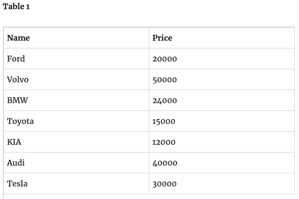
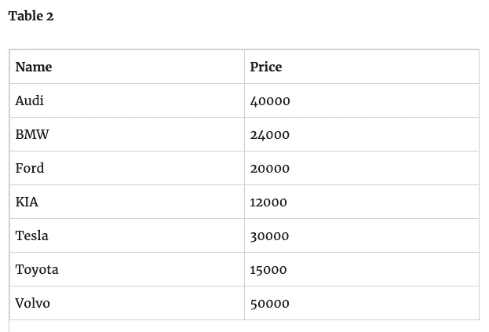

# 使用 Python 按特定属性对对象列表进行简单排序

> 原文：<https://towardsdatascience.com/simple-sorting-of-a-list-of-objects-by-a-specific-property-using-python-dac907150394?source=collection_archive---------30----------------------->

## 这没有你想象的那么难

在我对 Python 和数据建模的初步实验中，我必须将数据导入到我的 Jupyter 笔记本中。我想到了排序，并且想到了如何使用特定的实例变量(比如 name)对对象列表进行排序。例如，我有一个由名称和价格组成的汽车对象列表。



所以我想生成一个列表，其中的结果按照汽车名称的字母顺序排序，如下所示。我不想使用任何库，所以没有为我导入。



Googling 没有给我返回太多信息，因为结果返回了大量关于数字排序的信息，一些关于单词排序的结果，没有令人满意的作为实例变量一部分的单词排序结果。所以我决定尝试一下。Python 不是我日常工作中需要做的事情。但是当需要的时候，我偶尔会使用 Python 来编写脚本。所以我想我应该尝试一下。

这就是我解决问题的方法，我的示例代码如下所示

首先，我将声明一个汽车类，并创建一个列表来插入这些对象

```
class cars:
    def __init__(self, name, price):  
        self.name = name
        self.price = price unsorted_cars = []
unsorted_cars.append(cars('Ford', 20000))
unsorted_cars.append(cars('Volvo', 50000))
unsorted_cars.append(cars('BMW', 24000)) 
unsorted_cars.append(cars('Toyota', 15000)) 
unsorted_cars.append(cars('Kia', 12000)) 
unsorted_cars.append(cars('Audi', 40000)) 
unsorted_cars.append(cars('Tesla', 30000))
```

因为我想按照卡片的名称对列表进行排序，所以我创建了一个空列表，将汽车名称放入该列表，并使用标准的**排序**函数对列表进行排序

```
sorted_car_name = []
for car in unsorted_cars: 
	sorted_car_name.append(car.name)sorted_car_name.sort()
```

这将返回一个按字母顺序排序的汽车名称列表。最后，现在我有了排序后的名字列表。我可以以此为参考，使用这个双 for 循环遍历**未排序 _ 汽车**列表，并使用每个**汽车**对象中的**名称**实例变量与**已排序 _ 汽车名称**列表中的每个单词进行比较，如果匹配，则将其插入新的空列表**已排序 _ 汽车列表**

```
sorted_car = []
for sort_car in sorted_car_name:  
	for unsorted_car in unsorted_cars:
		if unsorted_car.name == sort_car:
			sorted_car.append(unsorted_car)
			break
```

**sorted_car_list** 现在将按照汽车名称的字母顺序排列汽车的最终列表，如上表 2 所示。请注意，由于双 for 循环，这种方法不是很有效，在双 for 循环中，我们遍历**未排序 _ 汽车**中的购物车对象列表，然后遍历**已排序 _ 汽车 _ 名称**中的每个单词，进行比较以查看是否匹配，然后我们将**未排序 _ 汽车**对象插入到**已排序 _ 汽车**列表中。

你可以在这里下载示例 Python 代码[。要运行代码，只需在命令行输入**' python python _ sort _ sample . py '**，它就会打印出未排序的汽车列表和最终排序的汽车。我希望这能对任何 Python 爱好者有所帮助。](https://gist.github.com/gibtang/83f9681b525908900ec4b490992f032d)

心灵的朋友，[文瑞](https://www.linkedin.com/in/ruiwen/)，刚刚给我指出 Python 有一个 **sorted()** 函数可以用。函数的作用是:接收一个对象列表，作为排序依据的关键字，并返回排序后的列表。这个函数使用 **Lamba** 来创建一个匿名函数。因此，为了对未排序的汽车名称列表进行排序，我们使用

```
result_list = sorted(unsorted_cars, key=lambda cars: cars.name)
for car in result_list:
        print(car.name + " and price is " + str(car.price))
```

所以，通过传入未排序的汽车列表，匿名函数和作为排序依据的属性，也就是汽车的名称。我们将在 **result_list** 中得到排序后的列表。这是一种更好的排序方式，尽管 Lamba 的使用将您的 Python 代码转变为函数式编程范式。

我已经更新了我的示例代码，并将 **sorted()** 方法包含在这个 gist[https://gist . github . com/gib Tang/83f 9681 b 525908900 ec4b 490992 f032d](https://gist.github.com/gibtang/83f9681b525908900ec4b490992f032d)中

排序函数的一些相关链接
[https://Julien . danjou . info/python-functional-programming-lambda/](https://julien.danjou.info/python-functional-programming-lambda/)
https://docs.python.org/3/howto/sorting.html
https://www.w3schools.com/python/ref_func_sorted.asp