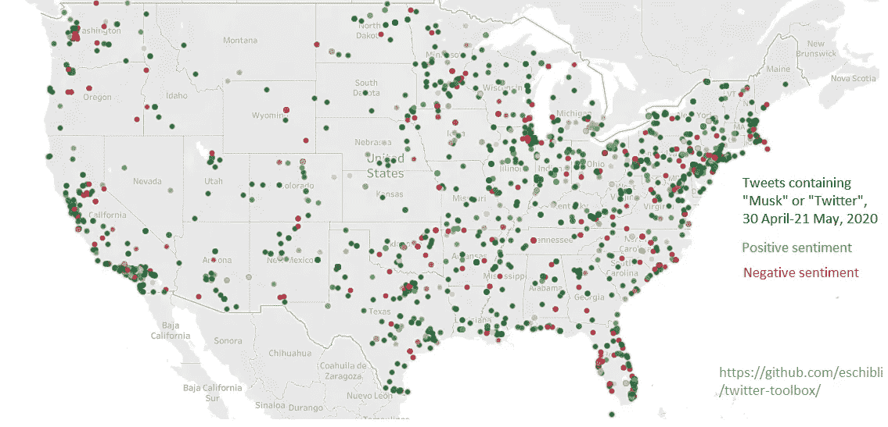

# 使用 twitter-nlp-toolkit 进行简单的 Twitter 分析

> 原文：<https://towardsdatascience.com/simple-twitter-analytics-with-twitter-nlp-toolkit-7d7d79bf2535?source=collection_archive---------37----------------------->

Twitter 是商业分析和学术或教学自然语言处理最丰富的数据源之一；Kaggle 上的许多[顶级](https://www.kaggle.com/kazanova/sentiment140) [数据集](https://www.kaggle.com/crowdflower/twitter-airline-sentiment)是在 Twitter 上收集的，[最受欢迎的文本嵌入之一](https://nlp.stanford.edu/projects/glove)是使用 Twitter 训练的，几乎每个公司都在积极监控 Twitter。

原因有很多:Twitter 有一个可访问的 API，它的 hashtag 系统使数据收集和分类变得容易。也是因为 Twitter 是一个令人难以置信的两极分化和反动的平台；当某件事成为“推特上的流行趋势”时，它通常是一个令人震惊的产品公告，一个受到批评的新版本，或者有人说了一些煽动性的话。这使得 Twitter 成为公众情绪的一个极其强大的信息来源。我和我的合作者注意到，我们经常被分派收集和分析 Twitter 数据的任务，所以我们决定为此构建一个用户友好的包— [twitter-nlp-toolkit](https://pypi.org/project/twitter-nlp-toolkit/) 。在这里，我将通过我今年早些时候制作的一个可视化展示来告诉你如何使用它，展示伊隆·马斯克在 Twitter 上的几个煽动性评论的影响。

首先，你需要注册一个 Twitter API 密匙，安装软件包，并安装 Spacy 的`en_core_web_sm`模型。你可以很容易地做第一个[这里](https://developer.twitter.com)——你将被简单地要求提供一个你正在做的需要一个的快速描述——后两个甚至更容易；只需在你的终端中运行`pip install twitter-nlp-toolkit`和`python -m spacy download en_core_web_sm`。`twitter-nlp-toolkit`需要
`tensorflow ≥2`和`scikit-learn ≥0.22`，所以你可能要把它安装在一个新的虚拟环境里。

## 倾听

Twitter API 的主要产品是一个监听器，它允许您将 tweets 实时传输到磁盘。搜索逻辑记录在[这里](https://developer.twitter.com/en/docs/tweets/rules-and-filtering/overview/standard-operators)。首先，将您的 Twitter API 密匙作为`keys.key`以`.json`格式保存在您的工作目录中，如下所示:

你可以建立你的听众。这将监听包含“Musk”和/或“Tesla”的推文(如果你想要两个关键词，只需设置`target_words = [‘Musk Tesla’]`)。)

这将持续不断地将所有包含“Musk”**和/或**“Tesla”的推文发送到`musk_tweets.json`。该文件可能会变得非常大，并且包含许多可能无关的信息，因此应该监控磁盘使用情况。比如这条推文:

“我对@elonmusk 的看法现在是零，开尔文。”— @AltPublicLands

被保存为超过 10kB 的信息:

呀。解析器会将包含 tweets 的`.json`文件转换成更易于管理的`.csv`文件:

生产`parsed_musk_tweets.csv`:

(因为我们没有商业 Twitter API 密匙，所以我们看不到用户的确切位置。)

我们还可以使用批量下载工具获取马斯克本人最后 200 条左右的推文:

这将产生已经以`.csv`格式解析的 tweets。

# 情感分析

`twitter_nlp_toolkit` 还包括一个情绪分析包，可以评估推文的正面或负面:

情感分类代码

`predict()`函数产生二元预测——0 表示负数，1 表示正数——而`predict_proba()` 产生连续预测。

我们的模特意识到这不是赞美

在 Tableau 中将推文量和平均情绪绘制为时间的函数，产生了以下可视化效果，表明虽然 Twitter 对淡化新冠肺炎严重性的推文有些担忧，但他们对关于特斯拉高股价的推文更加担忧。

随着时间的推移，受平均情绪影响的推文量。对比度得到增强，以提高可见度。

也可以利用用户账户位置来产生估计的地理地图。这里我使用了 Tableau 的地理编码服务；然而，Tableau 只能解释不到 20%的用户提供的位置，其中一些解释是不可信或不准确的。谷歌地图可能会做得更好，但免费层每天的请求数量限制在 2000 个左右:

这里还应该注意的是，在我们的测试中，情感分析只有大约 85%的准确性，在野外可能不太准确；我们的情感分析工具仅使用[sensition 140](https://www.kaggle.com/kazanova/sentiment140)数据集对文本内容进行训练，该数据集已相当陈旧。虽然我们正在努力改进模型，但它们可能只用于观察趋势，而不是对单个推文进行分类，除非它们可以在领域数据上进行微调。

# 功能愿望列表

该软件包仍在积极开发中，但这里显示的功能应该不会中断。当前的优先任务包括改进情感分析模型，提高推文解析和语言预处理的效率和定制，以及集成谷歌地理编码 API。

软件包中的所有代码，包括更多的例子，都托管在 [Github 这里](https://github.com/eschibli/twitter-toolbox)。我们鼓励读者带着问题或功能需求联系开发人员。