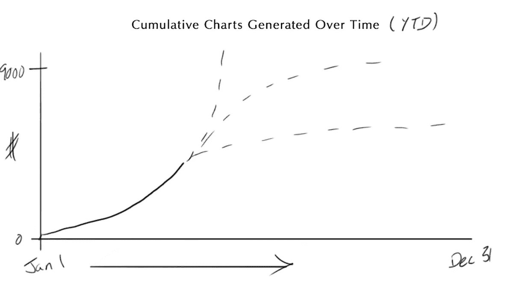
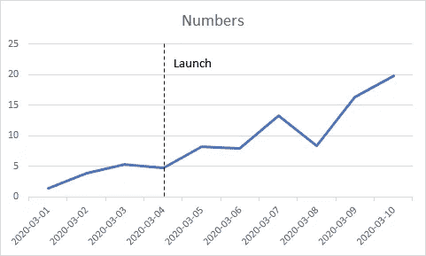
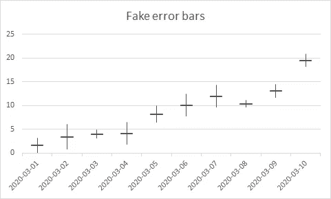
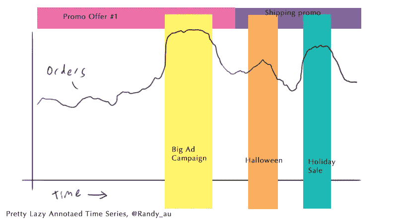
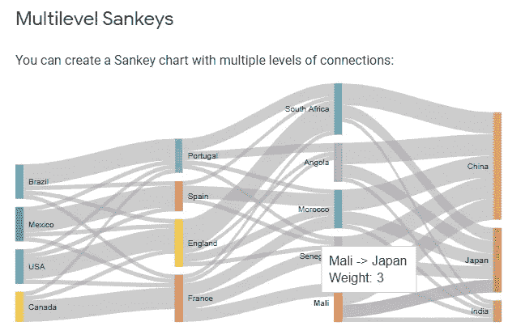
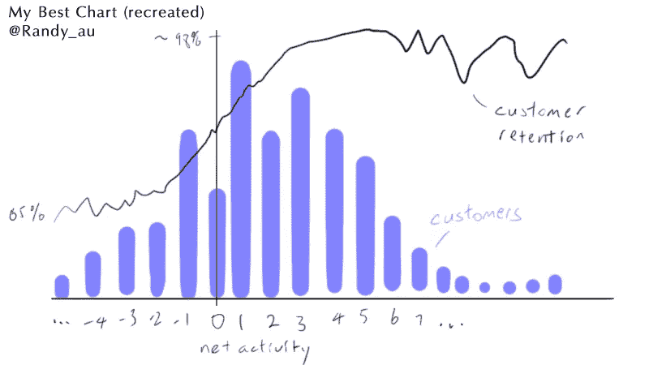

# 简单的可视化非常棒

> 原文：<https://towardsdatascience.com/simple-visualizations-are-pretty-darned-great-f5235c53df47?source=collection_archive---------40----------------------->

## 如果你像我一样不擅长 Viz，我们还有希望

图表中的图表(作者:Randy Au)

我必须承认，我有萝卜的艺术和视觉技巧。

这并不是说我曾经欺骗过自己，假装自己很擅长——我几乎总是依靠非常简单的日常工具，体面地过日子。但是在最近的一次团队场外活动中，我突然发现我已经变得对它超级适应了，这是一种非常奇怪的感觉，因为我真的应该改进这样一个缺陷。

触发这种认识的事件是由我上面的集团董事 2 组织结构图级别主持的 UX 峰会。大约有 100 人出席，包括我们产品领域的所有 UXers，所以在人群中有设计师、研究人员、作家和工程师，大概是这个顺序。我想房间里有两个量子 UX 研究员，包括我自己。

该活动的部分活动涉及一系列 10 个 3 分钟的闪电谈话，我是其中之一。人们谈论他们学到或做过的事情，在会议上做研究，他们开发的有趣的新功能，组织研究的框架，等等。我完全专注于品牌，正在谈论我的团队建立的流程，该流程用于设置和监控功能工作的成功指标。

当我那天看完所有的演示时，我意识到每个人都在使用漂亮的图形、可视化、照片，甚至视频剪辑，来讲述他们正在讲述的任何故事。有设计背景的人在这方面尤其出色，他们使用了一些最令人惊叹的设计图形和可爱的 gif 口音。

与此同时，我用默认的谷歌幻灯片字体在白色背景上显示黑色文本。我对设计的唯一认可是从 UX 团队的模板中复制的标题卡。回想起来，肯定有很多地方都有时间表、示例度量图等。，会更容易理解。但是在准备的几周里，我没有想到把一个很长的演讲缩短到 3 分钟。在那模糊的 360 秒里，我所有的话，以及从我嘴里说出来的一切。

虽然这个故事主要是说我在演讲时缺乏对设计和美学的优先考虑，但我向你保证，这个性格缺陷适用于我制作的任何图表。斯巴达是描述事物的好方法，这是我需要努力的地方。

作为数据人员，我们最重要的职责是将我们的发现和结果传达给其他人。无论是授权给决策者，帮助团队达成共识，还是向客户提供信息，都需要沟通。如果我们在最后一步失败了，我们的结果是否是完美的预言也没有关系。视觉化通常对沟通过程非常重要。一幅制作精良的图像，即使是非常简单的图像，也能比文字更好地表达观点。

现在著名的“拉平曲线”图形可能是过去几个月中“简单但强大的 viz”最突出和最令人难忘的例子。顺便说一句，在这里可以很好地看到这个图形的历史。

类似地，一些陈述只能通过可视化来理解，比如选举地图，网络地图。数据点太多，很难用文字来概括。

所以，我只想说，在这个角色中拥有视觉化技能从来都不是坏事。我想不出在任何情况下成为数据可视化的大师会有什么坏处。

令人惊讶的是，你可以用非常非常少的这些技能走多远，这里是我在生活中使用的几个工具。

# Lv 1:简单的可视化往往就足够了

大概 99%为工作制作的图表都是用电子表格制作的。开始时，我可能会用复杂的 SQL 和代码处理大量的数据，但最终的演示步骤通常很小，足以放入一个简单的电子表格，可能还会有一个数据透视表，以便我可以播放、格式化和扩充最终的图表结果。

剩下的 1%时间是我不得不依靠 Python 或类似语言中一些更强大的外部工具。这是如此的罕见，以至于我每次做的时候都要查阅文档来绘制一个折线图。我不知道如何使用 D3 或者其他强大的工具。但是尽管我能力有限，我还是设法一瘸一拐地走了下去！

# 到处都是线！

如果要我猜的话，我的图表中有超过 70%是简单的线形图，你可以在 Windows 上最多通过 6 次按键(ctrl-a，alt，n n，1，enter)从 Excel 中输出。当他们在功能区上添加了太多功能时，他们在命令链中插入了一个“1”，多么令人讨厌。

> *我的大多数演示图表看起来都像上面这样😜。垂直的“启动”虚线是我的一个花哨的 viz 技巧。我不得不做太多的前/后分析。*

我制作的另外 20%的图表只是条形图的变体，水平的或垂直的。剩下的部分是面积图(反正只是彩色的堆叠线)、堆叠条形图，偶尔我会用烛台图来近似误差棒线。我几乎从来不预测未来，所以我从来没有真正制作过误差界限线图，没有专门的软件包很难制作。

大多数时候，只要有适当的标签，一张类似上面的图表就足以让我理解我需要理解的任何一点。事情呈上升趋势，目前的指标与历史水平相似，我们没有因为发布而破坏系统，等等。诸如“样本量小，所以误差可能很大”这样的警告是通过画外音、脚注或添加到标题中来传达的。

这对于半正式的团队工作非常有效，在这种情况下，我们需要快速查看数据点或趋势，做出决定，然后永远不要再查看相同的图表(我们可能会在未来查看更新的图表)。将数据转换成适合图表的格式(装箱、标准化、剔除工件等)已经够麻烦的了，改进演示文稿的边际收益是不值得的。

对于更高级别的涉众的更正式的演示，出于演示的原因，我将在表面样式上投入额外的精力。升级通常包括确保所有标题、轴和图例都格外清晰，添加线条粗细/破折号以增加/消除强调，异常数据点在脚注中附有解释，等等。

在一天结束的时候，一个美学上令人愉悦的图表比一个有着相同内容的非常丑陋的图表更令人难忘。你也不希望小瑕疵分散你的主要信息。

# Lv 2:图表。但是用语言

当我出于演示目的需要让**变得真正**奇特时(不可否认很少)，我通常会拿出带注释的折线图，如下所示。这是一种为令人沮丧的时间序列提供更多背景信息的方式。同样，所有这些都是用 Excel 或工作表中的透明色块和文本框完成的。这是我的努力，也是我艺术能力的上限。

我在 Photoshop 中根据内存重新创建示例图表，因为在电子表格中我想要的地方人为地创建带有任意屈折的弯弯曲曲的长线条很烦人。这个图表的目的是简单地提供一段时间内的销售情况。因为每时每刻都有一大堆事情在发生，有时还会重叠，所以不可能找出哪些时间段足够相似来进行比较。

所有的注释和框都是手工完成的，这是一个巨大的时间投资，所以它被保留到需要理解回报的时候。我的颜色感觉特别差，所以当我需要在一个图表中包含 6 种以上的颜色时，事情变得非常难看，它们看起来不可能都一样，但也不能相互冲突。恶心。

尽管成本很高，但在图表上手写注释远比争论独立的数据系统要痛苦得多，我需要将这些独立的数据系统组合起来才能使其工作。其中一些数据点只存在于人们的头脑或随机的电子表格中。

# Lv 3:更硬的东西通常有另一个用途

简单的视觉化很擅长清楚地表达一两点，因为它们能够编码的信息量是有限的。你可以用注释和颜色之类的巧妙技巧再多塞进去一点，但是还是有限制的。

除了简单的东西之外，当需要的时候，我会拿出一些更复杂的东西，但是我发现它们有不同的用途。地图、桑基图、网络流程图、动画，这些可视化的复杂性意味着人们需要时间来消化它们，或者它们是为探索而设计的。在某些情况下，它们有助于分析和理解，但在我个人的日常生活中却没有用。

来自[https://developers . Google . com/chart/interactive/docs/gallery/Sankey](https://developers.google.com/chart/interactive/docs/gallery/sankey)的 sankey 示例

由于不熟悉制作这些可视化效果的细节，我主要依靠预建的版本来制作。Excel 的映射功能惊人地强大(我一生中已经做了足够多的 ZIP->FIPS 映射，以至于还想再做一次)，有一些库可以根据需要制作[桑基图](https://developers.google.com/chart/interactive/docs/gallery/sankey)。漏斗下降图我只是慢慢地用手或黑一个条形图来做。

*懒人群组分析*

有时我会给一个数字网格着色，就像队列分析一样…然后把它作为一个缩小的图形来阅读。它足够接近于我的大脑进行分析的可视化，而不需要实际做些什么。仅仅通过观察数字的形状就能很容易地看出模式。

# 吕∞:遥不可及的东西

当我想到我永远也做不了的非常酷的 vis 时，我会想到那些经常来自纽约时报数据团队、卫报或流动数据网站的工作。

其中许多都是复杂的设计，显示了对显示的每个像素投入的许多小时的工作。即使是简单的折线图和条形图，通常也是精心设计的，设计元素经过深思熟虑，颜色经过精心选择，轴和标签经过精心着色，不引人注目但又清晰可见，等等。

这并不是说我没有时间来制作如此美丽的图形，如果有一千个小时的空闲时间来尝试，我真的无法自己制作一个。我能做的最好的事情就是盲目地模仿，很可能会失败。

但至少，我可以坐在我的椅子上，欣赏我知道有人花了一些时间的小细节，因为默认设置(如果默认设置存在的话)看起来永远不会完全轻松。

# 尽管缺乏美感，但仍有影响力

考虑到我的 Lv 2 有多简单。问题是，你可能想知道你能走多远。

举例来说，这是我迄今为止 12 年多职业生涯中最好的(即最有影响力的)图表。这是一个“奇特”的双图形——棒线！再次在 Photoshop 中重新创建，但原始版本是许多年前在 Excel 中完成的，所以想象一下它的块状，锯齿状，默认红/蓝荣耀。由于我的记忆有缺陷，细节被更改以掩盖起源，并且在公共场合随意挥舞任何人的客户保持数据都不是件好事。

这张图表背后的故事是这样的:我的老板要求我做一个“是什么驱动了留存”的分析，因为一些投资者问了这个问题。在花费数周时间进行大量数据清理和大型回归分析后，一个没有人真正关注的因素出现了。分析该因素的结果变成了这张图表，它本质上是说“在续订时有净积极的[特定类型]活动意味着非常高的保留率！”。

我之所以称之为“我最好的图表”,是因为这个简单的图表能引起人们的讨论。产品人员很快意识到，他们可以做出改变，让许多客户的“净活动”增加 1 到 2 个单位。该公司并没有真正考虑过移动网络活动统计，他们认为这只是系统的一个有机属性。人们很兴奋，他们开始试验，几个月后，他们发现了针对用户共鸣的指标的非常棒的功能设计。

突然之间，整个公司的指标同比增长了 40%，而此前有一段时间，这一数字一直停留在 15%。我们的产品开发相当于一口油井，这张图表是我们最初的地图。太疯狂了。我们也不知道这种极高的增长会持续多久。人们不断问我这个问题，我没有办法模拟前所未有的增长。它最终持续了近 18 个月，才平息下来。狂野。

我完全意识到我在这里非常幸运。在整个职业生涯中，找到这种影响程度的图表可能只有一两次。许多我无法控制的事情都是为了让这种情况发生，包括发现一个流行产品中被严重忽视的方面，管理、工程和产品都兴奋地测试这个想法，以及人们偶然发现有用的设计和功能。

但是只有那一次，它成功地组合在一起，并且它全部来自一个巨大管道末端的一个大 SQL 查询的 CSV 转储，最后被扔进 Excel。除了轴标签之外，它甚至没有注释。图中嘈杂的极端情况(由于样本量小，保留率变得很高)被留在了所有嘈杂的荣耀中。我很确定我用默认的 Excel 蓝色和红色离开了图表。

我很确定，当时，我知道这个图表在说一些重要的东西，但是我认为它会是另一个一次性图表。我把它展示给人们，以获得我需要为一个完美的版本所做的改进的感觉……但是从那以后它就像病毒一样传播开来，所以我从来没有机会清理它。哦好吧。

¯\_(ツ)_/¯

*最初发表于* [*统计数据*](https://counting.substack.com/) *，兰迪的免费每周时事通讯涵盖了数据和技术中更平凡、更重要的部分。*