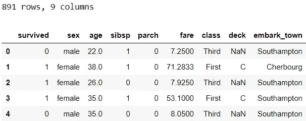
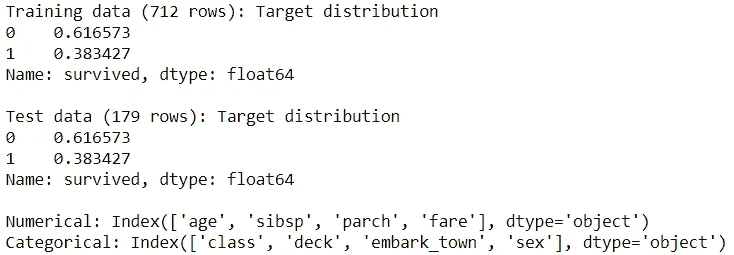
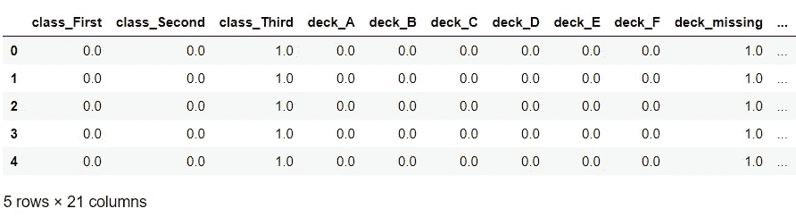
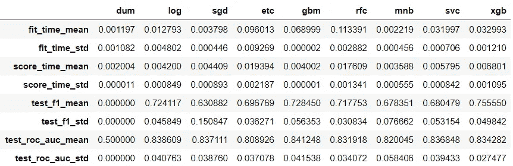
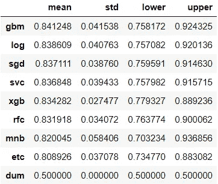

# 在 scikit-learn (Python)中为您的数据找到合适算法的简单方法

> 原文：<https://towardsdatascience.com/simple-way-to-find-a-suitable-algorithm-for-your-data-in-scikit-learn-python-9a9710c7c0fe?source=collection_archive---------14----------------------->

## [入门](https://towardsdatascience.com/tagged/getting-started)

## 使用这种实用的方法解决监督学习问题

在建立模型时，数据科学家需要选择合适的机器学习算法来使用。使用我们最喜欢的算法很有诱惑力，但是，对于数据来说，它可能并不总是正确的。那么我们如何从所有可用的选项中选择一个合适的算法呢？一个好的方法是在你的数据上尝试多种算法，从选项中选择一个或几个性能最好的算法来进一步微调。这个想法并不新颖。事实上，它可能是你已经以某种形式在做的事情。在这篇文章中，我将展示一种有组织地尝试多种算法的方法。

由[凯文·Ku](https://unsplash.com/@ikukevk?utm_source=medium&utm_medium=referral)在 [Unsplash](https://unsplash.com?utm_source=medium&utm_medium=referral) 上拍摄

# 1.准备数据📦

*如果你想跟随你电脑上的代码，确保你有*[*numpy*](https://numpy.org/install/)*，*[*pandas*](https://pandas.pydata.org/pandas-docs/stable/getting_started/install.html)*，*[*seaborn*](https://seaborn.pydata.org/installing.html)*，*[*sk learn*](https://scikit-learn.org/stable/install.html)*和* [*xgboost*](https://xgboost.readthedocs.io/en/latest/build.html)

假设我们想为一个分类问题找到一个合适的机器学习算法。对于我们的示例，我们将使用 titanic 数据集中的一个要素子集。让我们导入相关的包和示例数据:

让我们将数据分成训练集和测试集。我们还将定义对以后预处理数据有用的特征组:

我们现在将准备几个自定义的转换器来预处理数据:
◼ ️️ `Imputer`:用一个常量值进行估算，并在熊猫数据帧中返回估算的数据
◼ `CardinalityReducer`:将不常用的类别聚集到“其他”类别中，并在熊猫数据帧中返回转换后的数据

你会注意到，这篇文章中定义的大多数自定义函数或方法都返回数据帧，因为它们更容易查看。

现在，让我们转换数据。我们将并行预处理数字和分类特征。使用`ColumnTransformer`和`Pipeline`，我们将:

*   将数据分成两组:分类数据和数字数据
*   对每个组应用不同的变压器组
*   将结果粘贴在一起

如果这是你第一次看到`ColumnTransformer`和/或`Pipeline`，下面的代码可能不容易理解。如果你想了解他们更多，我已经专门写了一个[单独的帖子](/pipeline-columntransformer-and-featureunion-explained-f5491f815f)来解释这两个。

部分输出

# 2.评估多种算法🔧

现在，我们已经到了这篇文章的关键部分。利用您对数据和建模技术的了解，您可以选择一组潜在的候选者来尝试您的数据。例如，探索性的数据分析可能已经暗示了一些关于哪种算法可能对数据有效的方向。另外，你的机器学习算法的理论知识也可以指导你。像[这样的小抄](https://scikit-learn.org/stable/tutorial/machine_learning_map/index.html)可能也会派上用场。

一旦你有了一套要尝试的算法，你就可以对数据逐一尝试每一种算法。然而，使用一些功能，我们可以让这个过程更有条理。这些功能的想法是从[这里](https://www.kaggle.com/pouryaayria/a-complete-ml-pipeline-tutorial-acu-86/comments)得到的启发。

我们将需要定义我们决定在`create_baseline_classifiers`函数中的数据上尝试的所有算法。在这个例子中，我们使用的是开箱即用的分类器，没有任何超参数调整。但是，如果您愿意，可以在这个阶段调整超参数。我们在这里包括了虚拟分类器作为基准:

`assess_models()`目前的定义方式使其能够创建多个指标的绩效总结。但是，如果您愿意，也可以只包含一个指标。或者，我们很快会看到如何从输出中提取单个指标性能。现在，是时候根据训练数据评估模型并比较它们的结果了:

使用我们创建的第三个函数，让我们根据一个单独的指标来比较所有的模型:ROC 曲线下的面积。

这是一个非常有用的总结，不是吗？只看平均表现是不够的。因此，我们在这里包括了其他列，以便为我们提供关于跨褶皱性能的更详细的信息。在分析了结果之后，我们应该列出候选名单，并把我们的努力方向放在微调一个算法上，或者如果你愿意的话，一个精选的前几个算法。

这种方法也可以很容易地修改成回归问题。例如，下面是一个创建多个回归变量的示例函数:

我发现这些函数对数据科学项目很有用！⭐️，我希望你也是。

*您想访问更多这样的内容吗？媒体会员可以无限制地访问媒体上的任何文章。如果您使用* [*我的推荐链接*](https://zluvsand.medium.com/membership)*成为会员，您的一部分会费将直接用于支持我。*

谢谢你看我的帖子。我希望你能在你的监督学习项目中使用这种方法。如果你感兴趣，这里有我的一些帖子的链接:
◼️ [用这些提示整理你的 Jupyter 笔记本](/organise-your-jupyter-notebook-with-these-tips-d164d5dcd51f)
◼️ [探索性数据分析指南](/exploratory-data-analysis-guide-4f9367ab05e5)
◼️[python 中的探索性文本分析](/exploratory-text-analysis-in-python-8cf42b758d9e)
◼️️ [给熊猫用户的 5 个提示](/5-tips-for-pandas-users-e73681d16d17)
◼️️ [在熊猫中进行数据聚合的 5 个提示](/writing-5-common-sql-queries-in-pandas-90b52f17ad76)
◼️️ [在熊猫中编写 5 个常见的 SQL 查询](/writing-5-common-sql-queries-in-pandas-90b52f17ad76)

再见🏃💨