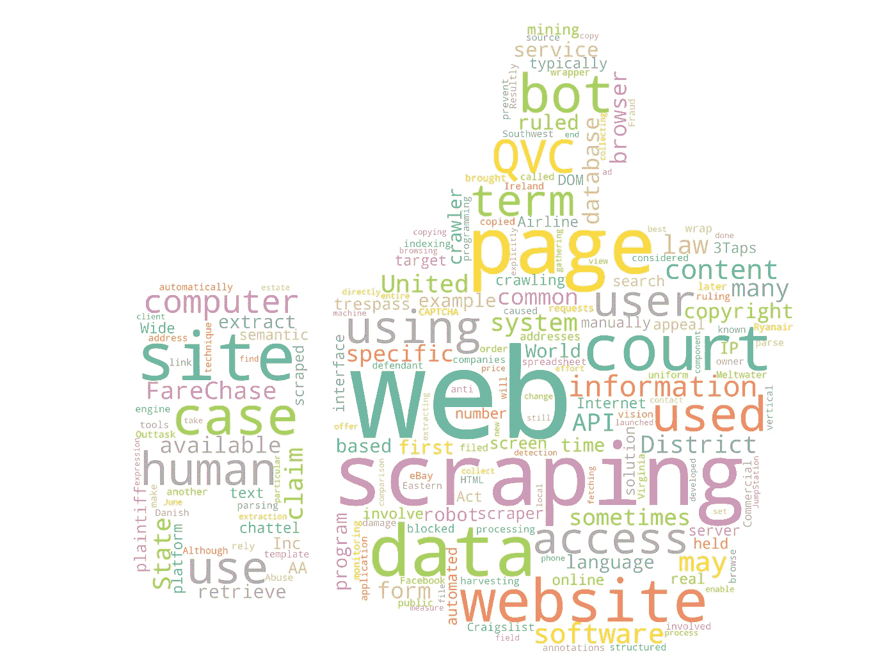
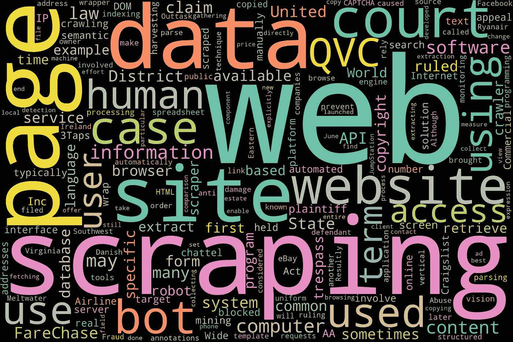

# Python 中的简单单词云

> 原文：<https://towardsdatascience.com/simple-wordcloud-in-python-2ae54a9f58e5?source=collection_archive---------2----------------------->

💡 ***单词云*** *是一种可视化文本中频繁出现的单词的技术，其中单词的大小代表它们的频率。*

创建单词云的一个简单方法是在谷歌上搜索“单词云”，找到一个可以生成单词云的免费网站。你可以自定义它的外观。又快又简单！

更令人兴奋的是，您可以用 Python 自己构建一个💫。这篇文章将展示如何创建一个像下面这样的单词云。



第三节的词云。Fancier 单词云🌸

# 0.Python 设置🔧

我假设读者(👀是的，你！)可以访问并熟悉 Python，包括安装包、定义函数和其他基本任务。如果你是 Python 新手，[这个](https://www.python.org/about/gettingstarted/)是一个入门的好地方。

我已经在 Jupyter Notebook 中使用并测试了 Python 3.7.1 中的脚本。

在我们开始之前，让我们确保您已经安装了以下库:
◻️ **创建单词云:** *单词云* ◻️ **导入图像:** *枕头*(稍后将导入为*pil*)◻️**从维基百科中抓取文本:***维基百科*

最后一个包是可选的，你可以加载或创建自己的文本数据，而不必通过网络抓取拉文本。

# 1.数据📦

作为我们的样本文本，我们将使用从维基百科“网络抓取”页面上抓取的文本。

```
# Import packages
import wikipedia
import re# Specify the title of the Wikipedia page
wiki = wikipedia.page('Web scraping')# Extract the plain text content of the page
text = wiki.content# Clean text
text = re.sub(r'==.*?==+', '', text)
text = text.replace('\n', '')
```

🔗我已经在另一篇关于抓取的文章中解释了这个脚本的作用。简而言之，这个脚本将提取段落中的纯文本内容，并将其分配给*文本*字符串。

# 2.字云☁️

首先，让我们准备一个绘制单词云的函数:

```
# Import package
import matplotlib.pyplot as plt# Define a function to plot word cloud
def plot_cloud(wordcloud):
    # Set figure size
    plt.figure(figsize=(40, 30))
    # Display image
    plt.imshow(wordcloud) 
    # No axis details
    plt.axis("off");
```

其次，让我们创建我们的第一个单词云并绘制它:

```
# Import package
from wordcloud import WordCloud, STOPWORDS# Generate word cloud
wordcloud = WordCloud(width= 3000, height = 2000, random_state=1, background_color='salmon', colormap='Pastel1', collocations=False, stopwords = STOPWORDS).generate(text)# Plot
plot_cloud(wordcloud)
```


Ta-da❕我们刚刚建立了一个单词云！以下是关于 *WordCloud* 函数参数的一些注意事项:

**◼️宽度/高度:**您可以使用这些选项将单词云的尺寸更改为您喜欢的宽度和高度。
◼️ **random_state:** 如果你不把它设置成你选择的数字，你很可能每次在相同的输入数据上运行相同的脚本时得到一个稍微不同的单词云。通过设置此参数，您可以确保完全相同的词云的再现性。你可以玩随机数，直到你找到你喜欢的单词云。
**◼️背景 _ 颜色:**‘白’和‘黑’是常见的背景颜色。如果你想探索更多的颜色，[这个](http://www.science.smith.edu/dftwiki/index.php/Color_Charts_for_TKinter)可能会派上用场。请注意，有些颜色可能不适用。希望你能找到你喜欢的东西。
**◼️色彩图:**通过这个参数，你可以设置文字显示的颜色主题。有很多漂亮的 [Matplotlib 色图](https://matplotlib.org/3.2.1/tutorials/colors/colormaps.html)可供选择。我最喜欢的是“彩虹”、“地震”、“彩色 1”和“彩色 2”。
◼️ **搭配:**将此设置为 *False* 以确保单词云看起来不会包含任何重复的单词。否则你可能会在词云中看到' web '、' scraping '、' web scraping '作为搭配，给人一种词被重复的印象。
**◼️停用词:**停用词是对文本意义几乎没有价值的常用词 We、are 和 the 是停用词的例子。我已经在这里更详细地解释了停用词[(滚动到‘步骤 3。删除“停用词”部分)。这里，我们使用了来自 *wordcloud* 包的*停用词*。要查看停用词集合，使用`print(STOPWORDS)`并向该集合添加自定义停用词，使用此模板`STOPWORDS.update(['word1', 'word2'])`，在生成词云之前用您的自定义停用词替换 *word1* 和 *word2* 。您还可以自定义其他参数。查看](/introduction-to-nlp-part-1-preprocessing-text-in-python-8f007d44ca96) [*文档*](https://github.com/amueller/word_cloud) *了解更多信息。*

让我们用不同的*背景颜色*和*颜色图*生成另一个单词云🎨。你可以玩不同的组合，直到你找到你喜欢的。我觉得下面这个组合挺好的:

```
# Generate wordcloud
wordcloud = WordCloud(width = 3000, height = 2000, random_state=1, background_color='black', colormap='Set2', collocations=False, stopwords = STOPWORDS).generate(text)# Plot
plot_cloud(wordcloud)
```



假设我们对 word cloud 很满意，并希望将其保存为. png 文件，我们可以使用下面的代码来实现这一点:

```
# Save image
wordcloud.to_file("wordcloud.png")
```

# 3.Fancier 单词云🌸

我说的更好的单词云是指那些自定义形状的单词云，就像本文开头显示的那样。要创建一个花哨的单词云，我们需要首先找到一个图像作为遮罩。看来最大的挑战是找到正确的图像文件。你可以在谷歌图片上用关键词搜索图片:“屏蔽文字云图片”。在我的搜索过程中，我偶然发现了这个来源，一位慷慨的 kaggler 分享了一些有用的屏蔽图片。我在这篇文章的开头使用“upvote.png”来生成单词 cloud，使用了以下脚本(记得在运行脚本之前在当前目录中保存一份蒙版图像的副本):

```
# Import packages
import numpy as np
from PIL import Image# Import image to np.array
mask = np.array(Image.open('upvote.png'))# Generate wordcloud
wordcloud = WordCloud(width = 3000, height = 2000, random_state=1, background_color='white', colormap='Set2', collocations=False, stopwords = STOPWORDS, mask=mask).generate(text)# Plot
plot_cloud(wordcloud)
```

你会注意到，唯一的区别是我们将图像导入到了一个 *numpy 数组*，然后在 *WordCloud* 中添加了`mask=mask`。蒙版的一个特点是，最好将背景颜色设置为“白色”。如果我们尝试换成不同的颜色，单词 cloud 可能看起来不太好。让我们创建一个并查看:

```
# Generate wordcloud
wordcloud = WordCloud(width = 3000, height = 2000, random_state=1, background_color='navy', colormap='rainbow', collocations=False, stopwords = STOPWORDS, mask=mask).generate(text)# Plot
plot_cloud(wordcloud)
```


相对于拥有白色背景，你怎么看这个？我会让你来判断。

我喜欢单词云，并计划做一个(当然不是关于网络抓取的！🙈)用来当海报装饰我的房间。但是它也可以在其他环境中使用，例如在演示文稿和文档中作为视觉辅助。

*您想访问更多这样的内容吗？媒体会员可以无限制地访问媒体上的任何文章。如果您使用* [*我的推荐链接*](https://zluvsand.medium.com/membership) ，*成为会员，您的一部分会费将直接用于支持我。*

谢谢你看我的帖子。我希望你已经学到了一些东西，✂️.如果你感兴趣的话， 以下是我其他一些帖子的链接:
◼️ [用 Python 从维基百科中抓取文本的两种简单方法](https://medium.com/@zluvsand/two-simple-ways-to-scrape-text-from-wikipedia-in-python-9ce07426579b)
*(下面列出了一系列关于 NLP 介绍的帖子)*
◼️ [第一部分:Python 中的文本预处理](/introduction-to-nlp-part-1-preprocessing-text-in-python-8f007d44ca96)
◼️ [第二部分:引理和词干的区别](https://medium.com/@zluvsand/introduction-to-nlp-part-2-difference-between-lemmatisation-and-stemming-3789be1c55bc)
◼️ [第三部分:TF-IDF 讲解](https://medium.com/@zluvsand/introduction-to-nlp-part-3-tf-idf-explained-cedb1fc1f7dc)
◼️ [第四部分:Python 中的有监督文本分类模型](https://medium.com/@zluvsand/introduction-to-nlp-part-4-supervised-text-classification-model-in-python-96e9709b4267)
◼️ [第 5A 部分:Python 中的无监督主题模型(sklearn)](/introduction-to-nlp-part-5a-unsupervised-topic-model-in-python-733f76b3dc2d)
◼️ [第 5B 部分:Python 中的无监督主题模型(gensim](/introduction-to-nlp-part-5b-unsupervised-topic-model-in-python-ab04c186f295)

再见🏃💨