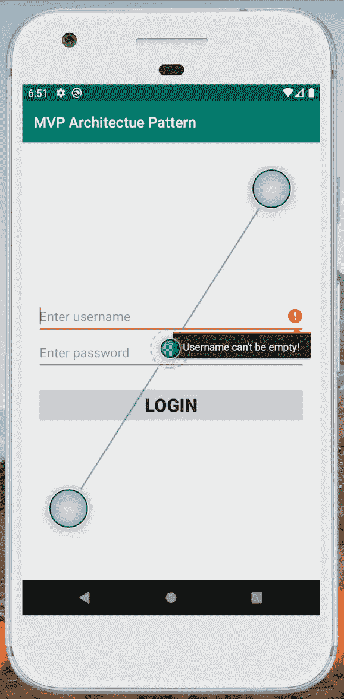
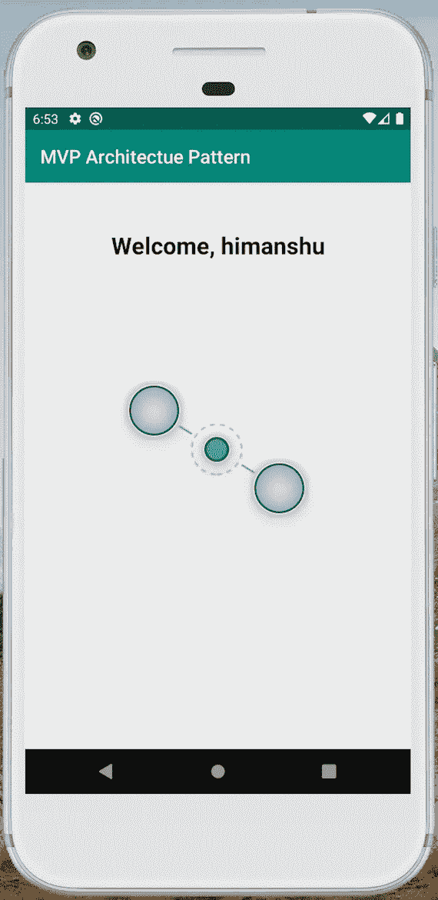

# 面向初学者的 Android MVP

> 原文：<https://towardsdatascience.com/simplest-way-to-understand-mvp-in-android-b2d96583260b?source=collection_archive---------15----------------------->

## 让我们来理解这种设计模式是如何以更少的努力提供更大的维护大型项目代码的便利性的

照片由[西蒙·瑞](https://unsplash.com/@simonrae?utm_source=unsplash&utm_medium=referral&utm_content=creditCopyText)在 [Unsplash](https://unsplash.com/s/photos/separate?utm_source=unsplash&utm_medium=referral&utm_content=creditCopyText) 上拍摄

在 Android 中，由于 Android 活动与 UI 和数据访问机制紧密耦合，我们遇到了一个问题。但是应用程序代码必须易于扩展、维护、阅读和测试，等等。为了实现所有这些，我们将使用 MVP 架构模式，它将应用程序分为三层。三层是模型、视图和演示者。

# 模型视图演示者(MVP)

*   模型:它处理我们应用程序的数据部分
*   **视图**:负责按照演示者的指示，用相关数据布置视图
*   **展示者**:它是连接模型和视图的桥梁

**注意** : Presenter 是模型和视图之间的中间人，这意味着视图和模型不能直接相互交流。

# 使用 MVP 的好处

*   将用户界面的代码与业务逻辑分开
*   阻止模型(数据)和用户界面之间的直接通信
*   更改代码的一部分不会影响另一部分。
*   代码对于单元测试来说变得容易多了

现在把所有的理论部分放在一边，开始研究编码部分

我们将创建登录应用程序，以尽可能保持简单

在 ActivityMain.java 的课上，我简单地拿了两个编辑文本和一个登录按钮。我在这个活动中实现了`LoginView` `interface`,并覆盖了所有的方法——这些方法将基于用户提供的凭证被调用。如果`username`和`password`不是用户输入的，那么`“Username can’t be empty”`消息将显示给用户。我正在创建人工延迟来显示进度条。

ActivityMain.java

这里我声明了不同目的的方法，比如用户名错误和密码错误等等。

LoginView.java

这是最重要的类，有助于模型和视图之间的交流。

LoginPresenter.java

这个类包含了应用程序的业务逻辑，并且这个类决定了哪个方法将被调用。

LoginInteractor.java

输出:

当输入字段为空时:

当用户名和密码都正确时:

# 结论

MVP 架构模式没有普遍公认的定义。每个人都根据自己的需要实现这个模式，但是我们的目标应该是将代码分成至少三层，就像我们上面讨论的那样。

我希望你喜欢读这篇文章，你也可以访问我的 [**网站**](http://thehimanshuverma.com/) ，在那里我会定期发布文章。

[**订阅**](https://mailchi.mp/b08da935e5d9/himanshuverma) 我的邮件列表，以便在您的收件箱中直接获得我的文章，并且不要忘记关注我自己在 Medium[**The Code Monster**](https://medium.com/the-code-monster)上发表的文章，以丰富您的技术知识。

# 了解你的作者

希曼舒·维尔马毕业于印度勒克瑙的 APJ 阿卜杜勒·卡拉姆大学博士。他是 Android & IOS 开发人员、机器学习和数据科学学习者、金融顾问和博客作者。