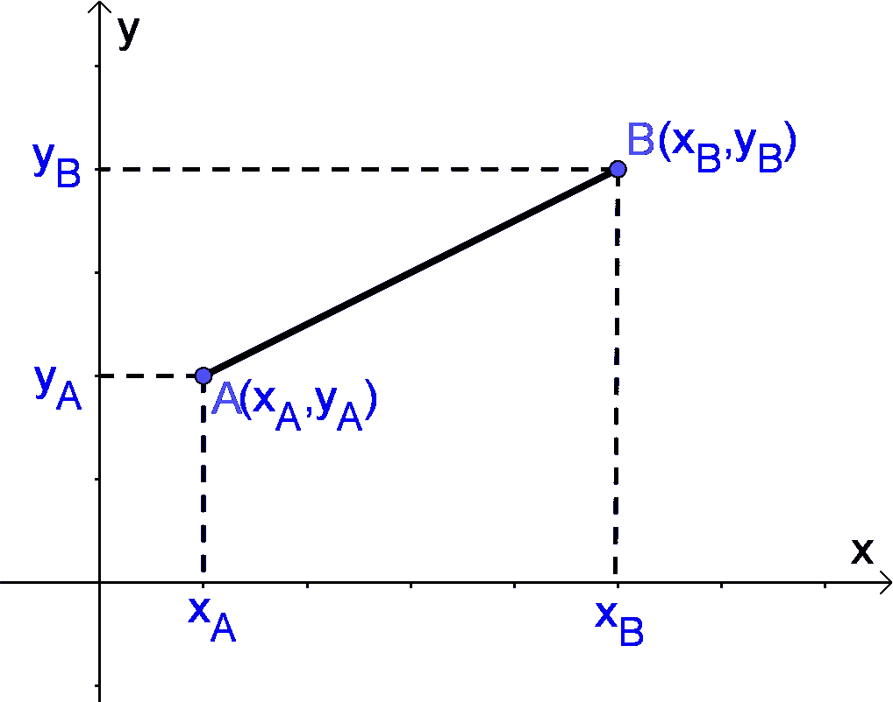
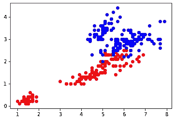
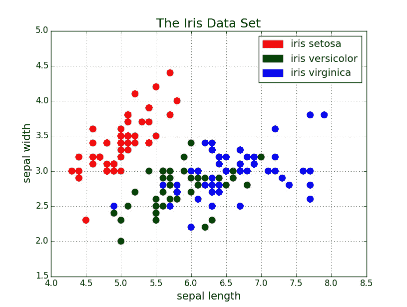

# 使用 Python 简化 KNN 算法并提供编码说明

> 原文：<https://towardsdatascience.com/simplified-knn-algorithm-using-python-with-coding-explanation-ab597391b4c3?source=collection_archive---------45----------------------->

## *K 近邻，机器学习中最简单的分类算法之一*

M 机器学习就是识别模式，创造自己的算法，并不断进化。模式通常由机器创建，它使用各种技术和算法。对于机器学习中的分类问题，k 近邻算法是一种最简单而有效的算法。它既可用于*分类，也可用于*回归问题，即它可以对任何特定事件/属性进行分类，甚至可以预测其值。这种方法因为比其他复杂的算法简单而被采用。它测量数据点之间的距离。测量距离会形成一个模式，以创建两点之间的关系。这就是它决定新数据点应该放在哪个组中的方式。



图片来自 nccalculators.com

如果我们需要计算上图中提到的两点之间的距离，比如说`(XA,YA)`和`(XB,YB)`，那么可以使用一个简单的公式


以上是测量两点间距离的**欧几里得**方法。这种距离测量也可以有其他方式。遵循上述方法来计算各种数据点之间的距离。KNN 有两个独特的属性

1.  **懒惰学习算法:**它被称为懒惰学习者，因为它没有任何专门的训练阶段，而学习意味着它没有预定义的规则。它只是消耗所有的数据，同时对一个新的数据点进行分类，并制定自己的规则。
2.  **非参数学习算法:**它采用非参数方法，这意味着它不做任何假设。它不担心选择哪些特性。这种方法非常适合您事先不了解传入数据的情况。

由于这种无忧无虑的分类，KNN 算法各有利弊

**优点:**

1.  对于大量数据来说，它非常有用
2.  它在选择变量方面很灵活(没有假设)&可以适应大量的函数形式。
3.  它可以在预测时提供更好的性能

**缺点:**

1.  在估计映射函数时，它消耗大量的数据
2.  它可以给出过拟合模型输出
3.  由于训练时使用了大量参数，所以速度较慢。
4.  不平衡数据集可能会给这种算法带来麻烦。



绘制在 2D 坐标系上的样本数据集

在 K 个最近邻中，K 的**值表示与我们的新数据点具有最小距离的最近邻的数量。如果我们说 k=3，这意味着我们必须为我们的新数据点找出 3 个最近的邻居。如果有 3 个相邻点，其中一个来自红色数据集，另外两个来自蓝色数据集，那么新的数据点将被标记为蓝色。越多的邻居意味着分类越清晰，但是它增加了分类的复杂性和时间范围。k 值还有一个更重要的方面，它应该是一个奇数*总是为了更好的分类，否则如果两种颜色的邻居数量相等，那么它将是一个平局。***

让我们举一个例子，用 python 语言展示算法是如何工作的。为了在 python 中工作，我们需要调用某些库

```
import pandas as pd
import numpy as np
from sklearn.datasets import load_iris
from sklearn.model_selection import train_test_split
from sklearn.neighbors import KNeighborsClassifier
from sklearn.metrics import accuracy_score
```

这里的数据集是 python 框架上一些基本样本数据集的存储库。这些数据集可以用来做一些简单的实际建模。 *Iris* 是那个存储中非常有名的数据集。

sklearn 是 python 中最著名的数据科学包，拥有机器学习所需的几乎 70%的功能。在这里，我们导入一个函数，用于将数据拆分为测试和训练 *(train_test_split)和 KNN 分类的 KNeighborsClassifier* 。为了检查我们模型的准确性，我们再次使用来自同一个著名库包的 *accuracy_score* 。

```
iris = load_iris()
x= pd.DataFrame(iris.data,columns=iris.feature_names)
y = pd.Categorical.from_codes(iris.target, iris.target_names)
```

我们已经调用了 iris 数据集，并将目标变量从数据帧的其余部分中分离出来。这里 y 是目标变量，x 是将用于建模的数据集。

```
x.info()
```

来深入了解我们的数据集。它对正在处理的数据帧提供了相当多的洞察力。这是它的输出

```
<class 'pandas.core.frame.DataFrame'>
RangeIndex: 150 entries, 0 to 149
Data columns (total 4 columns):
 #   Column             Non-Null Count  Dtype  
---  ------             --------------  -----  
 0   sepal length (cm)  150 non-null    float64
 1   sepal width (cm)   150 non-null    float64
 2   petal length (cm)  150 non-null    float64
 3   petal width (cm)   150 non-null    float64
dtypes: float64(4)
memory usage: 4.8 KB
```



使用 matplotlib 绘制的虹膜数据集

现在，我们将数据分成 70:30 比例的训练和测试数据。这个比例可以由程序员根据自己的意愿来选择，但更明智的做法是为训练数据提供一个合适的容量，并且还应该有合理的测试容量。

```
#Prepare data for classification process
x_train, x_test, y_train, y_test = train_test_split(x, y, test_size=0.3, random_state=0)
```

现在，我们准备使用下面的命令制作一个 KNN 模型。您可以在代码中看到，我们使用了 p 值为 2 的*闵可夫斯基*距离度量，即 KNN 分类器将使用*欧几里德*距离度量公式。

```
#Create a model
KNN_Classifier = KNeighborsClassifier(n_neighbors = 6, p = 2, metric=’minkowski’)
```

现在我们将使用 KNeighborClassifier 训练模型，这里 k 的值是 6。(是的它是偶数，看复杂程度)

```
KNN_Classifier.fit(x_train, y_train)
```

在对模型进行训练之后，将通过使用以下命令，使用同一个经过训练的模型对测试数据进行测试

```
pred_test = KNN_Classifier.predict(x_test)
```

基于为所有数据点计算的距离，我们找出有多少邻居指示哪一侧。一旦选择了顶部最近的邻居，我们检查邻居中投票最多的类

```
#check the accuracy of your predicted classifier
acc = accuracy_score(y_test, pred_test)
```

通过使用这个命令，我们可以检查我们设计的模型的准确性。好的价值意味着更好的建模。为了识别过拟合模型特征，必须检查测试数据和训练数据的准确性。

**结论:**

该模型为其下一个任务做好了准备，并且不需要再次训练。如果我们输入更多的数据，模型会发展得更好，结果也会更好。我们必须确保所提供的数据是干净的，缺失值已被处理，因为机器无法正确处理缺失值数据集。