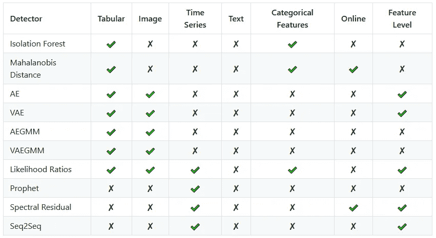
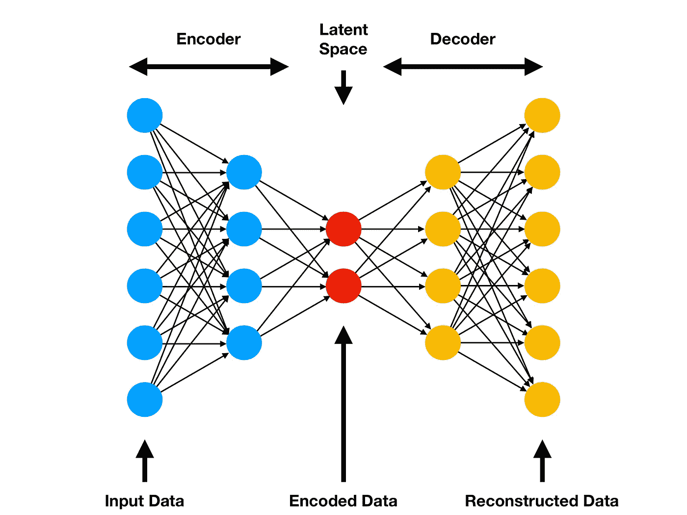
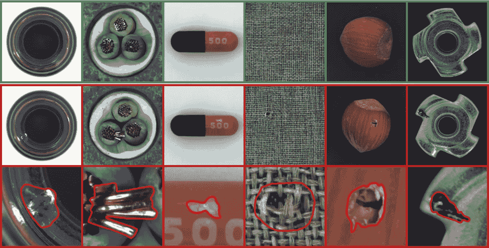
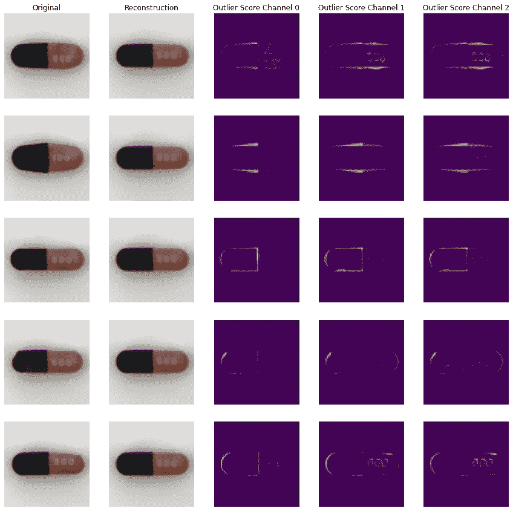

# 使用 Alibi Detect 简化图像异常检测

> 原文：<https://towardsdatascience.com/simplifing-image-outlier-detection-with-alibi-detect-6aea686bf7ba?source=collection_archive---------14----------------------->

## [入门](https://towardsdatascience.com/tagged/getting-started)

由[杰西卡·鲁斯切洛](https://unsplash.com/@jruscello?utm_source=medium&utm_medium=referral)在 [Unsplash](https://unsplash.com?utm_source=medium&utm_medium=referral) 上拍摄的照片

> ***离群*** 名词
> 
> out li er | \ ˈau̇t-ˌlī(-ə)r \
> 1:在数值上明显不同于样本中其他人的统计观察值
> 2:在某一特定群体、阶级或类别中非典型的人或事物

O 异常检测是对与大多数数据有显著差异的数据集元素的识别。这些元素被称为异常值，检测它们有各种动机，这取决于每个案例的领域。一个典型的例子是欺诈检测，其中金融数据集中的异常值可能表示欺诈活动，如使用被盗信用卡的交易。异常值检测也可以用于网络入侵检测，其中异常值是可疑网络活动的记录，指示可能试图获得未授权的访问。上述情况是应用于表格数据的异常值检测的示例，但是它也可以用于其他数据类型，例如图像。工业制造中的质量控制就是使用异常值检测来识别产品图像中的缺陷。

异常值检测有三种基本方法。首先，无监督方法既不需要关于离群值的任何信息，也不需要关于正常元素的任何信息。另一方面，半监督方法需要在一组正常元素上进行训练，并且能够检测那些显著不同的元素。最后，监督方法需要一个带有内点和外点的标记数据集，使它们类似于分类算法，特别适合不平衡的类。关于离群点检测的更详细的介绍，我建议你阅读这篇文章。

# 不在场证明检测

[Alibi Detect](https://docs.seldon.io/projects/alibi-detect/en/latest/) 是一个开源 Python 库，用于异常、敌对和漂移检测，包括各种强大的算法和技术。它还支持各种数据类型，如表格、时间序列和图像。这里列出了 Alibi Detect 包含的所有异常值检测算法，后面的表格显示了每种算法的可能用途。关于每个算法的更多信息，以及相关的研究论文，都包含在链接的文档页面中。

## **离群点检测算法**

*   [隔离林](https://docs.seldon.io/projects/alibi-detect/en/latest/methods/iforest.html)
*   [马氏距离](https://docs.seldon.io/projects/alibi-detect/en/latest/methods/mahalanobis.html)
*   [自动编码器(AE)](https://docs.seldon.io/projects/alibi-detect/en/latest/methods/ae.html)
*   [变分自动编码器(VAE)](https://docs.seldon.io/projects/alibi-detect/en/latest/methods/vae.html)
*   [自动编码高斯混合模型](https://docs.seldon.io/projects/alibi-detect/en/latest/methods/aegmm.html)
*   [变分自动编码高斯混合模型](https://docs.seldon.io/projects/alibi-detect/en/latest/methods/vaegmm.html)
*   [似然比](https://docs.seldon.io/projects/alibi-detect/en/latest/methods/llr.html)
*   [先知时间序列异常检测器](https://docs.seldon.io/projects/alibi-detect/en/latest/methods/prophet.html)
*   [光谱残留](https://docs.seldon.io/projects/alibi-detect/en/latest/methods/sr.html)
*   [序列对序列(Seq2Seq)](https://docs.seldon.io/projects/alibi-detect/en/latest/methods/seq2seq.html)

Alibi 检测库中包含的每个算法的建议用途

# **自动编码器**

自动编码器是一种人工神经网络，由编码器和解码器组成。编码器将输入转换为潜在空间表示，而解码器接收该表示并输出输入数据的重构。自动编码器有各种各样的应用，比如降维和图像去噪，但是在本文的范围内，我们将把重点放在图像异常检测上。

一个简单的自动编码器架构图来自 [Comp Three Inc](https://www.compthree.com/blog/autoencoder/)

在图像异常值检测的情况下，这种类型的神经网络被称为卷积自动编码器，因为编码器和解码器部分由卷积神经网络组成。离群点检测自动编码器在图像数据集上被训练，并且之后能够重建作为输入提供的相似图像。如果输入图像和重建输出之间的差异很大，则该图像可以被标记为异常值。

# **mv tec 广告数据集**

在现实世界条件下测试离群点检测模型的准确性可能具有挑战性，因为数据集离群点的数量通常是我们未知的。我们可以通过在专门为测试目的而创建的数据集上训练我们的模型来克服这个障碍。

MVTec 广告数据集的示例图像—图像由 [MVTec 软件有限公司](https://www.mvtec.com)提供

[MVTec AD 数据集](https://www.mvtec.com/company/research/datasets/mvtec-ad/)包含数千张高分辨率图像，适合测试和基准测试图像异常模型，重点是工业制造质量控制。数据集由 15 类图像组成，如地毯、皮革、晶体管、螺丝等。每个类别的训练集仅包括正常图像，而测试集既有正常图像又有带有各种缺陷的异常值。有关数据集和各种异常值检测算法的基准测试结果的更多信息，可以参考相关的研究论文。

# 带有 Alibi 检测的异常值检测

我们现在将基于 Alibi Detect 库的自动编码器算法创建一个图像异常值检测模型。该模型将在 MVTec AD 数据集的胶囊图像上进行训练和测试，遵循半监督方法，因为训练集将仅由正常(内层)图像组成。

我们从导入必要的库、类和函数开始。之后，我们创建一个函数，从给定的路径加载所有的图像，并将它们转换成一个 numpy 数组。我们使用该函数为我们的模型创建`train`和`test`集合。

我们使用 [TensorFlow/Keras API](https://www.tensorflow.org/guide/keras/sequential_model) 定义卷积自动编码器的编码器和解码器部分。然后我们实例化`OutlierAE`检测器类，它将编码器和解码器层作为输入，并在适当的集合上训练模型。我们还需要定义一个阈值，超过该阈值的元素将被标记为异常值。我们用`infer_threshold`函数计算阈值，该函数将 inlier 值的百分比作为参数。这很方便，但在现实世界中并不总是可行的。之后，我们通过使用`predict`函数检测测试集的异常值，该函数返回一个包含每个元素预测的字典。`instance_score`键包含实例级别的分数，如果该元素高于阈值，则被标记为异常值。此外，`feature_score`键包含图像中每个像素的分数。

首先，我们将所有标记为异常值的图像复制到`img`文件夹中。然后，我们用所有图像的文件名以及探测器的预测创建一个熊猫数据帧。我们创建仅包含异常值的第二个数据帧，然后打印它。该模型相当准确，因为它已经检测到所有异常图像，并且仅将少数正确图像标记为异常(假阳性)。

最后，我们使用`plot_feature_outlier_image`函数为离群元素的每个像素绘制分数。这有助于我们更好地理解异常检测器是如何工作的。第一个图形列包含五个被标记为异常值的图像。接下来，我们可以看到每个图像，因为它是由异常检测器重建的。显然，该模型只能输出正常的胶囊图像，因此不能重建各种变形。接下来的三列是每个图像通道的特征分数可视化，可以帮助我们定位有问题的区域。

# 结论

卷积自动编码器是一个可行的和相当准确的图像异常检测选项，但仍有改进的空间。例如，您可以尝试修改神经网络架构以获得更好的结果。您还应该记住，Alibi Detect 包括其他算法，如变分自动编码器和自动编码高斯混合模型，它们可能适用于特定情况。我鼓励您进行试验，找到符合您需求的最佳解决方案。欢迎在评论中分享您的想法，或者关注我的 LinkedIn，我会定期在那里发布关于数据科学和其他主题的内容。你也可以访问我的[个人网站](https://giannis.io/)或者查看我的新书，书名是[用 PyCaret](https://leanpub.com/pycaretbook/) 简化机器学习。

# 参考

[1] I. Goodfellow，Y. Bengio，a .库维尔，[深度学习](https://www.deeplearningbook.org/) (2016)，麻省理工出版社

[2]r . chal aparty，S. Chawla，[用于异常检测的深度学习:调查](https://arxiv.org/abs/1901.03407) (2019)，arXiv:1901.03407

[3] P .博格曼，m .福瑟，d .萨特勒格，c .斯泰格， [MVTec AD —无监督异常检测的综合真实世界数据集](https://ieeexplore.ieee.org/document/8954181)，2019 年 IEEE/CVF 计算机视觉和模式识别会议(CVPR)