# 用 SymPy 简化机器学习微积分

> 原文：<https://towardsdatascience.com/simplify-calculus-for-machine-learning-with-sympy-8a84e57b30bb?source=collection_archive---------27----------------------->


凯文·Ku 在 [Unsplash](https://unsplash.com/s/photos/machine-learning?utm_source=unsplash&utm_medium=referral&utm_content=creditCopyText) 上的照片

## 快速浏览用于机器学习的微积分，以及如何使用 SymPy 将它添加到您的代码中

机器学习需要一些微积分。许多在线机器学习课程并不总是涵盖微积分的基础，假设用户已经有了基础。如果你和我一样，你可能需要复习一下。让我们来看看一些基本的微积分概念，以及如何使用 SymPy 在代码中编写它们。

很多时候，我们需要微积分来寻找最优化问题中的导数。这有助于我们决定是增加还是减少重量。我们的最终目标是找到一个极值点，它将是函数中的局部最小值或最大值点。

让我们通过以下步骤来完成寻找极值点的过程。

1.  安装和学习 Sympy 的基础知识。
2.  求线性函数的斜率。
3.  发现切线和割线。
4.  用我们的斜率和切线知识来求极限。
5.  理解什么是函数的导数。
6.  用导数求极值点。
7.  决定极值点是局部最小值还是最大值点。

# SymPy 入门

[SymPy](https://www.sympy.org/en/index.html) 是一个 Python 库，可以让你使用*符号*来计算各种数学方程。它包括计算微积分方程的函数。它还包括许多其他函数，用于一些更高级的数学。

安装 SymPy 很简单，你可以在这里找到完整的安装说明。如果您已经在使用 Anaconda，那么 SymPy 也包括在内。有了 Anacona，您可以通过一个简单的:

```
conda update sympy
```

如果您没有使用 Anaconda，pip 是安装新 Python 库的好方法。

```
pip install sympy
```

SymPy 依赖于 mpmath 库，所以你也需要安装它。

```
conda install mpmath
#or
pip install mpmath
```

使用 SymPy，我们可以像在数学方程中一样创建变量。我们需要将这些变量设置为符号，这样 SymPy 就知道将它们与常规的 Python 变量区别对待。这很简单，使用 **symbols()** 函数即可完成。

```
import sympy
x2, y = sympy.symbols('x2 y')
```

现在我们已经安装了 SymPy，让我们后退一步，看看微积分的基础。

# 线性方程和斜率

如上所述，我们需要微积分的一个主要原因是寻找极值点。为了说明这一点，让我们假设你每年都参加年度土豆大炮大赛。每年你都输给可怕的丹尼·麦克道格。今年你雇了一个教练来帮你打败丹尼。要打败丹尼，教练需要你给他三样东西。

1.当丹尼的土豆在最高点时。

2.土豆到达最高点需要多长时间。

3.土豆最高点的斜度。

先说坡度。

如果丹尼在土豆永远上升的地方建造了一个魔法炮，找到斜坡会很容易，但不会有最大高度。这种类型的马铃薯飞行路径是一个线性方程，如 y = 3x+2(y 截距形式)。

我们可以使用 NumPy 和 Matplotlib 来可视化这个线性函数马铃薯飞行。如果您没有安装 NumPy 和 Matplotlib，过程就像上面的 SymPy 安装一样。更多详情见[此处](https://numpy.org/install/)和[此处](https://matplotlib.org/3.3.1/users/installing.html)。

```
import matplotlib.pyplot as plt
import numpy as np#create 100 values for x ranging from 0 to 6
x = np.linspace(0,6,100)#our linear function
y = 3*x + 2#add some aesthetics to out plot
plt.grid(color='b', linestyle='--', linewidth=.5)
plt.plot(x,y, label="potato flight")
plt.xlim(0, 6)
plt.ylim(0,20)
plt.legend(loc='best')
plt.xlabel("Seconds")
plt.ylabel("Feet(x10)")#show the plot we created
plt.show()
```

我们要检查斜率，因此我们将在两个随机点上添加标记:(1，5)和(4，14)。

```
plt.plot(1, 5, 'x', color='red')
plt.plot(4, 14, 'x', color='red')
```


马铃薯以线性函数飞行

当我们有一个线性函数时，我们的斜率是常数，我们可以通过观察任意两点，计算 y 的变化除以 x 的变化来计算斜率，让我们来看看我们之前标记的两点。

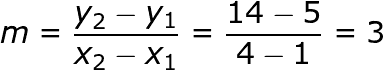

求斜率的方程

在 y 截距形式(y = mx + b)中， *m* 总是斜率。这与我们之前的函数 y = 3x + 2 相符。

# 土豆一定要下来——非线性函数

线性函数的斜率很容易，但土豆必须下降。我们需要一种方法来计算随每个点变化的斜率。让我们从可视化一个更真实的土豆飞行路径开始。

我们的教练很棒，他知道代表土豆飞行的函数是 f(x) = -(x ) +4x。

让我们再一次用 Matplotlib 可视化这个土豆的飞行路径。

```
x = np.linspace(0,5,100)
y = -(x**2) + 4*xplt.xlim(0, 4.5)
plt.ylim(0,4.5)
plt.xlabel("Seconds")
plt.ylabel("Height in Feet(x10)")
plt.grid(color='b', linestyle='--', linewidth=.5)
plt.plot(x, y, label="potato")
plt.legend(loc='best')plt.show()
```

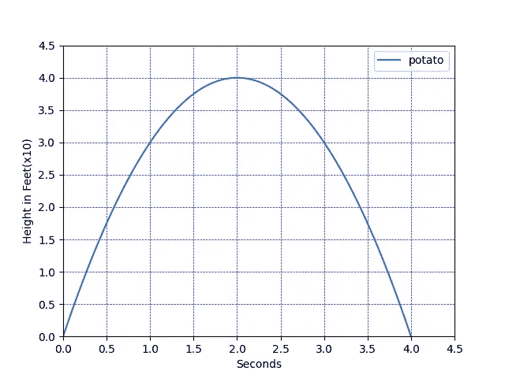

马铃薯的非线性飞行

从函数的可视化来看，我们看到在大约 2 秒钟内，马铃薯达到了大约 40 英尺的高度。该图很有帮助，但我们仍然需要最大高度的斜率。另外我们需要一些确凿的证据带回给教练。让我们继续用微积分证明这个高度和时间。

# 割线

曲线的割线是一条至少在两个不同点处与曲线相交的线。当我们有非线性函数时，我们仍然可以找到两点之间的斜率，或一条割线。由于(2，4)看起来像我们的马铃薯路径的顶部，让我们看看我们新的非线性马铃薯路径上的 2 个点:(1，3)和(2，4)。

```
#adding this code to our above plot
x2 = np.linspace(1,2,100)
y2 = x2 + 2
plt.plot(x2,y2, color='green')
```

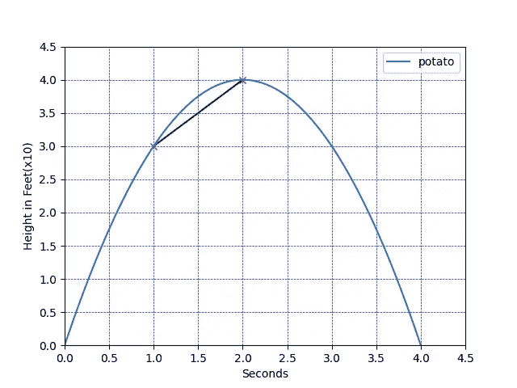

割线 x + 2

我们可以看到(1，3)和(2，4)的斜率是 1。让我们更进一步，看看当我们试图只找到点(2，4)的斜率时会发生什么。为了做到这一点，我们需要一条线，能够代表通过一个点。

# 切线

让我们看看越接近(2，4)线的斜率会发生什么变化。所以我们再画几条割线。我们将端点保持在(2，4)，但一条线将从(1.5，3，75)开始，另一条线从(1.95，3.9975)开始。这又给了我们两条割线 y3 = .5x + 3 和 y4 = .05x + 3.9。

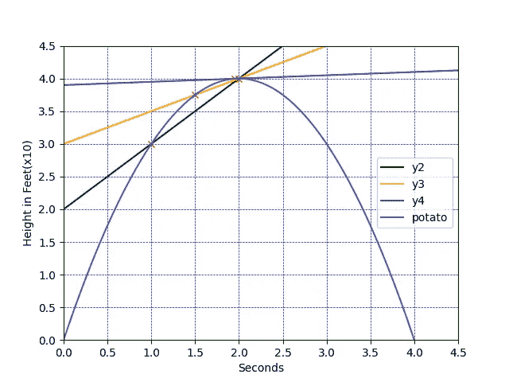

两条割线

当我们最终到达(2，4)作为我们的起点时，一条线形成了，这就是 y = 0x +4。这是(2，4)的切线。通过求解极限并将其代入 y 截距线性方程来计算切线。更多关于极限的内容。函数中的每一点都有一条切线，这就是我们如何计算函数中每一点的斜率。

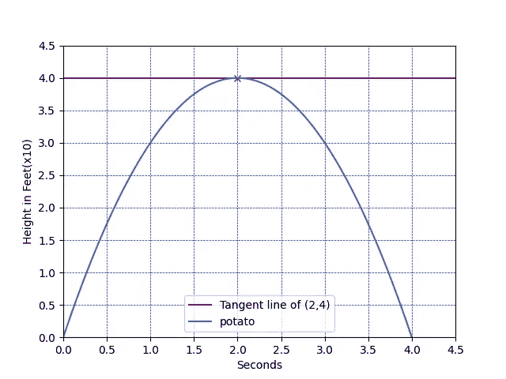

点(2，4)的切线

记住，我们的主要目标是找到一个极值点，土豆的最大高度。极值点将出现在切线斜率为零的时候，因为这表示函数改变了方向。例如，让我们看看穿过(1，3)和穿过(3，3)的切线的斜率。

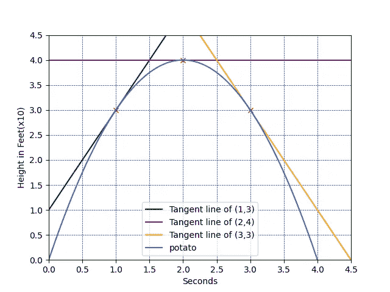

3 条切线

我们来看看这三个点的切线斜率发生了什么变化。

*   点(1，3)，切线为 y = 2x + 1，斜率为 **2**
*   点(2，4)，切线为 y = 0x + 4，斜率为 **0**
*   点(3，3)，切线是 y = -2x + 9，斜率是- **2**

0°之后，斜率改变方向。很好，我们需要找到切线斜率为零的点。这些点将告诉我们最大或最小点，因为切线斜率的方向总是在 0°之后改变。

太好了！所以我们需要在函数上找到一个斜率为零的点。如果有一种方法可以创建一个函数，给出原始函数中任意一点的斜率就好了。有，这就是导数！在我们进入衍生品之前，让我们先看看**极限**。

# 限制

极限允许我们找到函数接近某个 x 值时的斜率。如果我们把极限解成割线，那就简单了。我们代入两个 x 值和两个 y 值，就可以求解斜率方程。这种极限定义了。但是，我们想要找到一个未定义的极限，因为我们想要点到点(2，4)的切线的斜率。

当我们接近(2，4)时，我们需要斜率。我们不能得到从(2，4)到(2，4)的割线的斜率，因为如果我们把这些数字代入斜率方程，我们得到 0/0。这是行不通的，因为正如一位数学老师曾经说过的:“生活中有两件事你不能做，把果冻钉在墙上，然后除以零”。因为我们不能被零除，我们需要找到未定义的极限。

极限是通过将我们的函数代入斜率方程并分解出来解决的。我们可以使用之前的斜率公式，用点(2，4)代替 x1/y1 值，然后用 f(x)和 x 代替 x2/y2 值。我们的极限值是我们正在逼近的 x 值，在这个例子中是 2。函数-(x ) +4x 的极限 2 的新斜率方程为:

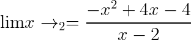

我们的目标是去掉分母上的 x，所以让我们展开-(x)并抵消分母上的 x。

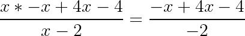

现在我们已经把 x 从分母中去掉了，我们可以把 plug 2 放回 x 中。

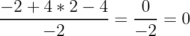

现在我们知道了极限是如何求解的，让我们启动 SymPy，这样我们就可以在代码中求解极限了。

SymPy 有一个名为 **limit()** 的函数，它有 3 个参数。

*   我们正在寻找极限的函数
*   输入变量
*   输入变量接近的数字

因为我们的极限是未定义的，我们需要像上面一样替换 x 和 y 值。

```
import sympy
x2, y = sympy.symbols('x2 y')
#store our substituted function as a y variable
y = (-(x2**2) + 4 * x2 -4) / (x2 -2)
limit = sympy.limit(y, x2, 2)
// 0
```

我们的上限是 0！

# **衍生品**

导数是一个函数，它将给出函数中任意一点切线的斜率。

现在我们明白了极限线和切线是什么，我们可以朝着我们的最终目标前进，用导数来寻找函数中的极值点。求函数导数的过程是 [**微分**](https://en.wikipedia.org/wiki/Derivative#Differentiation) **。**

求解导数需要用到一些代数和上面的斜率公式。因为我们不是在求解一个特定的点，所以我们不会替换任何值。对于此示例，我们也用更常见的形式替换 x1 和 x2，即使用 x 和 x +h。这将为我们提供以下公式来求解 f′(x)的导数，f′(x)表示 x 的函数的导数:

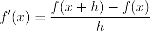

如果我们把函数代入这里，我们得到:

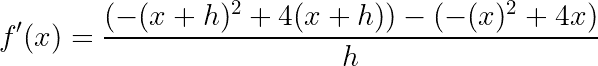

然后我们可以用解决极限的方法来解决这个问题。我们还可以使用[幂法则](https://en.wikipedia.org/wiki/Power_rule)来求解，从而使用以下等式轻松找到我们的导数。

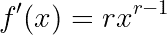

使用该规则，我们可以看到函数 **-(x ) +4x** 的导数是- **2x +4** 。

让我们用 SymPy 来求导，而不是通过手动的步骤来求导。

SymPy 为我们提供了一个名为 **diff()** 的函数，它将执行微分过程并返回导数。

diff 函数有两个参数:

*   我们要求导数的函数
*   输入变量

让我们用我们原来的函数 **-(x ) +4x** 来试试这个函数。

```
# set x as the variable
x = sympy.symbols('x')#help make the out easier to read
sympy.init_printing(use_unicode=True)#enter the our argumnets to th diff funtion
d= sympy.diff(-(x**2) + 4*x, x)#print our derivative
print(d)
//-2*x + 4
```

函数的极值点是导数等于零的地方。这是因为当导数等于 0 时，函数的方向已经改变，正如我们上面所探讨的。

为了找到 x 值，我们将导数设为 0，然后求解 x， **-2x + 4 = 0。**

这是通过使用函数 **solveset()** 用 SymPy 解决的。Solvest 有两个参数:

*   Eq 函数*，它有两个参数:等式和等式需要等于的值*
*   我们试图解决的变量

Solvset 将返回所有解方程的数的集合。

当导数等于 0 时，使用 solvset 来查找 x 值将如下所示:

```
answer = sympy.solveset(sympy.Eq(d, 0),x)
print(answer)
//{2}
```

完美！我们的 x 值是 **2** ，如果我们把它代入原始函数，我们得到 **4** 作为我们的 y 值。

现在我们可以确定，在 2 秒钟时，麦克道戈尔的土豆正好在空中 40 英尺处，并且该点的斜率为 0！我们可以把它带给教练，我们一定会赢得下一场土豆大炮比赛！

# 我们的极值点是最小值还是最大值？

我们知道我们的土豆的极限点一定是最大点，因为这些土豆大炮不是用来击落土豆的。但是如果我们没有图或者不知道函数的方向，我们怎么知道极值点是局部最小值还是局部最大值？我们已经知道，将导数的 x 值设置为 2 会导致斜率为 0。如果我们在我们的导函数中再插入两个数，一个数会大于 2，另一个会小于 2，会发生什么？我们将使用 1 和 3 来尝试。

```
test1 = -2*1 + 4
test2 = -2*3 + 4
print(test1)
//2
print(test2)
//-2
```

我们看到，在极值点之前，斜率是正的，而在极值点之后，斜率是负的。斜率从正到负的变化告诉我们极值点是最大值。如果斜率从负变为正，我们就知道极值点是最小值点。如果有多个极值点，我们希望在每个点之间选择一个值。例如，如果我们有极值点 1 和 5，我们将重复这个过程三次:

*   选择一个小于 1 的随机数
*   选择一个大于 1 但小于 5 的随机数
*   选择一个大于 5 的随机数

很可能非线性函数不会只有一个极值点。在这种情况下，所有的步骤都是一样的，但是当我们求解导数等于零时，我们得到了多个解。

# 结论

SymPy 是一个庞大的库，是一个很好的方法来寻找导数和函数的局部极值点。SymPy 易于使用和阅读，为任何需要微积分的机器学习项目增加了简单性和可读性。我们只涉及了这个[库](https://www.sympy.org/en/index.html)的许多可用函数中的一小部分。我鼓励您进一步探索它，看看还有什么可以用来将数学融入到您的数据科学项目中。