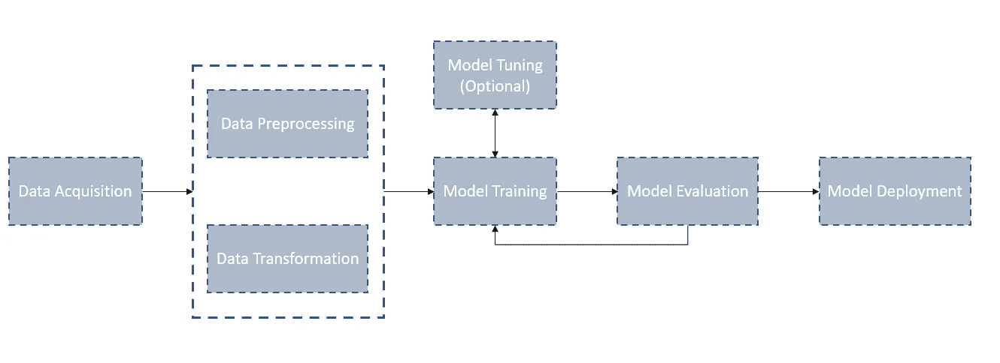
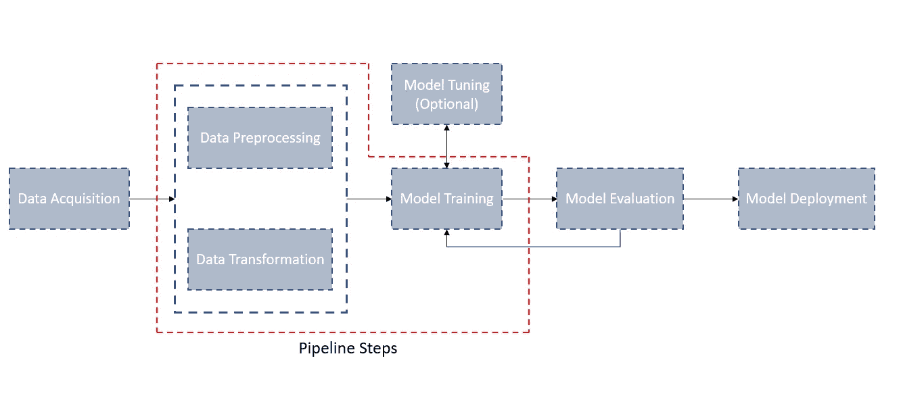
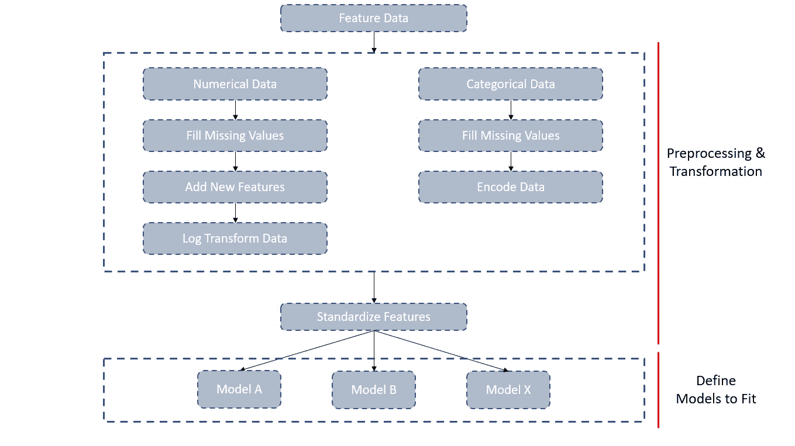
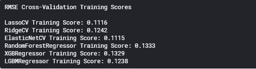
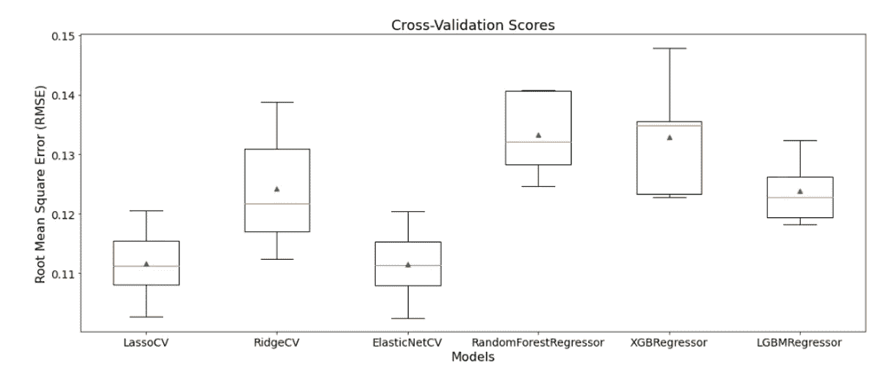

# 简化机器学习工作流程

> 原文：<https://towardsdatascience.com/simplify-machine-learning-workflows-e9d4f404aaeb?source=collection_archive---------31----------------------->

## 如何使用管道来标准化机器学习工作流的数据预处理、数据转换和建模步骤

杰里米·毕晓普在 [Unsplash](https://unsplash.com?utm_source=medium&utm_medium=referral) 上的照片

**本文概述了如何使用定制转换器和 Scikit-Learn 管道捆绑数据预处理、数据转换和机器学习工作流的建模步骤。包含探索性数据分析(EDA)的详细笔记本可以在我的** [**GitHub**](https://github.com/david-hurley/kaggle-comps) **上找到。**

**本教程的结果是在 Kaggle Ames Housing 数据集上使用 Pipelines 的一个示例，其中我们获得了排行榜前 20%的分数！**

# 机器学习工作流

虽然有许多方法来构建机器学习(ML)工作流，但基本结构可以被认为是以下步骤:

1.  **数据采集:**收集数据
2.  **数据预处理:**剔除异常值，替换缺失值等。
3.  **数据转换:**添加特性，标准化数据等。
4.  **模型训练&调优:**选择模型、交叉验证、调优超参数等。
5.  **模型评估:**分析模型性能
6.  **模型部署:**根据测试数据进行预测

基本 ML 工作流程

# 机器学习工作流程陷阱

即使是简单的 ML 工作流程也会变得复杂。例如，假设有 10 个预处理/转换步骤应用于训练和测试数据。此外，您希望测试多个模型，并执行交叉验证和超参数调整。一些数据科学家可能会拼凑杂乱的代码块，并试图手动跟踪每一步。然而，有几个原因可以解释为什么这很快变得不切实际，甚至对您的建模工作有害。

**在管道外执行 ML 工作流程的挑战:**

*   **训练-测试污染:**当您对整个数据集执行预处理/转换步骤，而不是对单个训练、验证和测试数据组件执行预处理/转换步骤时，就会发生这种形式的数据泄漏。一个典型的例子是在分割前标准化数据集，这可能导致验证甚至测试数据的高性能。
*   **非统一预处理/转换:**即使您将数据集分成训练、验证和测试数据组件，您现在也必须跟踪每个组件，并记住应用相同的预处理/转换。在复杂的 ML 工作流中，这可能很难做到，甚至更难执行“堆栈跟踪”。
*   **交叉验证:**当你不得不跟踪应用不同模型的每个代码块，或者更糟糕的是，对于循环来说，一个庞大而繁琐的*，几乎不可能“干净地”执行多个模型的交叉验证测试。*
*   **部署:**即使你部署了它而没有不可追踪的错误，你也不能轻易地改变工作流中的组件。

# 输入管道

管道是捆绑数据预处理、转换和建模代码的一种简单方法，允许您像应用单个步骤一样应用“捆绑”。这意味着不再有列车测试污染或忘记预处理/转换步骤。只要您在应用管道之前拆分数据，每个数据集将接收相同且独立的预处理/转换。它还使得交叉验证、模型调整和模型部署更加简单和清晰。

具有示例管道的基本 ML 工作流

# 一个例子

本节提供了一个使用 Scikit-Learn 管道和定制转换器来交叉验证和比较几个模型的示例。

## 数据

我将使用来自 Kaggle 竞赛*房价:高级回归技术的 Ames 房产数据集。该数据集有 79 个特征，混合了数字和分类，并包括变量，如房屋各部分的平方英尺、社区以及建造和出售的年份。数据可以通过 [Kaggle 比赛页面](https://www.kaggle.com/c/house-prices-advanced-regression-techniques/data)访问。*

## 定义管道

首先，我们需要定义管道步骤。我将执行非常基本的数据预处理/转换和特征工程。基本上，它只是足够加上一点额外的东西来将我们的数据转换成 Scikit-Learn 模型可以接受的东西。

Ames 住房数据集的 Scikit-Learn 管道

首先，需要定义数值和分类数据列(这些数据的预处理和转换涉及不同的步骤)。然后，我们希望定义一个管道类，并在嵌套管道中包含适用的数据转换类(即数据预处理/转换步骤)。我们可以通过将多个转换类和嵌套管道包含在 FeatureUnion 类中来连接它们的结果。这里的[是一个很好的来源](http://zacstewart.com/2014/08/05/pipelines-of-featureunions-of-pipelines.html)来获取更多关于构建管道和特征联合的信息。要素数据集被传递到执行以下操作的管道中:

**数字列:**提取数字列，估算缺失值，生成新要素总平方英尺，log 转换数据。

**分类列:**提取分类列，估算缺失值，编码分类数据

**标准化:**feature union 将经过处理/转换的数字和分类数据结合起来，并对这些数据进行标准化。

## 定制变压器

有时候我们需要一个不附带 Scikit-Learn 的变压器。例如，我们可能希望创建一个新的特性，或者希望现有的 Scikit-Learn 转换器返回一个熊猫数据帧。幸运的是，Scikit-Learn 和 Python 通过 TransformerMixin 和类继承简化了这一过程。

**下面是每个定制转换器的简要总结:**

*   **列提取器():**自定义转换器类，用于从特征数据集中提取选择列。
*   **dfSimpleImputer():**从 simpleinputr()类继承并返回 Pandas DataFrame 的自定义转换器类。
*   **DFOneHotEncoder():** 自定义 transformer 类，该类从 OneHotEncoder()类继承并返回 Pandas DataFrame。
*   **TotalSF():** 自定义 transformer 类，用于计算房屋的总面积。

## 创建和评估管道

现在我们已经定义了管道，我们可以把它们放在一起。首先，我们定义一个助手函数，它采用一个管道，对一个特定的模型执行 X 重交叉验证，并返回房屋销售价格日志的均方根误差(RMSE)。接下来，我们定义我们想要训练的模型，并为循环创建一个*，其中每个循环定义“完整管道”，该管道是预处理/转换步骤(即最后一部分)和选择模型的组合。循环*的*结果是每个模型的交叉验证 RMSE 分数以及模型分数和标准偏差的箱线图比较。这里[是制作交叉验证箱线图的绝佳资源](https://machinelearningmastery.com/stacking-ensemble-machine-learning-with-python/)。*

交叉验证 RMSE 分数

各种模型的箱线图交叉验证 RMSE 分数

# 结论

在本教程中，我们定义并创建了一个管道来预处理/转换 Kaggle Ames 住房数据集，并使用 X 倍交叉验证 RMSE 评分来评估模型。结果是一个易于跟踪和调试的管道，返回 RMSE 分数在 Kaggle 排行榜的前 20%。

将管道添加到您的数据科学武库中，保持有序和高效！