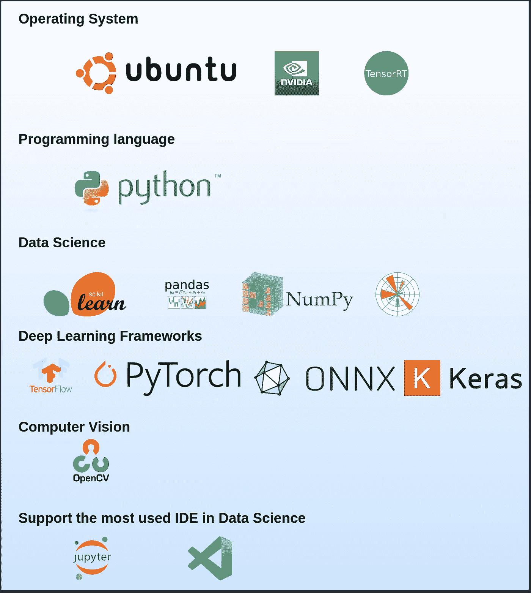
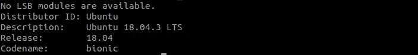
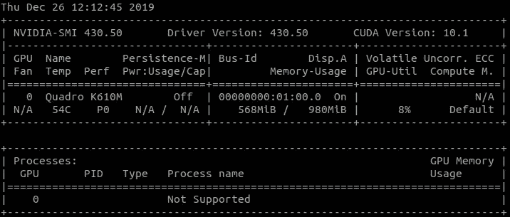
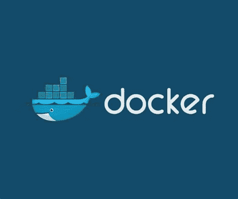
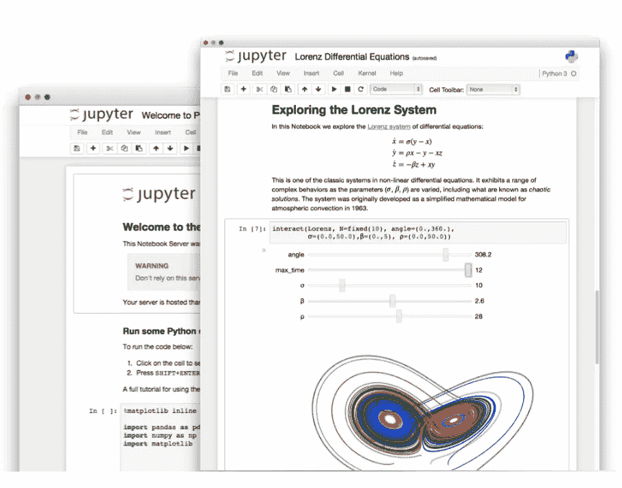
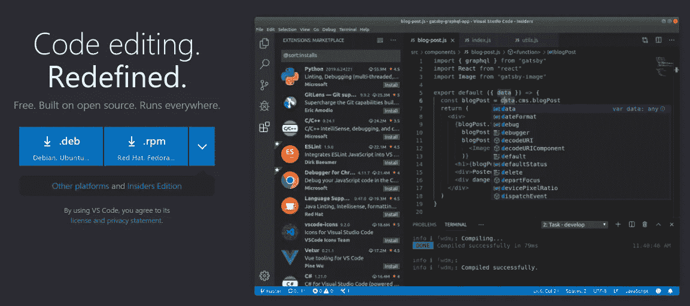
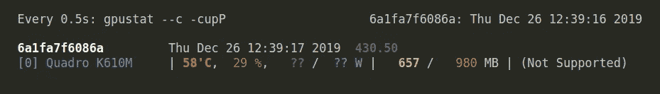
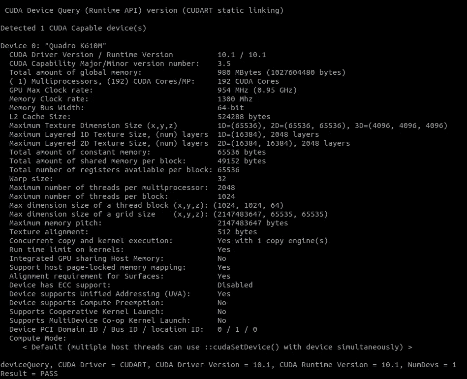

# 使用此工具简化您的数据科学项目

> 原文：<https://towardsdatascience.com/simplify-your-data-science-project-with-this-tool-c493b9970280?source=collection_archive---------35----------------------->

## 数据科学家开发和导出机器学习模型的理想工具



【https://github.com/amineHY/AI-LAB 

# 🚀链接到项目

*   Github 项目:[https://github.com/amineHY/AI-LAB](https://github.com/amineHY/AI-LAB)
*   docker Hub:[https://Hub . docker . com/repository/registry-1 . docker . io/amine hy/ai-lab](https://hub.docker.com/repository/registry-1.docker.io/aminehy/ai-lab)

# 描述

这个项目是为数据科学家创造一个开发环境。它帮助用户以简单的方式开发机器学习模型，

*   关注代码，而不是工具。
*   节省安装过程中可能浪费的时间。
*   防止通过安装不兼容的软件包破坏操作系统。

我手工制作了`AI-lab`(在 [NVIDIA 容器](https://ngc.nvidia.com/catalog/containers/nvidia:tensorrt)之上)并利用 [Docker](https://www.docker.com/products/docker-desktop) 的功能来拥有一个可复制和可移植的开发环境。

`AI-lab`允许使用最常见的人工智能框架在 Python 中开发基于人工智能(AI)的应用程序。`AI-lab`旨在用于构建、培训、验证、测试您的深度学习泰格豪雅

例如，模型是进行迁移学习的好工具。

它包括:

*   Ubuntu 18.04
*   NVIDIA CUDA 10.1
*   英伟达 cuDNN 7.6.0
*   OpenCV 4.1
*   Python 3.6
*   最常见的 AI 框架:TensorFlow、PyTorch、ONNX、Keras、ONNX-tensort、Jupyter-lab、VS 代码集成远程开发、Numpy、Matplotlib、Scikit-learn、Scipy、Pandas、tensort 等等。

# 安装人工智能实验室

在使用`AI-lab`之前，需要在操作系统上安装一些先决条件

*   您必须拥有 AMD64 架构的操作系统。在终端检查一下

```
dpkg --print-architecture
```

比如我用的是 Ubuntu 18.04.3 LST。您可以用这个命令检查您的系统

```
lsb_release -a
```



*   [NVIDIA 驱动](https://www.nvidia.com/Download/index.aspx)和 [CUDA 工具包](https://developer.nvidia.com/cuda-downloads)。

```
nvidia-smi
```

在我的笔记本电脑上，我有 NVIDIA 驱动程序版本 430.50 和 CUDA 版本 10.01。



*   Docker-ce 必须安装在您的操作系统上。要安装或重新安装 docker-ce，请遵循最初的 Docker-ce [安装指南](https://docs.docker.com/install/linux/docker-ce/ubuntu/)，包括 Linux 的[安装后](https://docs.docker.com/install/linux/linux-postinstall/)步骤。



码头工人

# 使用

## **首先从 Docker Hub 注册表中拉出 AI-lab**:[AI-lab](https://hub.docker.com/repository/docker/aminehy/ai-lab)

```
docker pull aminehy/ai-lab
```

最新的图像大约有 9.97GB，所以请确保您有足够的空间(和高速互联网)。

## 然后运行人工智能实验室，开始你的开发

```
xhost 
```

然后

```
docker run -it --rm -v $(pwd):/workspace -w /workspace -v /tmp/.X11-unix:/tmp/.X11-unix -e DISPLAY=$DISPLAY --runtime=nvidia -p 8888:8888 -p 6006:6006 aminehy/ai-lab
```

搞定了。

## **安装 UFF 转换器** `**convert-to-uff**` **(如果需要)**

运行 AI-lab 后，使用以下命令移动到`/opt/tensorrt/python`文件夹并安装`convert-to-uff`:

```
cd /opt/tensorrt/python dpkg -i *-tf_*.deb UFF_PATH="$(python -c 'import uff; print(uff.__path__[0])')" chmod +x ${UFF_PATH}/bin/convert_to_uff.py ln -sf ${UFF_PATH}/bin/convert_to_uff.py /usr/local/bin/convert-to-uff
```

# 启动 IDE 并开始开发您的应用程序

## Jupyter 笔记本

如果`AI-lab`在您的机器上正确运行，那么`Jupyter notebook`应该会自动运行。如果不是这样，请使用以下命令从终端启动它

```
jupyter notebook --allow-root --port=8888 --ip=0.0.0.0 --no-browser
```



jupyter 笔记本

## VS 代码

[VS Code](https://code.visualstudio.com/) 是一个 IDE，它提供了从 docker 容器内部(即`AI-lab`内部)通过扩展[远程开发](https://marketplace.visualstudio.com/items?itemName=ms-vscode-remote.vscode-remote-extensionpack)进行开发的可能性。更多详情[此处](https://code.visualstudio.com/docs/remote/containers)。

我在文件夹`AI-LAB_in_vscode`中添加了两个配置文件夹`.devcontainer`和`.vscode`。他们必须能够通过`AI-lab`使用 VS 代码。这两个文件夹是隐藏的，必须位于应用程序的目录中，以便 VS 代码自动检测`AI-lab`配置。因此，您需要将它们复制到应用程序文件夹中。

要获得这些文件夹，首先，克隆这个存储库并移动到其中

```
git clone [https://github.com/amineHY/AI-lab.git](https://github.com/amineHY/AI-lab.git) cd /AI-lab
```

将这两个文件夹复制到您的应用程序文件夹，例如`/path_to_folder_application`

```
sudo cp -R AI-lab/AI-LAB_in_vscode/.* /path_to_folder_application
```

最后，移动到您的应用程序文件夹

```
cd /path_to_folder_application
```

和启动 VS 代码

```
code .
```



虚拟代码

# 显示 GPU 的内存使用情况

根据您的开发情况，您可能希望观察 GPU 的内存消耗。多亏了`gpustat`，你才能做到这一点

```
watch -n0.5 -c gpustat --c -cupP
```

我的操作系统的输出:



# 用`deviceQuery`显示关于 GPU 的信息

在终端中，运行`deviceQuery`脚本(在这个库中提供)来获得更多关于你的 GPU 配置的信息

```
./deviceQuery
```

我的操作系统的输出:



## 参考

*   Github 项目:[https://github.com/amineHY/AI-LAB](https://github.com/amineHY/AI-LAB)
*   docker Hub:[https://Hub . docker . com/repository/registry-1 . docker . io/amine hy/ai-lab](https://hub.docker.com/repository/registry-1.docker.io/aminehy/ai-lab)

**有什么建议吗？**

*   请在 [GitHub](https://github.com/amineHY/AI-LAB) 上创建一个问题。
*   在 [LinkedIn](https://www.linkedin.com/in/aminehy/) 上和我联系。

**阅读我的另一篇关于媒介的文章:**

*   [你在部署之前优化过你的深度学习模型吗？](/have-you-optimized-your-deep-learning-model-before-deployment-cdc3aa7f413d)
*   [在 PyTorch 中实现的图像分类深度学习](/convolutional-neural-network-for-image-classification-with-implementation-on-python-using-pytorch-7b88342c9ca9)
*   [如何撰写和发表研究论文](/how-to-write-and-publish-a-research-paper-3692550a5c5d)