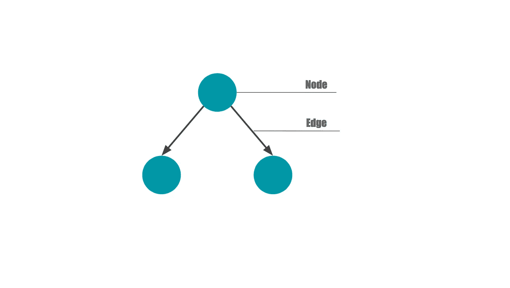
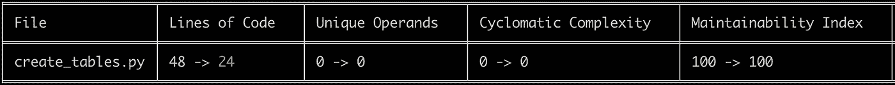
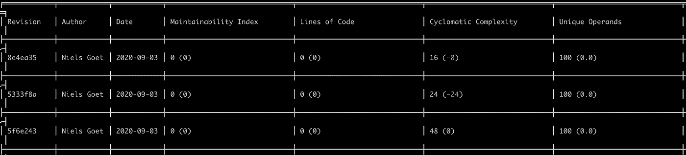
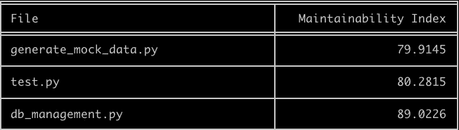
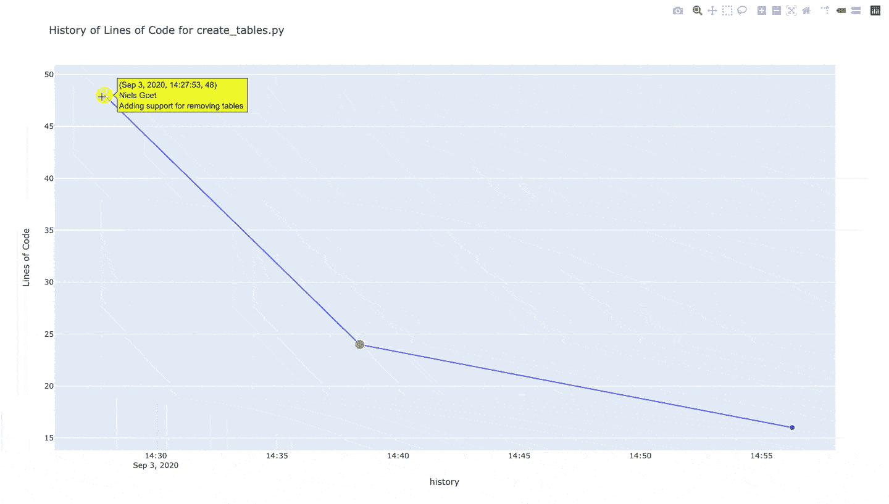

# 简化您的 Python 代码:用 Wily 自动化代码复杂性分析

> 原文：<https://towardsdatascience.com/simplify-your-python-code-automating-code-complexity-analysis-with-wily-5c1e90c9a485?source=collection_archive---------28----------------------->


约翰·巴克利在 [Unsplash](https://unsplash.com?utm_source=medium&utm_medium=referral) 上的照片

## 以下是如何让评估代码复杂性成为 Python 开发例程的一部分

所以你写了一段 Python 代码，它完成了工作。很好，但是你的代码足够简单吗？复杂的代码很难阅读，这使得代码维护成本更高。尽早发现复杂性可以节省时间、金钱和许多挫折。在这篇文章中，我将向您展示如何使用[老谋深算的命令行工具](https://wily.readthedocs.io/en/latest/)来跟踪代码的复杂性。

# 代码复杂性快速入门

代码复杂性很重要。不必要的复杂代码更难阅读，也更难维护。如果你的代码很难理解，就很难发现现有的错误，也很容易引入新的错误。笨重的代码使团队工作变得复杂，并且很难让新同事跟上进度。科技公司必须满足复杂性门槛，这是有原因的。

开发人员使用几种不同的代码复杂度度量方法。复杂性分析工具中普遍存在两种这样的度量。

## 麦凯布的循环复杂性

首先，[麦凯布的循环复杂性](http://www.literateprogramming.com/mccabe.pdf) (CYC)依赖于图论。由 Thomas McCabe 在 1976 年开发的度量是从一个函数的控制流图中计算出来的，控制流图由节点和边组成。



流程图中的节点和边(图片由作者提供)

基于这样的图表，我们可以使用以下公式计算 CYC:

```
CYC = E – N + 2P
```

在这个公式中，`P`是谓词节点(即包含 if/else 条件的节点)的数量，`E`是边的数量，`N`是节点的数量。CYC 实际上是通过你的模块的独立路径的数量的度量，给出了代码理解的困难程度的一些指示，以及需要多少单元测试来实现完全的测试覆盖(即它的“可测试性”)。

CYC 的值越高，代码就越复杂。卡内基梅隆大学的软件工程研究所定义了以下范围(参见本出版物第 147 页的[):](https://resources.sei.cmu.edu/asset_files/Handbook/1997_002_001_16523.pdf)

*   **1–10**:风险低，程序简单；
*   **11–20**:中等风险，难度较大的项目；
*   **21–50**:高风险，非常难的项目；
*   **> 50** :风险极高，不可测试的程序。

## 可维护性指数

其次，[可维护性指数(MI)](http://www.ecs.csun.edu/~rlingard/comp589/ColemanPaper.pdf) 是 McCabe 度量(C)[Halstead 量](https://www.geeksforgeeks.org/software-engineering-halsteads-software-metrics/) (V)和代码行数(LoC)的组合。在公式中:

```
MI = 171 - 5.2*ln(*V*) - 0.23*(*C*) - 16.2*ln(*LoC*)
```

MI 在理论上被限制在 0 到 100 之间，但在实践中不是这样(大多数软件实现将其限制在 100)。最初介绍度量标准的文章提到了以下阈值:如果你的代码的 MI 低于 65，那么它就很难维护；如果是 85 或者更高，你的代码很容易维护。65 到 85 之间的任何值都是适度可维护的([科尔曼、洛瑟和阿曼，1994](http://www.ecs.csun.edu/~rlingard/comp589/ColemanPaper.pdf) )。Visual Studio[使用的重新调整版本(在 0 到 100 之间)将阈值分别设置为 0 到 9 表示低可维护性，10 到 19 表示中等可维护性，20 及以上表示高可维护性。(请注意，不同的 ide 和库可能使用不同的阈值。)](https://docs.microsoft.com/en-us/visualstudio/code-quality/code-metrics-values?view=vs-2019)

## 对 CYC 和米的警告

出于多种原因，不应该孤立地使用 CYC 和 MI 来确定您的代码是否过于复杂或难以维护。

首先，这些度量没有考虑其他不必要的复杂性指标，比如代码重复、嵌套深度或可读性。第二，MI 尤其受到一系列问题的困扰，这使得它不一致。它是几十年前校准的，并对它使用的一些变量的增加和减少如何影响整体复杂性做出了一些相当可疑的假设。(关于 MI 缺点的更详细的评估，请看代尔夫特理工大学教授 Arie van Deursen 的这篇出色的博客文章。)

最后，我们应该预期 MI 的值会根据您所分析的框架而有所不同。因此，像代码行(LOC)这样的简单度量可能是首选的。

这些限制确实给了我们一些何时以及如何使用 CYC 和 MI 的想法。首先，MI 不能可靠地用于比较两个不同系统的复杂性，即使它们是使用相同的框架构建的。第二，当一段代码足够简单和可维护时，我们不能使用硬截止，因为这些度量不能脱离人类评估和代码库的专家知识。

相反，CYC 和 MI 可能是有用的——与其他更简单的度量标准结合——如果我们将它们视为帮助我们识别代码中潜在问题的试探法。如果我们定期评估我们的代码，并观察度量标准如何随着时间的推移而演变，这可能特别有用。突然和巨大的变化应该引起我们的注意，并促使我们进一步研究。不用说:和大多数代码质量工具一样，CYC 和 MI 应该在你的开发工作流程中补充质量控制，而不是取代它。

# 使用预提交挂钩将代码复杂性分析集成到您的工作流中

在这篇文章的剩余部分，我将向你展示如何在你的 Python 开发工作流程中集成[和](https://wily.readthedocs.io/en/latest/)，在每次提交新代码时为你执行复杂性分析。Wily 是一个命令行工具，允许您分析、跟踪和可视化 Python 代码的复杂性和可维护性。虽然 [mccabe](https://pypi.org/project/mccabe/) 和 [radon](https://pypi.org/project/radon/) 库提供了类似的功能，但是 wily 有一些很好的特性，允许我们相对容易地跟踪复杂性。下面的视频是作者安东尼·肖对《诡计》的介绍。

老谋深算的 Python:编写更简单、更易维护的 Python — PyCon 2019

检测代码复杂性的用处取决于您执行分析的频率。如果你定期检查你的代码复杂性，你可以很容易地发现突然增加。这样的异常值不一定有问题，但是它们应该促使您进行调查。确保你经常获得这些见解的最好方法是在你的项目的[预提交钩子](https://pre-commit.com)中包含老谋深算。

预提交钩子是一些小的“脚本”,当使用`git commit`命令时，它们在本地运行在暂存文件上。(如果你想了解更多关于预提交钩子的知识，你可能会对我在[上发表的使用预提交钩子自动执行代码风格](https://medium.com/python-in-plain-english/how-to-improve-your-python-code-style-with-pre-commit-hooks-e7fe3fd43bfa)的文章感兴趣。)

## 安装预提交库

要开始使用预提交钩子，首先使用终端安装预提交库(关于 Homebrew 和 Conda 的说明可在本页[获得](https://pre-commit.com)):

```
pip install pre-commit
```

您可以使用下面的命令检查安装是否成功。此命令应返回预提交安装的版本。

```
pre-commit --version
```

## 创建和配置您的。yaml 文件

安装完`pre-commit`之后，创建一个`.yaml`文件。您的`.yaml`文件指定了您的预提交钩子配置。在终端中使用以下命令在您的项目目录中创建新的`.yaml`文件:

```
nano .pre-commit-config.yaml
```

随后，添加以下配置:

```
repos:
-   repo: local
    hooks:
    -   id: wily
        name: wily
        entry: wily diff
        verbose: true
        language: python
        additional_dependencies: [wily]
```

## 使用预提交

现在您已经安装了预提交包并设置了您的`.yaml`文件，您已经准备好使用预提交和 wily 来分析代码复杂性了。首先，在终端中运行以下命令来安装预提交挂钩:

```
pre-commit install
```

安装好预提交钩子后，每次提交对 git 的更改时，都会执行`pre-commit`命令。或者，您可以使用以下命令直接从终端运行预提交挂钩:

```
pre-commit run
```

# 老谋深算入门

在可以使用带有预提交的 wily 之前，您必须从终端运行`wily build`。 [build](https://wily.readthedocs.io/en/latest/commands/build.html) 命令编译您最近 50 次提交中代码复杂性变化的缓存。您需要这个缓存，以便 wily 可以计算您提交的度量。或者，您可以使用`wily setup`并遵循终端中的指示。

在您设置和配置了预提交并创建了您的老谋深算的缓存之后，`wily diff`命令将在每次新提交时自动运行。在新提交时，您的终端输出将显示当前提交的代码版本与前一版本相比的复杂性。下面的输出显示了删除一些代码行后的 wily 的 diff 报告示例。我们获得了四个分数，包括代码行数(LOC)、唯一操作数以及圈复杂度和可维护性指数。如果您的复杂性在相对较小的更改后急剧增加，您可能应该暂停并重新考虑您刚刚做出的更改。



结合预提交使用“wily diff”命令进行新提交后的代码复杂性分析(图片由作者提供)

了解代码在两次提交之间是如何变化的是很有用的，但是并没有给我们太多的数据来处理。为了识别和区分潜在的问题领域，我们必须考虑一个特定的模块是如何随着时间而变化的。要获得此信息，请在终端中运行以下命令:

```
wily build
wily report <my-module-name>
```

如下例所示， [report](https://wily.readthedocs.io/en/latest/commands/report.html) 命令将生成一个 CLI 表，显示指定模块的所有提交之间复杂性度量的变化。这个报告可以让你很容易地发现变化，以及复杂性的模式和趋势，以及你可能出错的地方。



使用“老谋深算的报告”命令分析提交之间的复杂性差异(图片由作者提供)

另一个识别大型项目中(潜在)有问题模块的有用命令是`wily rank`，它将显示不同模块的可维护性指数。在这种情况下，所有值都高于 75，这意味着它们很容易维护。(请注意我在本文前面概述的使用可维护性指数的注意事项)。



使用“wily rank”命令计算 Python 模块的可维护性指数(MI)

最后，在绘制不同提交的一段代码的复杂性时，最容易发现趋势。您可以使用 [graph](https://wily.readthedocs.io/en/latest/commands/graph.html) 命令显示模块的复杂性报告，例如:

```
wily graph create_tables.py loc sloc complexity
```

这个命令将产生一个`create_tables.py`模块的图(见下文)，在 y 轴上显示代码行，在 x 轴上显示提交，以及由每次观察的气泡大小表示的复杂性。



用 Wily 绘制代码行(LOC)(行)和循环复杂度(气泡大小)

结合起来，wily 的`diff`、`report`、`rank`和`graph`命令可以提供有用的信息，告诉你你的代码是否变得不必要的复杂。

# 超越诡计:简化您的 Python 代码

编写简单、清晰、易读的代码具有挑战性。虽然[代码风格](https://medium.com/python-in-plain-english/how-to-improve-your-python-code-style-with-pre-commit-hooks-e7fe3fd43bfa)和[(单元)测试](/automating-unit-tests-in-python-with-hypothesis-d53affdc1eba)在很大程度上可以自动化，但是代码本身的设计仍然是一项人工任务。也就是说，如果机器编程的最新进展没有让开发人员过时的话。自动化复杂性分析可以帮助您做出明智的决策，决定何时重新考虑您的代码，以及您的代码库的哪些区域应该优先考虑。这些分析永远不能取代正确的代码设计过程，但是它可以在开发过程中避免不必要的错误和捕捉潜在的问题。

感谢阅读！

MI 的原始版本。请注意，存在不同版本的 MI。参见 [Radon 关于该指标的文档](https://radon.readthedocs.io/en/latest/intro.html)。

Visual Studio 的重新调整 MI 可以使用下面的公式计算:`MAX(0,(171–5.2*ln(V) — 0.23 * (C) — 16.2*ln(LoC))*100 / 171)`。详见本文。

[](https://medium.com/@ndgoet/membership) [## 用我的推荐链接加入媒体。

### 作为一个媒体会员，你的会员费的一部分会给你阅读的作家，你可以完全接触到每一个故事…

medium.com](https://medium.com/@ndgoet/membership) 

*您有兴趣了解更多关于自动化 Python 开发过程的知识吗？看看我之前关于这个话题的一些帖子:*

[](/automating-unit-tests-in-python-with-hypothesis-d53affdc1eba) [## 使用假设在 Python 中自动化单元测试

### 单元测试是产生高质量代码的关键。以下是如何自动化测试 Python 代码。

towardsdatascience.com](/automating-unit-tests-in-python-with-hypothesis-d53affdc1eba) [](https://medium.com/python-in-plain-english/how-to-improve-your-python-code-style-with-pre-commit-hooks-e7fe3fd43bfa) [## 如何用预提交钩子改进 Python 代码风格

### 实施代码风格是简化开发过程的关键，下面是如何实现自动化。

medium.com](https://medium.com/python-in-plain-english/how-to-improve-your-python-code-style-with-pre-commit-hooks-e7fe3fd43bfa) 

*请仔细阅读* [*本免责声明*](https://medium.com/@ndgoet/disclaimer-5ad928afc841) *中的任何内容后再依托* [*我的 Medium.com 文章*](/@ndgoet) *。*