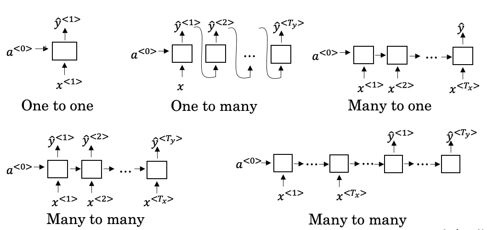
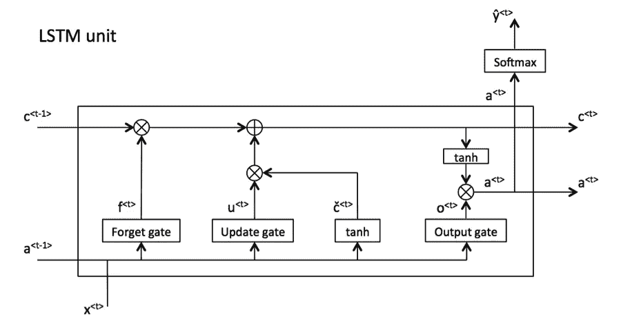

# 了解格鲁、LSTM 和 RNNs

> 原文：<https://towardsdatascience.com/simplifying-grus-lstm-and-rnns-in-general-8f0715c20228?source=collection_archive---------44----------------------->

## 在这篇文章中，我们讨论了序列模型的工作原理及其应用。

序列模型是一类特殊的深度神经网络，可应用于机器翻译、语音识别、图像字幕、音乐生成等。序列问题可以是不同类型的，其中输入 X 和输出 Y 可能都是长度相同或不同的序列。也可以是 X 或 Y 中只有一个是序列。以下是 RNNs 应用的几个例子:

吴恩达在 Coursera 上的图片

# 单词表示法

如果输入是一个句子，那么每个单词都可以表示为一个单独的输入，如 x(1)、x(2)、x(3)、x(4)等。那么，我们如何表示句子中的每个单词呢？我们需要做的第一件事是拿出一个字典，包含我们在输入句子中可能有的所有单词。字典中的第一个词可能是“a”，再往下我们可能会找到“and”或“after”，最后一个词可能是“zebra”或“zoo”之类的词。准备字典真的是在我们的手中，因为我们可以包括尽可能多的单词。一本字典的长度可以从 10，000 到 100，000 不等，甚至更多。

假设我们有一个命名实体识别问题，其中 X 是一个输入句子，如“杰克和吉尔上山了”Y 是表示每个输入单词是否是人名的输出。因此，本质上 y(1)，y(2)，y(3)，y(4)如果是人名，则为 1，否则为 0。并且 x(1)，x(2)，x(3)，x(4)将是长度为 10，000 的向量，假设我们的字典包含 10，000 个单词。例如，如果 Jack 出现在我们的字典中的第 3200 个位置，x(1)将是一个长度为 10，000 的向量，在第 3200 个位置包含 1，在其他位置包含 0。可能会有这样的情况，输入序列中的一个单词在我们的字典中不存在，为此，我们可以使用一个单独的标记，如“unknown”或其他。

# 为什么我们需要 RNNS？

下一步是建立一个神经网络来学习从 X 到 y 的映射。一种可能性是使用一个标准的神经网络，在我们的情况下，将七个单词作为输入，以七个一键向量的形式输入到标准的神经网络，然后是一些隐藏层和一个 softmax 层，最后，通过将 0 或 1 作为输出来预测每个单词是否是一个人的名字。但是这种方法有两个问题，一个是对于不同的例子，输入可以有不同的长度，在这种情况下，标准的神经网络将不起作用。其次，像这样幼稚的架构不会共享出现在文本不同位置的特征。例如，如果网络已经知道在文本的第一个位置出现的 Jack 是一个人的名字，如果 Jack 出现在任何位置 x_t，它也应该将 Jack 识别为一个人的名字。

吴恩达在 Coursera 上的图片

由于这些原因，我们需要一个递归神经网络，其中第一层的输入是字向量 x(1)和一个激活函数 a_0，它可以用几种不同的方式初始化。第一层的输出将是 y(1)，表示 x(1)是否是人名。第二层将具有来自第一层的输入 a(1 ),第二字向量 x(2)给出输出 y(2 ),依此类推，直到最后一层或最后一个时间步将具有输入 a(t-1)和 x(t)给出输出 y(t)。

因此，在递归神经网络中，信息从左向右流动，在对 y(3)进行预测时，来自 x(1)和 x(2)的信息也与 x(3)一起使用。但是这种 RNN 的一个缺点是，它只考虑出现在我们试图预测的单词之前的单词，而不考虑它后面的单词。比如预测 y_3，我们用的是 x(1)，x(2)，x(3)而不是 x(4)，x(5)，x(6)，x(7)等等。例如，以“他带罗斯去一家不错的餐馆吃饭”为例。在这里，如果你试图用两个单词“he”和“take”来预测 Rose 是否是一个人的名字，你不会得到好的结果，因为句子可能是“他从花束中取出玫瑰花瓣并把它铺在床上”。因此，在预测 y(3)时，最好考虑 x(3)后面的单词，如 x(4)、x(5)、x(6)、x(7)等。这个问题可以通过使用双向 rnn 或 BRNNs 来解决，我们不会在本文中讨论。

# 基本 RNN 建筑

先说一下我们网络的参数。在第一层中，a(0)来自左边，x(1)来自底部。为了计算 a(1)，我们将 a(0)乘以一组参数 Waa，将 x(1)乘以一组参数 Wax，然后将两者相加，再加上一个偏差 b_a。接下来，为了计算 y^(1，我们将 a(1)乘以一组参数 Wya，再加上一个偏差 b_y。现在，RNNs 的优点在于，我们对所有时间步长使用相同的参数 Wax、Waa、Wya。计算 a(t)和 y^(t 的方程式如下:

a(t)= g(W _ aa * a(t-1)+W _ ax * x(t)+b _ a)

y ^(t)=g(W_ya*a(t)+b_y)

我们用上面的等式计算 y^(1、y^(2、y^(3、y^(4 等等，直到 y^(t。然后，我们将所有 y^(t 与地面真实值 y(t)进行比较，以计算可以通过我们的网络反向传播的损耗。然后我们把每个时间步的损失加起来，这就是为什么我们称之为时间反向传播。损失函数类似于逻辑回归中使用的交叉熵损失函数。损失函数将如下:

L(t)(y^(t)，y(t))= -y^(t)log y^(t)-(1-y^(t))log(1- y^(t))

总损失 *= ∑* L(t)(y^(t)，y(t))

到目前为止，我们一直在处理输入长度 X 等于输出长度 y 的情况。但是，情况可能并不总是这样。例如，在情感分类中，我们有一个输入序列 X，但是 Y 可以是 1 到 10 之间的整数。例如，假设您有一个文本“这部电影的情节很糟糕，表演也很一般”，您想给它打 1-5 颗星。在这种情况下，我们将在每个时间步输入一个字，而没有输出 y^(t，并在最后一个时间步或最后一个字输出单个 y^。这被称为多对一架构。还可能存在一对多架构的情况，例如，音乐生成，其中我们只有一个输入 a(0 ),它可以是一个整数，表示我们想要生成的音乐流派或音乐的起始音符。然后，我们从 a(0)获得输出 y^(1，该输出与 a(1)一起被馈送到下一个时间步骤，以获得 y^(2，该输出与 a(2)一起被再次馈送到下一个时间步骤，以生成 y^(3，然后是 y^(4，等等，直到生成最后一段音乐。

还可能存在多对多架构的情况，其中输入长度 X 不等于输出长度 Y，例如在机器翻译中，我们试图使用 RNN 将法语句子翻译成英语，法语句子的长度可能与翻译的英语句子不同。以下是不同类型的 RNN 架构的概述:

图片来自 Coursera 上的 Angrew Ng

# **消失梯度问题**

到目前为止，我们讨论的可以称为基本 RNN 算法，基本 RNN 的一个问题是它可能会遇到消失梯度问题。例如，假设我们有一个句子“孩子在操场上跑了几个小时，到家时已经筋疲力尽了”。然后想想这句话“孩子们在操场上跑了几个小时，回到家时已经筋疲力尽了”。因此，为了保持一致，应该是“kid was”和“kid was ”,这向我们表明，句子可以具有长期依赖性，而基本的 rnn 无法捕捉到这一点。这意味着，当我们有几个时间步长的非常深的 RNNs 时，与后面的时间步长相关的误差很难影响前面的时间步长的计算。在这种情况下，RNN 必须记住“kid”是单数，因此以后应该使用“was ”,对于“kids”应该使用“were”。在英语中，我们看到单词可以有很长的依赖关系，这是基本的 rnn 无法解决的。这里，输出 y^(5 只受接近 y^(5 的值的影响，这使得输出很难受到序列中更早出现的输入的强烈影响。

另一方面，我们也可能遇到爆炸梯度问题，其中我们的参数变得非常大，并且不收敛。爆炸梯度问题可以通过梯度裁剪来解决。但是一般来说，与爆炸渐变相比，消失渐变是一个更常见也更难解决的问题。现在，让我们来谈谈格鲁斯和 LSTM，他们是用来解决梯度消失问题的。

# **门控循环单元**

门控循环单元有一个新的变量，称为内存单元或“c ”,为 RNNs 提供所需的内存。所以在我们之前的例子中，记忆细胞帮助 RNN 记忆我们句子中的主语是单数还是复数，这样在后面的句子中，它可以考虑主语是单数还是复数。在每一个时间步，我们将考虑用一个新的变量 c ̃(t).覆盖 c(t)我们将使用参数 Wc 矩阵的激活函数 tanh 乘以前一存储单元 c(t-1)和当前输入 x(t)加上偏置项 b 来计算 c ̃(t。现在，GRU 的一个非常重要的元素是门γ_ u，也称为更新门，其值在 0 和 1 之间，因为它是使用 sigmoid 函数计算的。但是出于所有实际目的，γ_ u 可以被假定为 0 或 1，因为对于大多数值范围，sigmoid 函数非常接近 0 或 1。

然后我们尝试使用 c ̃(t 来更新 c(t)的值，并且门γu 决定我们是否更新它。所以基本上，如果γ_ u 等于 1，这意味着用 c ̃(t 更新单元存储器 c(t ),在我们的例子中，它可以用来记住我们句子的主语是单数，即“孩子”。现在，对于接下来的几个时间步，让我们假设γ_ u 等于 0，这意味着我们在告诉 RNN 不要更新存储单元的值，保持设置 c(t) = c(t-1)，以便记住主语是单数。而到了需要决定主语是单数还是复数的时候，细胞记忆就会告诉我们，主语是单数，应该用‘was’而不是‘were’。如果我们不需要在句子中进一步记住主语是单数还是复数，γ_ u 可以被设置为 1，这意味着现在我们可以忘记旧值并用新值 c ̃(t).更新存储单元以下等式将更好地描述 GRUs 的工作方式:

1.̃(t) = tanh⁡(W_c [c(t-1)，x(t)] + b_c)

2.γ_ u = σ⁡(w_u[c(t-1)，x(t) ] + b_u

3.c(t)= γ_u⁡*c ̃(t)+(1-γ_ u)* c(t-1)

在 GRUs 的情况下，c(t)是下一个时间步长 a(t)的激活值，c(t)也可以通过类似 softmax 的函数传递，以获得当前时间步长的输出 y(t)。这就是我们需要了解的关于 GRUs 的所有信息，下图将更好地展示 GRUs 的工作原理:

米歇尔·卡瓦奥尼关于机器学习叮咬的图片

# **长短期记忆**

LSTM 是长短期记忆的缩写，是另一种可以解决消失梯度问题并帮助记忆序列中的长期依赖性的算法。LSTM 可以被认为是一个更强大和通用版本的 GRUs。一个主要的区别是在 LSTMs 中，a(t)不等于 c(t)。下面的等式支配着 LSTM 的工作，我们将详细讨论它:

1) c ̃(t) = tanh⁡(W_c [a(t-1)，x(t)]+b_c)

2)γu = σ⁡(w_u[a(t-1)，x(t)]+b u)

3)γf = σ⁡(w_f[a(t-1)，x(t)]+b_f)

4)γ_ o = σ⁡(w_o[a(t-1)，x(t)]+b_o)

5)c(t)=γ_ u∫c ̃(t)+γ_ f∫c(t-1)

6)a^(t)=γ_ o∫c(t)

这里你可以看到我们用的是 a(t-1)而不是 c(t-1)。我们可以看到的另一个区别是，我们用γu 和γf 来计算 c(t ),而不是γu 和(1-γu)。并且γ_ f 被计算为 W_f 矩阵的 sigmoid 乘以[a(t-1)，x(t)]加上 b_f。因此，存储单元 c(t)的新值是更新门，γ_ u 逐元素地乘以 c ̃(t)加上遗忘门，γ_ f 逐元素地乘以存储单元 c(t-1)的先前值。我们还有一个输出门γ_ o，它的计算方法是 W_o 矩阵的 sigmoid 乘以[a(t-1)，x(t)]加上 b_o。此外，如前所述，a(t)不等于 c(t)，而是等于输出门γ_ o 按元素乘以 c(t)。所以，基本上在 LSTM，我们有三个门:更新门，忘记门和输出门，而 GRUs 只有一个更新门。下图将让我们更好地了解 LSTM 是如何运作的:

Michele Caviaone 关于深度学习的图片

现在，想象有一堆并联的 LSTM 单元。每个单元将有一个输入 x(t)，如 x(1)，x(2)，x(3)，x(4)等等，并且一个单元的输出 a(t)将是下一个相邻单元的输入 c(t+1)。如果我们适当地设置遗忘和更新门，我们可以让某个值 c(1)一直传递到 c(6)而不被改变，使得 c(1) = c(6)。在我们之前的例句中，“孩子们在操场上跑了几个小时，到家时筋疲力尽”，主语是复数的信息可以存储在以“孩子”作为输入的单元的存储单元 c(2)中，就在以“The”作为输入的单元之后。然后，它可以一直被传送，直到该单元的存储单元 c(10)将“和”作为输入，使得 c(10) = c(3)，从而我们得到 y(10)的期望输出，该输出应该是“是”。这就是为什么 LSTM 和格鲁非常善于记住长期依赖关系。下图显示了 LSTM 单元之间的连接方式:

吴恩达在 Deeplearning.ai 上的图片

# LSTM 对格鲁

我们什么时候应该使用 GRU，什么时候应该使用 LSTM？这个问题没有明确的答案，尽管我们首先讨论了格鲁，但 LSTM 在实践中要早得多。然后 GRUs 作为更复杂的 LSTM 模型的简单版本被发明出来。与 LSTM 相比，gru 模型更简单，计算量也更小。因此，我们可以用 GRUs 建立更大的网络，尽管 LSTM 更强大、更有效。但更重要的是，这两种算法都不是普遍的优越算法，它真的取决于我们正在处理的数据和我们试图解决的问题。

这是我想在这篇文章中涵盖的所有内容。希望您能够对序列模型的工作原理及其在现实世界中的应用有一个很好的了解。我要感谢吴恩达博士关于深度学习专业化的课程，没有他，我就不能写这篇文章。我正在写一篇文章，在这篇文章中，我将演示我们如何用 python 实现这些算法，并创建一些有用的应用程序。我还在撰写一些关于光束搜索算法的文章，该算法可用于改善机器翻译和图像字幕，以及用于检查机器翻译和图像字幕性能的 bleu 评分。所以，敬请期待！