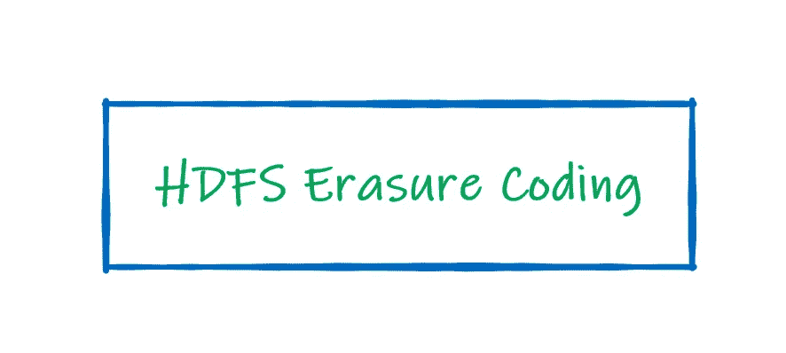
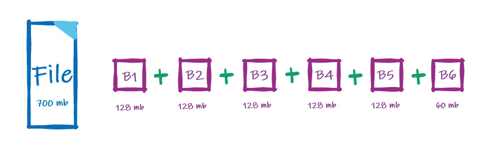
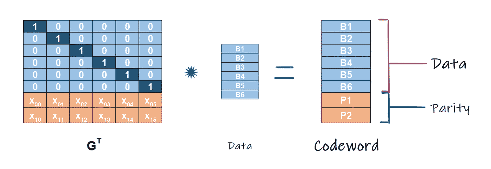

# HDFS 擦除编码

> 原文：<https://towardsdatascience.com/simplifying-hdfs-erasure-coding-9d9588975113?source=collection_archive---------31----------------------->

## 通过利用擦除编码，显著降低 HDFS 集群的存储开销

假设:

您已经了解并内化了 Hadoop 分布式文件系统或 HDFS 的基本概念— [数据块&复制因子、存储&复制和机架感知](/hadoop-distributed-file-system-b09946738555)

## **背景**

Hadoop 分布式文件系统(HDFS)数据块和复制方法有两个关键概念，即“数据块大小”和“复制因子”。进入 HDFS 的每个文件都被分成几个块或“区块”。块数取决于分配的最大块大小，通常为 128 MB。创建数据块后，它们会在 HDFS 集群中复制。副本的数量由复制因子(RF)决定，通常配置为 3 (1 份原件和 2 份副本)。这种冗余有助于建立弹性和容错能力，也就是说，当一个数据块出现故障时，我们可以从另一个数据块安全地恢复数据。

基于块大小的文件分割= 128 MB

上图是我们刚刚讨论过的分割的快速演示。一个 700 MB 的文件被分成 6 个块。128 MB 的 5 份和 60 MB 的 1 份。复制系数为 3 时，它将消耗(6*3) = 18 个数据块和(700 MB * 3) = 2100 MB 的存储。考虑将其扩展到 Pb 级，您将很快意识到由于数据复制带来的冗余而导致的可用空间的严重利用不足。

因此，对于 3-n/3 路复制(即 RF = 3)，其中 n =副本数量，我们有 2 个复制的数据块，即 200%的存储开销，效率为(1/n)或(1/3)或 33%，n-1 = 2 作为容错。更不用说创建、维护和执行 BAU 活动的网络和 I/O 使用情况了。

虽然廉价的存储和出色的网络带宽是当今世界的现实，但这种为容错和弹性建立冗余的方法仍然非常低效。这带来了一种新的模式，可以显著提高保护数据的效率。

## 擦除编码

通过英特尔和 Cloudera 的优秀人员的共同努力，擦除编码(EC)在 3.x 版中被引入 Hadoop。

继续同一个示例，一旦数据在 HDFS 被分割成几个块，它就作为输入被传递给 EC，EC 返回许多奇偶校验块。这个过程称为编码，而(数据+奇偶校验块)称为编码组。在失败(也称为擦除)的情况下，可以从该编码组中重建数据，称为解码。

引擎盖下发生了什么？

对 OR 和 XOR 有基本的数学理解

在被称为⊕的**异或**或**异或编码**中，数据(INs)通过被称为异或的数学运算传递，结果(OUT)为单个奇偶校验块，如上所示。此外，XOR 有两个漂亮的数学特性:

> *可交换的* : B1⊕ B2 = B2⊕ B1
> 
> *联想*:b1⊕【b2⊕B3】=【b1⊕b2]⊕B3

意思是——输入的排列不会改变输出。

作为推论，我们可以扩展到我们的示例，使用 6 个数据块作为输入，我们将在磁盘上总共消耗 7 个存储块，6 个数据块和 1 个奇偶校验块。与 HDFS 的三向复制相比，这显著提高了效率。并且如果任何一个数据块失败，例如如果 B2 失败，则剩余的块被异或，即 b1⊕***P1***⊕b3⊕b4⊕b5⊕b6，以恢复丢失的数据 B2。然而，≥2 个同时故障且数据*不可恢复*。因此，XOR 最多可以容忍 1 次故障，效率为((n-1)/n)或约 83%，其中 n =数据块的总数。由于 XOR 具有低容错性，所以它对于 HDFS 的要求来说是完全不可接受的。

里德·所罗门编码([来源](https://www.usenix.org/legacy/event/fast09/tech/full_papers/plank/plank.pdf))

**Reed-Solomon****【RS】****编码**通过使用复数线性代数生成多个奇偶校验块，解决了 HDFS 处理多个同时失效的需求。RS 编码表示为 RS₍ₖ,ₘ₎，使用两个参数，其中 k 是数据块的向量，m 是奇偶校验块的数量。这是通过将数据块向量 k 乘以生成矩阵(Gᵀ)得到长度= (k+m)或长度=(数据+奇偶校验)的 Codeword₍ₖ₊ₘ₎向量而生成的，如上图所示。

当故障发生时，通过将剩余的块(或幸存者)乘以生成矩阵的逆矩阵来进行恢复，前提是 k 个块总是可用的。因此，最多可以容忍 m 个故障。在我们的示例中，使用 k & m 的最佳实践参数，即 RS(6，3)，具有 6 个数据块的文件将消耗磁盘上的 9 个存储块(即 6 个数据块和 3 个奇偶校验块)，或者每 2 个数据块消耗 1 个奇偶校验块。因此，只需要 50%的存储开销，效率为(k/(k+m))或约 67%。

还有另一种流行的 RS 配置，即 RS(10，4)，其效率为(k/(k+m))或约 71%，存储开销约为 50%。

## **选择正确的区块布局**

我希望到现在为止，你们都支持 HDFS 的(6，3)或(10，4)配置的 Reed Solomon 擦除编码。

在**连续块布局**中，你在 HDFS 基础上有一个更简单的实现。考虑部署在连续块布局上的 HDFS EC RS(10，4 ),块大小固定为 128 MB。无论您有 10 个数据块还是 1 个数据块要写入，都会写入 4 个奇偶校验块。因此，对于单个数据块(比如 B5)，存储效率开销现在约为 400%,比三向复制还要糟糕。我们所有的存储效率收益都化为乌有。为了证明从 HDFS 三向复制切换到具有连续布局的 EC 的合理性，需要写入所有 10 个数据块。同样，对于具有相同块布局的 RS(6，3)，我们需要 6 个写入的数据块来确保存储效率。

根据几个项目的个人经验和 Cloudera 的行业研究(参考下文)，存储在 HDFS 的大约 70–95%的数据小于 1 个数据块或 128 MB。在**条带化块布局**中，文件被“条带化”为较小的大小，通常为 64 KB 或 1 MB 数据“单元”。因此，无论我们使用 RS(10，4)还是 RS(6，3)，创建的奇偶校验单元都不会对存储开销产生太大影响。

最重要的是，HDFS *允许在集群中的目录或文件级配置不同的复制和擦除编码策略*。由于文件大小是块布局的决定因素，从数据持久性和存储效率的角度来看，在文件/目录级别应用擦除编码策略的能力非常有益。

## HDFS 的建筑变革

为了用条带化布局处理 EC，进行了某些体系结构上的更改。

**名称节点扩展**:

文件的逻辑块或字节范围已从存储块中分离出来，存储块在数据节点中存储实际的数据块。HDFS 命名节点现在将其块 ID 分别映射到数据节点的存储块和逻辑块。这在名称节点上产生了大约 250–440%的巨大存储开销。

具有 3 个部分的分层块

因此，引入了一种新的分层块命名协议来解决空间使用过度增长的问题。我们不是基于时间戳顺序分配块 id，而是将块映射分成 3 个部分，如上所述。*注意，对于连续区块布局，只有 2 个部分*。因此，神经网络能够以摘要-细节或分层协议的形式管理逻辑和存储块，并将开销限制在大约 21–76%。

**客户端扩展**:

将 DFSInputStream (Java 数据类型)扩展为 DFS**Striped**InputStream，将 DFSOutputStream (Java 数据类型)扩展为 DFS**Striped**OutputStream，以适应数据分条和 EC。由于逻辑块和存储块现在是分开的，使用*条带化*数据类型，我们可以在 HDFS 实现块的并行创建/处理。

**数据节点扩展**:

神经网络识别丢失的块，并将恢复分配给数据节点。这由一个新的组件来处理，即 ECW 或 **ErasureCodingWorker** 、，它执行三个任务。首先，它向所有没有失败的数据源发送一个读请求。第二，使用英特尔优化的 Reed Solomon Erasure 编解码器框架， [**ISA-L**](https://www.youtube.com/watch?v=2wn79fy2XyQ&list=PLg-UKERBljNyTX8RGRxKnHP7GZ0UP3sST&index=8&t=0s) ，ECW 对数据进行解码。第三，它将恢复的数据推送到故障数据节点。

最后，让我们总结一下到目前为止我们所讨论的利弊:

## **优点**

*   在线电子商务支持:将数据实时转换为电子商务，从而立即节省存储空间，并完全避免临时/导入后数据转换过程。
*   低存储开销:将存储开销降低到仅 50%左右。
*   向后兼容:HDFS 的大多数功能，如快照、加密和缓存，在 EC 模式下也可用。

## **限制**

*   由于架构的变化，HDFS 的一些原生特性，如 hflush、hsync 和 append 在 EC 模式下不可用。然而，作为 HDFS-欧共体第二阶段的一部分，这一问题可能会得到解决。
*   在线/离线 EC 对集群提出了大量带宽和 IO 要求。但是，带宽与存储效率和耐用性之间的权衡应该被视为一种微妙的平衡，因为当使用 EC 进行条带化时，这种权衡是真正有益的。

**参考文献**:

[1] [HDFS 擦除编码](https://hadoop.apache.org/docs/r3.0.0/hadoop-project-dist/hadoop-hdfs/HDFSErasureCoding.html) (2017)，Apache Hadoop，ASF

[2] A.Wang，Z. Zhang，K. Zheng，U. Maheshwara 和 V. Kumar，[Apache Hadoop 中的擦除编码介绍](https://blog.cloudera.com/introduction-to-hdfs-erasure-coding-in-apache-hadoop/) (2015)，Cloudera

J. Plank 教授，[存储应用擦除编码教程，第 1 部分](http://web.eecs.utk.edu/~jplank/plank/papers/2013-02-11-FAST-Tutorial.pdf) (2013)，田纳西大学 EECS 系

 [## 使用 Hadoop 生态系统的大数据分析渠道

### 登录页面

medium.com](https://medium.com/@prathamesh.nimkar/big-data-analytics-using-the-hadoop-ecosystem-411d629084d3)