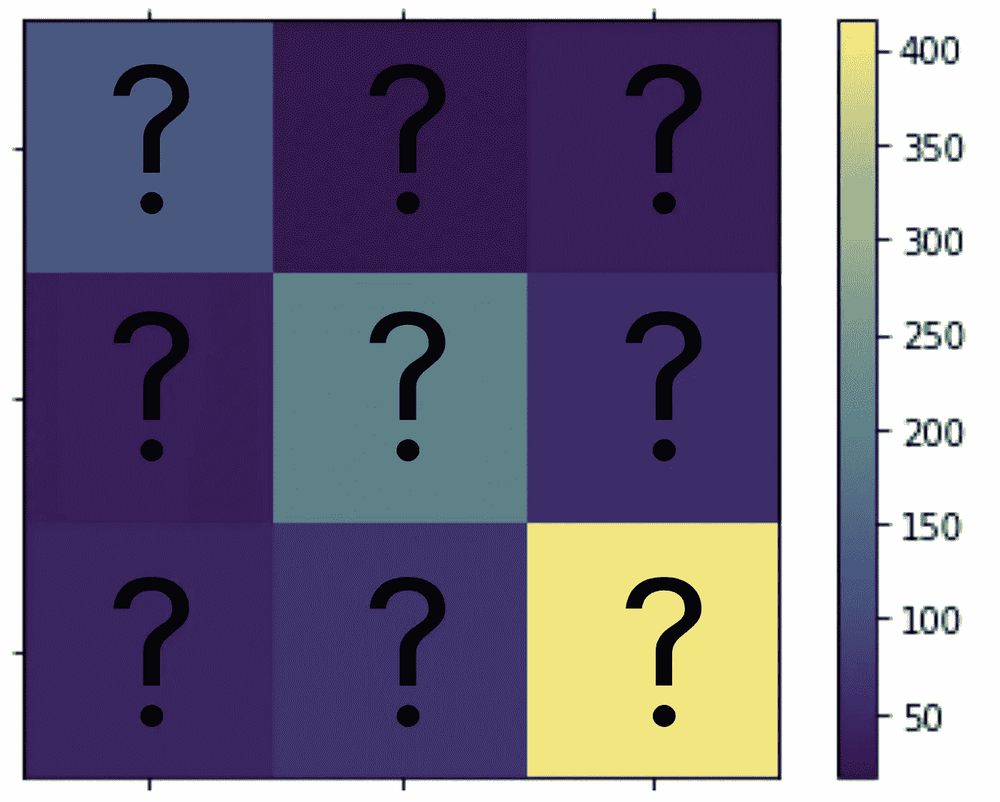
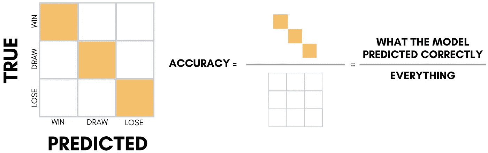
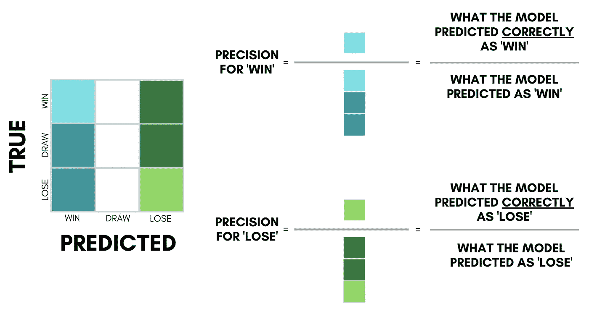
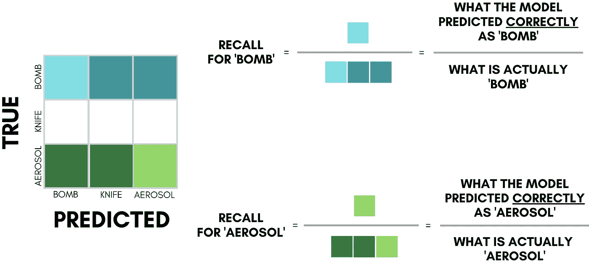
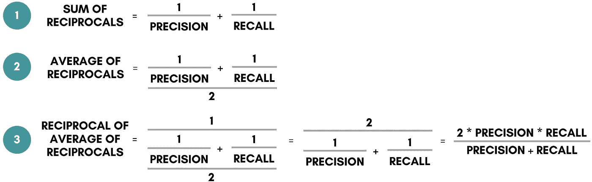
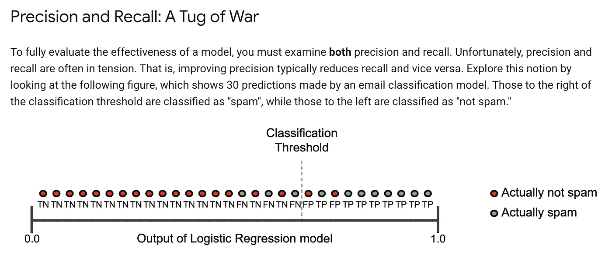

# 简化精确度、召回率和 F1 分数

> 原文：<https://towardsdatascience.com/simplifying-precision-recall-and-other-evaluation-metrics-d066b527c6bb?source=collection_archive---------43----------------------->

## 用基本术语解释评估指标

机器学习术语可能看起来非常费解，好像它们是为了让机器理解而制造的。不直观和听起来相似的名称，如假阴性和真阳性、精确度、回忆、ROC 下面积、敏感性、特异性和疯狂。好吧，最后一个不是真的。

已经有一些关于精确和召回的[好文章](/accuracy-precision-recall-or-f1-331fb37c5cb9)，但是当我阅读[它们](/beyond-accuracy-precision-and-recall-3da06bea9f6c)和其他关于 [stackexchange](https://datascience.stackexchange.com/questions/17868/usage-of-precision-recall-on-an-unbalanced-dataset) 的讨论时，这些混乱的术语在我脑海中混在一起，我比一个未标记的混乱矩阵更加混乱——所以我从来没有感觉到我完全理解了它。

混乱的混乱矩阵

但是要知道我们的模型是如何工作的，掌握评估指标并在深层次上理解它们是很重要的。那么一个数据科学家真正需要知道什么来评估一个分类模型呢？我在下面用图片和例子解释了最重要的几个，这样它就能永远留在我们的脑海里。

# **精度**

让我们从最简单的——精确度开始。这实际上是你的模型在猜测正确的标签或基本事实方面有多好。如果你的数据集非常平衡，并且你关心每个类别是否正确，这就是你需要担心的。

可悲的是，如果你的数据集像欺诈检测数据集一样不平衡，那么非欺诈案例占你的标签的 80–90%的可能性很大。因此，如果您的模型盲目地将所有数据点预测为多数标签，我们仍有 80–90%的准确性。

这就是我们需要精确和回忆的时候。

# 精确度(也称为特异性)

精度是模型正确预测值与模型预测值的比率。对于每个类别/类，都有一个精度值。

当我们需要正确的预测时，我们关注精度，也就是说，理想情况下，当您预测标签时，您希望确保模型是正确的。举个例子，如果你有一个[足球博彩模型](/what-ive-learnt-predicting-soccer-matches-with-machine-learning-b3f8b445149d)预测是否下注，你最关心的是它是否正确，因为你会根据它的预测采取行动，但当它告诉你不要下注时，你并没有赔钱。

**当倾向于精确时，错误预测的成本比错过正确预测的成本高得多。**

# 回忆(也称为敏感度)

召回率是模型正确预测的数量与实际标签数量的比率。类似地，对于每个类别/类，都有一个召回值。

当我们想要最大化特定类别的预测时，我们关心回忆，也就是说，理想情况下，你希望模型捕获该类别的所有示例。例如，机场安检扫描机必须确保探测器不会漏掉任何真正的炸弹/危险物品，因此我们可以接受有时拦下错误的行李/旅客。

当倾向于回忆时，错过一个预测的代价比一个错误的预测要高得多。

# f1-得分:结合精确度和召回率

如果我们希望我们的模型有一个平衡的精度和召回分数，我们平均他们得到一个单一的指标。但是什么样的平均才是理想的呢？对于精确度和召回率这样的比率，与通常的算术平均值相比，像 F1-Score 这样的调和平均值[更合适](https://www.quora.com/When-is-it-most-appropriate-to-take-the-arithmetic-mean-vs-geometric-mean-vs-harmonic-mean)。

调和平均数的定义似乎很复杂:分数的**算术平均数**的**倒数**和**倒数**。我处理冗长定义的方法是从最深层开始，逐层理解。有 3 个:

# 权衡:生活的现实

正如你可能已经想到的，精确度和回忆对我们来说更重要——是错误预测的代价，还是错过真相的代价？很多时候，你必须放弃一个才能得到另一个。下面是谷歌对权衡的一个很好的解释/viz，以及如何切换**分类阈值**让我们决定我们关心什么——注意，这也将改变我们的 F1 分数。

[https://developers . Google . com/machine-learning/crash-course/classification/precision-and-recall](https://developers.google.com/machine-learning/crash-course/classification/precision-and-recall)

# 结论

我希望这用简单直观的方式解释了准确度、精确度、召回率和 F1。结合示例，我认为这是理解其他评估指标的良好开端。那么，你的业务目标是更接近博彩模式、机场扫描仪，还是两者兼而有之？

资料来源:联合国人类住区规划署