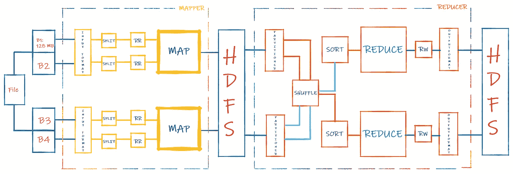
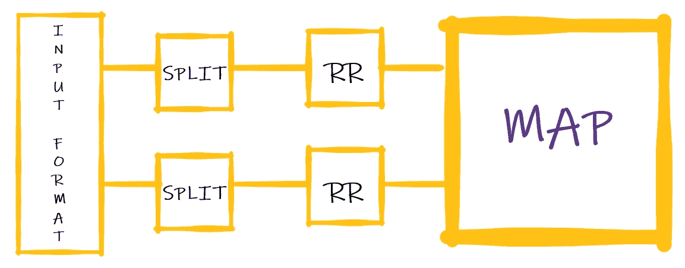
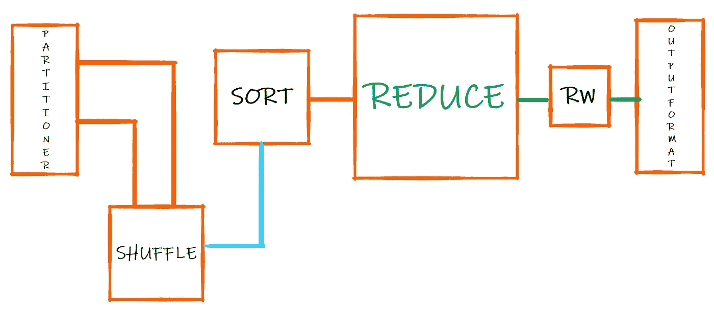

# MapReduce

> 原文：<https://towardsdatascience.com/simplifying-the-mapreduce-framework-20915f13ebd3?source=collection_archive---------45----------------------->

## 简化 MapReduce 框架



Apache Hadoop MapReduce 架构

在 2003 年，Google 提出了一个迷人的框架，通过他们革命性的白皮书“MapReduce:大型集群上的简化数据处理”，在分布于多个节点的大型数据集上实现并行处理。

现在，MapReduce (MR)是 Hadoop 的主要处理框架，跨多个应用程序使用，如 Sqoop、Pig、Hive 等。

## 数据存储在 HDFS

如果你是 HDFS (Hadoop 分布式文件系统)的新手，或者想要复习一下，我建议你看看我的[综合指南](/hadoop-distributed-file-system-b09946738555)。否则，继续阅读。

在上面的流程图中，我们在 HDFS 存储了一个大的 csv 文件。我们的复制系数(RF)为 2，数据块大小为 128 MB，有 2 个数据节点。因此，B1、B3、B3、B4 等，每个大小为 128 MB，放置在两个数据节点中，如上面的流程图所示。

> Hadoop 与传统客户端-服务器架构的不同之处在于，数据位于静态位置，而作业/流程移动到数据所在的位置。这显著提高了性能。

想想看，数据的大小通常是 GB 到 PBs，而作业/进程只有几 MB。因此，通过网络将数据转移到作业/流程中非常昂贵，但是通过网络将作业/流程转移到存储数据的地方非常便宜。这就是 HDFS 建筑的美。

## 制图人

从本质上讲，谷歌的人认为数据处理的大多数用例都适合 Map + Reduce 任务。我认为大约 90%的任务都适合这种形式。

那么，什么是映射器呢？映射器只是一个函数，它接受一个键、值(k，v)对，对其进行处理并返回一个(k，v)对。下面是它的编程方式:

```
map(in_key, in_value) -> list(intermediate_key, intermediate_value)
```

**工作开始:地图 0%减少 0%**



制图人

1.  **输入格式—** 指向 HDFS 文件块位置的指针。这些数据仍然没有被加载到内存中，目前按原样放在 HDFS 上。在我们的例子中，节点 1 的输入格式中的指针指向块 1 和块 2。类似地，在节点 2 中，它指向块 3 和块 4。
2.  **Split —** 此时，文件实际上被加载到内存中。拆分的数量等于该节点中的块数。拆分器和 RecordReader 一起工作。
3.  **RR 或 RecordReader —** 我肯定您想知道如何将一个简单的文件转换成(k，v)对。嗯，谷歌在他们的白皮书中提到，大部分处理是通过抽象完成的，这很好！记录阅读器只是为我们将数据处理成(k，v)对。此外，有多种方法可以实现这一点。更多细节见下文。
4.  **Map —** 最后，我们到达“Map”函数，在这里进行实际的处理。无论您希望函数执行什么逻辑，这里都是它发生的地方。发布此消息后，最终得到的(k，v)对再次被卸载到 HDFS，reducer 任务开始。

**工作状态:地图 100%减少 0%**

## 还原剂

一个 reducer，就像一个 mapper，也是一个函数，它接受一个(k，v)对，处理它并返回一个(k，v)对。以下是图示:

```
reduce(intermediate_key, list(intermediate_value) -> list(out_key, out_value)
```



还原剂

1.  **分割器—** 中间(k，v)对再次被原样加载到内存中。并且使用这些中间键，将一个*分组函数*应用于数据集。我们将在下一节的例子中更好地理解这一点。如果你觉得幸运的话——这里有一个[定制分区](https://acadgild.com/blog/mapreduce-custom-partitioner)。
2.  **Shuffle —** 这是跨节点的分组。基本上，公共键现在在节点间“混洗”。
3.  **排序—** 数据现在根据关键字排序。
4.  **Reduce —** 最后，我们到达“Reduce”函数，在这里进行数据的实际聚合。无论您希望该函数执行什么样的聚合，这里都是它发生的地方。
5.  **输出格式—** 最终得到的(k，v)对通过 RecordWriter (RW —更多细节见下文)再次卸载到 HDFS，作业完成。

**工作状态:地图 100%缩小 100%**

## 用一个简单的例子把它们放在一起


照片由[德乐思教授](https://unsplash.com/@andreasdress?utm_source=medium&utm_medium=referral)在 [Unsplash](https://unsplash.com?utm_source=medium&utm_medium=referral) 上拍摄

假设你是特斯拉汽车公司的首席执行官埃隆·马斯克。你得到了以下特斯拉汽车一年来的全球销量数据(百万辆)。很自然，你很高兴，你抽了一些，然后马上在推特上说:

> 特斯拉的股价在我看来太高了

好吧，那是个错误。那你哭还是不哭。反正我跑题了。

特斯拉汽车销售数据集(百万)

这些数据现在在 HDFS 被分成几个数据块，平均分布在两个数据节点中(根据 RF)。这是两个区块(B1 和 B3)的样子:

**映射器输出**:

```
**Country,Sales(M)**
USA,1
Russia,1
UK,1
France,1
China,1
Russia,1
UK,1
France,1
China,1
USA,1**Country,Sales(M)** UK,1
USA,1
China,1
UK,1
USA,1
China,1
UK,1
USA,1
China,1
UK,1
```

输出到 HDFS —生成 2 个文件

**减速器**:

```
**Country,Sales(M): Partition** USA,1
USA,1
Russia,1
Russia,1
UK,1
UK,1
France,1
France,1
China,1
China,1**Country,Sales(M)**: **Partition** UK,1
UK,1
UK,1
UK,1
USA,1
USA,1
USA,1
China,1
China,1
China,1**Country,Sales(M)**: **Shuffle** Russia,1
Russia,1
France,1
France,1**Country,Sales(M)**: **Shuffle** USA,1
USA,1
USA,1
USA,1
USA,1
UK,1
UK,1
UK,1
UK,1
UK,1
UK,1
China,1
China,1
China,1
China,1
China,1**Country,Sales(M)**: **Sort** France,1
France,1
Russia,1
Russia,1**Country,Sales(M)**: **Sort** China,1
China,1
China,1
China,1
China,1
USA,1
USA,1
USA,1
USA,1
USA,1
UK,1
UK,1
UK,1
UK,1
UK,1
UK,1**Country,Sales(M)**: **Reduce** France,2
Russia,2**Country,Sales(M)**: **Reduce** China,5
USA,5
UK,6
```

输出到 HDFS —生成 2 个文件。大概就是这样。有问题吗？不要犹豫地问。

## 记录阅读器

以下方法可用于将数据转换成(K，V)对:

RecordReaderInputFormat

## 记录器(RW)

以下方法可用于将(K，V)对转换为输出数据:

RecordWriterOutputFormat

# 优步模式

摘自我的 Apache Sqoop 帖子(脚注中的链接):

> MapReduce 作业的 Mapper 和 Reducer 任务由 [YARN](/apache-yarn-zookeeper-61e17a958215) 的资源管理器(RM)在分布于几个节点的两个独立容器中运行。但是，如果您的数据集很小，或者您的作业包含小型制图工具任务，或者您的作业仅包含一个缩减器任务，我们可以将优步模式设置为 TRUE。这迫使 RM 在一个容器或 JVM 中顺序运行 mapper 和 reducer 任务，从而减少了启动新容器和跨多个节点为一个小任务建立网络的开销。工作完成得更快。

参考资料:

[1] J. Dean，S. Ghemawat (2003)， [MapReduce:大型集群上的简化数据处理](https://static.googleusercontent.com/media/research.google.com/en//archive/mapreduce-osdi04.pdf)，Google

[1.1] J. Dean，S. Ghemawat (2003)， [HTML 幻灯片— MapReduce:大型集群上的简化数据处理](https://research.google.com/archive/mapreduce-osdi04-slides/index.html)，Google

[2] Manjunath (2016)， [MapReduce 自定义分区器](https://acadgild.com/blog/mapreduce-custom-partitioner)，Acadgild

[3] C. Chaudhari，[什么是优步模式？](https://community.cloudera.com/t5/Support-Questions/What-is-Uber-mode/td-p/211160) (2018)，Cloudera 社区

[4] [MapReduce 教程](https://hadoop.apache.org/docs/current/hadoop-mapreduce-client/hadoop-mapreduce-client-core/MapReduceTutorial.html) (2019)，Apache Hadoop MapReduce 客户端，ASF

[](/apache-flume-71ed475eee6d) [## 阿帕奇水槽

### 使用 Apache Flume 将非结构化数据涓滴输入 HDFS

towardsdatascience.com](/apache-flume-71ed475eee6d) [](/apache-sqoop-1113ce453639) [## Apache Sqoop

### RDBMS 到 HDFS 并返回

towardsdatascience.com](/apache-sqoop-1113ce453639) [](https://medium.com/@prathamesh.nimkar/big-data-analytics-using-the-hadoop-ecosystem-411d629084d3) [## 使用 Hadoop 生态系统的大数据分析渠道

### 登录页面

medium.com](https://medium.com/@prathamesh.nimkar/big-data-analytics-using-the-hadoop-ecosystem-411d629084d3)