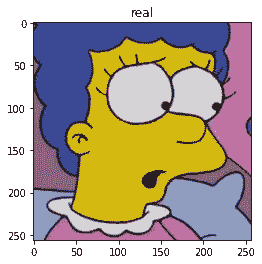

# 用 CycleGAN 和 PyTorch 来简化自己

> 原文：<https://towardsdatascience.com/simpsonize-yourself-using-cyclegan-and-pytorch-cea94ee199ca?source=collection_archive---------24----------------------->

## 使用 CycleGAN 和 PyTorch 将人脸转换为 Simpsons 角色


作者图片


作者图片

Cyclegan 是一个能够进行不成对图像到图像翻译的框架。它被应用在一些非常有趣的案例中。比如把马转换成斑马(T4)，把冬天的照片转换成夏天的照片。

我认为这可能适用于辛普森一家。我的灵感来自于像[变黄](https://turnedyellow.com/)和 [makemeyellow](https://makemeyellow.photos/) 这样的网站。这个想法是你上传一张你的脸的照片。Cyclegan 会把它翻译成辛普森一家的角色。

值得注意的是[论文](https://arxiv.org/pdf/1703.10593.pdf)明确提到大的几何变化通常是不成功的。所以这不太可能有好结果。

但我还是要尝试一下。

# 安装

首先我们需要安装 CycleGAN。

```
!git clone https://github.com/junyanz/pytorch-CycleGAN-and-pix2pix
import os
os.chdir('pytorch-CycleGAN-and-pix2pix/')
!pip install -r requirements.txt
```

# 数据集

创建数据集比您最初想象的要困难。

为了创建这个数据集，我需要找到辛普森一家角色的特写镜头和普通人的特写镜头。

# 下载辛普森数据集

最初我的想法是从谷歌图片中抓取图片。不幸的是，要做到这一点，看起来你需要一个来自谷歌控制台的开发者密钥。

所以我从 Bing 中抓取图片。

这在一定程度上起了作用。但是花了*这么长时间*才下载完所有的图片。在我看了这些照片后，我注意到其中一些根本没有任何人脸。

谢天谢地，我在 kaggle 上偶然发现了一个数据集，里面有我需要的一切。它包含了从几季中提取的辛普森面孔。每个图像为 200x200 像素，包含一张脸。

该数据集将存储在`trainA`文件夹中。

```
def create_training_dataset_simpson_faces(download_dir):

  %cd $download_dir

  # download dataset and unzip
  !kaggle datasets download kostastokis/simpsons-faces --force
  !unzip \*.zip
  !rm *.zip
  !cp -a $download_dir/cropped/. $download_dir

  # remove unnecessary folders
  !rm -Rf $download_dir/cropped
  !rm -Rf $download_dir/simplified

  # go back to orig directory
  %cd /content/pytorch-CycleGAN-and-pix2pix

create_training_dataset_simpson_faces(TRAIN_A)
```

# 下载真实人脸数据集

为了创建真实人脸的数据集，我做了一点实验。

[Will Kwan](https://www.youtube.com/watch?v=pctzpu_wJyE) 最近使用 [stylegan2](https://github.com/NVlabs/stylegan2) 在他最近的一个视频中生成数据集。这对他来说似乎相当有效。所以我想我也可以做同样的事情。

这里有一些取自 Nvidia 的 stylegan2 github 库的人脸示例。如你所见，GAN 的输出相当逼真。


图片由 [NVlabs](https://github.com/NVlabs) 在 [Github](https://github.com/NVlabs/stylegan2) 上提供

这可能比在网上搜索人脸要好得多。我可以为我的模型创建尽可能多的面。另外，我也不必下载笨重的大文件。

该数据集将存储在`trainB`文件夹中

## 创建数据集

```
import matplotlib.pyplot as plt
from tqdm.notebook import tqdm# see Github for full code: [https://github.com/spiyer99/spiyer99.github.io/blob/master/nbs/cyclegan_simpsonify.ipynb](https://github.com/spiyer99/spiyer99.github.io/blob/master/nbs/cyclegan_simpsonify.ipynb)def create_training_dataset_real_faces_stylegan(download_dir):

  # create in batches of 100
  # reduces RAM requirements

  counter = 0
  pbar = tqdm(total = LIMIT)

  while counter < LIMIT:

    seeds = np.random.randint(10000000, size=100)
    imgs = generate_images_from_seeds(seeds, 0.7)

    for img in imgs:
      img.save(download_dir/'real_face_{}.jpg'.format(counter), 'JPEG', quality=100)
      counter+=1
      pbar.update(1)
    del imgs

create_training_dataset_real_faces_stylegan(TRAIN_B)
```

# 列车测试分离

接下来，我们需要将数据分为训练和测试。`testB`将包含我们想要转换成辛普森一家角色的真实面孔。`testA`将包含辛普森一家的人物，我们想把他们变成真人。

```
# move images to a new folder
# `images` is the existing image directory: 
# `new_dir` is the path that the images will be moved to
# `files_limit` is the limit of files that will be moved
def move_all_images_to_new_folder(images, new_dir, files_limit = None):
  files = glob.glob(str(images/'*.*g'))

  if(files_limit is not None):
    files = files[:files_limit]

  for file in files: shutil.move(file, new_dir/os.path.basename(file))

move_all_images_to_new_folder(TRAIN_A, new_dir = TEST_A, files_limit = int(min(LIMIT*0.1, 25)))
move_all_images_to_new_folder(TRAIN_B, new_dir = TEST_B, files_limit = int(min(LIMIT*0.1, 25)))
```

# 查看我们的培训和测试数据

让我们看看我们正在处理的图像。

```
import PIL
import random

def plot_from_image_path(path, title):

  all_imgs = glob.glob(str(path/'*.*g'))

  print(f'{len(all_imgs)} imgs in {title} directory')

  img_path = random.choice(all_imgs)
  img = PIL.Image.open(img_path)
  plt.imshow(img)
  plt.title(title)
  plt.show()

plot_from_image_path(TRAIN_A, 'TRAIN_A')
plot_from_image_path(TRAIN_B, 'TRAIN_B')

plot_from_image_path(TEST_A, 'TEST_A')
plot_from_image_path(TEST_B, 'TEST_B')
```


作者图片


作者图片

一切看起来都很好！

# 创建模型

现在我们可以创建模型了。我对现有的[脚本](https://github.com/junyanz/pytorch-CycleGAN-and-pix2pix/blob/master/train.py)做了一些调整。

让我们创建几个助手函数。

这些功能帮助我将保存的模型复制到我的 google drive。它还有助于测试模型并将输出图像存储到 google drive。

```
import os
from pathlib import Path
from distutils.dir_util import copy_tree
import matplotlib.pyplot as plt
import random

def copy_to_drive(folder = 'cyclegan_simpsonify'):

  drive_folder = Path('/content/drive/My Drive/')/folder

  if(drive_folder.exists()):
    shutil.rmtree(drive_folder)

  shutil.copytree('/content/pytorch-CycleGAN-and-pix2pix/checkpoints/'+NAME+'/', str(drive_folder))

def get_corresponding_photo(file_path):
  return file_path.replace('fake', 'real')

def plot_results(number):

  for i in range(number):

    img_path = random.choice(glob.glob('./results/'+NAME+'/test_latest/images/*fake.*g'))
    print(img_path)
    img = plt.imread(img_path)
    plt.imshow(img)
    plt.title('fake')
    plt.show()

    print(get_corresponding_photo(img_path))
    img = plt.imread(get_corresponding_photo(img_path))
    plt.imshow(img)
    plt.title('real')
    plt.show()

def get_model(src, dst):

  # copy across model
  try:
    os.remove(dst)
  except:
    pass
  shutil.copyfile(src, dst)

def copy_from_drive(folder = 'cyclegan_simpsonify'):

  drive_folder = Path('/content/drive/My Drive/')/folder

  if(not Path('/content/pytorch-CycleGAN-and-pix2pix/checkpoints/').exists()): 
    os.mkdir('/content/pytorch-CycleGAN-and-pix2pix/checkpoints/')

  if(Path('/content/pytorch-CycleGAN-and-pix2pix/checkpoints/'+NAME+'/').exists()): 
    shutil.rmtree('/content/pytorch-CycleGAN-and-pix2pix/checkpoints/'+NAME+'/')

  shutil.copytree(str(drive_folder), '/content/pytorch-CycleGAN-and-pix2pix/checkpoints/'+NAME+'/')

def test_model (number_results = 5, direction = 'BtoA', src = None, dst = None):

  # delete results folder and recrete
  shutil.rmtree('./results')
  os.mkdir('./results')

  # get appropriate model
  if (src is None): src = './checkpoints/'+NAME+'/latest_net_G_'+direction.split('to')[-1]+'.pth'
  if (dst is None): dst = './checkpoints/'+NAME+'/latest_net_G.pth'

  get_model(src, dst)

  if (direction == 'BtoA'):
    test = TEST_B
  else:
    test = TEST_A

  cmd = 'python test.py --dataroot '+str(test)+' --name '+str(NAME)+' --model test --no_dropout'
  os.system(cmd)
  plot_results(number_results)
```

让我们为培训创建选项。

```
import time
from options.train_options import TrainOptions
from data import create_dataset
from models import create_model
from util.visualizer import Visualizer
import shutil
import os
from pathlib import Path
from tqdm.notebook import tqdm

options_list = ['--name', NAME,\
		'--dataroot', TRAIN_A.parent,\
		'--batch_size', BATCH_SIZE,\
		'--checkpoints_dir', './checkpoints',\
		'--lr', 2e-4,\
		'--n_epochs', EPOCHS,\
		'--n_epochs_decay', EPOCHS//2,\
		'--name', NAME]

opt = TrainOptions().parse(options_list)
```

首先，我们使用前面指定的选项创建数据集。

```
dataset = create_dataset(opt)
dataset_size = len(dataset)
print('The number of training images = %d' % dataset_size)
```

然后，我们创建模型并运行 setup 调用。

```
model = create_model(opt)
model.setup(opt)
visualizer = Visualizer(opt)
total_iters = 0
```

我们从 A 到 b 来看生成器，命名约定和[论文](https://arxiv.org/pdf/1703.10593.pdf)略有不同。在论文[中](https://arxiv.org/pdf/1703.10593.pdf)发电机被称为`G`。

在代码中，他们称这个映射函数为`G_A`。意思还是一样的。

该发生器功能从`A`映射到`B`。

在我们的例子中，它从辛普森一家映射到现实生活。

```
model.netG_A
```


作者图片

这里我们可以看到模型使用了 [Resnets](https://arxiv.org/pdf/1512.03385v1.pdf) 。

我们有`Conv2d`、`Batchnorm`、`ReLU`、`InstanceNorm2d`和`ReflectionPad2d`。`InstanceNorm2d`和`ReflectionPad2d`对我来说是新的。

`InstanceNorm2d`:这与[批量定额](https://arxiv.org/abs/1502.03167)非常相似，但它一次应用于一幅图像。

`ReflectionPad2d`:这将使用输入边界的反射填充张量。

现在我们也可以看看鉴别器。

```
model.netD_A
```


作者图片

鉴别器使用`LeakyReLU`、`Conv2d`和`InstanceNorm2d`。

`LeakyReLU`有意思。`ReLU`是增加网络非线性的激活。但是什么是`LeakyReLU`？

`ReLU`将所有负值转换为`0`。由于`0`的梯度是`0`神经元达到大的负值，有效神经元抵消到`0`。他们实际上是“死”了。这意味着你的网络最终会停止学习。

这种效应被称为[将死](https://datascience.stackexchange.com/questions/5706/what-is-the-dying-relu-problem-in-neural-networks) `[ReLU](https://datascience.stackexchange.com/questions/5706/what-is-the-dying-relu-problem-in-neural-networks)` [问题](https://datascience.stackexchange.com/questions/5706/what-is-the-dying-relu-problem-in-neural-networks)。

`LeakyReLU`旨在解决这个问题。该功能如下所示:


由 [PyTorch](https://pytorch.org/) 在 [PyTorch 文档](https://pytorch.org/docs/stable/generated/torch.nn.LeakyReLU.html)上拍摄的图像

这个函数本质上解释为:如果一个值是负的，则将其乘以`negative_slope`，否则什么也不做。`negative_slope`通常是`0.01`，但是你可以变化一下。

所以`LeakyReLU`大大降低了负值的幅度，而不是将它们发送给`0`。但是这是否真的有效还没有定论。

# 培养

现在，我们可以在多个时期内训练模型。我在这里指定了`10`纪元。

以下是培训代码:

所有神奇的事情都发生在这里。它运行损失函数，获取梯度并更新权重。通过这样做，它优化了生成器和鉴别器。

让我们训练它！

# 测试

我让模型在 [google colab](https://colab.research.google.com/) 上通宵训练，并将`.pth`模型复制到我的 google drive 上。

让我们看看输出。

```
test_model(10, 'BtoA')
```


作者图片


作者图片


作者图片


作者图片


作者图片


作者图片

这是一个好的开始。我特别喜欢这张图片:


作者图片

老实说，它需要一些改进。

让我们尝试运行`AtoB`周期。所以我们要把辛普森一家的角色转换成人脸。

```
test_model(10, 'AtoB')
```


作者图片



作者图片


作者图片


作者图片

# 丰富

Cyclegan [的作者指出](https://junyanz.github.io/CycleGAN/)需要大的几何变化的任务不太可能成功。我刚刚证实了这一点。

该网络似乎在努力应对将辛普森一家的角色转换成真人(反之亦然)所需的巨大几何变化。我不确定更多的培训能否解决这个问题。GANs 的棘手之处在于弄清楚何时停止训练。目视检查[似乎](https://github.com/junyanz/pytorch-CycleGAN-and-pix2pix/issues/166)是 Cyclegan 的答案。再训练几天看看会发生什么也许是值得的。

完整的 jupyter 笔记本可以在 [Github](https://github.com/spiyer99/spiyer99.github.io/blob/master/nbs/cyclegan_simpsonify.ipynb) 上找到

*原载于 2020 年 8 月 30 日*[*https://spiyer 99 . github . io*](https://spiyer99.github.io/Cyclegan-Simpsonify/)*。*