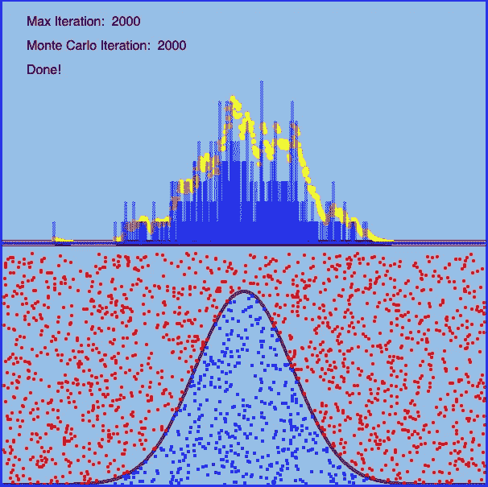

# 对剔除抽样的 3 分钟回顾:模拟任何分布

> 原文：<https://towardsdatascience.com/simulate-any-distribution-with-rejection-sampling-ebe4e66cc068?source=collection_archive---------24----------------------->

## 3 分钟回顾

## 一个简短的概率和算法教程，值得你花时间

在 [Unsplash](https://unsplash.com?utm_source=medium&utm_medium=referral) 上 [Miikka Luotio](https://unsplash.com/@mluotio83?utm_source=medium&utm_medium=referral) 的照片

当您想要某个概率分布的一些值时，比如说正态分布，您可以简单地在 R 中调用`rnorm`，或者在 Python 中调用`numpy.random.normal`。但是你有没有想过他们是怎么做到的？潜在的想法非常简单却非常强大。在这篇文章中，我将直观地解释它，而不会用任何数学符号来让你厌烦。在 3 分钟内，您将能够实现您自己的定制分发模拟器。我们开始吧！

# 蒙特卡罗模拟拒绝抽样

任何计算机系统都应该有一个[伪随机数发生器](https://en.wikipedia.org/wiki/Pseudorandom_number_generator#Non-uniform_generators)，它能够给你(伪)均匀分布的随机数。这是我们的起点。核心问题是:**给定均匀随机值，我们如何生成不同的分布？**

考虑一个投掷飞镖的游戏，在这个游戏中，你向一块长方形的木板投掷飞镖。玩之前，你在上面画一个钟形曲线(高斯概率密度函数)。假设你的飞镖均匀地落在整个区域。自然，会有一些飞镖落在曲线上方，一些落在曲线下方。在足够多的投掷次数后，它应该看起来像下图的下半部分。如果我们去掉曲线上方的红色部分，为蓝色部分做一个直方图，它应该看起来像上半部分的那个。

这是我在 P5.js 中的实现，可以随意去[我的网站](https://logancyang.com/simulations/montecarlo/montecarlo.html)通过调优迭代次数和改变分布自己试试！

这张照片展示了 2000 次投掷。当你扔的次数多了很多，上半部分的黄色轮廓会越来越接近底部的钟形曲线。

这个游戏被称为[拒绝抽样](https://en.wikipedia.org/wiki/Rejection_sampling)算法，或接受-拒绝法，每次投掷飞镖都是一次[蒙特卡洛模拟](https://en.wikipedia.org/wiki/Monte_Carlo_method)。

这里到底发生了什么？你可以把 *x* 的值想成一个均匀随机数`sampleX`，把 *y* 的值想成另一个，`sampleY`。那么一掷镖的位置就是`(sampleX, sampleY)`。算法是这样的:

1.  首先，你画一个`sampleX`，然后你立即画一个`sampleY`。(扔飞镖)
2.  您将`sampleX`插入到您想要的分布的 PDF 中，在本例中是高斯 PDF，并在对应于`sampleX`的紫色曲线`targetY`上获得一个值。
3.  你把`sampleY`比作`targetY`。如果`sampleY < targetY`，表示我们有一个“命中”，即飞镖落在曲线下方。这个随机数`sampleX`被“接受”并作为高斯样本返回。如果`sampleY >= targetY`，这意味着我们有一个“错过”，然后`sampleX`被拒绝，并且没有成功的高斯样本从该试验中抽取。继续下一个试验。
4.  一旦你有了足够的试验，所有被接受的`sampleX`形成了一个正态分布的随机值列表。

就是这个！这就是我们用均匀随机数得到高斯随机数的方法。

事实上，您可以将其更改为任何您想要的目标分布！在板上画一个疯狂的曲线，开始投掷。如果低于曲线，接受；如果高于曲线，拒绝。就这么简单。曲线甚至不需要积分到 1，就相当于缩放这条曲线可以得到的 PDF。

我用 P5.js 在浏览器中创建了一个[可视化。您可以通过调整迭代次数和改变分布类型来随意尝试。](https://logancyang.com/simulations/montecarlo/montecarlo.html)

# 摘要

拒绝采样是一个非常简单的想法，非常简单，你只需不到 5 分钟就能学会，而且*没有任何公式*！尽管它很简单，但对于计算统计学和任何依赖于概率的技术来说都是至关重要的。`rnorm`和`numpy.random.normal`使用的实际算法被称为[金字形神算法](https://en.wikipedia.org/wiki/Ziggurat_algorithm)。这是在拒绝抽样和蒙特卡罗方法的保护伞下。有兴趣可以看看。希望你喜欢这个非常短的教程，并欣赏这个算法的小宝石的美丽！

# 参考

*   [拒绝采样](https://en.wikipedia.org/wiki/Rejection_sampling)
*   [代码的本质视频](https://youtu.be/DfziDXHYoik)作者丹·希夫曼

*在* [*中*](https://medium.com/@loganyang) *上看我的其他帖子，或者在* [*上关注我的*](https://twitter.com/logancyang) *。*