# 使用 Go 和 Python 模拟文化互动

> 原文：<https://towardsdatascience.com/simulate-cultural-interactions-using-go-and-python-cac5db427708?source=collection_archive---------26----------------------->

## 使用 Go 和 Jupyter Notebook 模拟文化传播

没有什么比过年走亲戚更能体现文化了。从庆典和习俗到装饰和食物(永远都是关于食物的)，一切都在你面前变得又红又吵。当我年轻的时候，我认为这就是作为一个中国人的全部，但是随着年龄的增长，我意识到还有更多。

春节期间探索新加坡的唐人街(鸣谢:张秀祥)

我在马来西亚和新加坡，在[马来群岛](https://en.wikipedia.org/wiki/Malay_Archipelago)长大，我一直认为中国新年是纯粹中国的事情。后来我知道日本人、朝鲜人、西藏人、蒙古人和越南人也庆祝这个节日。在中国，中国人甚至不叫它春节，而是叫它春节。

过了一段时间，我了解到一些我一直认为完全是中国的习俗，原来并不像看起来那么简单。例如，[狮子不是中国本土的，那么为什么舞狮是中国新年庆祝活动的主要部分呢](https://www.scmp.com/magazines/style/news-trends/article/3047386/lunar-new-year-lions-arent-native-china-so-where-did)？我一直认为是中国新年的主食——吃肉夹馍和送橘子在中国很多地方都没有实行。作为中国新年小吃的常年菠萝馅饼显然纯粹是当地的一种做法，是土生华人的一种交叉。

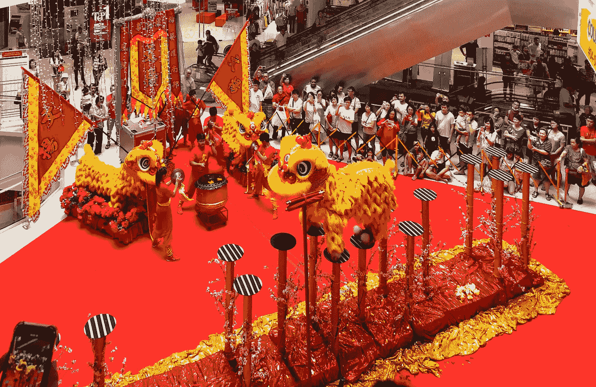

新加坡购物中心的中国新年舞狮(鸣谢:张秀雄)

进一步说，如果你观察我们的日常生活，你会意识到你习惯的日常文化可能是多种文化的大杂烩。你所认同的国家或地方文化可能是许多其他文化的混合，而这些文化反过来又是更多其他文化的混合。

以 [laksa](https://en.wikipedia.org/wiki/Laksa) 为例，这是一道在新加坡、马来西亚、印度尼西亚和泰国南部广受欢迎的香辣汤面。它的起源被认为是来自中国的沿海居民区，随着中国移民引入当地的食材和烹饪方法，它呈现出了当地的特色。至于当地的配料，可以是椰奶(咖喱叻沙的变种)，罗望子(阿萨姆叻沙的变种)，sambal belacan，各种鱼类，甚至柠檬草！这导致[出现了令人愉快和眼花缭乱的各种变体](https://blog.traveloka.com/en/article/malaysian_laksa/)，它们只是当地文化融合的可食用体现。

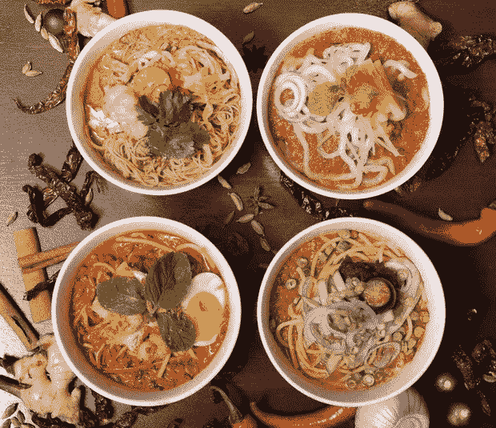

许多种类的叻沙(咖喱叻沙、柔佛叻沙、槟城阿萨姆叻沙和沙捞越叻沙)中的一些(信用:[https://www . theartofbusiness travel . com/news/Malaysia-airlines-lounge-offers-Laksa-disks/](https://www.theartofbusinesstravel.com/news/malaysia-airlines-lounge-offers-laksa-dishes/))

同样，我们在新加坡使用的一种以英语为基础的克理奥尔语中找到了语言对等词，这种语言包含来自英语、马来语、各种汉语方言和印度语的词汇，在马来西亚的英语、马来语、各种汉语方言和印度语之间通过语码转换形成的一种马来西亚洋泾浜语[中也找到了语言对等词。如果我们深入挖掘，我们认为是文化象征的各种事物往往起源于其他文化，例如](https://en.wikipedia.org/wiki/Bahasa_Rojak)[英国茶](https://www.tea.co.uk/history-of-tea)(来自中国)和[禅宗](https://en.wikipedia.org/wiki/Zen)(通过日本禅宗在西方流行，来自禅宗，起源于中国并受道教影响，但反过来是来自印度的大乘佛教的一个流派)。

正如斯蒂芬·霍金斯在《时间简史》的开篇中所写的——海龟一直在往下走。

# 文化互动建模

人们和文化如何相互作用和影响是众多研究的主题。各种各样的社会科学家、人类学家和生物学家研究了文化变迁，提出了看似合理的理论，并撰写了描述这些理论的论文。

一篇特别有影响力的论文是罗伯特·阿克塞尔罗德(Robert Axelrod)的《文化的传播:一个局部趋同和全球极化的模型》(T1)，这是一篇开创性的论文，在后来的研究中被引用。阿克塞尔罗德建立了一个基于主体的模型，该模型遵循一套简单的规则，试图产生涌现行为(也就是说，他建立了一个复杂系统的模型)。

我已经创建了一个类似的[基于代理的模型](https://en.wikipedia.org/wiki/Agent-based_model)，部分基于阿克塞尔罗德论文中描述的规则。我用 Go 创建模拟，用 Python 对结果做了一点分析。

我使用的模型基于两个非常简单的前提，类似于 Axelrod 的模型:

1.  彼此相似的文化比不相似的文化更有可能相互影响
2.  当文化相互作用时，它们变得更加相似

利用这两个前提，我用正方形网格建立了一个模型。网格中的每个单元格代表一种文化。

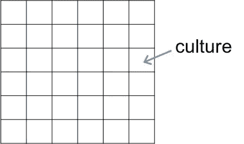

在模拟中，每种文化有 6 个特征，其中一个特征是文化的属性，如食物、语言、宗教等。

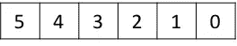

每个特征又有 16 个不同的特性，它们是该特征不同的可能值。

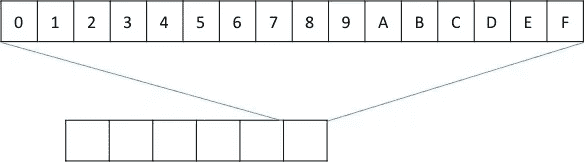

正如您可能意识到的，这显然是为了便于我用十六进制颜色描述网格而建模的。

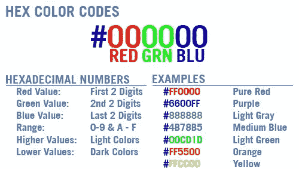

让我们看看模拟是如何工作的。每个细胞(培养物)有 8 个邻居，除非它是一个角落或细胞。

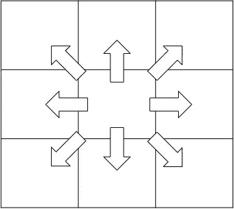

在每个时间间隔，模拟随机选取 n 个培养物。将选定的区域性与其相邻区域进行逐个功能的比较。一种文化和另一种文化之间的差异，我称之为文化差异，是一种文化影响另一种文化的可能性。如果有文化的影响，模拟会选择一个随机的特质复制到另一个文化中，使其彼此更加相似。

在下面的示例中，取两个相邻的区域性 A 和 B(即它们是邻居)。现在比较它们的特性。在下图中，两个特征之间的差异，或者说特征差异是 3。请注意，我们只寻找两个特征之间的差异，所以我们得到的是绝对数字，而不是简单的一个数字减去另一个数字。

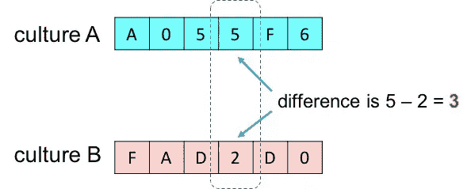

接下来，我们将两种文化之间的所有特征差异加起来，得到一个文化差异。在下图中，我们得到的文化差异是 34(如果我们退后一点，你会发现我们只是将两种文化之间的差异减少到一个数字，但这就是建模的本质)。

快速的算术检查会告诉我们，如果两个文化完全不同，那么它们的文化差异是 96 (16 个特质 x 6 个特征)，如果完全相同，那么它们的文化差异是 0。因此，出现文化交流的概率是:

最后，如果文化交流真的发生了，模拟将随机选取一个特征，并将该特性值从一种文化复制到另一种文化。在这种情况下，区域性 A 的功能 3 被复制到区域性 b。

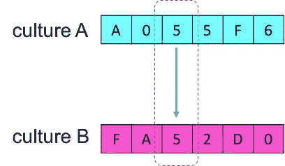

接下来我们来看看模拟代码。

# 围棋的模拟

这个模拟是用 Go 编写的(这里并不奇怪),它创建了一系列如上所述的网格图像。这些图像以快速连续的方式一个接一个地显示，以显示模拟的培养物如何随着模拟的每个节拍而变化。

## 数据

先说数据。`img`变量存储图像，它是标准库中的一个`image.RGBA`。这是将用于显示图像的变量。`cells`变量是代表模拟网格的`Cell`结构的一部分。

我们可以为模拟调整 4 个参数——`width`是网格的大小，`coverage`是将包含文化的模拟网格的百分比，`interactions`表示模拟在每个 tic 中进行的交互次数，`numTicks`是运行模拟的时间长度。

我们还存储了 3 组模拟数据，可用于以后的分析，`fdistances`表示网格中所有单元的特征之间的平均距离，`uniques`是剩余的独特文化的数量，`changes`是实际发生的文化变化的数量，`interactions`是我们做了多少次，但`changes`是实际发生了多少次。

## 细胞

模拟中的一个`Cell`有一个位置`X`和`Y`，一个半径`R`描述它有多大，一个`Color`是单元格的颜色，值为`0x1A2B3C`。struct `Cell`有一个返回颜色整数(代表颜色的数字)的`getRGB`方法和一个用颜色整数设置单元格的`Color`的`setRGB`方法。

为了创建一个单元格，我们使用了接受位置`x`和`y`以及一个颜色整数的`createCell`函数。最后，我们还有一个创建随机网格的函数，叫做`createPopulation`。`createPopulation`基于`coverage`参数创建模拟网格，该参数指定了文化填充网格的百分比。

接下来看主模拟。

## 模拟

对于模拟，我使用了[终端框](https://github.com/nsf/termbox-go)(就像[入侵者游戏](https://medium.com/sausheong/writing-space-invaders-with-go-db22111cce48)等)。你可以看看[我写的关于我如何使用它的其他帖子。](https://medium.com/sausheong/writing-space-invaders-with-go-db22111cce48)

在我开始主模拟循环之前，我将首先使用`createPopulation`创建网格。对于模拟中的每个循环，我将捕获距离`dist`，独特文化的数量`uniq`和变化的数量`chg`。

然后，对于每一个循环，我随机选取一些细胞，让它们与它们的邻居互动，如上所述。

在每次循环结束时，我获取距离、唯一性和变化，并分别存储到`fdistances`、`uniques`和`changes`中。这些函数会相应地计算这些值。

该模拟还使用许多函数来帮助它找出哪些是它的邻居。

现在我们有了模拟，我们需要显示它。

## 图像

和以前的帖子一样，我使用`draw2dimg`库来绘制网格。`draw`功能在每个节拍绘制网格。每个单元格都是一个给定颜色的圆圈。

`printImage`功能就是这样做的——它将图像打印到控制台，而`saveImage`功能用于保存模拟的最后一幅图像。

## 保存模拟数据

模拟的全部目的是获取数据，这是使用`saveData`功能完成的。该功能保存三种类型的数据——存储在`fdistances`、`uniques`和`changes`中的模拟数据。它还将模拟的最终状态(实际上只是最后一个 tick 的网格数据)以及网格的最终图像快照保存在 PNG 文件中。

# 运行模拟

这就是我们的模拟。如果我们运行它，我们应该得到这样的结果:

以 8 倍速度模拟

模拟结束后，我们应该得到 3 个文件——包含模拟数据的日志文件、包含最终刻度网格数据的 cells 文件以及最终的快照图像。

# 分析模拟数据

如果你只看模拟网格本身，你可以弄清楚一些事情。GIF 是实际速度的 8 倍(对于没有耐心的人来说)，但是你可以清楚地看到，当它以随机布局开始时，随着时间的推移，集群形成、增长和扩展，然后也消失了。

让我们仔细看看数据。在模拟结束时，我们将数据保存在一个`log-nxx-tyy-wzz.csv`文件中。如上所述，该文件将包含特征距离、独特文化的数量和变化的数量。我用 Jupyter 笔记本对数据做了一些简单的分析。

# 不同数量的文化互动

我进行了 4 次模拟，每次模拟都将交互次数从 100、500、1000 和 1500 增加，同时保持模拟网格的宽度为 36 个单元。我运行了 500 次模拟。

基于交互分析数据

首先，我使用 [Pandas](https://pandas.pydata.org) 将数据从 CSV 文件读入数据帧。然后，我相应地转换列，首先是特征距离，然后是唯一的数量，最后是变化的数量。

## 文化差异

正如我们所看到的，在模拟开始时，特征之间的距离迅速下降，然后下降速度变慢，最终逐渐变小，形成长尾。我只运行了 500 次模拟，即使我们运行更长时间，特征距离实际上也不会下降到 0。这是什么意思？

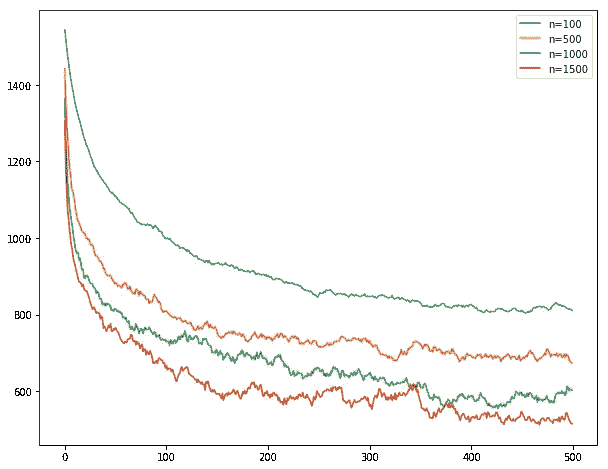

文化差异，假设每个模拟分笔成交点的交互次数不同

由于特征距离实际上是关于不同文化之间的差异，这意味着当交互发生时，最初文化之间变得更加接近，变得更加相似。然而，文化差异并没有完全消失。

互动数量的差异告诉我们，如果更多的互动发生，文化之间会更接近，这也是我们所期望的。

接下来让我们看看独特文化的数量。

## 独特的文化

从图表中，你可以看到独特文化的数量随着时间的推移而减少，因为它们相互影响。互动发生得越多，文化就越有可能变得彼此相似，最终变得相同。

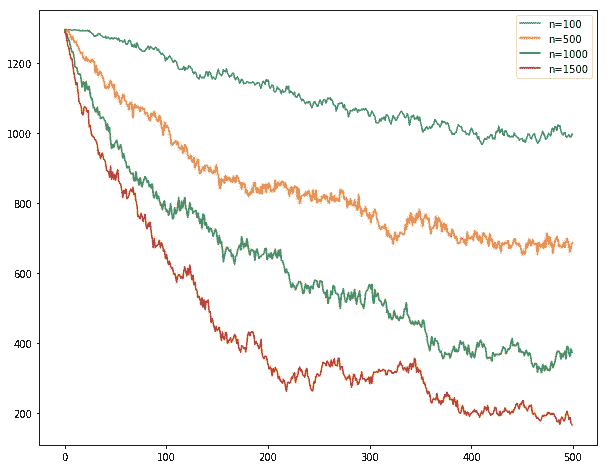

给定每个模拟分笔成交点的不同交互数量，独特文化的数量

请注意，这并不一定意味着一种文化吸收了另一种文化，这只是意味着两者变得更加相似，正如你有时可以从模拟中看到的那样，主导文化也会随着时间的推移而变化。

## 文化变迁

最后，如果我们看一下变化的实际数量，它们大部分时间保持相当稳定，徘徊在交互数量的 15–20%之间。这告诉我们，尽管独特文化的数量在不断变化，即使特征距离变得越来越小，但总会发生某种程度的变化

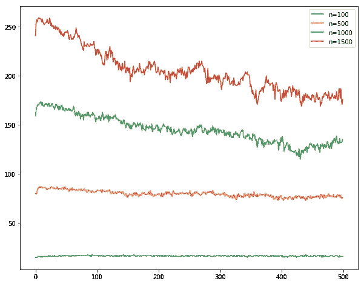

文化变化的次数，给定每个模拟分笔成交点的不同交互次数

这种分析是基于仅仅改变相互作用的次数。让我们看看如果我们改变模拟网格的覆盖范围会发生什么。通过减少整个模拟网格中的文化总数，该参数改变的是每个文化与之交互的邻居的数量。

# 不同数量的邻居

分析是相同的，唯一的区别是真正改变了源文件。在这种情况下，我们从 20%的培养物网格覆盖率开始，到 40%，然后 60%，80%，最后整个网格被培养物覆盖。

## 文化差异

让我们从比较不同 coverages 的要素距离开始。当覆盖范围变化时，特征距离变化看起来相当一致，当覆盖范围增加时，即，当文化有更多的邻居要交互时，特征差异在稳定状态下更大。然而，正如你所看到的，当文化有更多的邻居时，最初的下降更大。

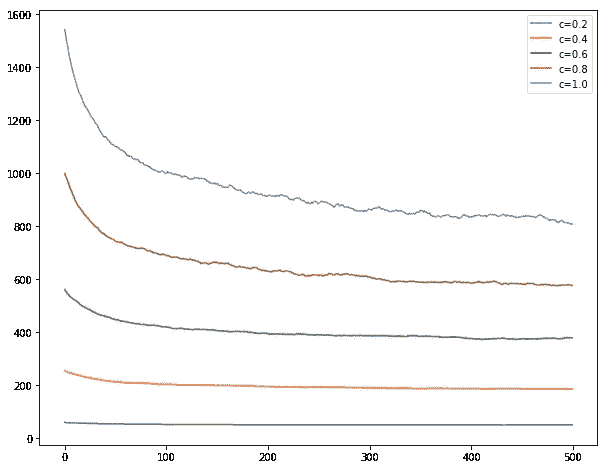

文化差异，给定模拟网格中不同的文化覆盖范围

## 独特的文化

接下来我们来看看独特文化的数量。该图表与早期的观察结果一致，随着覆盖面的增加，独特文化的数量也在增加，即使随着时间的推移数量在减少。然而，你可能也会注意到，随着覆盖率的增加，独特文化的数量也会下降得更快。

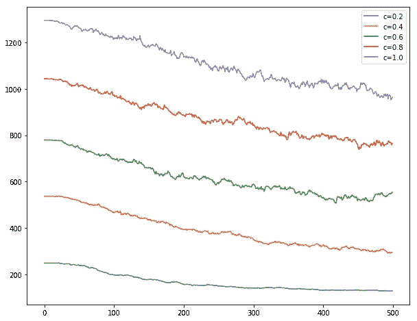

给定模拟网格中不同区域性的覆盖范围，唯一区域性的数量

## 文化变迁

最后让我们看看变化的数量。不出所料，随着覆盖面的扩大和更多邻居的互动，会发生更多的文化变化。我们还可以看到，随着时间的推移，变化是相当一致的，即使独特的文化以及特征距离的数量下降。

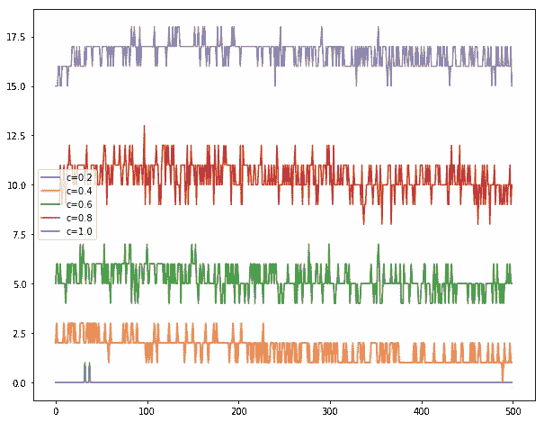

给定模拟网格中不同的文化覆盖范围，文化变化的数量

# 观察

从模拟中，我们可以观察到以下情况:

1.  随着时间的推移，独特文化的数量越来越少。这并不出人意料，毕竟我们确实希望不同的文化相互影响，变得越来越相似，直到它们变得相同。您可以从模拟网格上的文化聚类中看到这一点。这就是阿克塞尔罗德所说的局部收敛。
2.  即使过了很长时间，独特文化的数量实际上也不会下降到 1。这些文化仍然彼此不同。这就是阿克塞尔罗德所说的全球两极分化。
3.  随着时间的推移，随着特征差异的减少，文化变得越来越相似。然而，在最初的急剧下降之后，文化差异或多或少地趋于平缓，即使独特文化的数量继续下降。这告诉我们，即使文化相互作用，也不意味着我们都会变得一样——文化差异仍然存在。
4.  最后一个有趣的观察是，即使文化在互动中同化，一些文化似乎占主导地位，但这种主导地位不是永久的。事实上，在整个模拟过程中，变化或多或少是恒定的，这意味着文化总是在变化。

# 密码

模拟的完整 [GitHub 库可以在这里找到——https://github.com/sausheong/culture_sim](https://github.com/sausheong/culture_sim)

# 摘要

基于代理的模拟就像科学实验，你可以为你的场景创建完美的环境和代理，你可以快速调整参数并找出可能的结果。我们可以将复杂的情况分离并简化成基本形式，然后进行我们想要的实验。在某种程度上，这有助于我们更好地理解复杂性及其不可预测的结果。

我使用 Go 进行模拟，并使用 Python/Jupyter Notebook 来分析结果，但还有很多其他方法可以做到这一点。事实上(有点无耻的广告宣传)我[已经写了一整本书，基于使用 Ruby 进行模拟和使用 R 进行分析](http://shop.oreilly.com/product/0636920022626.do)。

最后一点，虽然我在文化交流的背景下讨论了这一点，但我在这里展示的是一个有限的受控参数集的计算机模拟。模型或模拟应该被认为是真实的，仅仅是模型，而不是现实的真实代表。