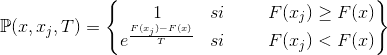
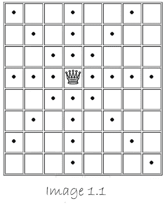
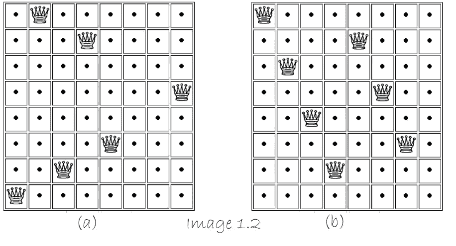
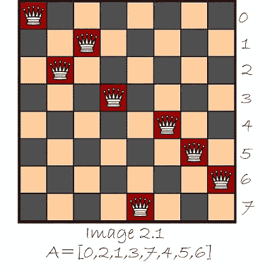
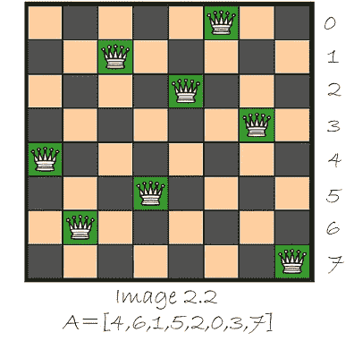

# 模拟退火和八皇后问题

> 原文：<https://towardsdatascience.com/simulated-annealing-and-the-eight-queen-problem-10f737edbb7e?source=collection_archive---------28----------------------->

## 无监督学习和随机优化算法


模拟退火算法是许多随机优化算法中的一种。不像爬山算法这样的算法，其目的只是改进优化，SA 允许更多的探索。这个想法是，通过这种探索，更有可能达到全局最优，而不是局部最优(关于局部最优、全局最优和爬山优化算法的更多信息，请点击此[链接](https://www.estudiodedatos.com/optimizacion-aleatoria/))。

术语“退火”是冶金学中的一个术语，其目的是降低和提高金属的温度。这个过程允许分子重新组合，每次都变得更近，因此金属变得更硬。类似的情况也适用于 SA 算法，通过探索更接近一个解决方案，离它更远，然后再次接近一个更好的解决方案。

# 模拟退火算法

该算法可以分解为 4 个简单的步骤:

1.  从一个随机点 x 开始。
2.  在邻域 N(x)上选择一个新的点 xⱼ。
3.  决定是否要搬到新点 xⱼ.将基于概率函数 P(x,xⱼ,T 做出决定(前面解释过)。
4.  减少 T

就像我们之前提到的 P(x,xⱼ,T)是将指导我们是否移动到新的点的函数:



让我们探索一下这个函数告诉我们什么。F(x)是目标函数(我们要找到最优点 x 的函数)。如果新点 xⱼ改进了目标函数的结果，我们将以概率 1 移动到新点。

当新点没有改善目标函数时，我们将根据 F(xⱼ)-F(x 和变量 t 的差异移动到新点

当 T 高时，移动到新的点的可能性也高，而当 T 低时，移动到新的点的可能性也低。这就是为什么最初我们将从一个高 T 开始做更多的探索，并逐渐降低 T 的值以达到最佳点。

现在我们知道了算法是如何工作的，是时候使用 python 来执行一个例子了，以进一步加深我们的理解。

# 八皇后问题

八皇后问题在于将八个皇后放置在一个 8*8 的桌面板上，并且它们中的任何一个都不在彼此的攻击线上。蚁后可以水平、对角和垂直移动，如图 1.1 所示。



图片来自 [Brainmetrix](http://www.brainmetrix.com/8-queens/)

找到问题的解决方案并不容易，因为存在大量的组合。我们可以在图 1.2 中看到一些解决方案，其中只有 6 和 7 个皇后位于棋盘上。



图片来自 [Brainmetrix](http://www.brainmetrix.com/8-queens/)

既然我们理解了这个问题，让我们用 python 代码来解决它。

# 使用 Python 的 8 个皇后

python 中有一个名为“mlrose”的库，它对实现随机优化算法非常有帮助，因此前几行代码将用于导入这个库以及帮助我们处理数组的 numpy 库。

```
### Importing the necessary libraries
import mlrose
import numpy as np
```

下一步是定义目标函数。目标函数将计算放置在不能被攻击的地方的蚁后的数量。考虑到皇后是垂直移动的，有理由说没有皇后应该被放置在同一垂直线上，因此我们可以用一个简单的 8 个位置的数组来表示每个皇后的位置。例如，在国际象棋棋盘中，数组 A=[0，2，1，3，7，4，5，6]看起来像图 2.1。



图片来自[数据遗传学](http://www.datagenetics.com/blog/august42012/)

现在是编写目标函数的时候了:

```
###Defining the objective function
def queens_max(position):
    # We start the count
    no_attack_on_j = 0
    queen_not_attacking=0
    # Compare for each pair of queens
    for i in range(len(position) - 1):
        no_attack_on_j=0
        for j in range(i + 1, len(position)):
            ### Check if there is any diagonal or horizontal attack.
            ###Iterative process for each column
            if (position[j] != position[i]) and (position[j] != position[i] + (j - i)) and (position[j] != position[i] - (j - i)):
                """If there isn't any attack on the evaluated column.
                The count is increased by one.
                This counter is only used as a reference ."""
                no_attack_on_j += 1
                """If there is no attack on all the columns.
                The general counter is increased by one.
                This counter indicates the number of queens that are correctly
                positioned."""
                if(no_attack_on_j==len(position)-1-i):
                    queen_not_attacking+=1
                """The return number is the number of queens not attacking each
                other. If this number is 7 we add 1 cause it means the last
                queen is also free of attack."""
    if(queen_not_attacking==7):
      queen_not_attacking+=1
    return queen_not_attacking
```

之前定义的目标函数被指定为 mlrose 中方法“CustomFitness”的参数。这就是任何目标函数使用这个库的方式。

```
# Assign the objective function to "CustomFitness" method.
objective= mlrose.CustomFitness(queens_max)
```

现在，我们完成了棘手的部分。剩下的唯一一件事就是告诉罗丝需要解决的问题类型。我们正在解决的问题有离散的数字(整数)，这就是为什么我们将使用“离散选择”的方法。这个方法将保存问题的描述，它有 4 个参数:

1.  length——我们正在处理的数组的大小(对于八皇后问题是 8)。
2.  fitness _ fn——我们之前用“目标”这个名字定义的目标函数。
3.  最大化-如果我们想要最大化目标函数，它必须是“真”,否则为“假”。
4.  max _ val——这个参数表示函数可以取的最大值。从 0 开始，到 max_val-1 结束。在我们的例子中，皇后的位置可以从 0 到 7，所以 max_val=8。

这一行代码:

```
#Description of the problem
problem = mlrose.DiscreteOpt(length = 8, fitness_fn = objective, maximize = True, max_val = 8)
```

最后，是时候告诉 mlrose 如何解决问题了。我们知道我们将使用模拟退火(SA ),指定 5 个参数很重要。

1.  问题-该参数包含问题的信息。我们之前用“问题”这个名称定义了它。
2.  schedule——这个参数告诉 T 如何在每次迭代中减少。有很多方法可以减少 T，可以在[的玫瑰](https://mlrose.readthedocs.io/en/stable/source/decay.html)上查看。这个时间 T 将使用 ExpDecay()以指数方式减少。
3.  max _ attempts——定义算法尝试搜索更好解决方案的次数很重要。如果尝试次数达到最大值，它应该停止。
4.  max _ ITER——它表示算法可以找到的新点的最大数量或者它所做的迭代的最大数量。
5.  init_state-参数“init _ state”是数组的初始位置。

最后一段代码如下所示:

```
# Define decay schedule
T = mlrose.ExpDecay()
# Define initial state
initial_position = np.array([4, 6, 1, 5, 2, 0, 3, 7])
# Solve problem using simulated annealing
best_position, best_objective = mlrose.simulated_annealing(problem=problem, schedule = T,
max_attempts = 500, max_iters = 5000,
init_state = initial_position)
print('The best position found is: ', best_position)
print('The number of queens that are not attacking each other is: ', best_objective)Output:The best position found is: [4 6 1 5 2 0 3 7]
The number of queens that are not attacking each other is: 8.0
```

正如图 2.2 所示，我们成功解决了 8 皇后问题



图片来自[数据遗传学](http://www.datagenetics.com/blog/august42012/)

## 最后备注和代码

我希望你喜欢这篇文章，并玩八皇后问题。我把 google colab 和 github 上的代码留给你。运行这段代码，稍加调整，甚至可以解决 9，10…n 皇后问题。

参考书目:

机器学习，随机优化和搜索。(未注明)。检索于 2020 年 8 月 13 日，发自 https://mlrose.readthedocs.io/en/stable/

大脑训练。(未注明)。检索于 2020 年 8 月 13 日，发自 http://www.brainmetrix.com/8-queens/

八个皇后。(未注明)。2020 年 9 月 10 日，从[http://www.datagenetics.com/blog/august42012/](http://www.datagenetics.com/blog/august42012/)检索

*原载于 2020 年 8 月 25 日 https://www.estudiodedatos.com**的* [*。*](https://www.estudiodedatos.com/simulated-annealing-and-the-eight-queen-problem/)