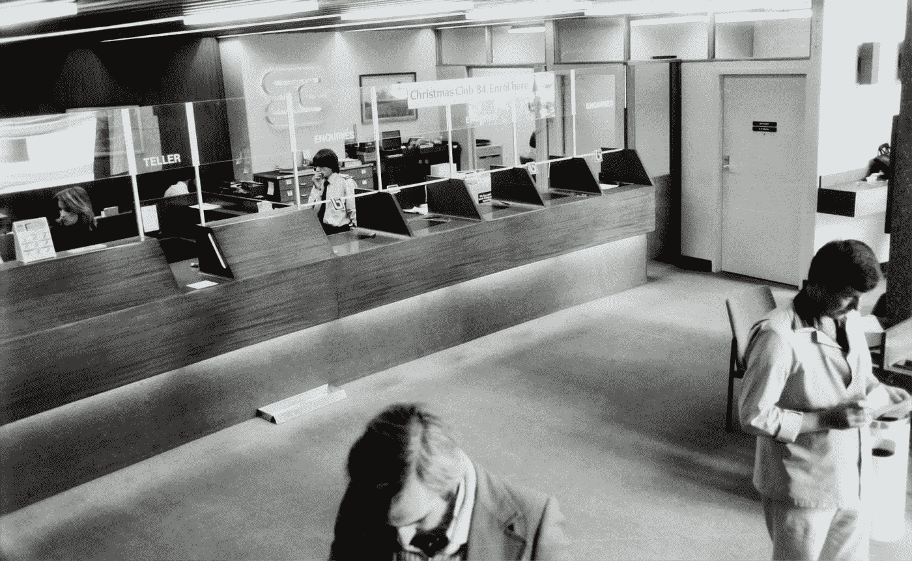
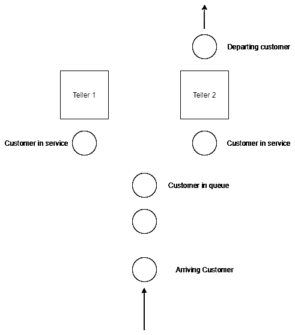
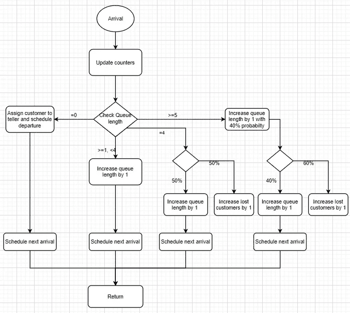
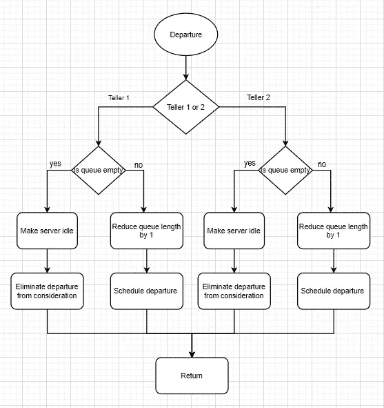
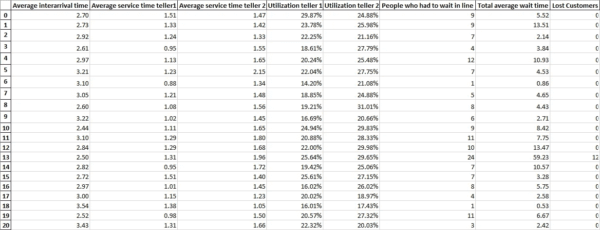
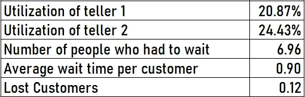

# 用 Python 模拟排队系统

> 原文：<https://towardsdatascience.com/simulating-a-queuing-system-in-python-8a7d1151d485?source=collection_archive---------1----------------------->

## 了解如何从头开始用 python 创建模拟

图片由维多利亚博物馆在 [Unsplash](https://unsplash.com/) 上拍摄

我们都在生活中的某个时候去过银行，我们熟悉银行的运作方式。顾客进去，排队等候叫号，从出纳员那里得到服务，最后离开。这是一个排队系统，我们在日常生活中会遇到很多排队系统，从杂货店到游乐园，它们无处不在。这就是为什么我们必须尽可能提高它们的效率。这些系统中存在大量的随机性，这会导致巨大的延迟，导致长时间的排队，降低效率，甚至造成金钱损失。可以通过开发[离散事件模拟](https://en.wikipedia.org/wiki/Discrete-event_simulation)模型来解决随机性问题，这对于通过分析关键绩效指标来提高运营效率非常有帮助。

在这个项目中，我将模拟一家银行的排队系统。

> 让我们考虑一家有两个出纳员的银行。根据泊松过程，客户平均每 3 分钟到达银行一次。在这种情况下，这个到达率是假设的，但是应该根据实际数据进行建模，以获得准确的结果。他们排队等候一个空闲的出纳员。这种类型的系统被称为 [M/M/2 排队系统](https://en.wikipedia.org/wiki/M/M/1_queue#:~:text=In%20queueing%20theory%2C%20a%20discipline,is%20written%20in%20Kendall's%20notation.)。第一名柜员服务客户的平均时间为 1.2 分钟，第二名柜员为 1.5 分钟。这里假定服务时间是指数增长的。当一个客户进入银行，两个柜员都闲着，他们以相等的概率选择其中一个。如果一个客户进了银行，有四个人在排队，他们会有 50%的概率离开银行。如果一个客户进入银行，有五个或五个以上的人在排队，他们将有 60%的概率离开银行。

让我们首先试着想象这个系统

作者照片

太好了！现在让我们开始构建模型

一般来说，在离散事件仿真中有两种广泛使用的时间推进方法，**下一个事件时间推进**(时钟从一个事件跳到另一个事件)& **固定增量时间推进**(时钟以固定时间间隔推进)。我将为这个模型使用下一个事件时间推进机制。

模拟模型的主要组件包括:

1.  **状态变量:**描述系统在特定时间的状态
2.  **模拟时钟:**记录时间
3.  **统计计数器:**存储性能参数统计信息的变量
4.  **初始化例程:**在时间 0 初始化模型的子程序或类
5.  **定时程序:**决定下一个事件的子程序或类
6.  **事件例程:**特定事件发生时更新系统的子程序或类

从导入所需的库开始，在这种情况下只需要 NumPy 和 Pandas(python 有一个名为 [SimPy](https://en.wikipedia.org/wiki/SimPy) 的模拟库，这是一个基于流程的模拟框架，也可以使用)

来源[https://gist.github.com/BhavyaJain08](https://gist.github.com/BhavyaJain08)

接下来，我们开始定义变量，并在主类中的 *__init__* 函数中初始化它们。下面定义变量是状态变量和统计计数器。

告诉我们系统性能的关键变量是平均等待时间、服务器利用率、排队等待的人数和流失的客户，其中一些是直接计算的，另一些是派生的。

来源[https://gist.github.com/BhavyaJain08](https://gist.github.com/BhavyaJain08)

## 定时程序

定时程序通过比较事件的预定时间来决定下一个发生的事件，并将模拟时钟提前到相应的事件。最初，出发事件被安排在无限时间发生(因为没有顾客)，这保证了第一个事件将是到达事件。

来源[https://gist.github.com/BhavyaJain08](https://gist.github.com/BhavyaJain08)

我还在这个函数中计算了客户的总等待时间。这是有意义的，因为我们希望评估客户在活动结束后的等待时间，这也是计时例程的开始。

## 到达事件

根据上面提到的问题，一个到达事件可以有多种结果，在下面的图表中突出显示了这些结果。

抵店活动流程图(作者摄影)

到达事件的结果由队列中的客户数量和服务器的状态决定。对于每个结果，更新统计计数器，并安排下一个事件。

来源[https://gist.github.com/BhavyaJain08](https://gist.github.com/BhavyaJain08)

在队列长度为零的情况下，检查每个服务器的状态，并将顾客分配给空闲的服务器，在到达的同时安排离开。如果两个服务器都很忙，队列长度为零，那么队列长度增加 1，并安排下一个到达。

在所有其他情况下，队列长度增加 1，并计划下一个到达，或者丢失一个客户，并更新计数器。

## 离开事件

当计时程序识别出接下来要安排的两个发车事件中的任何一个时，发车事件发生。离开事件的流程如下图所示

离职事件流程图(作者摄影)

来源[https://gist.github.com/BhavyaJain08](https://gist.github.com/BhavyaJain08)

当有客户在队列中等待时，下一个客户开始服务，队列长度减少一，服务器保持忙碌。

当队列中没有顾客时，服务器处于空闲状态，将来不会安排离开事件。

## 生成到达和服务时间

使用[逆变换](https://en.wikipedia.org/wiki/Inverse_transform_sampling)采样生成到达和服务时间。这些随机数生成器函数在到达和离开函数中被调用，以生成随机的到达和服务时间。

来源 https://gist.github.com/BhavyaJain08

## 运行模拟

下一步是运行模拟。我决定从上午 9 点到下午 1 点(4 小时)运行 100 次复制，收集数据并存储在 excel 工作簿中以供进一步分析。我使用了一个 for 循环，它每次都更新随机数种子，运行 100 次，并将结果附加到 pandas 数据帧中。稍后，该数据框将导出为 excel 工作簿

来源[https://gist.github.com/BhavyaJain08](https://gist.github.com/BhavyaJain08)

## 结果

以下是从 100 次重复中获得的结果片段

作者照片

最后，我们可以从这些结果中导出性能度量，然后分析它们，并在提高效率、降低成本、分配资源等方面使用它们。

作者照片

从制造业到服务业，甚至是生物学，模拟在许多行业都可以作为重要的决策工具。这个项目只是模拟无限可能性的一个小例子。有许多软件和资源可以轻松地对复杂系统进行建模和模拟。然而，该项目的目标是对离散事件模拟如何工作及其作为决策工具的用途有一个基本的了解。

**参考文献:**

[https://www.youtube.com/channel/UCkQ5dusAivKJ66hb3EDeBZg](https://www.youtube.com/channel/UCkQ5dusAivKJ66hb3EDeBZg)