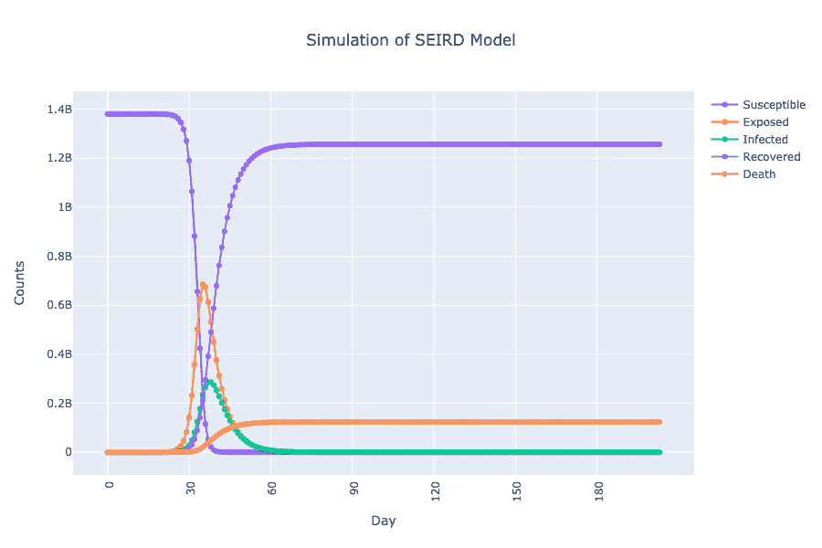
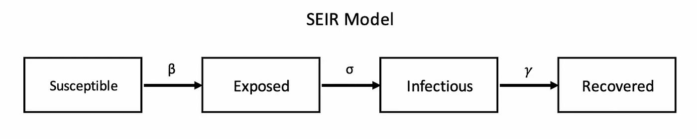
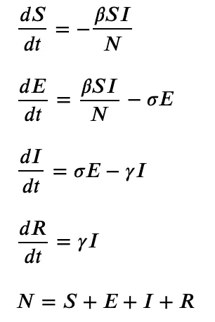
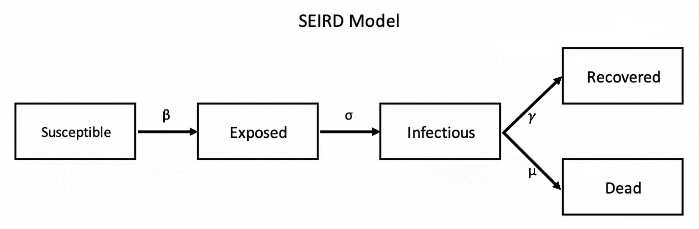
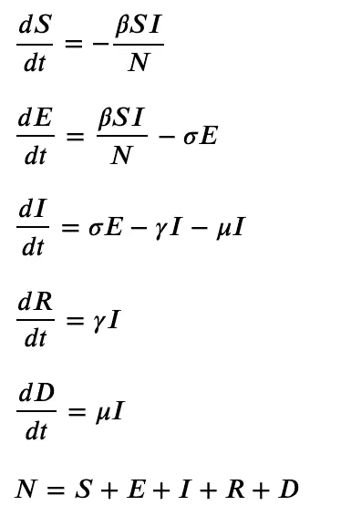
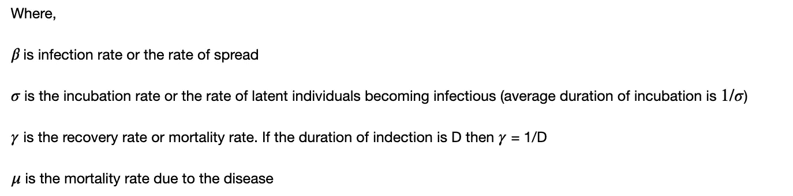
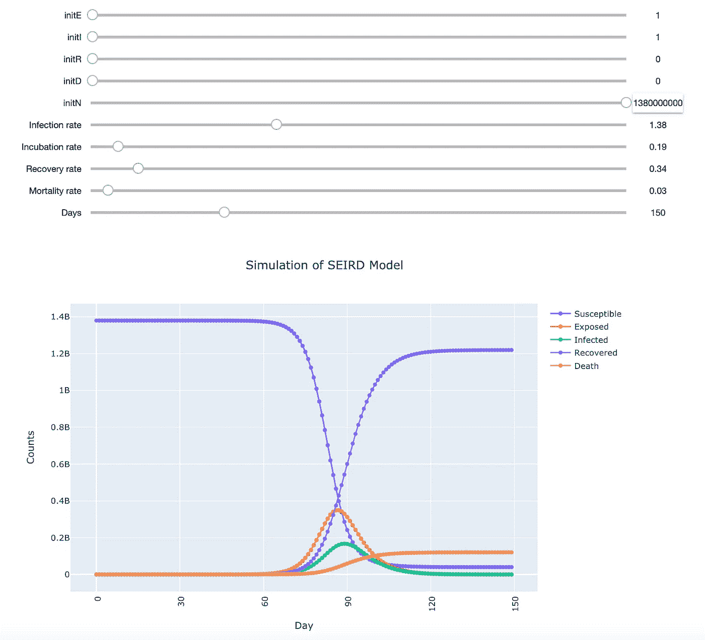

# 用 Python & Jupyter 控件模拟流行病学中的房室模型

> 原文：<https://towardsdatascience.com/simulating-compartmental-models-in-epidemiology-using-python-jupyter-widgets-8d76bdaff5c2?source=collection_archive---------15----------------------->

## 在 Jupyter 笔记本中实现和模拟 SEIR 和塞德模型。

***编者按:*** [*走向数据科学*](http://towardsdatascience.com) *是一份以数据科学和机器学习研究为主的中型刊物。我们不是健康专家，这篇文章的观点不应被解释为专业建议。*

在这篇文章中，首先，我们将了解在[流行病学](https://en.wikipedia.org/wiki/Epidemiology)中使用的[房室模型](https://en.wikipedia.org/wiki/Compartmental_models_in_epidemiology)的基础知识，然后我们将使用 python 来模拟两个这样的模型 SEIR 和塞德。最后，您应该能够模拟更改不同参数的效果，就像下面的动画所示。

*下面的动画展示了在保持其他参数不变的情况下，并假设所有人都容易感染该疾病时，感染率降低的效果。*

模拟感染率降低的影响，保持所有其他参数不变，并假设整个人口总是容易感染该疾病

> 请注意，这纯粹是一个编程和数据科学练习，所以不要根据这些模拟得出结论。把这留给流行病学和医学专家吧。

如果你对这个领域很熟悉，并且想直接进入代码，你可以在我的 GitHub 上查看 SEIR 和 T21 的笔记本。

现在让我们从基础开始。

# 分室模型

房室模型是一种机械模型，它试图通过将问题动力学中涉及的机制整合到模型中来解释观察到的数据。

房室模型是基于一个常微分方程系统，它表达了人群不同流行病学状态之间的动态。它们可用于短期和长期预测一种现象(如疾病)的传播，也可用于研究不同干预措施的效果( [Chowell，2017](https://www.sciencedirect.com/science/article/pii/S2468042717300234) )。

单词'*隔室'*表示将种群划分成相互排斥的组，称为*‘隔室'*。例如，在流行的 SIR 模型中，三个隔间是 **S** 可接受的、 **I** 未感染的和 **R** 已死亡的。SIR 模型用于其中恢复导致对疾病的持久抗性的疾病，例如麻疹的情况( [Allen 等人](https://www.ncbi.nlm.nih.gov/pubmed/1806092))。理解这些模型的假设及其对特定疾病的有效性极其重要，因此，最好留给专家来做:)

在 SIR 模型的基础上，让我们看看什么是 SEIR 和塞德模型，以及它们之间的动态。

## SEIR 模型

SEIR 代表“患病的”和“死亡的”。这 4 种流行病学状态之间的进展如图 1 所示。

图 1: SEIR 模型

模型的动力学用图 2 所示的微分方程系统来表示，

图 2: SEIR 模型的 ODE 系统

有关公式中使用的参数说明，请参考图 5。

## 塞德模型

SEIRD 代表 S**S**S**E**exposed**I**infective**R**recovered**D**EAD。在这里，死亡个体的动力学用一个单独的隔间来建模。在一些疾病中，如埃博拉病毒，死亡仍然可以传染，因此 SEIRD 模型的动力学也可以研究 D 和 E 个体之间的相互作用( [Weitz 等人](https://www.nature.com/articles/srep08751))。为简单起见，我们假设 D 没有传染性，因此，这 5 种流行病学状态之间的进展如图 3 所示。

图 3: SEIRD 模型

模型的动态特性用图 4 所示的微分方程系统表示。

图 4: SEIR 模型的颂歌系统

图 5:符号

了解了基础知识后，现在让我们开始模拟。

# SEIR 和塞德模型的模拟

此实施练习的结果将是一个小部件，它将使我们能够修改模型的不同参数，并观察其对 SEIR 和 d 曲线的影响。我们将使用 Jupyter 小部件进行交互，最终的小部件将类似于图 6 所示。

图 6: SEIRD 模拟器小部件

模拟的实现将需要我们定义一个常微分方程(ODE)系统，使用解算器对其进行求解，并预测感兴趣的时间跨度，最后用 Jupyter 小部件将所有这些连接在一起，从而实现交互性。

对于这些步骤，我将大量使用超级棒的教程[用 Python 求解微分方程](https://www.youtube.com/watch?v=VV3BnroVjZo)、用 Python 计算统计和用 Python 和 Jupyter 实现的[常微分方程(ODE)。让我们以 SEIR 模型为例，一步一步地进行，以使实现更加清晰。](https://elc.github.io/posts/ordinary-differential-equations-with-python/)

# SEIR 模型的模拟

## 定义 ode

这里，我们将在 python 函数中编写图 2 中的 ode，并在列表中返回 ODE 系统。让我们看看如何，

SEIR 颂诗体系

## 定义规划求解

接下来，定义一个函数，该函数将输入时间跨度、求解常微分方程组的初始条件和模型参数，并在求解常微分方程组后返回结果预测。注意，解微分方程需要初始条件来估计积分常数。我们将使用 scipy 的 odeint 作为求解器。现在让我们看看代码，

求解 SEIR 模型常微分方程的函数

## Jupyter 互动部件

现在，让我们使用 [ipywidgets](https://ipywidgets.readthedocs.io/en/latest/) 库中的小部件将它们联系在一起，以实现交互性并帮助我们进行模拟。

遵循教程[用 Python 和 Jupyter 实现的常微分方程(ODE)](https://elc.github.io/posts/ordinary-differential-equations-with-python/)，我们将编写主函数，其中我们将调用上面定义的辅助函数。让我们看看它的代码…

ipywidgets.widgets 中的 interact 方法所需的主函数

这个难题的最后一部分是调用 *interact* 函数，参数为上面实现的 *main* 函数，以及 *main* 函数所需的参数值，由相应的参数小部件读取。根据输入的类型，使用的小部件有 *IntSlider* 和 *FloatSlider* 。让我们看看这最后一段让一切正常工作的代码！

用于创建窗口小部件交互方法

你可以在 Jupyter 笔记本[模拟 SEIR 模型](https://github.com/silpara/simulators/blob/master/compartmental_models/SEIR%20Simulator%20in%20Python.ipynb)中找到完整的代码。运行笔记本后，您将得到一个类似于图 6 所示的小部件。

# SEIRD 模型的模拟

SEIRD 模型的相应 ode_model、ode_solver、main 和 interact 函数为:

## 定义 ode

塞德颂诗体系

## 定义规划求解

求解 SEIRD 模型常微分方程的函数

## Jupyter 互动部件

ipywidgets.widgets 中的 interact 方法所需的主函数

最后，

用于创建窗口小部件交互方法

同样，你可以在 Jupyter 笔记本[中找到 SEIRD 模型](https://github.com/silpara/simulators/blob/master/compartmental_models/SEIRD%20Simulator%20in%20Python.ipynb)的模拟完整代码。

# 结论

在这篇文章中，我们了解到，

1.  流行病学中的房室模型
2.  先生，SEIR，塞德模型——它们的区间和动态表现为一个常微分方程系统。
3.  python 中求解 ode 的代码
4.  使用 python 中的计算机小部件模拟房室模型的代码。

希望你和这些模特一起工作愉快。

# 参考

[1]Python 中的计算统计学(【https://people.duke.edu/~ccc14/sta-663/CalibratingODEs.html】T2

[2]用 Python 求解微分方程【https://www.youtube.com/watch?v=VV3BnroVjZo

[3]https://www.idmod.org/docs/hiv/model-seir.htmlSEIR 和塞伊斯的车型(

[4]流行病学中的房室模型[(https://en . Wikipedia . org/wiki/compartment al _ models _ in _ epidemiology # The _ SEIR _ model](https://en.wikipedia.org/wiki/Compartmental_models_in_epidemiology#The_SEIR_model))

[5]Python 和 Jupyter 的常微分方程(ODE)[(https://elc . github . io/posts/常微分方程-python/](https://elc.github.io/posts/ordinary-differential-equations-with-python/) )

[6]赛尔斯+型号[(https://github.com/ryansmcgee/seirsplus](https://github.com/ryansmcgee/seirsplus))

[7] R .古普塔、G .潘迪、P .乔德里、S .帕尔、SEIR 和基于回归模型的新冠肺炎疫情预测(2020 年)，medRxiv 预印本

[8] G Chowell，用量化的不确定性拟合流行病爆发的动态模型:参数不确定性、可识别性和预测的初级读本(2017)，传染病建模第 2 卷，第 3 期，2017 年 8 月，第 379-398 页

[9] LJ Allen，MA Jones，CF Martin,《麻疹流行病疫苗接种的离散时间模型》( 1991 年),《数学生物科学》第 105 卷，第 1 期，1991 年 6 月，第 111-131 页

[10] JS Weitz，J . Dushoff,《埃博拉死后传播建模:推理挑战和控制机遇》( 2015 年),《科学报告》第 5 卷，文章编号:8751 (2015 年)