# 用元胞自动机模拟新冠肺炎

> 原文：<https://towardsdatascience.com/simulating-covid-19-with-cellular-automata-aeb820910a9?source=collection_archive---------24----------------------->

## 社交距离和戴口罩真的有助于预防感染吗？

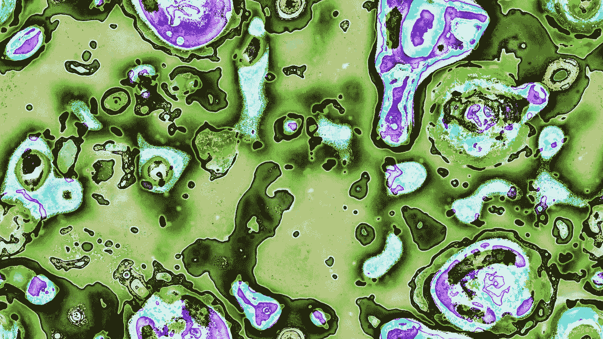

[来自 flickr 上的 Softology](https://www.flickr.com/photos/39445835@N05/)

*看看这篇文章附带的* [*代号*](https://github.com/maxbren/epidemic_cellular_automation) *。试着自己运行它，并修改参数。*

## 新冠肺炎（新型冠状病毒肺炎）

模拟新病毒的传播及其导致的疾病是学习适当预防措施的重要一步。到目前为止，已经有许多新的模拟被创造出来，覆盖了新型冠状病毒和新冠肺炎的不同区域。例如,《华盛顿邮报》发表了一篇很棒的文章展示了社交距离的重要性。通过这篇文章，我尝试模拟这种疾病，并希望通过它来传播安全预防措施的重要性。

## 什么是元胞自动机？

[**元胞自动机**](https://en.wikipedia.org/wiki/Cellular_automaton) 是由网格单元组成的离散模型，其中每个单元可以是一组给定状态中的某个状态。每个时间步长，每个单元都根据其邻居的状态和简单规则更新为一个新状态。它们已经被用于模拟不同的领域，从人工生命到森林火灾蔓延。康威的生命游戏是一种流行的细胞自动化，它用非常简单的规则创造复杂的结构。

卢卡斯·维埃拉— [自己的作品，CC BY-SA 3.0](https://commons.wikimedia.org/w/index.php?curid=101736)

细胞自动机的一个重要方面是使用局部化。因为单元基于它们的邻居(通常在 8 个周围的单元中)更新，所以任何基于邻近实体之间的交互的问题都可以通过元胞自动机有效地建模。这非常适合模拟感染，因为它们往往是通过附近咳嗽或打喷嚏的人身上的水滴发生的。

## 重要的流行病方程

下面是几个用于分析病毒的[重要方程式](https://en.wikipedia.org/wiki/Mathematical_modelling_of_infectious_disease):

**继发感染率(SAR)** :感染总人数与易感总人数之比(模拟结束时计算)

**基本再生数(R0)** :一个感染者在其整个感染期内直接传播病毒的易感者数量

# 模拟新冠肺炎和安全政策的有效性

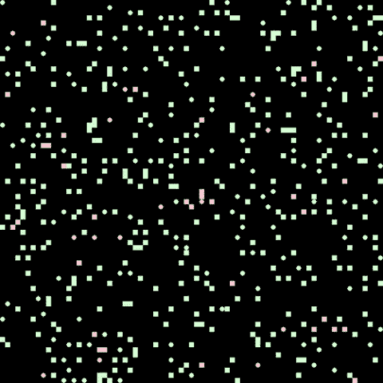

环境的渲染:绿色易感，红色被感染，蓝色被恢复；正方形是非社交距离个体，圆形是社交距离个体

## 环境

模拟环境由封闭空间中的人组成(一边包裹，即把人传送到另一边)。一个人可以是易感的、被感染的或康复的。这遵循了流行病的[基本 **SIR 模型**](https://en.wikipedia.org/wiki/Compartmental_models_in_epidemiology) 。最初，世界上充满了被感染或易感的人，然后随着时间的推移，根据现有的安全措施，感染率将会激增，或者病毒将会很快消亡。然而，没有新的人产卵，没有人可以离开，除非他们死于疾病。

## 运动和社会距离

环境中的个体四处移动来模拟互动。练习社交距离的人(上图中的圆圈)倾向于防御性地走动，以避免与他人站得太近。而不练习社交距离(方格)的人则四处走动，懒得与可能有传染性的人保持距离。看看上面这张代表环境的 gif。请注意，圆圈往往与其他所有人隔开。唯一不是这种情况的时候是如果他们被包围了，没有地方可去，或者旁边有一个广场。稍后，我们将探讨社交距离有多重要。

## 感染的时间线

当易感个体被感染时，他们不会立即出现症状或具有传染性。更确切地说，感染在人体内是有时间表的:

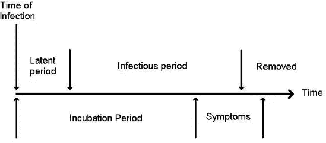

上边是时间线的传染部分，下边是症状部分。从**用细胞自动机模拟流行病传播开始，**程富 S

在顶部或传染性方面，首先病毒是潜伏的，这意味着这个人不会立即传染。几天后，在新冠肺炎，它们变得具有传染性。最后，甚至在症状完全停止之前，它们就进入了消除阶段，这意味着它们再次不具有传染性。在底部或症状方面，首先他们处于[潜伏期](https://en.wikipedia.org/wiki/Incubation_period)，这意味着他们没有表现出症状，然后他们变得有症状(或者[无症状](https://en.wikipedia.org/wiki/Asymptomatic_carrier)，这意味着他们从未表现出可能对他人造成危险的症状)。最后，症状会从轻微发展到严重，然后可能导致死亡。然而，大多数人只会经历轻微的症状。模拟包括这个重要的时间线，它与当前的新冠肺炎发现是精确的。

## 感染模型和戴口罩

一个流行的感染模型是 [**克马克-麦肯德里克模型**](https://mathworld.wolfram.com/Kermack-McKendrickModel.html) 。这有助于计算一段时间内封闭人群中的感染人数。它是一系列描述感染的微分方程，但是在这种情况下，在给定周围感染人数的情况下，使用非微分导数来描述易感者被感染的概率。

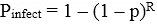

给定传染概率 p(传染邻居将疾病传染给易感者的概率)和 R(传染邻居的数量)。从**元胞自动机模型看流行病，**常 S

戴口罩已经被证明可以限制传染性飞沫的传播。换句话说，戴口罩的感染者将病毒传播给附近易感者的几率较低。所以在上面的等式中，p 值对于所有的感染者来说是不一样的，对于戴口罩的人来说会更低。

## 安全政策

在开始运行模拟之前，我们需要知道我们要分析什么。即使在无数的研究和报告之后，人们仍然在争论戴面具或 T2 社交距离的有效性。此外，一些州在安全问题上比其他州宽松得多，没有经常强制要求佩戴口罩，或者[在加强社会距离方面动作缓慢](https://www.newsweek.com/best-worst-states-social-distancing-revealed-1501022)。因此，让我们通过给戴口罩的人分配概率和社会距离来看看不同级别的安全政策，看看这些技术有多有效。

## 统计和概率

准确模拟新冠肺炎病毒而不仅仅是普通传染病的最重要的一步是获得正确的概率。许多价值观没有一个一致同意的答案，所以我坚持使用可靠的来源，如疾病预防控制中心和最近的研究论文。一些重要的数值，如感染的基本概率和戴口罩后感染概率的降低并不存在。然而，我将这些值设定在合理的范围之外，并对它们进行了调整，使模拟病毒的 R0 与新冠肺炎病毒相同。

# 结果和分析

## 低安全政策

每个人最初有 10%的社交距离和 10%的戴面具的机会。

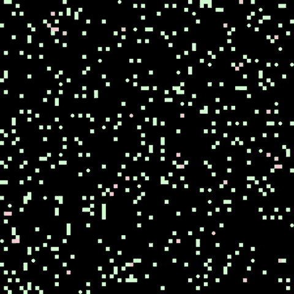

注意感染传播的速度

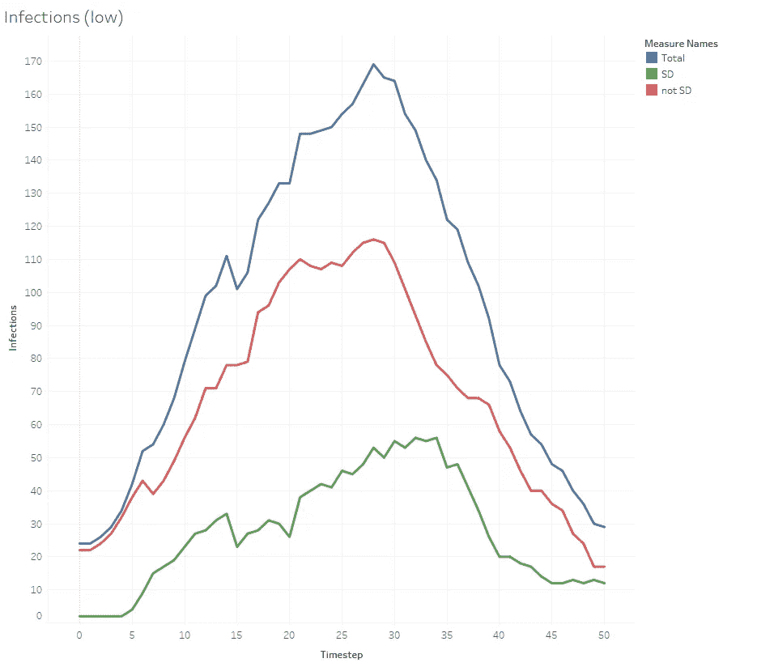

显示所有人(总数)、社交距离者(标准差)、非社交距离者(非标准差)在每个时间步(一天)的感染数

该图清楚地表明，练习社交距离的人感染的可能性要小得多。

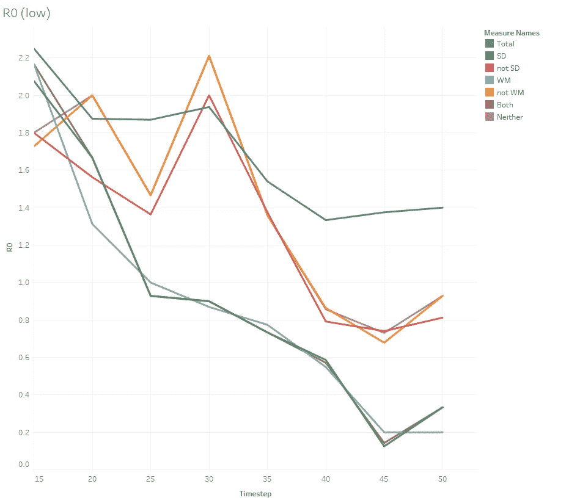

为社交距离者、戴口罩的人以及两者都做或都不做的人每 5 个时间步长显示 R0

戴口罩、保持社交距离或两者兼而有之的人感染的人数几乎总是比不采取这些安全预防措施的人少。

## 中等安全政策

每个人最初有 25%的机会保持社交距离，有 25%的机会戴面具。

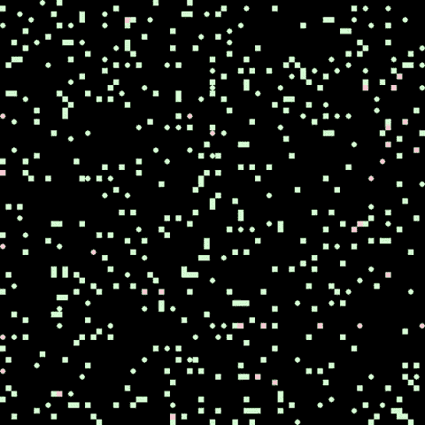

红色和蓝色比上面少

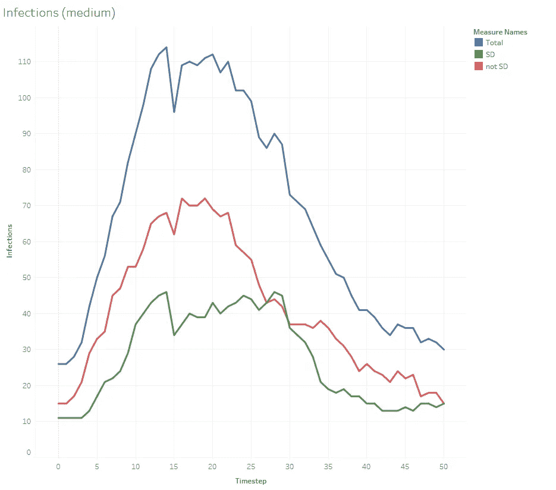

就像非常不安全的政策一样，那些有社交距离的人比那些没有社交距离的人更不容易被感染。

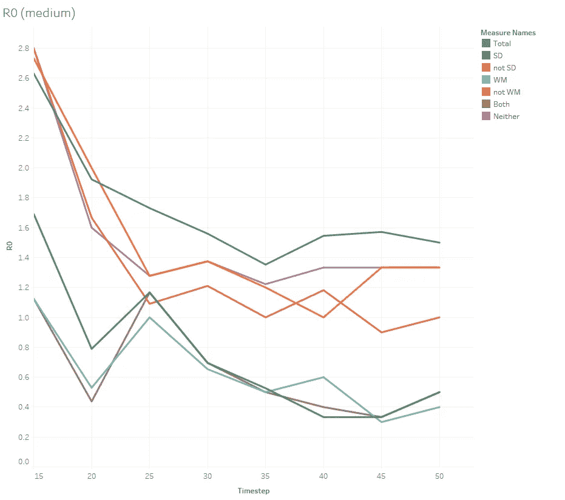

同上，那些采取安全预防措施的人有助于减少其他人的感染。

## 高安全性政策

每个人最初有 50%的机会保持社交距离，有 50%的机会戴上面具。

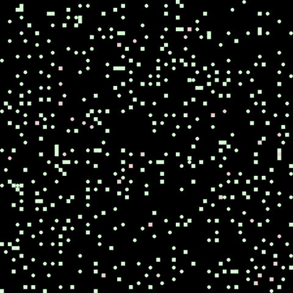

甚至更好

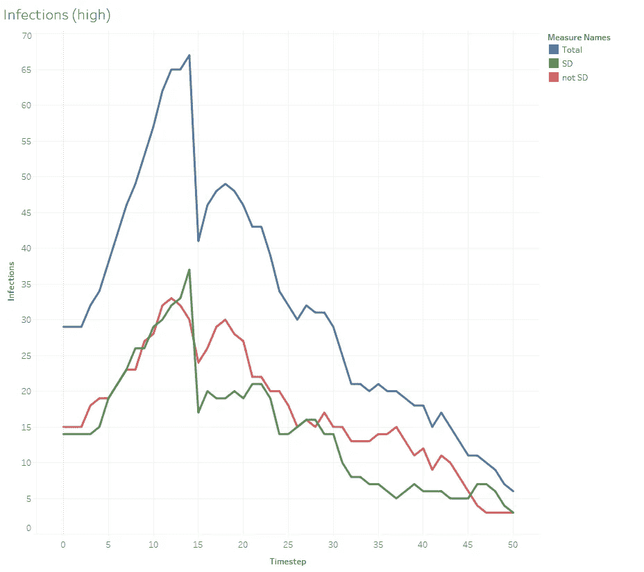

这与上述趋势一致，但界限更近，这可以解释为由于总体安全性，感染人数普遍减少。

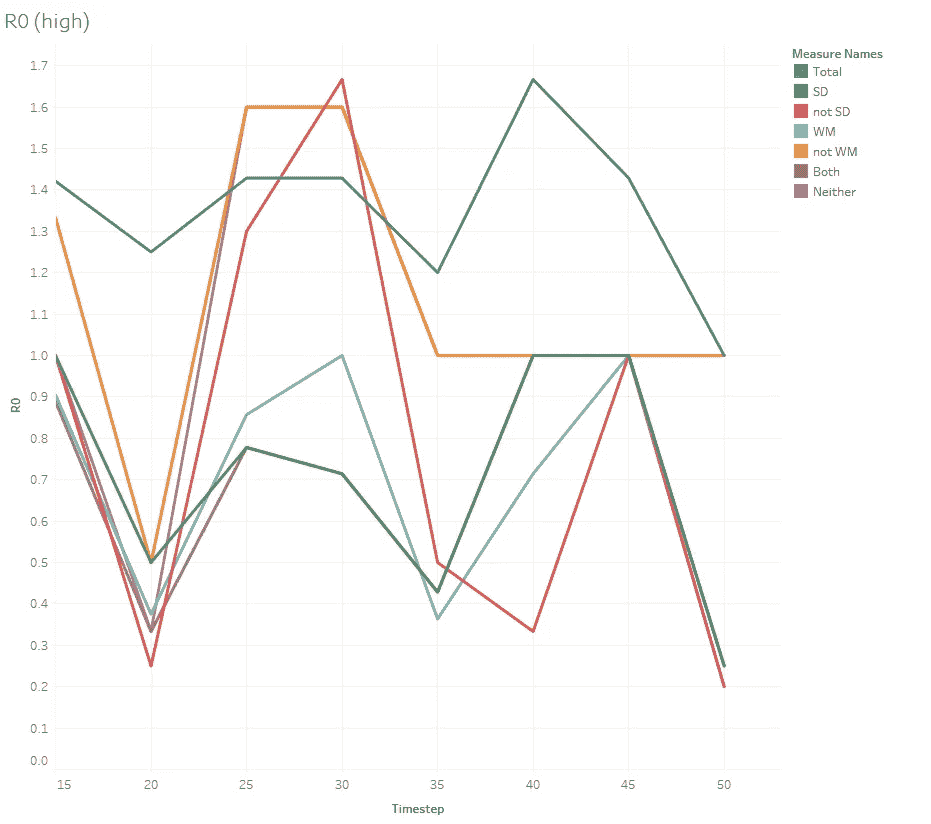

这个 R0 图很难读懂，线条更倾向于交叉。然而，在大部分时间内(尤其是 20 到 35 岁之间)，采取安全预防措施的人感染的人更少。因为没有太多受感染的人，所以不同的模拟运行会导致看起来非常不同的 R0 图。*用随行的* [*代号*](https://github.com/maxbren/epidemic_cellular_automation) *自己试试。*

## 比较安全策略的 SARs

比较不同安全策略有效性的一个好方法是，在模拟结束时，只查看感染与总易感性的比率，即 SAR。

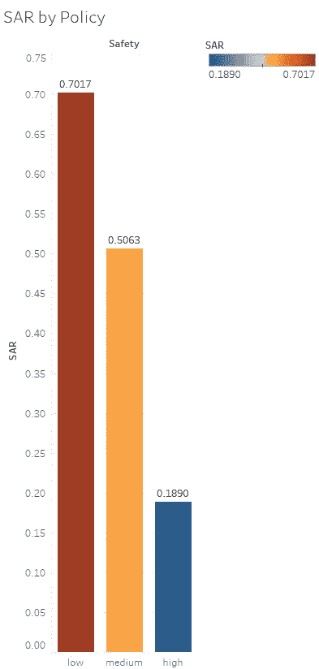

低安全性的 SAR 几乎是高安全性的 4 倍。让我们比较更多的安全政策的计算，以深入了解这一点。

## 比较感染总数

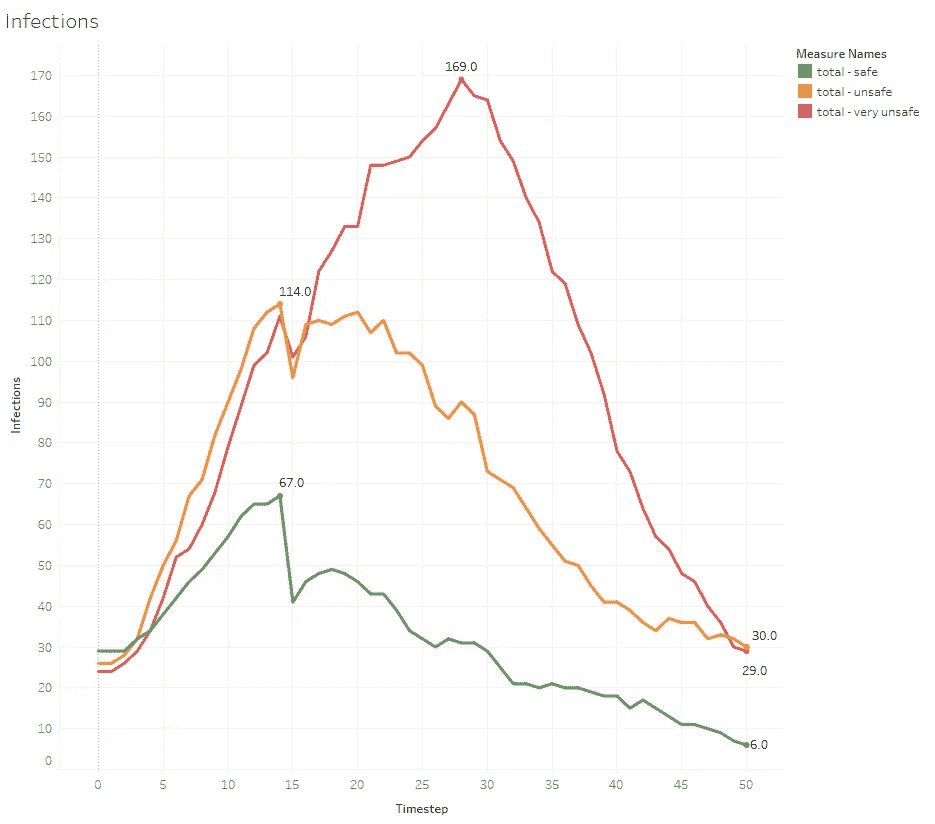

同样，越不安全，即社交距离越小和戴口罩，感染和死亡就越多(未显示)。注意:时间步长 14 处的下降是因为那些最初被感染的人恢复了(如果他们没有死亡的话)。

## 比较 r0

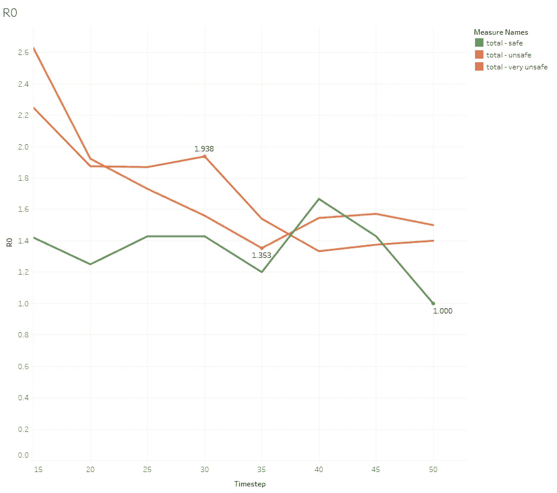

R0 图不像感染或 SAR 那样清晰，但在大多数情况下，安全策略归因于较少的终生感染。只有在时间步长 40，它才高于较不安全的策略。试着自己运行模拟，看看结果是什么样的。

**社交距离 vs 戴口罩？**

本节前驱:*双管齐下！*然而，我只是想看看哪种方法更能有效地降低模拟的感染人数。

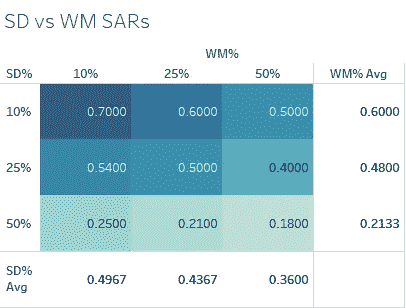

WM%按列，SD%按行。这些百分比再一次代表了个人社交距离或最初戴面具的机会

从该交叉表中可以明显看出，社交距离和戴口罩意味着较低的 SAR，即较少被感染。它还表明，社会距离是非常重要的，因为对于不同水平的社会距离，SARs 之间存在巨大的差异。戴口罩也有影响，但没有那么明显。然而，一点点走了很长的路，SAR 仍然从 10% WM 下降到 50% WM。

## 结论

通过这个用细胞自动化对流行病进行的简单模拟(使用新冠肺炎统计数据),我们可以看到采取安全预防措施是多么重要，比如保持社交距离和戴口罩。请做这些事情，帮助降低新冠肺炎的感染率。

旁注:有更多的事情可以添加到这个模拟中，如年龄效应，住院治疗，测试和自我隔离。叉我的[回购](https://github.com/maxbren/epidemic_cellular_automation)并尝试测试这些东西，以增加更多的模拟现实！

***编者按:*** [*走向数据科学*](http://towardsdatascience.com) *是一份以数据科学和机器学习研究为主的中型刊物。我们不是健康专家或流行病学家，本文的观点不应被解释为专业建议。想了解更多关于疫情冠状病毒的信息，可以点击* [*这里*](https://www.who.int/emergencies/diseases/novel-coronavirus-2019/situation-reports) *。*