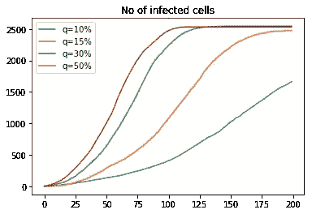

# 使用 Go 和 Python 模拟流行病

> 原文：<https://towardsdatascience.com/simulating-epidemics-using-go-and-python-101557991b20?source=collection_archive---------14----------------------->

## 用 Go 和 Jupyter Notebook 模拟和分析不同的流行病情景

这是一些直接影响我的事情，甚至当我打出这个故事的时候。2019 年 12 月底，一种新型冠状病毒在中国武汉爆发，并迅速蔓延到中国其他地区和境外。截至 2020 年 2 月撰写本报告时，距首次报告不到 2 个月，已有约 70，000 例确诊病例，近 1，700 例死亡。虽然大多数病例和死亡仍在中国，以武汉及其周边城市为中心，但情况正在迅速演变。

(演职员表:[邓](https://www.flickr.com/photos/186588517@N05/)https://www.flickr.com/photos/186588517@N05/49477439332/)

在我居住的新加坡，1 月 2 日报告了第一例疑似病例。患者是一名有武汉旅行史的三岁女童。[原来是肺炎](https://www.channelnewsasia.com/news/singapore/chinese-girl-pneumonia-travel-wuhan-common-illness-no-link-12235280)。

1 月 23 日出现了第一例实际确诊的新冠肺炎病毒病例，这是一名来自武汉的 66 岁男性中国公民的输入性病例，他于 1 月 20 日与其家人抵达新加坡。在接下来的几天里，这些数字迅速增加，都是外来病例。有一段时间，人们曾希望这只是外来病例。2 月 4 日锤子落下[报告了 6 例，包括 4 例人际传播](https://www.straitstimes.com/singapore/coronavirus-spore-reports-first-cases-of-local-transmission-4-out-of-6-new-cases-did-not)。第一例本地传播病例已经出现。

# 模拟流行病

像新加坡的每个人一样，我一直不安地关注着局势的发展。作为业务连续性规划的一部分，我已经将我的团队进行了分离，并要求其他不必参加面对面会议的人在家工作。生活和工作仍在继续，但紧张和焦虑的情绪正在酝酿。

(鸣谢 pix abay:[https://pix abay . com/illustrations/virus-microscope-infection-disease-1812092/](https://pixabay.com/illustrations/virus-microscope-infection-illness-1812092/))

所以我想尽力而为。在之前的一个项目中，我用彩色网格模拟了文化互动和传播。为什么不用我之前建立的相同机制来模拟流行病的传播呢？

# 流行病建模

大部分代码与[文化互动模拟](https://medium.com/sausheong/simulate-cultural-interactions-using-go-and-python-cac5db427708)相同，所以我不会在这里重复。相反，我只关注不同之处。

让我们从流行病建模开始。这个模型非常简单。使用细胞网格，我从网格中心的一个被病毒感染的细胞开始。几天后，被感染的细胞会感染它的邻居，我将从模拟中收集数据并做一些分析。

(鸣谢:张秀雄)

基本参数如`width`和`numDays`与[之前的模拟](https://medium.com/sausheong/simulate-cultural-interactions-using-go-and-python-cac5db427708)基本相同，而`filename`是保存模拟数据的文件名。

模拟配置和参数

流行病模拟的第一个参数是感染率(`rate`)，即细胞感染其邻居的可能性。接下来是潜伏期(`incubation`)，即病毒在开始传染之前保持休眠的天数。在这个阶段，细胞已经被感染了，尽管它还没有传染性。感染持续时间(`duration`)是细胞保持感染性的时间。在感染期结束时，细胞将恢复或死亡。细胞死亡的可能性是致死率(`fatality`)，细胞再次感染的可能性是其免疫力(`immunity`)。

我们从网格中心的一群健康细胞和一个感染细胞开始模拟。在我们的模拟中，不会填充整个网格，网格中的单元数量由参数`density`决定。当值为`1.0`时，整个网格将被填充，而在另一端，`0.0`意味着网格根本没有被填充。

虽然我模拟了疫情随时间的发展，但我也想了解隔离措施和有效药物的引入如何有助于阻止疫情。

参数`medIntroduced`是在抗击疫情中引入药物的日期。例如，如果值为`100`,则表示在第 100 天引入了药物。参数`medEffectiveness`是对引入药物有效性的测量。值`1.0`表示药物完全有效，每个接受药物治疗的细胞将有 100%的机会恢复，而值`0.0`表示药物完全无效。在被感染的细胞接受药物治疗并失败后，这就是生命的尽头，它将不得不依靠自己的运气生存。

参数`qIntroduced`是类似检疫措施出台的日子。参数`qEffectiveness`是衡量隔离成功程度的指标，包括找到被感染的细胞并确保其被正确隔离。一旦被感染的细胞被隔离，它将无法感染它的邻居，尽管这不会影响它的存活率。

## 细胞

有了这个，让我们看看我们需要如何改变`Cell`结构。没有任何惊喜，相应的参数被忠实地反映出来。

我给`Cell`结构添加了许多新方法。大多数方法都是不言自明的，所以我不会费心去描述它们。

`medicate`方法将药物应用于细胞，有机会使细胞恢复。如果没有，我会将该手机标记为正在接受药物治疗，我不会再呼叫它。一旦药物被证明无效，那就完了——细胞要靠自己了。

`process`方法是大部分动作所在的地方。如果被感染的细胞仍在孵化中，我减少它的孵化计数器，不做任何其他事情。否则，我将开始减少其持续时间计数器，一旦持续时间计数器达到 0，根据死亡率，细胞将恢复或死亡。

让我们继续进行主模拟。

## 主模拟

我从创造人口开始。如前所述，`density`参数决定了模拟网格的填充量。默认情况下，值为`0.7`,意味着 70%的网格将(随机)被单元格填充。

接下来，我感染了模拟网格正中央的一个细胞。然后开始模拟。

主模拟循环基本上贯穿所有单元，打印出网格，并在屏幕上打印一些信息。以下是遍历单元格时的步骤顺序:

1.  首先，我只关心被感染的细胞，如果不是被感染的细胞，我就忽略它
2.  接下来，我用上面的`process`方法处理单元格。这将相应地减少孵化或持续时间计数器，如果持续时间达到 0，将为细胞选择恢复或死亡
3.  如果细胞已经恢复或仍在孵化，我将跳到下一个细胞
4.  如果是时候引入药物，我就开始给细胞用药。如果药物对细胞起作用，它就痊愈了！否则，我会将它标记为正在用药，并在后面的循环中跳过它(药物不再对它起作用)
5.  当然，如果药物起作用了，细胞就会恢复，所以我会继续下一个细胞
6.  如果是时候引入隔离措施，我会检查是否已经发现并隔离了受感染的细胞，如果没有，我会隔离该细胞
7.  如果到达这里，最后一步是查看细胞的邻居。如果他们还没有被感染，如果他们对再次感染没有免疫力，我会试着去感染他们

# 模拟

正如你所看到的模拟是简单明了的。让我们来看看结果。

我将从一个典型的病毒流行开始，使用默认值。稍后，我们还将查看不同感染率的数据。

(鸣谢:张秀雄)

在默认的模拟场景中，网格填充了 70%,运行了 300 天。感染率为 15%，再次感染的可能性为 50%。病毒潜伏期为 3 天，传染性持续 4 天。致死率为 2%。

结果相当严峻。截至第 300 天，病毒仍然活跃，几乎所有细胞都被感染，尽管几乎 96%的细胞至少有一次从中恢复。结果，18.4%的人口死于该流行病。

虽然每次感染的死亡率为 2%，但由于细胞可以一次又一次地被再次感染(它们只有 50%的免疫力)，死亡人数要高得多！

## 感染率不同

让我们用数据仔细看看。我模拟了 10%、15%、30%和 50%的感染率。从模拟中收集的数据显示了一段时间内任何时间点的感染数、死亡数和已感染细胞数。如果你不明白感染数量和感染细胞数量之间的区别，感染数量是当前感染的数量，可能包括再感染，而感染细胞数量不包括再感染，包括已感染、死亡或恢复的细胞。

和以前一样，我在 Jupyter Notebook 上使用 Python 3，加入 matplotlib 并做了一些简单的图表。代码相对简单，我不会解释它，你可以在这里简单地阅读它。

相反，让我们看看结果。对于任何时间点的感染人数，你可以看到有趣的是，这个数字随着时间的推移而下降。

这不一定是一件好事，因为如果你看下一张图表，你可以看到死亡人数只是线性上升，这意味着感染随着时间的推移而下降，因为活着的细胞越来越少！

最后，让我们看看随着时间的推移，被感染的细胞数量。随着时间的推移，这些数字趋于平稳，因为所有细胞都被感染了！

## 不同的死亡率

现在让我们看看 1%、2%、5%、10%和 20%的不同死亡率。

感染人数最初保持不变，但随着时间的推移，较高的死亡率并不一定意味着更多的感染，事实上，情况正好相反！

这很可怕，因为死亡的细胞越多，感染的就越少！

最后，你可以看到不管死亡率如何，被感染细胞的总数几乎是相同的。

虽然我可以对其他流行病参数做同样的事情，但这一切都有点太病态了，无法继续。让我们转到一些更积极的话题，我们能做些什么来应对这种流行病，减缓甚至阻止它？对于模拟，我有两种方法:

1.  隔离—隔离受感染的细胞，使其不会感染其他细胞
2.  药物治疗——治愈病毒性疾病，使细胞恢复

一目了然，你觉得哪种方法帮助更大？我们来实验一下。

## 带隔离

从视频中可以很快看到，一旦隔离开始(这里是从第 50 天开始)，疫情很快得到控制！

(鸣谢:张秀雄)

事实上，如果您将此与没有隔离的模拟进行比较:

1.  18%的人口被感染，相比之下，99.4%的人没有被隔离
2.  0.8%的人口死亡，相比之下，没有隔离的人口死亡率为 12%

这是相当惊人的进步！为了进一步探索，我用 10%、20%、30%和 50%的不同隔离效率进行了模拟。

从下面的图表中，您可以看到不同的隔离效果以不同的速度减少了感染数量。在 10%的有效率下，效果很低，但一旦达到至少 20%或以上，感染就会急剧下降。即使这样，不管隔离有什么效果，它仍然比没有隔离好得多！

和死亡一样，一旦隔离到位，死亡人数会急剧下降。即使在 10%的有效率下，你也可以看到数量逐渐减少，这意味着过一段时间后不再有细胞死亡。

受感染细胞的数量也急剧下降。对于 20%和更高的有效率，你可以看到在第 50 天之后数字变平，意味着不再有细胞被感染(你也可以从模拟中直观地看到这一点)。

## 如果隔离稍后开始

如果隔离晚些时候开始呢？这导致了感染的增长，但和以前一样，一旦隔离到位，感染就会迅速下降。

死亡图表与我们分析隔离有效性时的图表相同。过了一段时间，不再有细胞死亡。

感染细胞的数量也是如此。

现在让我们看看第二种方法，即药物治疗。

## 用药物

对于药物治疗，影响是不同的。首先，一旦药物应用于细胞，它就有机会恢复(药物的有效性)。然而，如果它没有恢复，就意味着药物对它不起作用，即使它自己恢复并再次感染，也永远不会起作用。

其次，药物不会改变再次感染的可能性，所以你可以在下面的图表中看到，在药物有效性较低的情况下，感染的数量只是减缓，而不是完全消失。

然而，随着药物有效性的增加，它通过完全治愈细胞来防止细胞被感染！

我在药物有效性为 0%、30%、50%和 75%的情况下运行模拟。在 75%的有效率下，感染的数量在第 50 天之后很快下降到 0，而即使在 50%的有效率下，疾病仍然存在，并且感染在一段时间后甚至增加。

相应地，这转化为死亡人数。在效力较低的情况下，这种药物只是降低了死亡率，但从未完全消除死亡，但如果这种药物足够有效，它将完全消除感染，并防止更多的死亡。

这也可以从感染细胞数图表中看出。

从这个分析来看，似乎药物治疗不如隔离。然而，这是一个角度的问题，如果你看整个疫情，似乎隔离更有效，但如果你是病人，隔离对你个人没有任何作用，而药物可能会挽救你的生命！

如果我们采取隔离措施并使用足够好的药物会怎么样？

## 隔离和药物治疗

从第 50 天开始，我使用了 20%的隔离效果，50%的药物效果，也是从第 50 天开始，然后将它们与单独的隔离措施和单独的药物进行比较。

正如你从图表中看到的，使用这两种方法可以非常有效地阻止流行病的传播！从第 50 天开始，感染数量急剧下降。

它也减少了总的死亡人数，比两者单独使用要好。

并且感染细胞的数量也减少了。

隔离和药物治疗的综合效果非常有效。如果它们具有足够的有效性，(如果它们被很好地实施)就有可能阻止流行病的蔓延！

# 摘要

我只做了部分模拟。例如，我没有对潜伏期或传染期的变化进行任何模拟。我没有探究免疫接种(或疫苗接种)预防再感染的效果，也没有观察不同的人口密度。如果你喜欢我所做的，请自己尝试一下。

我们至少从这个练习中发现了:

1.  流行病非常可怕。如果不加控制，整个人口都可能被感染，大部分人口可能会死亡。如果我们回顾历史，我们可以从西班牙流感(导致 5000 万至 1 亿人死亡)、黑死病(导致欧洲 60%的人口死亡)等事件中看到这一点。
2.  隔离是阻止流行病传播的最有效的方法，越早实施越好。隔离的有效性也很重要，这包括发现和隔离感染者。
3.  药物治疗只有在治愈感染者的有效率较高的情况下才有用，否则，它只会减缓疫情。
4.  隔离和药物治疗相结合是阻止疫情的最有效方法。

# 结论

我经常否认模型只是模型，模拟只是模拟。它们试图给我们一种探索现实生活中不可能实现的可能性的方法，但它们与真实的事物并不相同。我们只能用我们的参数提供一个近似值。这个模拟也是这种情况。

我希望这是有用的，但如果你不同意我的结论或方法，请随时纠正我，并提交代码拉请求！

 [## sausheong/epidemic-sim

### 用 Go 和 Python 实现流行病模拟。通过在…上创建一个帐户，为少林寺/流行病模拟世界的发展做出贡献

github.com](https://github.com/sausheong/epidemic-Sim) 

与此同时，我仍在焦急地等待新冠肺炎疫情平息，重新开始我的生活。